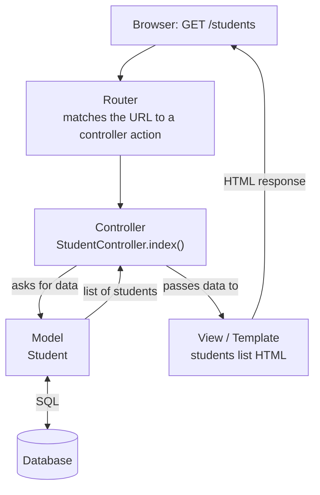

## Why Frameworks?

By now you've written a complete PHP application by hand: connecting to MySQL, validating forms, escaping output, managing sessions, checking logins, organising files. In a real project you'd write **the same plumbing again** in every application — and every hand-written version is a chance for a security bug.

A **web framework** is **a collection of reusable components, libraries, tools and best practices that simplify application development**. It provides the plumbing so you write only the parts **specific to your application**.

### What Frameworks Typically Provide

| Feature | What it replaces from your hand-written PHP |
|---|---|
| **Routing** | Mapping URLs to code (`/students/42/edit`) instead of one file per page |
| **Templates** | Separating HTML from logic, with **automatic output escaping** |
| **ORM / database abstraction** | Writing SQL by hand; safe queries by default |
| **Forms and validation** | Re-writing required/email/length checks |
| **Authentication** | Login, registration, password hashing, sessions, password reset |
| **Security** | CSRF tokens, XSS escaping, SQL-injection protection built in |
| **Project structure** | A standard folder layout any developer recognises |
| **Tools** | Command-line generators, migrations, a development server, testing support |

**Benefits (Week 1 recap):** faster development, reusable code, better organisation, improved security, easier maintenance, scalability, built-in authentication, database abstraction.

**Trade-offs:** a **learning curve**; the framework's **conventions** must be followed; more **files and dependencies**; for a tiny static site, it's overkill.

---

## The MVC Pattern

Most web frameworks organise code using **MVC — Model, View, Controller** — which separates an application into three roles:

| Part | Responsibility | SRMS example |
|---|---|---|
| **Model** | **Data and business rules** — talks to the database | `Student` — fields, validation, `Student::all()` |
| **View** | **Presentation** — the HTML template the user sees | `students/list.html` — the table of students |
| **Controller** | **Handles the request**: reads input, uses models, picks a view | `StudentController::index()` — fetch students, render the list |



**Why separate them?** Designers can change **views** without touching logic; database changes stay in **models**; each part can be **tested** separately; and many views (web page, JSON API) can share the same models.

> **Django calls it MTV — Model, Template, View.** Django's **View** does the controller's job, and its **Template** is MVC's view. Same idea, different names.

---

## Routing and Templates — Build a Tiny Framework

The two ideas at the heart of every framework are **routing** and **templates**. The fastest way to understand them is to see one working. This playground is a **mini-framework in plain PHP**:

- **`index.php`** is a **front controller**: every request goes through it.
- The **router** matches the path against a list of **routes** (patterns → handler functions). Patterns like `/students/{matric}` capture **route parameters**.
- **Handlers** (controller functions) get data from a **model** array and call **`render()`**, which fills a **template** — auto-escaping every value.

**Click the links** in the result and watch the address bar. Then add a route of your own (e.g. `/about`):

<PhpPlayground title="Routing + templates: a mini MVC framework" height="300">

```php
<?php // file: index.php
require "framework.php";

// ---- Model: the data (a real app would query a database) ----
$students = [
    "IFT-001" => ["name" => "Ada Obi", "department" => "Information Technology", "level" => 300],
    "CSC-014" => ["name" => "Musa Bello", "department" => "Computer Science", "level" => 400],
    "IFT-102" => ["name" => "Chioma Eze", "department" => "Information Technology", "level" => 200],
];

// ---- Routes: URL pattern => controller function ----
route("/", function () {
    render("home", ["title" => "Home", "count" => count($GLOBALS["students"])]);
});

route("/students", function () {
    render("list", ["title" => "All students", "students" => $GLOBALS["students"]]);
});

route("/students/{matric}", function ($matric) {
    $s = $GLOBALS["students"][$matric] ?? null;
    if (!$s) {
        http_response_code(404);
        return render("error", ["title" => "Not found", "message" => "No student with matric $matric"]);
    }
    render("detail", ["title" => $s["name"], "s" => $s, "matric" => $matric]);
});

dispatch();   // find the route that matches this request and run it
```

```php
<?php // file: framework.php
// --- Router ---
$routes = [];
function route($pattern, $handler) {
    global $routes;
    // "/students/{matric}" becomes the regex #^/students/([^/]+)$#
    $regex = "#^" . preg_replace("#\{\w+\}#", "([^/]+)", $pattern) . "$#";
    $routes[$regex] = $handler;
}
function dispatch() {
    global $routes;
    $path = $_GET["path"] ?? "/";                 // e.g. index.php?path=/students/IFT-001
    foreach ($routes as $regex => $handler) {
        if (preg_match($regex, $path, $m)) {
            array_shift($m);                      // drop the full match; keep the parameters
            return $handler(...$m);
        }
    }
    http_response_code(404);
    render("error", ["title" => "Not found", "message" => "No route for $path"]);
}
function url($path) {
    return "index.php?path=" . urlencode($path);
}

// --- Template engine ---
function e($value) {                              // escape for HTML output
    return htmlspecialchars((string) $value);
}
function render($template, array $data) {
    extract($data);                               // ["title" => …] becomes $title
    require "templates/layout_top.php";
    require "templates/$template.php";
    require "templates/layout_bottom.php";
}
```

```php
<?php // file: templates/layout_top.php ?>
<!DOCTYPE html>
<html><head><title><?= e($title) ?></title>
<style>body{font-family:Arial;margin:0}nav{background:#1e3a8a;padding:8px}nav a{color:#fff;margin-right:12px}main{padding:10px}</style>
</head><body>
<nav><a href="<?= url("/") ?>">Home</a><a href="<?= url("/students") ?>">Students</a></nav>
<main><h2><?= e($title) ?></h2>
```

```php
<?php // file: templates/layout_bottom.php ?>
</main></body></html>
```

```php
<?php // file: templates/home.php ?>
<p>Welcome to the mini-framework. There are <?= e($count) ?> students.</p>
```

```php
<?php // file: templates/list.php ?>
<ul>
<?php foreach ($students as $matric => $s): ?>
  <li><a href="<?= url("/students/$matric") ?>"><?= e($s["name"]) ?></a> — <?= e($s["department"]) ?></li>
<?php endforeach; ?>
</ul>
```

```php
<?php // file: templates/detail.php ?>
<p>Matric: <b><?= e($matric) ?></b><br>Department: <?= e($s["department"]) ?><br>Level: <?= e($s["level"]) ?></p>
<p><a href="<?= url("/students") ?>">← Back to list</a></p>
```

```php
<?php // file: templates/error.php ?>
<p style="color:#dc2626"><?= e($message) ?></p>
```

</PhpPlayground>

Try **`index.php?path=/students/XYZ`** in the address bar — the route matches, but the controller returns **404**. Real frameworks use the web server's **URL rewriting** (Apache `mod_rewrite`) so the address is simply **`/students/XYZ`** — the idea is identical.

**What you just saw is how Laravel, Flask, Django and ASP.NET all work inside:** a router, controller functions, models, and templates with layouts and auto-escaping — only far more complete.

---

## ASP.NET (C#)

**ASP.NET** is **Microsoft's web development platform for building enterprise web applications using C#** (first released in 2002). Its modern, **open-source, cross-platform** version is **ASP.NET Core** (2016), which runs on **Windows, Linux and macOS**.

| Aspect | ASP.NET Core |
|---|---|
| Language | **C#** (statically typed, compiled) |
| Web server | **Kestrel** (built in), often behind **IIS** or Nginx |
| Styles | **Razor Pages** (page-focused), **MVC** (controllers + views), **Minimal APIs**, **Blazor** (C# in the browser) |
| Templates | **Razor** — HTML with `@` expressions |
| Database | **Entity Framework Core** (ORM) — often with **SQL Server** |
| Tooling | Visual Studio, VS Code, the `dotnet` command-line tool |
| Known for | Performance, strong typing, enterprise and banking systems |

**Getting started:**

```bash
dotnet new webapp -o Portal     # create a Razor Pages project
cd Portal
dotnet run                      # starts Kestrel; open the URL it prints
```

**Routing with Minimal APIs** (`Program.cs`):

```csharp
var builder = WebApplication.CreateBuilder(args);
var app = builder.Build();

app.MapGet("/", () => "Hello from ASP.NET Core!");
app.MapGet("/students/{matric}", (string matric) => $"Student {matric}");

app.Run();
```

**An MVC controller and a Razor view:**

```csharp
public class StudentsController : Controller
{
    private readonly PortalDbContext _db;
    public StudentsController(PortalDbContext db) { _db = db; }

    public IActionResult Index()
    {
        var students = _db.Students.OrderBy(s => s.Name).ToList();   // Entity Framework query
        return View(students);                                      // renders Views/Students/Index.cshtml
    }
}
```

```html
@model List<Student>
<h2>Students</h2>
<ul>
@foreach (var s in Model)
{
    <li>@s.Name (@s.Level level)</li>      <!-- @ values are HTML-encoded automatically -->
}
</ul>
```

---

## Python for the Web

Python is a general-purpose language known for **clean, readable syntax** and its strength in **data science and AI** — so web apps that need machine learning often use Python frameworks. The two best known:

<Tabs>
<Tab label="Flask">

### Flask — the micro-framework

**Flask** (2010) is **small and flexible**: it gives you **routing, templates (Jinja2) and a development server**, and you add other pieces (database, login, forms) as extensions only when you need them.

**Good for:** small to medium apps, APIs, prototypes, learning how web apps fit together.

```python
from flask import Flask

app = Flask(__name__)

@app.route("/")
def home():
    return "Hello from Flask!"

@app.route("/students/<matric>")
def student(matric):
    return f"Student {matric}"
```

The **`@app.route(...)` decorator** is the **routing** rule; the function below it is the **view**.

</Tab>
<Tab label="Django">

### Django — "batteries included"

**Django** (2005) provides **almost everything built in**: ORM and **migrations**, an automatic **admin site**, authentication, forms, security protections (CSRF, XSS, SQL injection), and templates.

**Good for:** larger, database-heavy sites — news sites, portals, e-commerce. Instagram and Pinterest were built on Django.

Structure: a **project** contains **apps**; each app has **`models.py`** (data), **`views.py`** (logic), **templates** and **`urls.py`** (routes).

</Tab>
<Tab label="FastAPI">

### FastAPI — for APIs

**FastAPI** (2018) builds **JSON APIs** quickly, with automatic documentation and data validation from Python type hints. It's popular for **AI/ML services** — for example, an endpoint that returns a model's prediction to a web or mobile app.

</Tab>
</Tabs>

### Django in Brief

```bash
pip install django
django-admin startproject portal       # create the project
cd portal
python manage.py startapp students     # create an app (add "students" to INSTALLED_APPS in settings.py)
python manage.py runserver             # development server at http://127.0.0.1:8000
```

**Model** (`students/models.py`) — Django creates the table for you:

```python
from django.db import models

class Student(models.Model):
    matric_no = models.CharField(max_length=30, unique=True)
    name = models.CharField(max_length=100)
    level = models.PositiveSmallIntegerField()

    def __str__(self):
        return self.name
```

```bash
python manage.py makemigrations        # turn model changes into a migration file
python manage.py migrate               # apply it: creates the students table
```

**View** (`students/views.py`) and **URL** (`portal/urls.py`):

```python
from django.shortcuts import render
from .models import Student

def student_list(request):
    students = Student.objects.order_by("name")      # ORM query — no SQL, no injection
    return render(request, "students/list.html", {"students": students})
```

```python
from django.urls import path
from students import views

urlpatterns = [
    path("students/", views.student_list, name="student_list"),
]
```

**Template** (`students/templates/students/list.html`) — the Django template language:

```html
<h2>Students</h2>
<ul>
  
    <li>{{ s.name }} — {{ s.level }} level</li>   {# values are auto-escaped #}
  
    <li>No students yet.</li>
  
</ul>
```

Register the model in **`admin.py`** (`admin.site.register(Student)`), run **`python manage.py createsuperuser`**, and Django gives you a complete **admin interface** at `/admin` to add, edit and delete students — the whole SRMS CRUD without writing a form.

---

## Comparing the Frameworks

| | **Laravel** | **ASP.NET Core** | **Flask** | **Django** |
|---|---|---|---|---|
| Language | PHP | C# | Python | Python |
| Style | Full-stack MVC | Full-stack (Razor/MVC/APIs) | **Micro**-framework | **Batteries-included** (MTV) |
| Routing | `routes/web.php` | Attributes/`MapGet` | `@app.route` decorators | `urls.py` |
| Templates | **Blade** | **Razor** | **Jinja2** | Django templates |
| Database | **Eloquent** ORM + migrations | **Entity Framework Core** | Add-on (e.g. SQLAlchemy) | Built-in ORM + migrations |
| Admin panel | Packages (e.g. Filament) | Scaffolding | Add-on (Flask-Admin) | **Built in** |
| Dev server | `php artisan serve` | `dotnet run` | `flask run` | `python manage.py runserver` |
| Strengths | Huge PHP ecosystem, cheap hosting | Performance, typing, enterprise | Simplicity, flexibility | Speed of building data-heavy sites, security |

**Choosing:** consider the **team's language**, the **size** of the project, **hosting** options and budget, the **ecosystem** of packages, and whether you need **AI/data** features (Python) or **enterprise/Microsoft** integration (ASP.NET).

<MCQ question="In Django's MTV pattern, which part plays the role of the Controller in MVC?">
<Option>The Model</Option>
<Option>The Template</Option>
<Option correct>The View</Option>
<Option>The URLconf</Option>
<Explain>
In Django, the **View** (a function or class in `views.py`) receives the request, uses models and chooses what to render — the **controller's** job in MVC. Django's **Template** corresponds to MVC's **View**. `urls.py` is the router.
</Explain>
</MCQ>

<MCQ question="Which statement about Flask and Django is correct?">
<Option>Flask includes an admin site and ORM by default; Django does not.</Option>
<Option correct>Flask is a micro-framework you extend as needed; Django is batteries-included with an ORM, migrations and an admin site built in.</Option>
<Option>Both are written in C#.</Option>
<Option>Neither supports templates.</Option>
<Explain>
**Flask** provides the essentials (routing, Jinja2 templates) and you add extensions; **Django** ships with most features built in. Both are **Python** frameworks and both have template engines.
</Explain>
</MCQ>

---

## Practical: A Simple Flask Application

**Goal:** a Flask app with a home page, a registration form and a list page, using templates.

<Step step="1" title="Set up a virtual environment and install Flask">
Install Python 3 from **python.org** (tick "Add Python to PATH"), then in a new folder:

```bash
python -m venv venv
venv\Scripts\activate          # Windows  (macOS/Linux: source venv/bin/activate)
pip install flask
```

A **virtual environment** keeps this project's packages separate from other projects.
</Step>

<Step step="2" title="Create the project structure">
```text
flask_portal/
├── app.py
└── templates/
    ├── base.html
    ├── index.html
    └── students.html
```
Flask looks for templates in a folder named **`templates`**.
</Step>

<Step step="3" title="Write app.py (routes and views)">
```python
from flask import Flask, render_template, request, redirect, url_for

app = Flask(__name__)
students = []          # a list in memory; a real app would use a database

@app.route("/")
def index():
    return render_template("index.html")

@app.route("/students", methods=["GET", "POST"])
def student_list():
    if request.method == "POST":
        name = request.form.get("name", "").strip()
        level = request.form.get("level", "")
        if name and level.isdigit():
            students.append({"name": name, "level": int(level)})
        return redirect(url_for("student_list"))      # Post/Redirect/Get
    return render_template("students.html", students=students)

if __name__ == "__main__":
    app.run(debug=True)
```
</Step>

<Step step="4" title="Write the templates (Jinja2)">
`templates/base.html` — the **layout** other pages extend:

```html
<!DOCTYPE html>
<html>
<head><title>Flask Portal</title></head>
<body>
  <nav><a href="{{ url_for('index') }}">Home</a> | <a href="{{ url_for('student_list') }}">Students</a></nav>
  
</body>
</html>
```

`templates/students.html`:

```html

Students

  <h2>Students</h2>
  <form method="post">
    <input name="name" placeholder="Name" required>
    <input name="level" placeholder="Level" required>
    <button type="submit">Add</button>
  </form>
  <ul>
    
      <li>{{ s.name }} ({{ s.level }} level)</li>
    
      <li>No students yet.</li>
    
  </ul>

```

`templates/index.html`: `` with a welcome message in the content block.
</Step>

<Step step="5" title="Run it">
```bash
python app.py
```
Open **`http://127.0.0.1:5000`**. Add a few students. With `debug=True`, Flask reloads when you save a file and shows detailed errors — **turn it off in production**.
</Step>

**Map it to what you know:** `@app.route` = **routing**; the functions = **controllers/views**; `render_template` + Jinja2 = **templates** (with `{{ }}` **auto-escaping**, like `htmlspecialchars()`); `request.form` = **`$_POST`**; `redirect()` = **`header("Location: …")`**.

---

## Practice Questions

<Reveal question="What is a web framework? State five features frameworks commonly provide.">
A web framework is a **collection of reusable software components, libraries, tools and best practices that simplify web application development** by providing common functionality and a standard structure. Features (any five): **routing**, **templating**, **ORM/database abstraction**, **form handling and validation**, **authentication**, **built-in security** (CSRF/XSS/SQL-injection protection), **session management**, **migrations**, **a development server and CLI tools**, **testing support**.
</Reveal>

<Reveal question="Explain the MVC pattern with an example.">
**MVC** separates an application into the **Model** (data and business rules; talks to the database), the **View** (presentation — the HTML template) and the **Controller** (handles a request: reads input, uses models, chooses a view). Example: for `GET /students`, the **router** calls `StudentController::index()`, which asks the **Student model** for all students and passes them to the **students/list view**, which renders the HTML table.
</Reveal>

<Reveal question="What are routing and templates?">
**Routing** maps **URL patterns (and HTTP methods) to the code that handles them** — e.g. `/students/{matric}` → a function that receives `matric` as a parameter — giving clean URLs independent of file names. **Templates** are **HTML files with placeholders and simple logic** (loops, conditions) that the framework fills with data, keeping presentation separate from logic; template engines (Jinja2, Razor, Blade, Django templates) usually **auto-escape** output and support **layouts/inheritance**.
</Reveal>

<Reveal question="Compare Flask and Django.">
Both are **Python** web frameworks. **Flask** is a **micro-framework**: minimal core (routing, Jinja2 templates, dev server), very flexible, features added through extensions — good for small apps and APIs. **Django** is **batteries-included**: ORM with migrations, admin site, authentication, forms and security built in, with an opinionated project structure (MTV) — good for larger, data-driven sites.
</Reveal>

<Reveal question="Give an overview of ASP.NET.">
ASP.NET is **Microsoft's platform for building web applications in C#**. Its modern form, **ASP.NET Core**, is **open-source and cross-platform**, runs on the **Kestrel** server (often behind IIS or Nginx), offers **Razor Pages, MVC, Minimal APIs and Blazor**, uses **Razor** templates and **Entity Framework Core** for data access, and is widely used for **high-performance enterprise** applications.
</Reveal>

<Takeaway>
A **framework** supplies reusable, secure plumbing — **routing, templates, ORM, validation, authentication, security, structure, tools** — so you write only your application's logic. Most follow **MVC**: **Model** (data/rules), **View** (template), **Controller** (handles requests); **Django** calls it **MTV** (its *View* is the controller). **Routing** maps URL patterns like `/students/{matric}` to handlers; **templates** separate HTML from logic, with layouts and **auto-escaping**. **ASP.NET Core** — Microsoft, **C#**, cross-platform, Kestrel, Razor, Entity Framework; enterprise. **Flask** — Python **micro-framework** (`@app.route`, Jinja2). **Django** — Python **batteries-included** (ORM + migrations, admin, auth). **Laravel** — PHP (Blade, Eloquent). Choose by language, project size, hosting and ecosystem.
</Takeaway>

## Exam Tips

**What lecturers test:**
- Definition, benefits and features of web frameworks
- MVC (and Django's MTV)
- **Routing** and **templates** — definitions and small examples
- Overview of **ASP.NET**; **Flask vs Django**
- Steps to create a simple Flask or Django application

**Common mistakes:**
- Saying ASP.NET uses Python or PHP — it's **C#**
- Mixing up Django's "view" with MVC's "view"
- Treating frameworks as languages (Django is a framework **in** Python)

**Likely question:**
> "Explain the MVC architecture used by web frameworks. Compare Flask and Django, and write a simple Flask application with a route that displays a list of students using a template." (20 marks)
