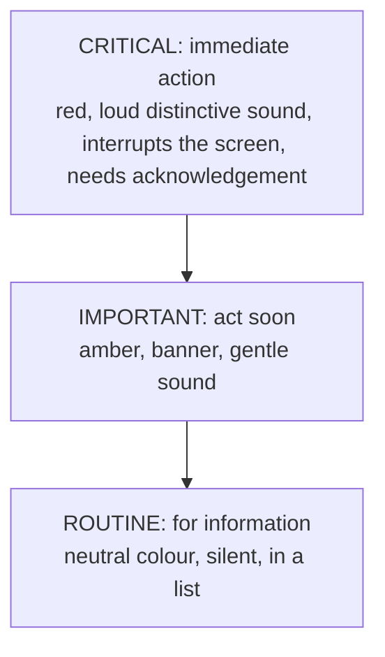
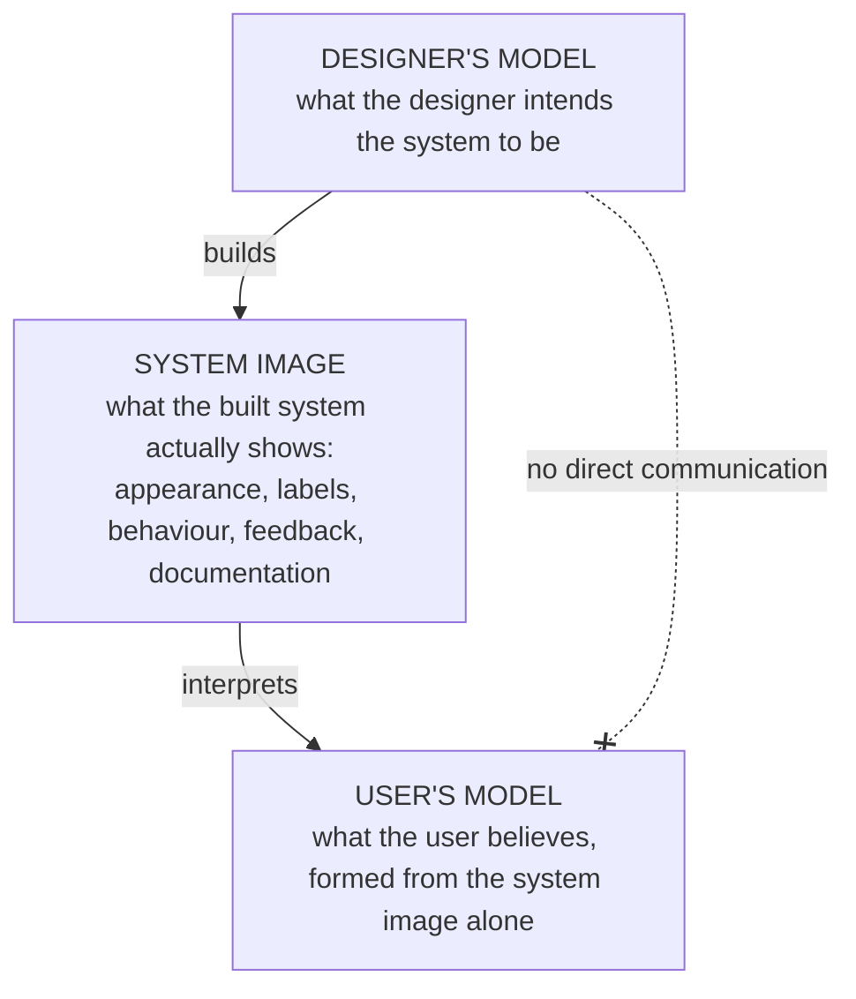

## 3.3 Attention

People cannot pay attention to everything at once. HCI distinguishes two kinds of attention:

| Selective attention | Divided attention |
|---|---|
| **Focusing on one source** of information while **filtering out others** | Trying to **attend to multiple sources at once** |
| Filling in one form field while ignoring the adverts around it | Reading a text message while driving |
| Works well — until something important is filtered out | **True multitasking is limited; performance on both tasks suffers** (Wickens, 2008) |

### Designing Notifications

Well-designed notification systems **prioritise**: **critical alerts must stand out clearly** from routine ones through **distinct colour, sound and placement**.

| ❌ Common mistake | ✅ Best practice |
|---|---|
| Treating **every notification as equally urgent** | A clear **visual and audio hierarchy**, and **disabling non-essential alerts during safety-critical tasks** |

### Preventing Alarm Fatigue

- **Real-life example:** a hospital monitor that uses **the same beep for a low-battery warning and a cardiac emergency** risks **"alarm fatigue"** — staff tune out or delay responding (Nielsen, 1993).
- **Industry example:** modern **smartphones** let users **configure notification priority** — silencing routine apps while letting calls or emergencies through ("Do Not Disturb" with exceptions).

<Reveal question="Think–pair–share: an exam-portal app needs three notifications — a submission-deadline reminder, a system-maintenance notice, and a suspected exam-malpractice alert to the invigilator. Rank them by urgency and describe how each should look and sound.">
**1. Malpractice alert (critical):** must reach the invigilator immediately — **red, full-screen or pinned banner, distinctive sound and vibration**, requiring acknowledgement, with the candidate's seat/ID shown. **2. Deadline reminder (important):** **amber banner** with a countdown, gentle sound, repeated as the deadline nears, with a direct "Submit now" button. **3. Maintenance notice (routine):** **neutral colour, silent**, shown in the notifications list or on the login page in advance. Each level looks and sounds **different**, so the critical one is never lost among routine ones.
</Reveal>

---

## 3.4 Learning and Skill Acquisition

Users are not fixed — they **learn**. Anderson (1982) describes a progression:

<FlowDiagram title="The novice-to-expert journey">
<FlowStep title="Novice">
Relies heavily on **visible cues** and **trial and error**. Reads every label; needs guidance.
</FlowStep>
<FlowStep title="Intermediate">
Builds **mental shortcuts** through **repeated use**. Knows the main paths; still checks now and then.
</FlowStep>
<FlowStep title="Expert">
Relies on **recall and automatic action** rather than conscious searching. Uses shortcuts; wants speed.
</FlowStep>
</FlowDiagram>

> **Learnability** is **the ease with which a new user can begin using a system successfully.**

**Good design supports the whole curve:** clear **onboarding** for novices **plus shortcuts and customisation** for repeated use.

- **Real-life example:** a university LMS offers a **guided first-login tutorial** while letting experienced students **skip it**.
- **Industry example:** **Adobe Photoshop** offers simplified **"Quick Actions"** for beginners alongside **extensive keyboard shortcuts** for professionals.

<ExamTip>
Link this to Topic 6: **novices depend on recognition** (visible menus), while **experts depend on recall** (shortcuts, commands). A design that only serves one end of the curve fails the other — e.g., hiding everything behind shortcuts traps novices, while forcing experts through a slow wizard frustrates them.
</ExamTip>

---

## 3.5 Mental Models: Norman's Three Models

A **mental model** is a person's internal understanding of **how something works**. Don Norman (2013) identified three models:

| Model | Meaning |
|---|---|
| **Designer's model** | What the designer **intends** the system to embody |
| **System image** | What the built system **actually communicates** through visible behaviour and feedback |
| **User's model** | What an actual user **forms from the system image alone** — not from the designer's intentions |

> **Key insight:** the **system image is the only bridge** between the designer's intention and the user's understanding. Designers can't sit beside every user to explain; the interface must speak for itself.

### When the System Image Misleads — and When It Works

<Tabs>
<Tab label="Misleading: the laptop lid">

Many users believe **closing a laptop lid turns it off**, when it typically enters **sleep mode** — a mismatch causing unexpected **battery drain** (and sometimes an overheated laptop in a bag).

The designer knew it would sleep; the **system image** (a lid that simply closes, no message) didn't communicate it.

</Tab>
<Tab label="Accurate: the trash can">

The **trash-can (recycle bin) icon** on desktop operating systems succeeds because it draws on a **familiar metaphor** — things you throw away can be retrieved until the bin is emptied. Users form an **accurate model without instruction**.

</Tab>
</Tabs>

| ❌ Common mistake | ✅ Best practice |
|---|---|
| Assuming users understand a system **as the designer does** | **Test the system image with real users**, and revise it whenever they form an incorrect model |

<Reveal question="Quick quiz: a user believes closing a laptop lid fully powers it off. Whose 'fault' is this mismatch in Norman's framework? A) The user's B) The designer's / system image's C) Nobody's — unavoidable">
**B — the designer's / system image's.** The user formed their model from what the system showed them. If the system image doesn't communicate "sleeping, still using battery", that's a **design problem to fix** (e.g., a status light or on-screen message).
</Reveal>

---

## 3.6 Human Errors: Reason's Taxonomy

James Reason (1990) distinguishes two kinds of error:

| Feature | Slip | Mistake |
|---|---|---|
| **Intention** | **Correct** | **Incorrect** |
| **Execution** | **Incorrect** (despite the correct intention) | Carried out **as (incorrectly) planned** |
| **Typical cause** | Inattention, habit, poor physical design | Flawed understanding or reasoning |
| **Example** | Pressing "Delete" instead of the adjacent "Save" | Believing a form field is mandatory when it is not |
| **Primary design fix** | **Improve spacing, add confirmation prompts** | **Improve labelling, instructions and feedback** |

<Analogy>
You want to buy fuel at the filling station. If you **meant** to pay ₦20,000 but your finger slipped and you typed ₦200,000 — that's a **slip** (right plan, wrong action). If you **thought** your car takes diesel and filled it with diesel — that's a **mistake** (wrong plan, executed perfectly). The cure for the first is a better keypad and a confirmation screen; the cure for the second is clearer labelling on the fuel cap.
</Analogy>

### Slips and Mistakes in the Wild

- **Slip:** **ATM PIN entry errors** — a customer who knows their correct PIN still presses the wrong digit because of a **cramped keypad** or a **distracting queue**.
- **Slip fix:** **Gmail's "Undo Send"** addresses the common slip of clicking Send too early by giving a brief **reversal window**.
- **Mistake fix:** clear **"(optional)"** labels on form fields prevent users wrongly believing a field is required.

> ⚠️ **Repeated user errors in usability testing are a design signal, not evidence that "users are careless."**

<Reveal question="Think–pair–share: recall a technology error you made this week. Was it a slip or a mistake? What single design change would have prevented it?">
Example answer: *"I sent money to the wrong recipient because two saved beneficiaries have similar names and I tapped the one above the one I wanted."* — That's a **slip** (I knew who I wanted to pay). **Design fix:** show the **account number and bank** next to each name, add a **confirmation screen showing the full recipient name**, and increase **spacing** between list items. A **mistake** example would be believing a transfer is instant when the bank processes it the next day — fixed by clearer **feedback** ("Expected arrival: tomorrow").
</Reveal>

---

## Practice Questions

<Reveal question="Distinguish selective attention from divided attention and state one implication for notification design.">
**Selective attention** focuses on one source while filtering out others; **divided attention** tries to attend to several at once, and performance suffers (Wickens, 2008). Implication: because users filter out much of what's on screen, **critical alerts must be made distinct** (colour, sound, placement) from routine ones, and non-essential alerts should be **silenced during critical tasks** to prevent alarm fatigue.
</Reveal>

<Reveal question="Define learnability and describe how a system can support both novices and experts.">
**Learnability** is the ease with which a new user can begin using a system successfully. A system supports the whole curve by offering **clear onboarding** (tutorials, visible menus, guided wizards) for novices, **plus shortcuts and customisation** for experts — e.g., an LMS tutorial that experienced students can skip, or Photoshop's Quick Actions alongside keyboard shortcuts.
</Reveal>

<Reveal question="Explain Norman's three mental models and why the system image is critical.">
The **designer's model** is what the designer intends; the **system image** is what the built system actually communicates through appearance, behaviour and feedback; the **user's model** is what the user forms from the system image alone. The system image is critical because it's the **only bridge** between the designer's intention and the user's understanding — if it's misleading, users form wrong models and make mistakes.
</Reveal>

<Reveal question="Classify each as a slip or a mistake: (a) clicking 'Reply All' instead of 'Reply'; (b) uploading a PDF because you believed the portal needed PDF, when it required Word; (c) typing 2024 instead of 2025 out of habit.">
(a) **Slip** — correct intention, wrong action (adjacent button). (b) **Mistake** — wrong understanding of the requirement. (c) **Slip** — a habit-driven execution error.
</Reveal>

<Reveal question="Should software always include confirmation prompts before destructive actions, or can overuse create new problems?">
Confirmations prevent **slips** on rare, costly actions (deleting an account, transferring money). But **overuse** creates new problems: users learn to click "Yes" automatically without reading (habituation), so the prompt no longer protects them, and frequent prompts slow experts down. Better: confirm only **rare, irreversible** actions, and prefer **undo** (e.g., Gmail's Undo Send) for common ones.
</Reveal>

<Takeaway>
**Selective attention** filters out most of what's on screen and **divided attention** degrades performance, so notifications need a **clear priority hierarchy** to prevent **alarm fatigue**. Users move from **novice** (visible cues) through **intermediate** to **expert** (recall, automatic action); good design supports the whole curve with onboarding **and** shortcuts, maximising **learnability**. Norman's **designer's model → system image → user's model** shows that the **system image is the only bridge** to user understanding — so test it with real users. Reason's taxonomy separates **slips** (right intention, wrong action — fix with spacing, confirmation, undo) from **mistakes** (wrong intention — fix with labels, instructions, feedback). **Errors are design signals, not careless users.**
</Takeaway>

## Exam Tips

**What lecturers test:**
- Selective vs divided attention; notification design and alarm fatigue
- The novice-to-expert progression and learnability
- Norman's three models, with the laptop-lid and trash-can examples
- **Slips vs mistakes** — the comparison table and a design fix for each

**Common mistakes:**
- Blaming the user for errors
- Calling every error a "mistake" — know the difference from a slip
- Confusing the **system image** (what the product communicates) with the **designer's model** (what was intended)

**Likely question:**
> "Using Reason's taxonomy, distinguish between slips and mistakes with one example each, and propose a design solution for each. Explain Norman's concept of the system image." (15 marks)
