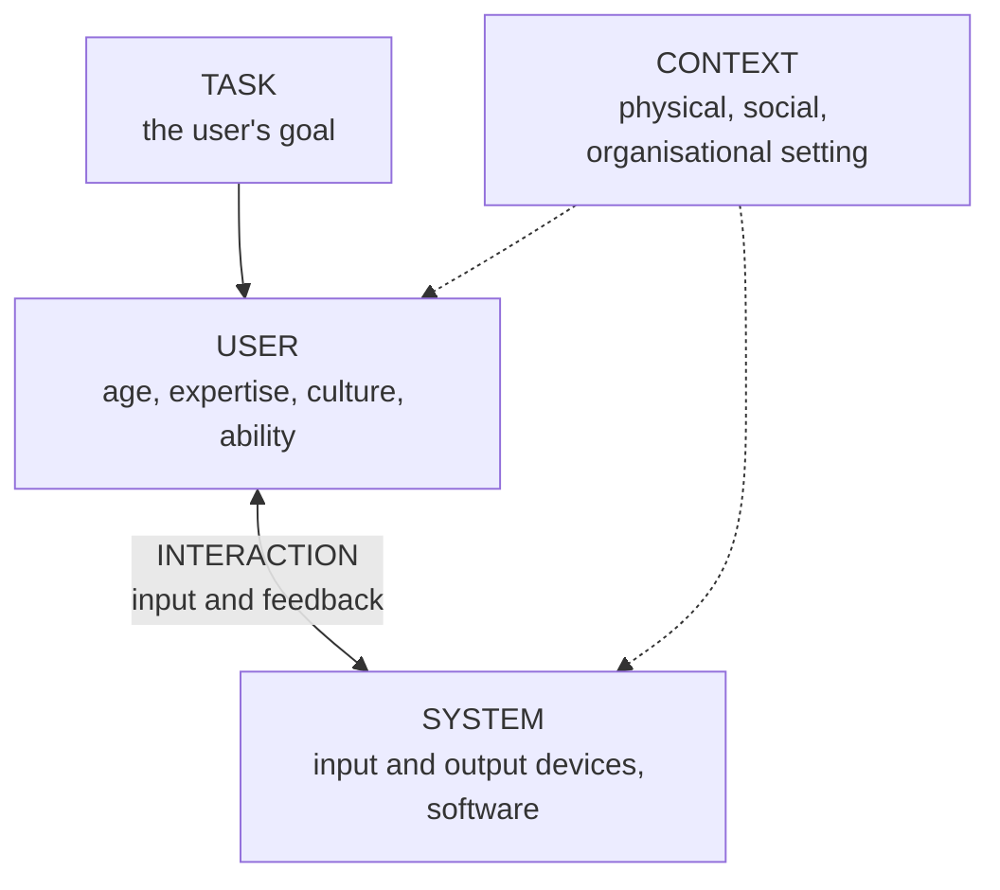
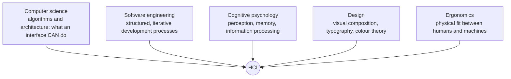

## 1.4 Why HCI Matters: Five Reasons

<Tabs>
<Tab label="Usability">

**Ease of learning and operating a system effectively and efficiently.**

*Example:* a usable ATM lets you withdraw cash **in under a minute**, even the first time you use that bank's machine.

</Tab>
<Tab label="Productivity">

Good interfaces **reduce the time and effort** users spend.

*Example:* with a well-designed electronic record, **nurses chart vital signs in seconds, not minutes** — more time for patients.

</Tab>
<Tab label="Safety">

**Poor design can cause fatal errors** in high-stakes settings.

*Example:* confusing **medical-device displays** have been implicated in real accidents; a confusing **cockpit display** endangers a whole aircraft.

</Tab>
<Tab label="Accessibility">

Good HCI **enables people with disabilities to use technology** — an **ethical and often legal obligation** (see the **W3C Web Accessibility Initiative, WAI**).

*Example:* a screen reader lets a blind student complete online course registration.

</Tab>
<Tab label="Business value">

Usability raises **customer satisfaction and conversion** and **cuts support costs**; usability investment typically **returns multiple times its cost**.

*Example:* **Amazon's one-click ordering** removed a single point of friction and measurably increased completed sales.

</Tab>
</Tabs>

### Local Lens: Usability in Nigeria

- **Mobile money and USSD banking** (e.g., dialling `*737#`) succeed because they **work on low-cost feature phones without internet** — HCI designed for **context**, not just technology.
- A confusing LMS **"Submit Assignment" button buried in a menu** causes missed deadlines and support complaints — a usability failure seen on Nigerian university portals too.

<Reveal question="Quick quiz: which importance factor is most at risk when a cockpit display is confusing? A) Business value B) Safety C) Accessibility D) Productivity">
**B — Safety.** A confusing cockpit display can lead a pilot to misread altitude or speed, with potentially fatal consequences.
</Reveal>

---

## 1.5 Applications of HCI

HCI is a **universal competency, not a niche** — every domain that uses computers needs it.

| Domain | Example system | Key HCI concern |
|---|---|---|
| **Banking** | Mobile banking app, ATM | **Security** balanced with **speed and clarity** |
| **Healthcare** | Electronic Health Record (EHR) | **Accuracy and error prevention** under pressure |
| **Education** | Learning Management System | **Learnability** for varying digital literacy |
| **Agriculture** | Farm-management dashboard | **Simplicity** for outdoor, low-connectivity use |
| **E-commerce** | Online shopping platform | **Frictionless checkout**, trust signals |
| **Government** | E-government portal | **Accessibility** for low-literacy, novice users |
| **Transportation** | Airport self-service kiosk | **Speed and clarity** under queue pressure |
| **Gaming** | Video game console interface | **Feedback clarity** without breaking immersion |

**Industry example:** **Duolingo** is a classic UX case study in **gamification** — streaks, points and levels grounded in **motivation theory** to keep learners engaged long-term.

---

## 1.6 The Five Components of Every Interaction

Every interaction — from paying at a POS to checking a patient's vital signs — has the same five components.

<FlowDiagram title="The five components of HCI">
<FlowStep title="User">
The **person** engaging with the system — characterised by **age, expertise, culture and ability**. A 70-year-old first-time smartphone user and a 20-year-old gamer are very different users.
</FlowStep>
<FlowStep title="System">
The **hardware and software**: **input** devices (keyboard, touch, microphone) and **output** devices (screen, speaker, haptics/vibration).
</FlowStep>
<FlowStep title="Interaction">
The **two-way exchange** of user **input** and system **feedback** — tap → confirmation; spoken command → spoken reply.
</FlowStep>
<FlowStep title="Task">
The **user's goal** — withdrawing cash, submitting an assignment, buying data.
</FlowStep>
<FlowStep title="Context">
The **physical, social and organisational setting** — a noisy airport, a quiet hospital ward, a dark room, a moving bus, a place with poor network signal.
</FlowStep>
</FlowDiagram>

### Applying the Framework: the ICU Monitor

| Component | ICU example |
|---|---|
| **User** | A nurse |
| **Task** | Checking a patient's vital signs |
| **System** | A bedside monitor |
| **Interaction** | Reading and responding during an emergency |
| **Context** | A **dim, high-stress** intensive care unit |

**Design implication:** every component shapes what "good design" means here — **large, high-contrast numbers and minimal steps**. **Industry parallel:** Toyota designs in-car infotainment around the **driving context**, minimising the visual attention required.

<ExamTip>
**Context changes everything.** The same task (checking vital signs) needs a different design in a **calm clinic** than in a **high-stress ICU**. When asked to analyse any system, go through all **five components** and then say what each implies for the design — that's how to earn full marks.
</ExamTip>

---

## 1.7 HCI and Its Adjacent Disciplines

HCI "stands on many shoulders" — it sits at the **intersection of several disciplines**:

| Discipline | What it contributes to HCI |
|---|---|
| **Computer science** | Algorithms and architecture determine **what an interface can do** |
| **Software engineering** | **Structured, iterative development** processes |
| **Cognitive psychology** | How people **perceive, remember and process** information |
| **Design** | **Visual composition, typography, colour theory** |
| **Ergonomics** | The **physical fit** between humans and machines |

*(Topic 3 adds sociology and linguistics to this list.)*

<Reveal question="Think–pair–share: should computer science students be required to study psychology and design? Consider a hospital alarm system.">
A strong answer weighs both sides. **Gains:** engineers who understand perception, attention and memory build alarms that nurses can actually distinguish and respond to; poor alarm design causes "alarm fatigue", where staff ignore constant beeps. **Trade-off:** curriculum time taken from technical subjects. **Conclusion:** at least foundational HCI/psychology is essential, and for a safety review of a hospital alarm system a **multidisciplinary team** (engineer, human-factors psychologist, clinician) should lead — no single discipline sees all the risks.
</Reveal>

---

## 1.8 Current Trends in HCI

| Trend | What it is | Example |
|---|---|---|
| **AI-assisted interaction** | Machine learning **personalises and automates** interaction | Predictive text, chatbots, recommendations |
| **Voice interfaces** | **Hands-free** interaction | Smart homes, accessibility tools, in-car assistants |
| **AR / VR** | **Overlay** digital information on the physical world (AR) or **immerse** the user fully (VR) | Surgical training, gaming, virtual campus tours |
| **Wearables** | Interfaces for **tiny or absent screens** | Smartwatches, fitness trackers |

**Did you know?** By the mid-2020s, voice assistants were handling **billions of queries weekly** across smart speakers, phones and cars — one of the fastest-growing interaction modalities in HCI history.

---

## Three Things to Remember

| # | Key idea | Why |
|---|---|---|
| 01 | **HCI ≠ visual design** | It equally concerns error prevention, learnability and accessibility |
| 02 | **Five components, always** | User, system, interaction, task and context together decide whether a design succeeds |
| 03 | **Context changes everything** | The same task needs different designs in different settings |

---

## Practice Questions and Discussion

<Reveal question="Class activity: analyse a ride-hailing app using the five HCI components, and name one design decision that would change if the context changed.">
**User:** commuters of varied ages and tech skills. **System:** smartphone app — touch input, map display, GPS, notifications. **Interaction:** enter destination → see price and driver → confirm → track trip → pay → rate. **Task:** get from A to B safely at a fair price. **Context:** outdoors, often in bright sunlight or at night, sometimes with poor network signal. **Context change:** at **night**, the app should use a dark theme and show the driver's plate number and photo prominently for safety; with **low signal**, it should cache the route and let users confirm the booking by SMS/USSD.
</Reveal>

<Reveal question="How might the five components differ for a rural farmer on a low-cost phone versus an urban banking customer on a premium smartphone?">
**User:** the farmer may have limited literacy and little smartphone experience; the urban customer is likely experienced. **System:** a feature phone (small screen, keypad, USSD) versus a large touch screen with biometrics. **Interaction:** short numbered menus and SMS versus rich touch gestures and notifications. **Task:** checking crop prices or sending money home versus managing investments. **Context:** outdoors, bright sun, poor network versus indoors with fast data. The farmer's design needs **simplicity, local language, offline/USSD support and large text**; the urban design can offer richer features.
</Reveal>

<Reveal question="What new usability and accessibility challenges do voice assistants introduce compared with touch interfaces?">
**Discoverability** — users can't see what commands exist. **Recognition errors** — accents (including Nigerian English and local languages), background noise. **Privacy** — speaking aloud in public. **Memory load** — spoken lists must be remembered, not re-read. **Accessibility** — great for blind users, but excludes people with speech impairments or who are deaf unless alternatives exist.
</Reveal>

<Reveal question="State the five reasons HCI matters, with an example of each.">
**Usability** (an ATM usable in under a minute), **productivity** (nurses charting vitals in seconds), **safety** (clear cockpit and medical-device displays), **accessibility** (screen-reader-friendly portals, W3C WAI), **business value** (Amazon one-click ordering increases sales and cuts support costs).
</Reveal>

<Takeaway>
HCI matters for **usability, productivity, safety, accessibility and business value** — from USSD banking that works without internet to cockpit displays where confusion can kill. It applies in **every domain** (banking, healthcare, education, agriculture, e-commerce, government, transport, gaming), each with its own key concern. Every interaction has **five components — user, system, interaction, task and context** — and context changes what good design means. HCI draws on **computer science, software engineering, cognitive psychology, design and ergonomics**, and is being reshaped by **AI, voice, AR/VR and wearables**.
</Takeaway>

## Exam Tips

**What lecturers test:**
- The five reasons HCI is important, with examples
- The **five components** of an interaction, applied to a scenario (ATM, ICU monitor, app)
- HCI application domains and their key concerns (Table 1.2)
- The disciplines that contribute to HCI
- Current trends

**Common mistakes:**
- Listing the five components without **applying** them to the scenario given
- Ignoring **context** — it's often the component that changes the design most

**Likely question:**
> "Using an ATM as an example, explain the five components of human-computer interaction and show how the design would change if the ATM were placed outdoors in a busy market." (15 marks)
