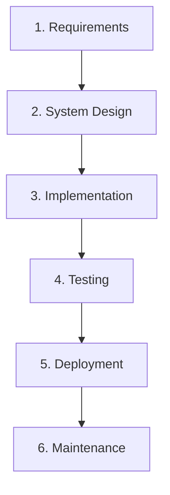
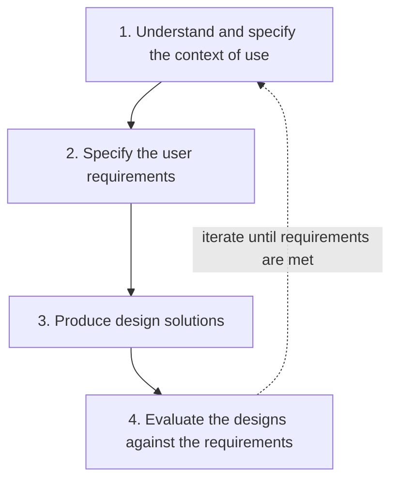

## Why Methods Matter

> A public hospital needs a new **appointment-booking kiosk**. Before a single button is drawn, the team must decide **how they will work** — gather every requirement up front, or build a small piece, test it with real nurses and patients, and adjust?

A **system design method** is **a structured approach to planning, organising and controlling how software gets built**. The method affects everything downstream: **how fast problems surface, how well the interface fits real users, and how expensive change is later.**

This lecture covers four methods: **Waterfall** (sequential, one pass), **Spiral** (risk-driven loops), **Agile** (values-based, iterative) and **Scrum** (Agile in fixed sprints).

---

## 8.1 The Design Lifecycle: Six Stages Underlie Every Method

<FlowDiagram title="The six-stage design lifecycle" cycle>
<FlowStep title="Concept">
**Identify the problem** — who needs what, and why?
</FlowStep>
<FlowStep title="Design">
**Plan screens and data** — wireframes, data models, architecture.
</FlowStep>
<FlowStep title="Build">
**Write the code.**
</FlowStep>
<FlowStep title="Test">
**Check it works** — functionally and for real users.
</FlowStep>
<FlowStep title="Deploy">
**Release** to real use.
</FlowStep>
<FlowStep title="Evaluate">
**Gather feedback** — which feeds the next concept.
</FlowStep>
</FlowDiagram>

> Every system design method answers one question: **in what order, and how many times, should a project pass through these six stages?**

<ExamTip>
**Exam tip from the lecture:** always describe methodologies in terms of **how they arrange these six stages** — e.g., "**Waterfall passes through them once; Scrum repeats them every sprint.**" This shared vocabulary lets you compare methods precisely.
</ExamTip>

---

## 8.2 The Waterfall Model

> **Waterfall** is a **sequential** method in which each phase — **requirements, design, implementation, testing, deployment, maintenance** — must **finish completely before the next begins**. It is named after water flowing down steps: progress moves **in one direction only**.

**Best when** requirements are **stable and well understood in advance** — e.g., regulatory or safety-critical systems.

**Worked example:** Nigeria's **FIRS** commissioning an **online tax-filing portal** with legally mandated features — requirements are documented and **approved by auditors**, the whole portal is built against those fixed requirements, tested against a formal plan, then deployed on a **fixed date before filing season**.

**Also used in:** government procurement (fixed-price contracts with formal sign-off); aerospace and defence software (safety certification demands exhaustive up-front documentation); banking compliance systems with regulator-fixed scope.

| Advantages | Disadvantages |
|---|---|
| Simple to understand and manage | **Users see a working system only late** |
| **Extensive documentation** | Poorly suited to **changing requirements** |
| **Clear milestones** aid budgeting and contracts | Little room for **feedback to reshape the design** mid-project |
| Works well when requirements are stable | |

**Common mistake:** Waterfall isn't "no planning for change". Disciplined projects still use **formal change control** — changes are just **costly, deliberate exceptions**.

---

## 8.3 The Spiral Model

> The **Spiral model** is a **risk-driven, iterative** method combining **Waterfall's structured phases** with **repeated cycles of prototyping and risk analysis** (Boehm, 1988). **Each loop produces a more refined, more complete version** of the system.

*Figure: Boehm's spiral model. Image: Conny / Marctroy, public domain, via Wikimedia Commons.*

Each loop passes through: **(1) determine objectives → (2) identify and resolve risks → (3) develop and test → (4) plan the next iteration** — and **each loop widens the scope**.

**Historical note:** **Barry Boehm** introduced the Spiral model in **1988**, explicitly to fix Waterfall's inability to handle **risk and changing requirements** in large government contracts. It was used for **NASA/aerospace** software, where failure costs are extreme.

**Worked example:** a bank or **Nigerian fintech** (e.g., a mobile-money provider) building a payment platform with **unproven biometric login**:
- **Loop 1:** a **throwaway fingerprint-login prototype** to test feasibility.
- **Loop 2:** expand it into a working, **customer-tested** module.
- **Later loops:** add transaction history, bill payment and fraud detection — **each preceded by a risk assessment**.

| Advantages | Disadvantages |
|---|---|
| **Explicitly manages risk** | **More complex** to manage than Waterfall |
| Handles changing requirements better than Waterfall | Needs genuine (costly) **risk-analysis expertise** |
| Early prototypes invite **user feedback** before major spending | **Hard to estimate** cost and schedule — the number of loops isn't fixed |

**Best for:** **large, complex or high-risk** projects where requirements aren't fully known and failure is costly (e.g., large ERP rollouts).

<Reveal question="Think–pair–share: an exams board wants a results-checking portal for millions of candidates, released on one fixed date — but it also wants to pilot an unproven facial-verification login. Which method, or combination?">
A **hybrid**. The core results portal has a **fixed date and stable, well-understood requirements** (enter exam number → see results), which suits **Waterfall-style** planning, formal testing and a fixed release. The **unproven facial-verification** feature is high-risk and uncertain, which suits **Spiral** — prototype it in early loops, assess risks (accuracy, bias, load on release day), and only include it in the release if the risk is resolved; otherwise fall back to PIN/scratch-card login. This matches the lecture's industry insight that many organisations use **hybrids**.
</Reveal>

---

## 8.4 Agile Software Development

> **Agile** is **a family of iterative approaches guided by the Agile Manifesto (Beck et al., 2001)**.

The Manifesto's **four values** — the items on the left are valued **more** than those on the right:

| We value… | …over |
|---|---|
| **Individuals and interactions** | Processes and tools |
| **Working software** | Comprehensive documentation |
| **Customer collaboration** | Contract negotiation |
| **Responding to change** | Following a fixed plan |

**How it works:**
- Delivers **working software in small, frequent increments**, often every **2–4 weeks**.
- Built on **twelve supporting principles**, e.g. *"welcome changing requirements, even late"* and *"the best designs emerge from self-organising teams."*
- **Directly fixes Waterfall's biggest weakness:** **late discovery of misunderstood requirements**.

<Reveal question="Extra: the twelve principles of the Agile Manifesto (for reference).">
1. Satisfy the customer through **early and continuous delivery** of valuable software.
2. **Welcome changing requirements**, even late in development.
3. Deliver working software **frequently** — weeks rather than months.
4. Business people and developers **work together daily**.
5. Build projects around **motivated individuals**; give them support and trust.
6. **Face-to-face conversation** is the most effective way to convey information.
7. **Working software** is the primary measure of progress.
8. Promote **sustainable development** — a constant pace indefinitely.
9. Continuous attention to **technical excellence and good design**.
10. **Simplicity** — maximising the amount of work not done — is essential.
11. The best architectures, requirements and designs emerge from **self-organising teams**.
12. At regular intervals, the team **reflects and adjusts** its behaviour.
</Reveal>

**Best practice:** Agile is **not "no planning"** — teams still plan carefully, just in **smaller increments**, **replanning every iteration**.

**Agile in practice:** an **e-commerce company** redesigning checkout might ship a simplified address form **every two weeks**, measuring cart abandonment before deciding what's next. **Spotify, Amazon** and most major tech companies organise teams around Agile, releasing small updates continuously.

| Advantages | Disadvantages |
|---|---|
| **Rapid feedback** from real users | **Less documentation** — complicates long-term maintenance and regulatory audits |
| **Flexible** to changing business needs | Requires a **highly collaborative, available** customer/product owner |
| Reduces the risk of **building the wrong product** | **Less predictable** cost and timeline than Waterfall |
| Improves **morale** through visible progress | |

**Applications:** consumer web and mobile apps, start-ups, social media platforms, continuously evolving e-commerce.

---

## 8.5 Scrum

> **Scrum** is **the most widely adopted concrete framework for Agile**, organising work into **fixed-length sprints (1–4 weeks)** with defined **roles, artefacts and ceremonies** (Schwaber & Sutherland, 2020).

<Tabs>
<Tab label="Three roles">

| Role | Responsibility |
|---|---|
| **Product Owner** | Represents users and the business; decides **WHAT** to build and in **what priority** |
| **Scrum Master** | **Facilitates** the process, **removes obstacles**, protects the team — **without directing technical work** |
| **Development Team** | A **small, cross-functional** group (**5–9** people) that designs, builds and tests the increment |

</Tab>
<Tab label="Three artefacts">

| Artefact | Meaning |
|---|---|
| **Product Backlog** | **Everything that might be built**, prioritised by the Product Owner |
| **Sprint Backlog** | The **subset committed to** for the current sprint |
| **Increment** | The sum of completed work — a **working, shippable slice** of product |

</Tab>
</Tabs>

<FlowDiagram title="The Scrum sprint cycle (1–4 weeks)" cycle>
<FlowStep title="Sprint Planning">
The team **selects backlog items** it can complete this sprint, forming the Sprint Backlog.
</FlowStep>
<FlowStep title="Daily Standup">
A **15-minute** sync each day — **peer-to-peer coordination**: what I did, what I'll do, **what's blocking me**.
</FlowStep>
<FlowStep title="Sprint Review">
**Demo the increment to stakeholders** and gather feedback on the **product**.
</FlowStep>
<FlowStep title="Retrospective">
The team **reflects on its own process** and agrees improvements for the next sprint.
</FlowStep>
</FlowDiagram>

<ExamTip>
**Common mistake:** treating the **Daily Standup as a status report to the Scrum Master**. It should be **peer-to-peer coordination** surfacing **blockers** — not line management. Also know the difference: the **Sprint Review** inspects the **product** (with stakeholders); the **Retrospective** inspects the **process** (the team only).
</ExamTip>

**Worked example — a university learning portal:**
- **Two-week sprints.** The **Product Owner** (a registry representative) prioritises **"view enrolled courses"** before **"download lecture recordings"**.
- A **four-person dev team** holds a **15-minute standup** each morning.
- At sprint end they **demo** the course-list screen to the registry and student testers, then agree in the **retrospective** to add **automated tests** next sprint.

**In industry:** banking mobile-app teams ship features like bill-split every 2–3 weeks; gaming studios, healthcare vendors and government digital-service teams (e.g., the UK's GDS) publicly document Scrum use.

| Strengths | Risk |
|---|---|
| Clear roles; regular feedback; **short sprints limit the cost of being wrong** | Can become **"ceremony for its own sake"** without genuine reflection |

---

## 8.6 Human-Centred Software Engineering (HCSE)

> **Human-centred software engineering** integrates **user-centred design** — understanding users, defining requirements, designing and evaluating — **into every phase**, not bolted on after coding.

**ISO 9241-210** formalises this as **four linked activities** that map onto the lifecycle:

> **Important:** HCSE is **not a competing methodology** — it can be **embedded within Waterfall, Spiral, Agile or Scrum**.

**Industry example:** **Google and Microsoft embed dedicated UX research teams inside Agile product teams**, so usability testing runs **continuously** rather than as a final gate (Nielsen Norman Group, 2021).

---

## 8.7 One Lifecycle, Three Rhythms

| Method | How the six stages happen |
|---|---|
| **Waterfall** | Stages occur **once, in strict sequence**, over the whole project. **Evaluation happens only after full deployment** — often months or years after the concept |
| **Spiral** | Stages **repeat with each loop, scoped by risk**. Early loops may reach only build-and-test; later loops extend to full deployment |
| **Agile / Scrum** | Stages **compress into each sprint**: a small concept/design in backlog refinement and planning, build and test within the sprint, and the review as a light deploy-and-evaluate step feeding the next sprint |

### Table 8.1 — Methodology Comparison

| Criterion | Waterfall | Spiral | Agile | Scrum |
|---|---|---|---|---|
| **Requirements** | Fixed, documented up front | Refined progressively via risk analysis | Expected to change continuously | Captured in a living Product Backlog |
| **User feedback timing** | Only after full deployment | After each loop's prototype | Every iteration | Every Sprint Review |
| **Cycle length** | Single pass, months–years | Loops of weeks–months | Short, days–weeks | Fixed sprints, 1–4 weeks |
| **Documentation** | Very high, formal sign-off | High — risk and design docs | "Just enough" | Lightweight backlogs and increment |
| **Best suited to** | Stable, regulated projects | Large, high-risk, uncertain projects | Projects needing fast learning | Team-based iterative delivery |

**Industry insight:** many organisations use a **hybrid** — **Waterfall-style sign-off for regulatory components**, **Scrum for the customer-facing app** on top.

---

## Quiz Check and Discussion

<MCQ question="A team says: 'We pass through concept, design, build, test, deploy and evaluate every two weeks, demoing to stakeholders at the end.' Which method are they using?">
<Option>Waterfall</Option>
<Option>Spiral</Option>
<Option correct>Scrum (Agile)</Option>
<Option>Big Bang</Option>
<Explain>
Repeating the whole lifecycle in a fixed short cycle, ending with a demo (Sprint Review), is Scrum. Waterfall passes through the stages once; Spiral repeats them in risk-driven loops of weeks to months.
</Explain>
</MCQ>

<Reveal question="What's the difference between the Sprint Review and the Sprint Retrospective?">
The **Sprint Review** inspects the **product**: the team demos the increment to **stakeholders** and gathers feedback that may change the backlog. The **Retrospective** inspects the **process**: the **team alone** reflects on how it worked and agrees improvements for the next sprint.
</Reveal>

<Reveal question="Name one sign that a daily standup has become a status report instead of coordination.">
Team members **address the Scrum Master (or a manager)** rather than each other, recite long lists of completed tasks, and **nobody mentions blockers or offers help** — or the meeting regularly runs well past 15 minutes.
</Reveal>

<Reveal question="Give an example of a Nigerian or African company whose apps likely ship in Agile-style small, frequent increments.">
Examples include fintech apps such as **Paystack, Flutterwave, Moniepoint, OPay and Kuda**, or **Jumia**'s e-commerce app — their apps receive frequent updates with small feature changes, typical of Agile/Scrum delivery. (Any well-justified example is acceptable.)
</Reveal>

<Reveal question="How should regulated industries (banking, healthcare) balance Agile's 'working software over documentation' with audit-trail needs?">
"Over" doesn't mean "instead of". Regulated teams keep **just enough** documentation for compliance — traceable user stories and acceptance criteria, automated test reports, change logs and release approvals — generated as part of each sprint. Many use a **hybrid**: Waterfall-style formal sign-off for regulated components, Agile for the customer-facing parts.
</Reveal>

<Takeaway>
Every method arranges the same **six-stage lifecycle — concept, design, build, test, deploy, evaluate** — differently. **Waterfall** passes through once in strict sequence: predictable and well documented, best for **stable, regulated** projects, but users see it late. **Spiral** (Boehm, 1988) loops through **objectives → risk analysis → develop/test → plan next**, best for **large, high-risk, uncertain** projects. **Agile** (Manifesto, 2001) values individuals, working software, collaboration and responding to change, delivering small increments every 2–4 weeks. **Scrum** makes Agile concrete with **roles** (Product Owner, Scrum Master, Development Team), **artefacts** (Product Backlog, Sprint Backlog, Increment) and **ceremonies** (Planning, Daily Standup, Review, Retrospective) in 1–4-week sprints. **Human-centred software engineering** (ISO 9241-210) embeds users in **any** method. Fit the method to the risk — and hybrids are common.
</Takeaway>

## Exam Tips

**What lecturers test:**
- Describe Waterfall, Spiral, Agile and Scrum **in terms of the six-stage lifecycle**
- The **four Agile values**
- Scrum **roles, artefacts and ceremonies**; Review vs Retrospective
- Table 8.1 comparisons; choose a method for a scenario
- Human-centred software engineering (ISO 9241-210's four activities)

**Common mistakes:**
- "Agile means no planning" / "Waterfall means no change"
- Treating the standup as a status report
- Presenting HCSE as a separate methodology rather than something embedded in any method

**Likely question:**
> "Compare the Waterfall and Scrum approaches to developing a hospital appointment-booking kiosk. Explain the roles, artefacts and ceremonies of Scrum, and show how user-centred design can be embedded in either approach." (20 marks)
