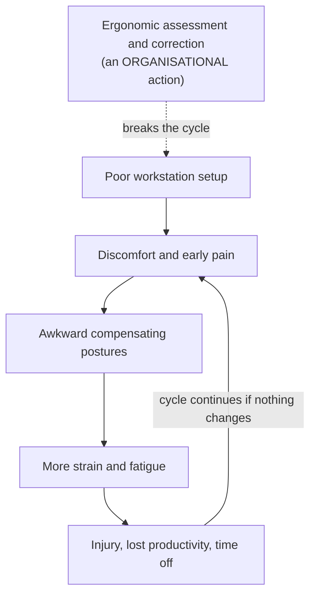

## Cumulative Harm from Everyday Use

Topic 9 was about **setting up** the workspace and devices. This topic is about what happens to the body when that setup — and our habits — go wrong **day after day**. None of these problems come from one dramatic event; they come from **cumulative, everyday screen and device use**.

| Condition | Body part | Key prevention |
|---|---|---|
| **Digital eye strain (Computer Vision Syndrome, CVS)** | Eyes | **20-20-20 rule**, matched lighting, proper viewing distance |
| **Repetitive Strain Injury (RSI)**, e.g. carpal tunnel syndrome | Hands, wrists, arms, neck | Neutral wrists, correct device height, micro-breaks |
| **Posture-related disorders** | Neck, back, shoulders, legs | **Postural variation** — alternate sitting, standing and moving |

---

## 4.6 Digital Eye Strain (Computer Vision Syndrome)

When we focus on a screen, we **blink far less**:

| State | Blink rate |
|---|---|
| Relaxed | **15–20** blinks per minute |
| Focused screen work | As low as **5–7** blinks per minute |

Fewer blinks → the eye's surface dries → **dry, gritty eyes, blurred vision and headaches**. Add long hours of close focus and glare, and strain accumulates.

### The 20-20-20 Rule

<FlowDiagram title="The 20-20-20 rule" cycle>
<FlowStep title="Every 20 minutes">
Set a reminder — it's easy to lose track of time when absorbed in work.
</FlowStep>
<FlowStep title="Look 20 feet away">
Look at something about **20 feet (≈ 6 metres)** away — out of a window, across the room. This relaxes the eye's focusing muscles.
</FlowStep>
<FlowStep title="For 20 seconds">
Hold it for **20 seconds**, and blink fully a few times to re-wet the eyes.
</FlowStep>
</FlowDiagram>

Regular breaks **reduce strain, improve focus and support long-term eye health**.

- **Real-life example:** a student attending **back-to-back online lectures for six hours**, then doing assignments on screen, ends the day with **blurred vision, a dull headache and dry, gritty eyes** — classic accumulated digital eye strain.
- **Industry response:** phone operating systems now include **night mode, blue-light reduction and screen-time/eye-comfort reminders** — recognition that eye strain is a **product-relevant concern**, not just personal health.

**Best practice:**
- Apply the **20-20-20 rule** consistently.
- Keep **ambient lighting comparable** in brightness to the screen.
- Keep **viewing distance around 50–70 cm**.
- Schedule **regular comprehensive eye examinations** for heavy screen users.

---

## 4.7 Repetitive Strain Injury (RSI)

> **RSI** is **cumulative micro-trauma** — small stresses repeated thousands of times a day (keystrokes, clicks, swipes) that add up to injury of muscles, tendons and nerves.

<Tabs>
<Tab label="Carpal tunnel syndrome">

The **carpal tunnel** is a narrow passage in the wrist that houses the **median nerve**. **Repeated wrist flexion/extension**, especially **combined with force** (e.g., gripping a mouse tightly), **swells the tendons and compresses the nerve**.

**Symptoms:** **tingling, numbness and weakness in the thumb, index and middle fingers**, often **worse at night**.

</Tab>
<Tab label="Tendonitis">

**Inflammation of a tendon**, often at the **wrist or elbow**, from repetitive movement.

</Tab>
<Tab label="De Quervain's">

**De Quervain's tenosynovitis** affects the **thumb-side wrist tendons**, and is increasingly linked to **heavy smartphone use** — sometimes called **"texting thumb"**.

</Tab>
<Tab label="Cumulative trauma disorders">

**Neck and shoulder harm** from **sustained poor posture** — e.g., craning toward a low laptop for hours.

</Tab>
</Tabs>

<ExamTip>
**Common mistake:** believing wrist rests should be used **continuously** while typing. In fact, **resting the wrist on a hard support while actively typing increases carpal tunnel pressure** rather than relieving it. Wrist rests are for **pauses only**. This is a favourite true/false or short-answer item.
</ExamTip>

### From Early Signs to Workplace Policy

- **Real-life example:** a **government records clerk** typing continuously for years, with a keyboard **too high** and a chair **without armrests**, starts feeling **night-time hand tingling** — an early sign of carpal tunnel syndrome. Without intervention it can progress to **persistent numbness and grip weakness**, affecting the very typing that caused it.
- **Industry example:** in the **1990s–2000s**, RSI claims among **journalists and telecom data processors** became prominent enough to drive **workplace policy change and litigation** in several countries, prompting **mandatory ergonomic training and equipment**.

<Reveal question="Quick quiz: dry, gritty eyes after screen use vs night-time hand tingling — which condition is which? A) Both are CVS B) Both are RSI C) Eye strain = CVS; tingling = RSI/CTS">
**C.** Dry, gritty eyes are **Computer Vision Syndrome (digital eye strain)**; night-time tingling in the thumb, index and middle fingers is **RSI — specifically carpal tunnel syndrome (CTS)**.
</Reveal>

---

## 4.8 Posture

> **Neutral posture:** joints **naturally aligned**, minimising stress — **straight spine, relaxed shoulders, straight wrists**.

But even "correct" posture **held motionless for hours** eventually causes discomfort — **muscles fatigue from sustained, unchanging load**.

### The Sit–Stand Debate

| Aspect | Sitting desk | Standing desk |
|---|---|---|
| **Musculoskeletal load** | Lower leg/foot fatigue; **higher spinal disc pressure** | Higher leg/foot fatigue; lower spinal disc pressure |
| **Circulation** | Reduced with prolonged sitting | Generally improved, if not prolonged |
| **Best for** | Fine motor tasks, precise mouse work | Short tasks, calls, brief collaboration |
| **Cost** | Lower | Higher (height-adjustable mechanism) |
| **Key risk if used exclusively** | Prolonged **sedentary** health risks | **Varicose veins**, foot and back strain |

**Standing desks** reduce total sitting time (sitting too much is linked to cardiovascular risk — Owen et al., 2010), but **standing all day** brings its own problems.

> **Consensus:** not that standing beats sitting, but that **postural variation — alternating sitting, standing and movement breaks — beats staying fixed in any one posture.**

<Analogy>
A car engine left idling in one gear for eight hours wears out faster than one that changes gear. Muscles are similar: any single position — even a "perfect" one — becomes harmful if held for hours. The healthiest posture is **the next posture**.
</Analogy>

<Reveal question="Think–pair–share: a developer sits for an 8-hour shift and notices back pain by mid-afternoon. Design an hour-by-hour movement schedule.">
One workable schedule (combine with the 20-20-20 rule throughout):
- **Every hour:** 50 minutes of focused work, then a **5-minute movement break** — stand, walk to refill water, stretch neck, shoulders and wrists.
- **Every 30 minutes:** change position — if the desk is adjustable, alternate **sitting and standing** (e.g., stand for stand-ups and code reviews).
- **Mid-morning and mid-afternoon:** a **10-minute walk** away from the screen.
- **Lunch:** away from the desk.
- Use a **timer or app reminder**, because absorbed developers forget — an **organisational policy** (team stretch breaks) helps more than willpower alone.
</Reveal>

---

## 4.9 Occupational Health: Breaking the Cycle

Ergonomic harm tends to **reinforce itself**:

> An **ergonomic assessment and correction** — an **organisational** action — is what breaks this self-reinforcing cycle, **rather than relying on the affected individual alone**.

**Regulation example — the EU DSE Directive:** the European Union's **Display Screen Equipment (DSE)** directive obliges employers to **assess workstation risks**, **provide adjustable equipment** and **offer regular eye examinations** for significant screen users.

### Shared Responsibility in Practice

| Who | Responsibility |
|---|---|
| **Organisations / employers** | Assess workstations, provide adjustable equipment, mandate breaks, train staff |
| **Designers** | Design devices and software that support neutral posture and breaks (e.g., break reminders, thumb-zone layouts) |
| **Individuals** | Adjust their setup, take breaks, report early symptoms |

- **Real-life example:** a **hospital radiology department** commissions a formal ergonomic assessment → **adjustable chairs, better monitor-arm placement and mandated micro-breaks** — measures unlikely to happen without organisational policy, since radiologists focused on diagnosis may not prioritise self-care.
- **Industry example:** large **e-commerce and logistics warehouses** using handheld barcode scanners faced regulatory scrutiny over injury rates, leading to **mandatory stretch breaks, job rotation and redesigned scanner grips**.

<Reveal question="Quick quiz: who bears responsibility for preventing ergonomic harm? A) Individuals only B) Employers only C) Shared — organisations and individuals">
**C — Shared responsibility.** Organisations must assess, equip and train; designers must build supportive products; individuals must adjust their setups and habits.
</Reveal>

---

## Discussion Questions

<Reveal question="Should governments mandate ergonomic assessments for all remote workers? What are the practical challenges?">
**For:** remote work is now common, and home setups (sofas, beds, dining tables) are often worse than offices; employers benefit from healthy staff. **Challenges:** employers can't inspect or control private homes; privacy concerns; cost of equipment for every worker; enforcement is hard. **Middle ground:** require **self-assessment checklists** with virtual guidance, **equipment allowances** (chair, external keyboard, laptop stand), and training — rather than physical inspections.
</Reveal>

<Reveal question="Mobile devices are the main computer for many people in developing economies. How should mobile ergonomics research evolve?">
Research should move beyond desktop workstations to **one-handed thumb reach**, **neck flexion ("text neck")** from looking down at phones, **De Quervain's "texting thumb"**, **outdoor glare and brightness**, **small-screen eye strain**, and use while **walking or commuting** — and test with users on **low-cost devices** common in those markets, not only premium phones.
</Reveal>

<Reveal question="Is it fair to hold organisations responsible for RSI or eye strain when individual habits also play a role?">
Largely yes, within limits. Organisations **control the environment** — equipment, workload, break policies and training — and an individual can't fix a systemic hazard alone (the cycle only breaks with organisational action). But individuals are responsible for **using** what's provided, taking breaks and reporting symptoms early. The fairest model is **shared responsibility**, with the organisation carrying the duty to assess and equip.
</Reveal>

<Takeaway>
Everyday screen use causes **cumulative** harm. **Digital eye strain (CVS)** comes from reduced blinking (15–20 → 5–7 per minute) and long close focus — prevent it with the **20-20-20 rule**, matched lighting and a 50–70 cm viewing distance. **RSI** is cumulative micro-trauma: **carpal tunnel syndrome** (median-nerve compression — tingling in the thumb, index and middle fingers, worse at night), tendonitis, **De Quervain's "texting thumb"** and neck/shoulder disorders; wrist rests are for **pauses only**. **Neutral posture** matters, but **postural variation beats any single posture** — standing all day is not the answer either. **Occupational health** is a **shared responsibility**: an **organisational ergonomic assessment** breaks the self-reinforcing cycle of harm, as required by laws like the **EU DSE Directive**.
</Takeaway>

## Exam Tips

**What lecturers test:**
- Causes and prevention of digital eye strain; the **20-20-20 rule**
- Types of RSI, especially **carpal tunnel syndrome** and its symptoms
- Sitting vs standing desks — and the **postural variation** consensus
- Occupational health as **shared responsibility**; the EU DSE Directive

**Common mistakes:**
- Saying standing desks are simply "better" than sitting
- Confusing CVS (eyes) with RSI (musculoskeletal)
- Claiming wrist rests should be used while typing

**Likely question:**
> "Explain the causes and prevention of digital eye strain and repetitive strain injury. Discuss why occupational health is described as a shared responsibility." (15 marks)
