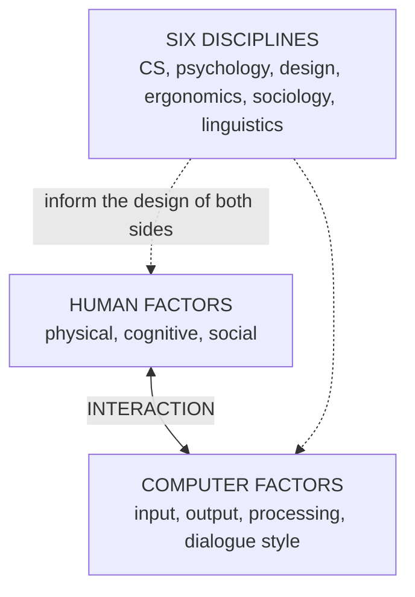

## From Five Components to Their Foundations

Lecture 1 gave us the five components of every interaction: **user, system, interaction, task and context**. This topic digs underneath them with three questions:

1. **What disciplines** inform good design decisions? (2.1)
2. **What physical, cognitive and social traits** do users bring? (2.2 — *human factors*)
3. **What technical capabilities** does the computer side offer? (2.3 — *computer factors*)

---

## 2.1 The Multidisciplinary Nature of HCI

HCI draws on **six disciplines**. Four you met in Topic 2; two are new:

| Discipline | Contribution | Introduced |
|---|---|---|
| Computer science | What the interface can technically do | Lecture 1 |
| Psychology | Perception, memory, attention, learning | Lecture 1 |
| Design | Visual composition, typography, colour | Lecture 1 |
| Ergonomics | Physical fit between people and machines | Lecture 1 |
| **Sociology** | **How groups behave, communicate and form norms** | **New** |
| **Linguistics** | **The structure and use of human language** | **New** |

### Sociology

Sociology matters wherever **groups**, not just individuals, use a system — **social media, collaborative tools and discussion boards**.

- **Industry example:** **Meta's News Feed** ranking draws heavily on sociological research into **group behaviour and social norms** to decide what content is shown, aiming to keep engagement up and conflict down.
- **Local example:** a university discussion forum **without threaded replies** makes class conversations impossible to follow — a **sociology-informed design failure**.

### Linguistics

Linguistics shapes **menu wording, error messages, chatbots and voice interfaces**, so system language **matches how users actually speak and read**.

| ❌ Poor linguistic design | ✅ Good linguistic design |
|---|---|
| "Invalid input in field 7" | "Please enter your date of birth as DD/MM/YYYY" |

<ExamTip>
**Common mistake:** writing interface text the way a **programmer thinks about the system** ("field 7", "code 402", "null value") rather than how a **user thinks about their task** ("date of birth", "not enough money"). Always phrase messages in the user's words.
</ExamTip>

<Reveal question="Think–pair–share: rewrite 'Error: Transaction failed. Code 402.' for a first-time mobile banking user.">
What's confusing: "transaction failed" doesn't say **why**, "Code 402" is meaningless to users, and there's **no next step**. A better version: **"Your transfer didn't go through because your balance is too low. You have ₦3,200; this transfer needs ₦5,000. Add money to your account or enter a smaller amount."** It explains the cause in plain words, uses the user's own terms, and tells them how to recover.
</Reveal>

---

## 2.2 Human Factors: What Users Bring to the Interaction

<Tabs>
<Tab label="Physical">

**Vision, hearing, dexterity and reach.**

*Question a designer asks:* can this user **accurately tap a small touchscreen button**? Can they read 10-point grey text? Hear a quiet alert in a noisy market?

*Real-life example:* an **elderly patient with reduced fine motor control** is far better served by a hospital self-check-in kiosk with **large, well-spaced buttons** than one with small, tightly packed icons.

</Tab>
<Tab label="Cognitive">

**Attention, memory and learning ability** — how much information a user can hold in mind, how easily they are distracted, how quickly they learn a new system.

These are covered in depth in **Lecture 3 (Human Cognition and Human Factors)** — perception, memory, attention, mental models and errors.

</Tab>
<Tab label="Social">

**Cultural background, prior technology experience, and comfort in public vs private settings.**

*Examples:* a user may avoid a voice interface in a crowded bus; someone who has only used feature phones may not recognise a "hamburger" menu icon; colours and gestures mean different things in different cultures.

</Tab>
</Tabs>

**Industry example:** **Nintendo's Wii** was explicitly designed for **non-gamers**, with simple motion controls needing no prior gaming expertise — a design built around the human factors of a new audience.

| ❌ Common mistake | ✅ Best practice |
|---|---|
| **Designing for oneself** — "I understand it, so users will too" | **Involve real target users early and often** |

<Analogy>
A tailor who sews every trouser in their own size will fit only people built like the tailor. Designers who build interfaces only for themselves do the same — the app "fits" young, tech-savvy developers and nobody else. Measuring real users (human factors) is how you cut the cloth to fit.
</Analogy>

---

## 2.3 Computer Factors: the Technical Side of Every Interaction

<FlowDiagram title="Four computer factors">
<FlowStep title="Input devices">
How users give information to the system: **keyboards, mice, touchscreens, microphones, cameras and sensors** (e.g., a **fingerprint scanner** on a phone or a BVN enrolment point).
</FlowStep>
<FlowStep title="Output devices">
How the system communicates back: **screens, speakers, printers and haptic (vibration) feedback**.
</FlowStep>
<FlowStep title="Processing">
How the system **interprets input and generates output**. **Response speed strongly affects perceived usability** — a correct answer that arrives slowly still feels like a bad interface.
</FlowStep>
<FlowStep title="Dialogue style">
The **structured pattern of exchange** — e.g., **one question at a time (a wizard)** versus **all options at once (a dashboard)**.
</FlowStep>
</FlowDiagram>

**Did you know?** The first computer mouse, built by **Douglas Engelbart's team in 1964**, was **carved from wood** and used **two perpendicular wheels** to track motion — a far cry from today's optical and laser sensors.

### When Devices Meet Real Tasks

- **Real-life example:** an **airport self-service bag-tag kiosk** combines a touchscreen, a barcode scanner and a small printer. **If the printer is slow, the whole interaction feels sluggish** — even though the touchscreen responds instantly. The slowest component defines the experience.
- **Industry example:** **Apple's haptic feedback** on the iPhone's virtual keyboard gives a **physical sense of key presses on flat glass**, improving typing accuracy and confidence.
- **Common mistake:** choosing devices for **novelty rather than task fit** — e.g., **voice control where typing is faster and more private** (nobody wants to speak their PIN aloud).

<Reveal question="Quick quiz: a surgeon needs sterile, hands-free control during an operation. Which input is best? A) Touchscreen B) Keyboard C) Voice/gesture D) Mouse">
**C — Voice/gesture.** The surgeon's hands must stay sterile and busy, so touching a screen, keyboard or mouse is impractical. Voice commands or touch-free gestures (e.g., waving to scroll through scans) fit the task and context.
</Reveal>

### Matching Devices to Tasks and Contexts

| Situation | Poor choice | Better choice | Why |
|---|---|---|---|
| Entering a PIN at a busy ATM | Voice input | Physical keypad | Privacy in a public context |
| Driving and changing music | Touch menus | Voice or steering-wheel buttons | Eyes and hands must stay on the road |
| Selling data bundles on a feature phone | Rich app | USSD menu | Works without internet on any phone |
| Nurse checking alarms across a ward | On-screen text only | Distinct sounds + large display + vibration on a pager | Multiple output channels catch attention in a busy context |

---

## Practice Questions

<Reveal question="Name the six disciplines that HCI draws on and state the two added in this lecture with their contributions.">
**Computer science, psychology, design, ergonomics, sociology and linguistics.** **Sociology** studies how groups behave, communicate and form norms — relevant to social media and collaborative tools. **Linguistics** studies the structure and use of language — shaping menu wording, error messages, chatbots and voice interfaces.
</Reveal>

<Reveal question="Distinguish between physical, cognitive and social human factors, giving one example each.">
**Physical** — bodily abilities such as vision, hearing, dexterity and reach (can an elderly user tap small buttons?). **Cognitive** — mental abilities such as attention, memory and learning (can a user remember a 6-step procedure?). **Social** — cultural background, prior tech experience, comfort in public or private (a user may not want to use voice commands on a crowded bus).
</Reveal>

<Reveal question="List the four computer factors and explain why processing matters to usability.">
**Input devices, output devices, processing and dialogue style.** Processing matters because **response speed strongly affects perceived usability** — even a correct, well-laid-out system feels poor if users wait; the slowest component (e.g., a slow kiosk printer) defines the whole experience.
</Reveal>

<Reveal question="What is the difference between a wizard and a dashboard dialogue style? When would you use each?">
A **wizard** asks **one question at a time** in a guided sequence — good for **novices and infrequent tasks** (e.g., first-time account opening). A **dashboard** shows **all options and information at once** — good for **experienced users** who need an overview and quick access (e.g., a bank manager monitoring branch performance).
</Reveal>

<Takeaway>
HCI rests on **six disciplines** — computer science, psychology, design, ergonomics, **sociology** (group behaviour and norms) and **linguistics** (language that matches how users speak and read). Every interaction has two sides. **Human factors** are what users bring: **physical** (vision, hearing, dexterity, reach), **cognitive** (attention, memory, learning) and **social** (culture, prior experience, public/private comfort). **Computer factors** are what the system offers: **input devices, output devices, processing (speed shapes perceived usability) and dialogue style** (wizard vs dashboard). Never design for yourself — involve real users, and choose devices for **task fit**, not novelty.
</Takeaway>

## Exam Tips

**What lecturers test:**
- The six disciplines of HCI, especially **sociology and linguistics** with examples
- Human factors (physical, cognitive, social) with examples
- Computer factors (input, output, processing, dialogue style)
- Choosing an input device for a task (like the surgeon quiz)

**Common mistakes:**
- Writing error messages in programmer language
- "Designing for oneself"
- Picking novel devices over ones that fit the task

**Likely question:**
> "Explain the human factors and computer factors that influence human-computer interaction, using a hospital self-check-in kiosk as an example." (15 marks)
