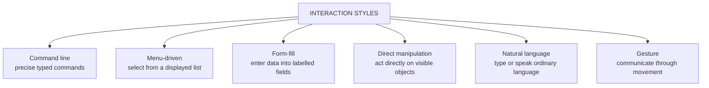

## What Is an Interaction Style?

An **interaction style** is the **pattern of exchange** between a user and a system — the "language" in which the user tells the computer what to do and the computer replies.

> Choosing the right style — or combination of styles — **directly determines task speed, accuracy, and the learning curve** a new user faces.

There are **six** styles:

---

## The Six Styles in Detail

<Tabs>
<Tab label="Command line">

**How it works:** the user types **precise commands** with exact syntax, e.g. `copy report.docx backup\` or `git commit -m "fix"`.

| Strengths | Weaknesses |
|---|---|
| **Very fast** for experts | **Steep learning curve** — commands must be memorised (**recall, not recognition**) |
| Powerful: commands can be **combined and scripted** | **Unforgiving** — one typo and the command fails |
| Low resource use; works remotely | Intimidating for novices |

**Typical example:** the terminal/shell used in software development and server administration.

</Tab>
<Tab label="Menu-driven">

**How it works:** the system **displays a list of options** and the user **selects** one.

| Strengths | Weaknesses |
|---|---|
| **Low learning curve** — users **recognise** rather than recall | Can be **slow** for experts (many levels to click through) |
| Few errors — only valid options are shown | Deep menus hide features |
| Needs little or no typing | Limited to the options the designer anticipated |

**Typical examples:** **ATM transaction menus** ("Withdrawal", "Balance Enquiry", "Transfer"), **USSD banking** (`*737#` → 1. Transfer 2. Airtime…).

</Tab>
<Tab label="Form-fill">

**How it works:** the user **enters data into labelled fields** — like filling in a paper form on screen.

| Strengths | Weaknesses |
|---|---|
| **Low learning curve** — familiar from paper forms | Needs **careful validation** of entries |
| Efficient for **structured data entry** | Long forms tire users; errors must be explained clearly |
| Fields show what information is required | Needs typing skill |

**Typical examples:** an **online loan or visa application**, JAMB/UTME registration, a school admission form.

</Tab>
<Tab label="Direct manipulation">

**How it works:** the user **acts directly on visible objects** — dragging a file to a folder, pinching to zoom a photo, dragging a slider.

Shneiderman (1983), who named the style, described its principles: **continuous visible representation of the objects**, **physical actions** (drag, click, pinch) **instead of complex syntax**, and **rapid, incremental, reversible actions whose effects are immediately visible**.

| Strengths | Weaknesses |
|---|---|
| **Intuitive**; low–moderate learning curve | Needs **screen space** and graphics |
| **Fast**, with immediate visual feedback | Hard for **visually impaired** users without alternatives |
| Actions are easy to **undo** | Repetitive tasks can be slower than a command |

**Typical examples:** dragging files on a desktop, photo **pinch-to-zoom**, drag-and-drop page builders.

</Tab>
<Tab label="Natural language">

**How it works:** the user **types or speaks ordinary language** — "What's my account balance?"

| Strengths | Weaknesses |
|---|---|
| **Very low learning curve** — no special syntax | **Ambiguity** — language is imprecise |
| Hands-free when spoken; good for accessibility | **Recognition errors** (accents, noise) |
| Natural for simple queries | Speed for experts is **variable**; users can't see what's possible |

**Typical examples:** **voice assistants** (Siri, Google Assistant), **chatbots** on bank and telecom websites.

</Tab>
<Tab label="Gesture">

**How it works:** the user **communicates through movement** — swipes, taps and pinches on touchscreens, or body movements tracked by sensors.

| Strengths | Weaknesses |
|---|---|
| **Fast** and natural on mobile | Gestures are **invisible** — users must discover them |
| Low–moderate learning curve | Inconsistent meanings across apps |
| Enables **touch-free** control | Tiring for large or repeated motions |

**Typical examples:** **touchscreen swipes** (swipe to delete, pull to refresh), **motion-sensing games**.

</Tab>
</Tabs>

---

## Table 2.1 — Comparison of Interaction Styles

| Interaction style | Learning curve | Speed for experts | Typical example |
|---|---|---|---|
| **Command line** | **Steep** | **Very fast** | Terminal/shell in software development |
| **Menu-driven** | Low | Moderate | ATM transaction menus |
| **Form-fill** | Low | Moderate | Online loan or visa application |
| **Direct manipulation** | Low–moderate | Fast | Dragging files, photo pinch-to-zoom |
| **Natural language** | **Very low** | Variable | Voice assistants, chatbots |
| **Gesture** | Low–moderate | Fast | Touchscreen swipes, motion-sensing games |

<ExamTip>
Notice the **trade-off**: styles that are **easiest to learn** (menus, natural language) are rarely the **fastest for experts**, and the fastest (command line) has the **steepest learning curve**. Examiners love asking you to justify a style choice using this trade-off.
</ExamTip>

---

## Matching Styles to Users and Tasks

Designers **match style to user expertise**:

| User type | Favoured styles | Why |
|---|---|---|
| **Novice / occasional** | **Menu-driven, form-fill** | Visible options, recognition over recall, few errors |
| **Expert / frequent** | **Command line, shortcut-heavy direct manipulation** | Speed and power once learned |

### Two Real Examples

- **The ATM** uses **menu-driven** interaction ("Withdraw", "Balance Enquiry") because it must be **usable instantly by first-time customers with zero training**.
- **Microsoft Excel** **combines** styles — **direct manipulation** (dragging cells), **menu-driven** ribbons, and a **command-line-like formula bar** — serving **both novices and power users** at once.

<Analogy>
Getting around Lagos: a first-time visitor uses a **menu** — a ride-hailing app that shows every option. A long-time resident uses a **command line** — they just tell the danfo driver "Ojuelegba, via Western Avenue" and get there faster. Good systems, like Excel, let both travellers use the same road.
</Analogy>

<Reveal question="Think–pair–share: you are designing a government portal for renewing a national ID card. Users range from tech-savvy graduates to first-time, low-literacy applicants. Which styles would you choose, and would you offer more than one pathway?">
Use a **step-by-step form-fill wizard** with **menu-driven** choices (select state, select renewal reason) as the main path, because novices can recognise options and complete one small step at a time. Add **icons, plain language and local-language options** for low-literacy users, and perhaps **assisted/voice** help. Yes — offer **multiple pathways**: returning expert users could get a shortcut ("Renew with my NIN" in one screen, autofilled from records), while first-timers follow the guided wizard. This serves both ends of the expertise spectrum without forcing either into the other's style.
</Reveal>

---

## Practice Questions

<Reveal question="Name the six interaction styles and give one example of each.">
**Command line** (terminal/shell), **menu-driven** (ATM menus, USSD), **form-fill** (online visa application), **direct manipulation** (dragging files, pinch-to-zoom), **natural language** (voice assistants, chatbots), **gesture** (swipe to delete, motion games).
</Reveal>

<Reveal question="Which style has the steepest learning curve but is fastest for experts? Explain why.">
The **command line**. Users must **memorise exact commands and syntax** (recall rather than recognition), which takes time to learn, but once learned, typing a command — or a script that runs many commands — is far faster than clicking through menus.
</Reveal>

<Reveal question="State three principles of direct manipulation (Shneiderman, 1983).">
(1) **Continuous visible representation** of the objects of interest; (2) **physical actions** (drag, click, pinch) instead of complex command syntax; (3) **rapid, incremental, reversible** actions whose effects are **immediately visible**.
</Reveal>

<Reveal question="Should all interfaces support multiple interaction styles? Discuss.">
Supporting multiple styles serves **diverse users** — novices use menus while experts use shortcuts or commands (as in Excel), and it aids accessibility (voice for blind users, keyboard for motor-impaired users). But it **adds complexity** and cost: more to design, test and document, and possibly a more cluttered interface. The best approach is a **primary style suited to the main users**, plus **optional accelerators** (keyboard shortcuts, search/command boxes) that don't get in novices' way.
</Reveal>

<Takeaway>
An interaction style is the pattern of exchange between user and system. The six styles are **command line** (steep learning, very fast for experts), **menu-driven** and **form-fill** (low learning, moderate speed — ideal for novices), **direct manipulation** (act on visible objects with immediate, reversible feedback), **natural language** (very easy but ambiguous, variable speed) and **gesture** (fast and natural but hard to discover). **Match the style to the user and task**: novices need visible menus and forms; experts need speed. Many good systems — like Excel — **combine styles** to serve both.
</Takeaway>

## Exam Tips

**What lecturers test:**
- Name and explain the six styles with examples
- Table 2.1 comparisons (learning curve, expert speed)
- Choose and justify a style for a scenario (ATM, government portal, surgeon, farmer)

**Common mistakes:**
- Saying one style is "best" without reference to users and tasks
- Confusing direct manipulation (acting on visible objects) with gesture (movement-based input) — they overlap on touchscreens, but gesture also includes touch-free motion

**Likely question:**
> "Compare menu-driven, command-line and direct-manipulation interaction styles. Recommend, with reasons, a suitable interaction style for a hospital appointment kiosk used by elderly patients." (15 marks)
