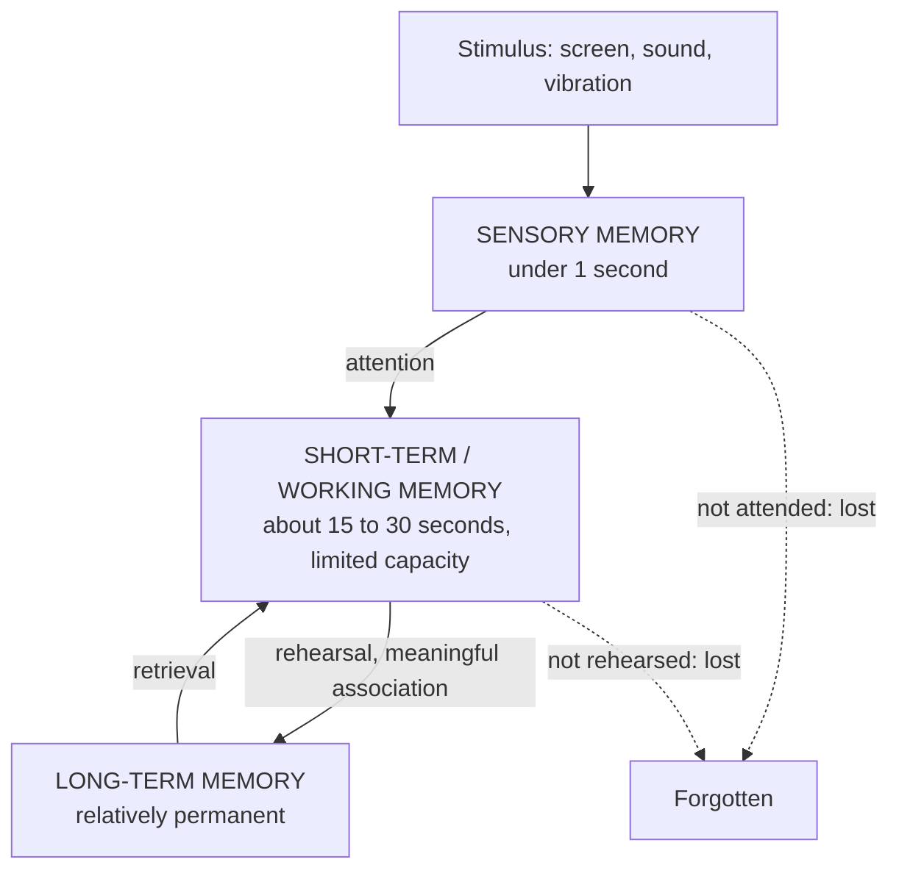

## Three Everyday Mysteries

- Why does a **first-time user freeze** at an airport kiosk, while a frequent traveller breezes through in seconds?
- Why do people occasionally **enter the wrong PIN** at an ATM they have used hundreds of times?
- Why does a **cluttered notification screen** make people miss the one alert that actually matters?

> The answers lie not in the software's code, but in **human cognition** — the mental processes of **perceiving, remembering, attending to and learning** information.

Lecture 3 is about the mind of the user. This topic covers **perception** and **memory**; the next covers **attention, learning, mental models and errors**; the one after covers the **laws** that let us calculate human performance.

---

## 3.1 Perception

> **Perception** is the process by which the brain **interprets sensory information** to construct a meaningful understanding of a computer interface.

<Tabs>
<Tab label="Visual">

Interpreting **light, colour, shape and motion** — the **dominant channel** in most graphical interfaces.

*Design implications:* colour contrast, font size, visual hierarchy, grouping and alignment all depend on visual perception.

</Tab>
<Tab label="Auditory">

Interpreting **sound** — used for **alerts** and **voice interfaces**.

*Design implications:* distinct sounds for different alert levels; volume and frequency must suit the environment (a quiet library vs a noisy market).

</Tab>
<Tab label="Haptic">

Interpreting **touch and physical feedback** — e.g., the **vibration** confirming a touchscreen press, or the raised dot on the "5" key of a keypad.

*Design implications:* haptics confirm actions without looking, which helps in noisy places and for visually impaired users.

</Tab>
</Tabs>

---

## Gestalt Principles

**Gestalt principles**, from early-20th-century psychology, describe how the brain **automatically groups visual elements** into wholes. ("Gestalt" is German for "shape" or "form".) Your notes focus on four:

*Figure: The four Gestalt principles covered in this course.*

| Principle | What the brain does | Interface example |
|---|---|---|
| **Proximity** | Items **close together** are seen as a **group** | "First Name" and "Last Name" fields placed together signal that they belong together |
| **Similarity** | Items that **look alike** (colour, shape, size) are seen as **related** | **Spotify** uses consistent colour coding for playlists vs albums, so users tell categories apart while scrolling fast |
| **Closure** | The mind **fills in gaps** to see complete shapes | Icons drawn with a few lines (a broken circle "loading" spinner, a simplified logo) are still recognised |
| **Continuity** | The eye follows **smooth lines and paths** | Items aligned in a row or along a curve are read as a sequence — progress steps, carousels, timelines |

**Real-life example:** a mobile banking app **groups balance, transactions and "Transfer" tightly together**, while placing **"Settings" and "Log Out" apart** — communicating function **through proximity alone**, without a single word of explanation.

<ExamTip>
**Common mistake:** placing **related controls far apart** (e.g., a "Save" button at the top of a long form and the fields at the bottom). **Best practice:** use proximity and similarity **deliberately**, and **test contrast with low-vision users**.
</ExamTip>

<Reveal question="Think–pair–share: open any app on your phone and find one example of proximity or similarity.">
Typical findings: **WhatsApp** — the camera, attachment and microphone icons sit together beside the message box (**proximity**: all ways of sending something). **Bank apps** — all tappable quick actions (Transfer, Airtime, Pay Bills) use the same icon style and size (**similarity**: they're all actions). **Instagram** — each post groups the photo, likes and comments together, with space between posts (**proximity** separates one post from the next).
</Reveal>

---

## 3.2 Memory

Memory works in **three stages**:

<FlowDiagram title="Three stages of memory">
<FlowStep title="Sensory memory">
Briefly holds **raw impressions** — for **under a second** — before most information is discarded. Only what we **attend to** moves on.
</FlowStep>
<FlowStep title="Short-term / working memory">
Holds a **small amount** of information for about **15–30 seconds** unless it is rehearsed. It is famously **limited in capacity** (Miller's 7 ± 2 — Topic 8). This is where we hold an OTP while typing it.
</FlowStep>
<FlowStep title="Long-term memory">
Stores information **relatively permanently** through **repetition and meaningful association**. This is where your PIN and your favourite app's layout live.
</FlowStep>
</FlowDiagram>

### Recall vs Recognition

| | Recall | Recognition |
|---|---|---|
| **Definition** | Retrieving information **with no cues** | **Identifying** information **when it is shown** |
| **Example** | Typing a remembered command in a terminal | Selecting an option from a visible menu |
| **Difficulty** | **Harder** | **Easier** |

> **Recognition is cognitively easier** than recall — which is why **menu-driven interfaces are generally easier for novices** than command-line interfaces.

<Analogy>
It's the difference between an **essay exam** and a **multiple-choice test**. In an essay you must **recall** the answer from nothing; in an MCQ the right answer is **in front of you** and you only need to **recognise** it. Good interfaces are MCQ-style: they show users their options instead of making them remember.
</Analogy>

### Designing for Recognition, Not Recall

- **Real-life example:** a hospital pharmacy system that requires staff to **remember a patient ID across five screens** raises transcription-error risk. **Displaying the ID persistently** on every screen relies on recognition instead.
- **Industry example:** **Amazon keeps the cart icon and item count visible everywhere**, so users never need to recall what they've selected.
- **Best practice:** show a **progress indicator** in multi-step processes ("Step 2 of 4"), and **limit menu depth to two or three levels**.

<Reveal question="Quick quiz: typing a remembered terminal command with no visible hint is an example of… A) Recognition B) Recall C) Sensory memory D) Divided attention">
**B — Recall.** The user must retrieve the command from memory with no cues on screen.
</Reveal>

---

## Putting It Together: Perception and Memory in One Screen

Consider a **bank transfer** screen:

| Design decision | Cognitive principle |
|---|---|
| Recipient name, account number and bank grouped in one card; amount and narration in another | **Proximity** — two clear groups |
| All primary buttons the same colour and shape | **Similarity** — users know what's tappable |
| Recently used beneficiaries shown as a list to tap | **Recognition over recall** — no need to remember account numbers |
| "Step 2 of 3" shown at the top | Reduces **working-memory** load; supports **continuity** of the process |
| A short vibration and a green tick after sending | **Haptic** and **visual** perception confirm success |

---

## Practice Questions

<Reveal question="Define perception and name the three perceptual channels used in interface design, with an example each.">
**Perception** is the process by which the brain interprets sensory information to build a meaningful understanding of an interface. **Visual** — reading icons and text on screen; **auditory** — hearing an alarm or a voice prompt; **haptic** — feeling a vibration confirming a tap.
</Reveal>

<Reveal question="Explain the Gestalt principles of proximity and similarity with an interface example of each.">
**Proximity:** elements placed close together are perceived as a group — e.g., grouping "First Name" and "Last Name" fields. **Similarity:** elements that look alike are perceived as related — e.g., Spotify colour-codes playlists differently from albums so users can distinguish categories quickly.
</Reveal>

<Reveal question="Describe the three stages of memory and state one design implication of working memory's limits.">
**Sensory memory** holds raw impressions for under a second; **short-term/working memory** holds a small amount for about 15–30 seconds unless rehearsed; **long-term memory** stores information relatively permanently through repetition and association. Because working memory is small and short-lived, **don't make users carry information between screens** — display it persistently (e.g., keep the patient ID or order number visible).
</Reveal>

<Reveal question="Why are menu-driven interfaces generally easier for novices than command-line interfaces?">
Menus rely on **recognition** — users identify the option they want from those displayed — while command lines rely on **recall** of exact commands with no cues. Recognition is cognitively easier, so novices make fewer errors and learn faster with menus.
</Reveal>

<Takeaway>
Most usability successes and failures are explained by **human cognition**, not code. **Perception** interprets **visual, auditory and haptic** input; the **Gestalt principles** — **proximity, similarity, closure and continuity** — describe how the brain automatically groups what it sees, so designers can communicate structure without words. **Memory** has three stages — **sensory** (under a second), **short-term/working** (about 15–30 seconds, very limited) and **long-term** (relatively permanent). Because **recognition is easier than recall**, good interfaces keep key information visible, use menus and progress indicators, and keep menus shallow.
</Takeaway>

## Exam Tips

**What lecturers test:**
- Define perception; the three channels
- Explain and illustrate the four Gestalt principles
- The three stages of memory with durations
- Recall vs recognition, and why recognition is preferred

**Common mistakes:**
- Mixing up proximity (closeness) and similarity (likeness)
- Stating working memory lasts "minutes" — it's about **15–30 seconds** without rehearsal

**Likely question:**
> "Explain four Gestalt principles of perception and show how each can be applied in designing a university course-registration page." (12 marks)
