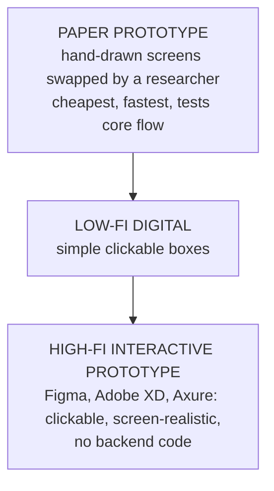

## From Research to Something Testable

Topics 11–12 produced **understanding**: design-thinking framing, research findings, personas and journey maps. This topic turns understanding into **artefacts you can show users and test**: storyboards, wireframes and prototypes — improved through **iterative design**.

| Artefact | Captures | Question it answers |
|---|---|---|
| **Storyboard** | Human and environmental **context** | *In what real situation is this used?* |
| **Wireframe** | **Structure** and layout, no styling | *What goes where, in what order?* |
| **Visual mockup** | Fully **styled** screens (not necessarily interactive) | *What will it look like?* |
| **Prototype** | **Interactivity** — a testable simulation | *Can users actually complete the task?* |

<ExamTip>
**Exam tip from the lecture:** be ready to distinguish **wireframe (structure)**, **prototype (interactivity)** and **visual mockup (fully styled, not necessarily interactive)**. These three are often confused but are distinct design artefacts.
</ExamTip>

---

## 5.5 Storyboards

> A **storyboard** is a **comic-strip-like sequence of panels** depicting a user interacting with a product in a **realistic scenario** — capturing the **human and environmental context** that a wireframe alone would miss.

### Worked Example: Mr Bello at the ATM

<FlowDiagram title="Storyboard: Mr Bello at the market ATM">
<FlowStep title="Panel 1 — The situation">
**Mr Bello, elderly**, approaches a **busy market ATM** holding a **walking stick**. He needs cash **before his bus arrives**.
</FlowStep>
<FlowStep title="Panel 2 — The friction">
He **squints at small on-screen text**, unsure which button means "fast cash". **The queue behind him grows.**
</FlowStep>
<FlowStep title="Panel 3 — The redesign">
He selects a **large, clearly labelled "Fast Cash ₦5,000"** button — the redesigned interface's new shortcut.
</FlowStep>
<FlowStep title="Panel 4 — The outcome">
He walks away **relieved**, catching his bus — a large-text shortcut **solved a real, observed problem**.
</FlowStep>
</FlowDiagram>

**Common mistake:** depicting only an **idealised, frictionless** scenario. **The friction in Panel 2 is what makes the redesign meaningful.**

### Designing for the Real World, Not a Vacuum

Software teams sometimes design interfaces imagining a user **calmly seated with full attention**. Storyboards counter this by forcing **realistic context**: a **nurse interrupted mid-task**, a **farmer in bright sunlight**, a **commuter one-handed on a crowded danfo**.

**Industry example:** automotive companies designing **in-car touchscreens** storyboard a driver **glancing at a navigation prompt while merging into traffic** — ensuring designs account for **divided attention and safety** constraints that a static mockup wouldn't reveal.

<Reveal question="Quick quiz: what makes a storyboard different from a wireframe? A) It's in colour B) It captures human and environmental context C) It's interactive D) It's built in Figma">
**B — It captures human and environmental context.** A wireframe shows the screen's structure; a storyboard shows the **person and situation** around the screen.
</Reveal>

<Reveal question="Think–pair–share: describe the 'realistic context' panel a storyboard would need for an app you use while distracted or in an awkward situation.">
Example: a **POS/transfer app used by a market trader**: *"Panel 2: Mama Nkechi holds a tray of tomatoes in one hand while a customer waits; with her thumb she tries to confirm a ₦3,500 transfer in bright sunlight, while two other customers call for her attention."* This panel tells designers to support **one-handed use, high-contrast screens, large confirm buttons and instant, audible confirmation**.
</Reveal>

---

## 5.6 Wireframes: Structure Before Style

> A **wireframe** is a **simplified, schematic layout** showing **buttons, fields and navigation** — **without colour, typography or final graphics**.

*Figure: A low-fidelity wireframe of a hospital booking screen — grey boxes and placeholder text validate the layout logic before any visual design begins.*

| Low-fidelity wireframe | High-fidelity wireframe |
|---|---|
| **Basic shapes**, often **hand-drawn** | **Closer to final layout and spacing** |
| **Deliberately unpolished** so reviewers focus on **structure**, not taste | Sometimes realistic placeholder content — but **still no final colours or branding** |

**Why it matters:** wireframes stop "*I don't like that shade of blue*" from derailing "*does the user need this before or after that?*"

- **Industry example:** government digital service teams (e.g., the **UK Government Digital Service**) publish **low-fidelity wireframes** for public services like tax filing, for **early stakeholder and accessibility review** — because **structural problems are far cheaper to fix at the wireframe stage** than after visual design or development.
- **Common mistake:** adding **visual polish too early**, which shifts feedback away from structure toward subjective taste.

---

## 5.7 Prototypes and the Fidelity Spectrum

> A **prototype** is **a preliminary, testable representation of a product**, built to **simulate functionality and gather feedback before full-scale development**.

- **Paper prototyping:** hand-drawn screens, **manually swapped by a researcher** to simulate transitions as the user "taps".
- **Digital prototypes (Figma, Adobe XD, Axure):** **clickable, screen-realistic**, simulating a near-final experience **with no backend code**.

> **Fidelity is a deliberate choice** tied to **project stage, testing goals, cost and time** — **not a "better or worse" ranking**.

### Table 5.2 — Wireframe vs Prototype Fidelity

| Aspect | Low-fi wireframe | High-fi wireframe | Interactive prototype |
|---|---|---|---|
| **Visual detail** | Minimal (boxes, lines) | Moderate, some real content | High (near-final visuals) |
| **Interactivity** | None | Little to none | **Clickable, simulates navigation** |
| **Best for** | Structure and hierarchy | Layout and information density | Realistic user flows |

- **Real-life example:** a team designing a **library self-checkout kiosk** first tests a **paper prototype with students in a hallway**; once the flow works, it builds a **clickable Figma prototype** on a tablet mounted to resemble the real kiosk.
- **Industry example:** **Airbnb** is known for rapid prototyping — building physical and interactive mockups to test new features with real users **before committing full engineering effort**.

<Reveal question="Quick quiz: why test a paper prototype before building a digital one? A) Paper looks more professional B) It tests core flow logic before investing more time and cost C) Paper prototypes are required by law D) Digital tools can't be used for kiosks">
**B.** Paper tests whether the **basic flow makes sense** almost for free; there's no point polishing a digital prototype of a flow that users don't understand.
</Reveal>

<Reveal question="Think–pair–share: you have one week and no budget to test whether students understand a new 3-step course-registration flow. Paper or digital prototype?">
**Paper.** The question being tested is **flow logic** (do students understand the three steps and their order?), not visual design — exactly what low fidelity is for. Paper costs nothing, can be sketched and changed in minutes, and lets you run several rounds with 5 students each within the week. Digital fidelity would spend the limited time on polish that doesn't answer the question.
</Reveal>

---

## 5.8 Iterative Design: The Design–Test–Refine Loop

<FlowDiagram title="The iterative design loop" cycle>
<FlowStep title="1. Design / Refine">
**Build or improve** a prototype.
</FlowStep>
<FlowStep title="2. Test">
**Observe real users**: where they succeed, hesitate and fail.
</FlowStep>
<FlowStep title="3. Analyse">
Identify **specific, actionable problems**.
</FlowStep>
<FlowStep title="4. Revise">
**Address the problems**, then repeat the loop.
</FlowStep>
</FlowDiagram>

**Why it matters:** no design team, however skilled, can **perfectly predict every usability issue in advance** (Nielsen, 1993). Iterative design treats unexpected confusion as **expected, not exceptional**.

| ❌ Common mistake | ✅ Best practice |
|---|---|
| Making **many changes at once** between iterations — you can't tell which change caused the improvement | Change **one or a few variables** per iteration to **isolate cause and effect** |

### Worked Example: The Login Screen in Three Cycles

<Tabs>
<Tab label="Cycle 1 — Initial design">

**Test result:** **5 of 8 users** missed the **low-contrast "Forgot password?"** link; **2** mistyped passwords with **no way to reveal** what they typed.

**Change for next cycle:** raise the link's **contrast** + add a **password reveal toggle**.

</Tab>
<Tab label="Cycle 2 — First refinement">

**Test result:** the password link is now fixed — **all users found it**. But **3 of 8 new users** entered the wrong information: unclear whether **"Username"** meant **account number, email or phone**.

**Change for next cycle:** relabel the field **"Phone or Account Number"** + add an **example placeholder**.

</Tab>
<Tab label="Cycle 3 — Second refinement">

**Result:** success rate rose from **about 60% (Cycle 1) to over 95% (Cycle 3)**. Remaining friction was minor individual preference.

Each cycle fixed **specific, evidenced problems** — and testing revealed a **new** problem (the Username label) that nobody predicted.

</Tab>
</Tabs>

- **Industry example:** **Google** is known for extensive **A/B testing** — showing two design variants to different user groups — on elements as small as **button colour and wording**, so even minor decisions are settled by **real behaviour, not internal opinion**.
- **Important:** iterative design **does not mean redesigning endlessly without direction**. Each iteration should be driven by **specific evidence** and a **clear hypothesis** about which change will fix which problem.

<Reveal question="Quick quiz: in the login example, why change only one variable per cycle? A) It's faster B) To isolate which change caused the improvement C) A rule of design tools D) Users prefer it">
**B — to isolate which change caused the improvement.** If you change five things and success rises, you don't know which change helped (or which hurt).
</Reveal>

---

## 5.9 Complete Worked Example: Library Self-Checkout Kiosk

Each stage's output becomes the next stage's input:

<FlowDiagram title="The UCD pipeline for a library kiosk">
<FlowStep title="1. User research">
**Contextual inquiry + 12 interviews + a 150-student survey.** Findings: students **hate queuing in 10-minute gaps between classes**; jargon like **"circulation"** confuses many.
</FlowStep>
<FlowStep title="2. Persona">
**"Tunde", 20, engineering student.** Borrows 2–3 books a week between classes, comfortable with everyday tech, **prioritises speed over features**.
</FlowStep>
<FlowStep title="3. Journey map">
Arrival → **Queue (pain point)** → **Transaction (slow — pain point)** → Departure, often **arriving late to class**.
</FlowStep>
<FlowStep title="4. Storyboard">
Three panels: Tunde walks to an **empty kiosk** → taps his ID and scans books with **on-screen confirmation** → leaves confidently **with minutes to spare**.
</FlowStep>
<FlowStep title="5. Wireframe">
**"Tap ID to begin"** instruction, a **scanned-books list**, and a **large fixed "Finish & Print" button** — sized for quick, confident tapping (touch-target principles from Lecture 4).
</FlowStep>
<FlowStep title="6. Prototype">
A **paper prototype with 6 students** reveals **confusion about whether to tap the ID or scan books first**. The **Figma prototype** adds explicit **"Step 1 of 3"** numbering to fix it.
</FlowStep>
<FlowStep title="7. Iteration">
**Cycle 1:** students weren't sure the transaction had finished → add an **animated confirmation**. **Cycle 2:** one-handed users couldn't reach a **top-corner Cancel** → move it into the **lower thumb zone** (Lecture 4).
</FlowStep>
</FlowDiagram>

**Outcome:** the final design addressed the **research-identified queuing pain point**, while **catching new problems that only user testing could reveal**.

---

## Discussion Questions

<Reveal question="How should teams proceed when target users are hard to access (surgeons during operations, air traffic controllers)?">
Use **proxy and indirect methods**: interview users **outside** critical moments (after shifts), observe **simulations and training sessions**, study **recordings, logs and incident reports**, consult **domain experts and trainers**, and test prototypes in **realistic simulators**. Keep sessions short and scheduled around their work, and validate findings with the real users whenever safe windows appear.
</Reveal>

<Reveal question="Personas are criticised for oversimplifying diverse populations. What are the risks, and how can teams mitigate them?">
**Risks:** minority needs (disabled, older, rural, low-literacy users) disappear; teams treat personas as stereotypes; decisions optimise for the "main" persona only. **Mitigations:** base personas on **fresh research** and update them; include **edge-case and accessibility personas** or a **persona spectrum**; test with **real, diverse users**, not just personas; and treat personas as a starting point for empathy, not a replacement for data.
</Reveal>

<Reveal question="Are there situations where paper prototyping is still preferable to digital, even when digital tools are available?">
Yes: **very early** exploration of flows, **workshops with non-technical stakeholders** who feel freer to criticise rough sketches, **field testing where power or devices are scarce**, and whenever you want feedback on **structure, not visuals**. Paper is also fastest to change **during** a test session.
</Reveal>

<Takeaway>
**Storyboards** show the **human and environmental context** of use (Mr Bello squinting at the ATM with a queue behind him) — the friction is the point. **Wireframes** fix **structure before style**: low fidelity for structure and hierarchy, high fidelity for layout. **Prototypes** are testable simulations along a **fidelity spectrum** from **paper** to **clickable Figma** — fidelity is a **choice** matched to the question, not a ranking. **Iterative design** loops **design → test → analyse → revise**, changing **one variable at a time** and driven by evidence (login success 60% → 95% over three cycles). Together they form a **pipeline**: research → persona → journey map → storyboard → wireframe → prototype → iteration.
</Takeaway>

## Exam Tips

**What lecturers test:**
- Distinguish **storyboard, wireframe, visual mockup and prototype**
- Low- vs high-fidelity; Table 5.2
- Paper vs digital prototyping — choose and justify for a scenario
- The iterative design loop and why to change one variable at a time
- Apply the full UCD pipeline to a scenario (like the library kiosk)

**Common mistakes:**
- Polishing visuals too early
- Storyboards with no friction
- Calling a static styled screen a "prototype" — without interactivity it's a mockup

**Likely question:**
> "Distinguish between a wireframe, a visual mockup and a prototype. Describe how you would use low- and high-fidelity prototypes and iterative testing to design a hostel-booking kiosk." (15 marks)
