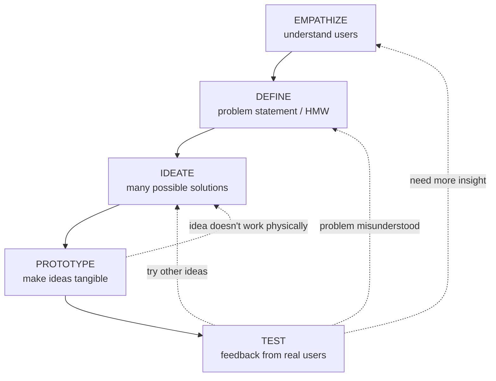
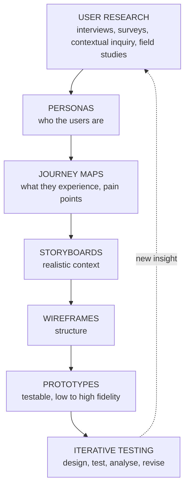

## Two Teams, One Hospital Booking System

| Team A — Engineer-led | Team B — User-centred |
|---|---|
| Builds what **they assume** a booking system should do | **Observes** real patients, **interviews** nurses, **sketches** ideas and **tests them with real patients** before building anything |
| Elderly patients **can't complete bookings**; nurses spend **more time helping** than the system saved | **Same function, dramatically more usable** |

Both teams wrote working software. Only one wrote software people could use. The difference is **User-Centred Design**.

> **User-Centred Design (UCD)** is **a design philosophy and iterative process in which the needs, limitations, behaviours and feedback of end users guide every stage of product development**, from initial research through to final refinement.
> — *ISO 9241-210 (2019)*

**Did you know?** **Donald Norman** popularised the term in his **1986** book, later reinforced in ***The Design of Everyday Things* (1988)**.

<Analogy>
Engineer-led design is like a tailor who sews a suit from what "a customer usually wants", then insists you wear it. User-centred design is a tailor who **measures you, lets you try on a rough fitting, adjusts, and fits again** — designing **with** you, not just **for** you.
</Analogy>

---

## Principles of UCD

*(From ISO 9241-210, the standard your lecture cites — useful for "state the principles of UCD" questions.)*

| # | Principle | What it means in practice |
|---|---|---|
| 1 | The design is based on an **explicit understanding of users, tasks and environments** | Research first — no assumptions |
| 2 | **Users are involved** throughout design and development | Not just asked once at the start |
| 3 | The design is **driven and refined by user-centred evaluation** | Testing with real users decides what changes |
| 4 | The process is **iterative** | Design → test → refine, repeatedly |
| 5 | The design addresses the **whole user experience** | Emotions, context and support — not just the screen |
| 6 | The design team includes **multidisciplinary skills and perspectives** | Designers, developers, researchers, domain experts |

---

## 5.1 Design Thinking: Five Non-Linear Stages

**Design thinking** structures user-centred problem solving into **five stages**:

<FlowDiagram title="The five stages of design thinking" cycle>
<FlowStep title="Empathize">
**Research and engage with users** to understand their needs and context — observe, interview, immerse yourself in their world.
</FlowStep>
<FlowStep title="Define">
**Synthesise** findings into a clear **problem statement** or a **"How Might We"** question.
</FlowStep>
<FlowStep title="Ideate">
**Generate a wide range of possible solutions**, deferring judgement — quantity first, quality later.
</FlowStep>
<FlowStep title="Prototype">
Build **low-cost, simplified representations** to make ideas **tangible**.
</FlowStep>
<FlowStep title="Test">
**Gather feedback from real users**, feeding back into **earlier stages**.
</FlowStep>
</FlowDiagram>

> **Design thinking is non-linear:** testing a prototype might reveal the problem was **misunderstood**, sending the team **back to Define**. This is **intentional, not a failure**.

<ExamTip>
**Common mistakes** examiners look for: (1) **skipping Empathize** and jumping straight to Ideate based on assumptions; (2) treating the five stages as a **strict one-way sequence**. Always mention that the process **loops back** as new evidence emerges.
</ExamTip>

### Table 5.1 — The Five Stages at a Glance

| Stage | Primary question | Typical output |
|---|---|---|
| **Empathize** | Who are the users, and what do they need? | Research notes, raw data |
| **Define** | What is the core problem to solve? | Problem statement, personas |
| **Ideate** | What are the possible solutions? | Idea list, concept sketches |
| **Prototype** | How can this idea be made tangible? | Testable prototype |
| **Test** | Does the solution work for real users? | Findings, refined requirements |

---

## "How Might We" Questions

**Best practice:** during **Define**, reframe the problem as a **"How Might We" (HMW)** question — **broad enough** to allow creative solutions, **specific enough** to guide focused ideation.

| ❌ Narrow / solution-first | ✅ Generative HMW |
|---|---|
| "How do we make ATMs faster?" | **"How might we reduce queue anxiety at ATM machines?"** |

The HMW version opens up many solutions — faster transactions, but also pre-staged withdrawals on your phone, queue displays, cardless cash, more machines at peak times.

<Reveal question="Think–pair–share: students frequently miss important announcements buried in a cluttered noticeboard app. Write a 'How Might We' question.">
A good HMW: **"How might we make sure every student sees the announcements that matter to them, at the moment they need them?"** It is **broad** (doesn't dictate notifications, SMS or redesign) but **focused** on the real need (the right announcement reaching the right student at the right time). A weak version would be "How might we add push notifications?" (solution-first) or "How might we improve communication?" (too vague).
</Reveal>

---

## Design Thinking in Action

<Tabs>
<Tab label="Crop-advice app (real life)">

A team designing a **crop-advice app for smallholder farmers**:

1. **Empathize** — visits farms to understand farmers' days, phones and literacy.
2. **Define** — *"How might we deliver crop advice to **low-literacy** farmers with **intermittent connectivity**?"*
3. **Ideate** — brainstorms **SMS, icons and voice**.
4. **Prototype** — builds an **icon-and-voice** prototype.
5. **Test** — discovers that **voice messages in local languages worked far better than text**.

Without the Empathize stage, the team might have built a text-heavy app that farmers couldn't use.

</Tab>
<Tab label="IDEO's shopping cart (industry)">

The design firm **IDEO** famously redesigned the **shopping cart** by **rapidly prototyping and testing with real shoppers in-store**, iterating on the **handle design and child seating** based on **direct observation** rather than internal assumptions.

</Tab>
</Tabs>

<Reveal question="Quick quiz: a team skips visiting real users and jumps straight to brainstorming. Which stage did they skip? A) Define B) Empathize C) Test D) Prototype">
**B — Empathize.** They skipped understanding users, so their ideas rest on assumptions.
</Reveal>

---

## The UCD Pipeline

Lecture 5 presents UCD as a **connected pipeline** — each stage's output becomes the next stage's input. You'll study each part in Topics 12 and 13:

> **It's a pipeline, not a checklist.** Skipping or isolating one stage — for example, never testing — **breaks the whole chain**.

---

## Practice Questions

<Reveal question="Define User-Centred Design according to ISO 9241-210 and state three of its principles.">
UCD is **a design philosophy and iterative process in which the needs, limitations, behaviours and feedback of end users guide every stage of product development.** Principles (any three): design based on an **explicit understanding of users, tasks and environments**; **users involved throughout**; design **driven and refined by user-centred evaluation**; an **iterative** process; addresses the **whole user experience**; a **multidisciplinary** team.
</Reveal>

<Reveal question="Explain the five stages of design thinking and why the process is described as non-linear.">
**Empathize** (research users' needs and context), **Define** (turn findings into a problem statement or HMW question), **Ideate** (generate many solutions without judging), **Prototype** (build cheap, tangible representations), **Test** (get feedback from real users). It is **non-linear** because testing may reveal the problem was misunderstood or a new need exists, sending the team **back** to Define, Empathize or Ideate — this looping is intended.
</Reveal>

<Reveal question="Rewrite 'How do we make the hostel portal faster?' as a better HMW question.">
For example: **"How might we help students secure hostel accommodation without the stress and uncertainty of the allocation rush?"** — it focuses on the underlying need (security and less stress) rather than one solution (speed).
</Reveal>

<Reveal question="Why did Team B's hospital booking system succeed where Team A's failed?">
Team B **grounded design in research** (observing patients, interviewing nurses) and **tested sketches with real patients before building**, so the system fitted elderly patients' abilities and nurses' workflows. Team A built on **assumptions**, never validated them with users, and discovered the problems only after deployment — when they were expensive to fix.
</Reveal>

<Takeaway>
**User-Centred Design** (ISO 9241-210; popularised by Donald Norman in 1986) lets **users' needs, limitations, behaviours and feedback guide every stage** of development — designing **with** people, not just for them. It rests on understanding users, involving them throughout, evaluation-driven refinement, **iteration**, the whole experience and a multidisciplinary team. **Design thinking** organises this into five **non-linear** stages — **Empathize, Define, Ideate, Prototype, Test** — that loop back as evidence emerges. Frame problems as **"How Might We"** questions: broad enough for creativity, specific enough for focus. **Evidence beats assumption.**
</Takeaway>

## Exam Tips

**What lecturers test:**
- Define UCD (ISO 9241-210) and contrast it with engineer-led design
- The five stages of design thinking with the question and output of each (Table 5.1)
- Why design thinking is non-linear
- Writing a good **HMW** question

**Common mistakes:**
- Presenting design thinking as a straight line
- Skipping Empathize ("we already know what users want")
- Writing HMW questions that are really solutions in disguise

**Likely question:**
> "Explain the five stages of design thinking, using the design of a campus shuttle-booking app as an example, and explain why the process is iterative rather than linear." (15 marks)
