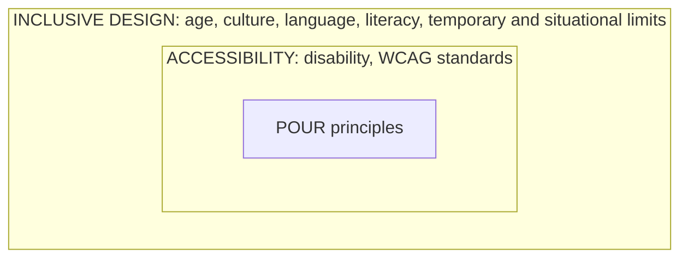

## 2.5 User Diversity: Nobody Is the "Average User"

Design a shoe for the "average foot" and it fits almost nobody well. Interfaces are the same. Users differ along **six dimensions**:

| Dimension | How it varies | Design implication |
|---|---|---|
| **Expertise** | **Novices** rely on **visible cues**; **experts** use **memorised shortcuts** | Offer both visible menus and shortcuts |
| **Age** | Affects **vision, motor control and technology exposure** | Larger text and targets; don't assume familiarity with gestures |
| **Culture** | Shapes **colour meaning, reading direction and icon interpretation** | Test icons and colours with the real audience |
| **Language** | Needs **true localisation**, not literal translation | Local languages (Yoruba, Hausa, Igbo, Pidgin) written by fluent speakers |
| **Disability** | **Visual, auditory, motor, cognitive** | Follow accessibility guidelines (below) |
| **Technical literacy** | A rural first-time smartphone user differs enormously from a software engineer | Simple flows, icons, voice prompts, help |

### Designing for Nigeria's Full User Base

- **Real-life example:** a rural agricultural app built only for **literate, tech-savvy users** fails smallholder farmers with limited formal education. Effective designs use **icons, voice prompts and local-language options** instead of dense text menus.
- **Industry example:** **Google Search supports over 100 languages** and adjusts dynamically for **right-to-left** languages such as Arabic and Hebrew — deliberate design for global diversity.
- **Common mistake:** treating "the user" as **a single persona modelled on the design team itself**.

<Reveal question="Quick quiz: a thumbs-up icon means approval in most Western cultures. This is an example of which diversity dimension shaping design? A) Expertise B) Culture C) Disability D) Age">
**B — Culture.** The meaning of gestures, icons and colours depends on culture; a thumbs-up is offensive in some regions, and colours like white or red carry different meanings in different societies.
</Reveal>

---

## 2.6 Accessibility

> **Accessibility** is the practice of **designing systems that people with disabilities — visual, auditory, motor or cognitive — can perceive, understand, navigate and use effectively.** *(W3C WAI, 2023)*

The world standard is **WCAG — the Web Content Accessibility Guidelines** published by the W3C's Web Accessibility Initiative (your notes cite WCAG 2.1; the newer WCAG 2.2 keeps the same principles). Every guideline sits under four principles, remembered as **POUR**:

<Tabs>
<Tab label="P — Perceivable">

Users must be able to **perceive** the information — it can't be invisible to all their senses.

- **Text alternatives** (alt text) for images
- **Captions** for video and audio
- **Sufficient colour contrast**
- Text that can be **resized** without breaking the layout

</Tab>
<Tab label="O — Operable">

Users must be able to **operate** the interface.

- **Full functionality via the keyboard** (for people who can't use a mouse)
- **No time limits** without the option to extend (extra time in an online exam)
- Nothing that flashes in a way that can trigger seizures

</Tab>
<Tab label="U — Understandable">

Users must be able to **understand** the information and how to use the interface.

- **Clear, consistent navigation** (the same menu on every page)
- Plain language and helpful error messages
- Predictable behaviour

</Tab>
<Tab label="R — Robust">

Content must work reliably with **current and future assistive technologies**.

- **Label every interactive element** so screen readers can announce it
- Use standard, valid code (proper buttons, form labels)

</Tab>
</Tabs>

### Table 2.2 — Accessibility Checklist

| Checklist item | WCAG principle | Example implementation |
|---|---|---|
| Text alternatives for images | Perceivable | Alt text on product photos |
| Sufficient colour contrast | Perceivable | Dark text on a light background, meeting the minimum ratio |
| Full keyboard navigation | Operable | The Tab key moves through every form field |
| No time-limited actions without extensions | Operable | Extra time to complete an online exam |
| Clear, consistent navigation | Understandable | Same menu structure on every LMS page |
| Captions for video/audio | Perceivable | Captioned lecture videos |
| Label all interactive elements | Robust | Screen-reader-readable button labels |
| Text resizing without loss of function | Perceivable | Responsive layout when the browser is zoomed |

### Try It: Colour Contrast

"Sufficient colour contrast" has a precise meaning. WCAG measures the **contrast ratio** between text and background, from **1:1** (identical colours) to **21:1** (black on white). Level **AA** requires at least **4.5:1** for normal text and **3:1** for large text; the stricter **AAA** requires **7:1** and **4.5:1**. Try the presets — you'll see why light-grey placeholder text and yellow-on-white warnings fail.

<ContrastChecker />

### Assistive Technologies

| Technology | Who it helps | What it does |
|---|---|---|
| **Screen reader** (e.g., NVDA, JAWS, TalkBack, VoiceOver) | Blind and low-vision users | Reads screen content and labels aloud |
| **Screen magnifier** | Low-vision users | Enlarges part of the screen |
| **Switch-access device** | Users with severe motor impairments | Operates the interface with one or two large switches |
| **Captioning** | Deaf and hard-of-hearing users | Shows spoken words as text |

### When Accessibility Is Missing — and When It Works

<Tabs>
<Tab label="The unlabelled icon">

A **visually impaired student** uses a **screen reader** on a university learning platform. If the **"Submit Assignment" button is only an unlabelled icon**, the screen reader cannot announce its purpose — **the student is blocked entirely**, however good the rest of the platform is.

The fix costs almost nothing: give the button an accessible label ("Submit assignment").

</Tab>
<Tab label="Xbox Adaptive Controller">

*Figure: Microsoft's Xbox Adaptive Controller, with oversized buttons and ports for external switches. Image: InclusiveGameLab, CC BY-SA 4.0, via Wikimedia Commons.*

Microsoft's **Xbox Adaptive Controller** was purpose-built to make gaming accessible to players with **limited mobility** — widely praised as an industry model of accessible hardware design.

</Tab>
</Tabs>

<ExamTip>
Memorise **POUR** with one example each: **P**erceivable — alt text; **O**perable — keyboard navigation; **U**nderstandable — consistent navigation; **R**obust — labelled elements for screen readers. That single sentence often earns full marks for "Explain the WCAG principles".
</ExamTip>

---

## 2.7 Inclusive Design: Beyond Accessibility

> **Inclusive design** creates products **usable by as many people as possible from the outset** — considering not only disability, but also **age, culture, language and situational limitations**.

### The Curb-Cut Effect

*Figure: A curb cut (kerb ramp) with tactile paving. Image: Ezekielf, CC0, via Wikimedia Commons.*

Pavement **curb cuts** were built for **wheelchair users** — but they also help **cyclists, parents with strollers and travellers with luggage**. **Solutions for permanent disabilities often benefit everyone.** Captions are the digital curb cut: made for deaf viewers, used by everyone watching videos on a noisy bus.

### Accessibility vs Inclusive Design

| Accessibility | Inclusive design |
|---|---|
| Targets **disability** | Covers the **entire spectrum of human diversity** |
| Centres on **standards** such as WCAG | Centres on a **design mindset** from the outset |
| Often checked **after** design (compliance) | Built in **from the start** |
| Permanent impairments | Permanent, **temporary** (broken arm) and **situational** (holding a baby) limitations |

**Accessibility is a subset of inclusive design.**

### The Persona Spectrum

Microsoft's **Inclusive Design Toolkit** frames disability as **a mismatch between a person and their environment**. The same need can be **permanent, temporary or situational**:

| Ability | Permanent | Temporary | Situational |
|---|---|---|---|
| **Touch** | One arm | Arm injury (broken arm) | New parent holding a baby |
| **See** | Blind | Cataract / eye infection | Distracted driver / bright sunlight on a phone |
| **Hear** | Deaf | Ear infection | Noisy market or bus park |
| **Speak** | Non-verbal | Laryngitis | Heavy accent in a voice system |

Design for the permanent case, and you help everyone on that row.

**Microsoft's inclusive design principles (2016):**
1. **Recognise exclusion** — notice who your design leaves out.
2. **Learn from diversity** — people who adapt to exclusion are experts in it.
3. **Solve for one, extend to many** — a solution for one group benefits many.

**Real-life example:** **subtitles in a hospital waiting room**, originally for deaf patients, also help hearing patients follow content in a noisy room.

<Reveal question="Think–pair–share: is WCAG compliance alone enough? Consider a temporary or situational limitation.">
Compliance is **necessary but not sufficient**. WCAG sets a baseline for users with disabilities, but a system can pass WCAG and still fail a user **holding a baby one-handed** (a flow needing two-handed gestures), someone using a phone in **bright sunlight** (low-contrast design that barely passes), a **first-time, low-literacy** user (jargon), or a user whose **language** isn't supported. Inclusive design considers these situational, temporary and cultural needs from the start — so **inclusive > compliant**.
</Reveal>

---

## Practice Questions

<Reveal question="Class activity: create three personas for a hospital appointment-booking app with different age, technical literacy and ability, and give one design change for each.">
**Mama Adebayo, 68,** low tech literacy, reduced eyesight → **large text and buttons, a phone-call or USSD booking option**, and confirmation by SMS. **Tunde, 24,** software engineer, broken wrist (temporary) → **full voice input and one-handed navigation**, no drag gestures required. **Aisha, 35,** deaf nurse booking for her mother → **no phone-only verification**; provide **SMS/email OTP and text chat support** instead of voice calls.
</Reveal>

<Reveal question="Define accessibility and state the four WCAG principles with an example each.">
Accessibility is designing systems that people with **visual, auditory, motor or cognitive disabilities** can perceive, understand, navigate and use effectively. **Perceivable** — alt text for images; **Operable** — full keyboard navigation; **Understandable** — clear, consistent navigation; **Robust** — label all interactive elements for screen readers.
</Reveal>

<Reveal question="What is the curb-cut effect? Give a digital example.">
The **curb-cut effect** is when a solution designed for people with a disability **benefits many others** too — curb cuts made for wheelchair users also help cyclists, parents with strollers and travellers. Digital example: **video captions** (made for deaf users) help people watching in noisy places or learning a language.
</Reveal>

<Reveal question="Distinguish accessibility from inclusive design.">
**Accessibility** targets **disability** and is measured against **standards like WCAG**. **Inclusive design** is broader: it designs for **as many people as possible from the outset**, including age, culture, language, literacy and **temporary or situational** limitations. Accessibility is a **subset** of inclusive design.
</Reveal>

<Reveal question="Using the contrast checker, does #767676 grey text on white pass WCAG AA for normal text?">
Yes — just. Its ratio is **4.54:1**, which meets the AA minimum of **4.5:1** for normal text (but fails AAA, which needs 7:1). Slightly lighter greys (e.g., #AAAAAA at 2.32:1) fail.
</Reveal>

<Takeaway>
There is **no average user**: users vary in **expertise, age, culture, language, disability and technical literacy**, so design for the spectrum — especially in Nigeria, where USSD, icons, voice and local languages matter. **Accessibility** makes systems usable by people with disabilities, guided by **WCAG's POUR principles** (Perceivable, Operable, Understandable, Robust), concrete checklist items (alt text, contrast ratios of 4.5:1, keyboard navigation, captions, labels) and **assistive technologies** (screen readers, magnifiers, switches, captions). **Inclusive design** goes further — **from the outset**, for permanent, **temporary and situational** limitations — following **recognise exclusion, learn from diversity, solve for one and extend to many**. The **curb-cut effect** shows that designing for disability benefits everyone. **Inclusive > compliant.**
</Takeaway>

## Exam Tips

**What lecturers test:**
- Dimensions of user diversity with examples
- Definition of accessibility and the **POUR** principles
- Accessibility checklist items and assistive technologies
- **Accessibility vs inclusive design**; the curb-cut effect; permanent/temporary/situational limitations

**Common mistakes:**
- Treating accessibility as only about blind users — it covers visual, auditory, motor **and cognitive** disabilities
- Saying WCAG compliance guarantees inclusion
- Literal translation instead of real localisation

**Likely question:**
> "Explain the four WCAG principles of accessibility with examples. Distinguish accessibility from inclusive design, illustrating your answer with the curb-cut effect." (15 marks)
