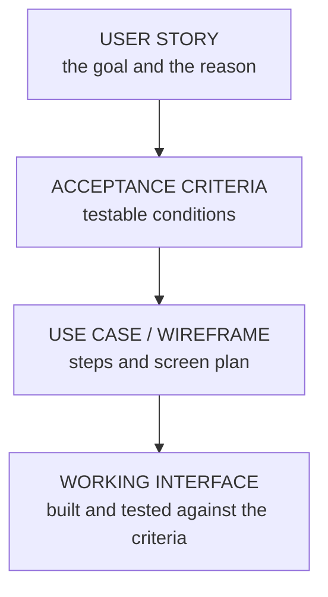

## Requirements Are the Foundation

> Requirements gathered **poorly or too late** are **the single most common cause of software project failure** — a system built **perfectly to the wrong requirements is still a failure.**

Whichever method a team uses — Waterfall, Spiral, Agile or Scrum (Topic 17) — it depends on **disciplined requirement gathering**. In HCI, the focus is on **user requirements**: what real people need in order to reach their goals.

<Analogy>
A tailor can sew flawlessly, but if the measurements were wrong, the suit won't fit. Requirement gathering is taking the measurements. No amount of excellent stitching (coding) fixes a suit cut to the wrong size.
</Analogy>

---

## 8.8 Five Requirement-Gathering Techniques

| Technique | Best for | Typical output | Limitation |
|---|---|---|---|
| **Interviews** | **Deep, qualitative** understanding of one user | Narrative notes, quotes, pain points | **Time-consuming**; small sample |
| **Questionnaires** | **Quantifying preferences** across a large population | Statistical summaries, ranked preferences | **Low response rate**; leading questions |
| **Observation** | **Real behaviour** in the actual environment | Field notes, workflow diagrams | **Resource-intensive**; users may change behaviour when watched |
| **Use cases** | Documenting **step-by-step interactions** | Structured actor–system sequences | Can become **overly technical** |
| **User stories** | Capturing **user value quickly** for Agile backlogs | "As a… I want… so that…" statements | Can **hide detail** if written too vaguely |

The first three **discover** requirements; the last two **document** them in a form the team can build from. (Compare INS 204's fact-finding techniques, which add document analysis, JAD and brainstorming.)

---

## Use Cases

> A **use case** is **a documented interaction between an actor and the system to reach a goal** — with a **title, actor, preconditions, numbered steps and an outcome**.

### Worked Example: Withdraw Cash

| Element | Content |
|---|---|
| **Title** | Withdraw Cash |
| **Actor** | Bank Customer |
| **Preconditions** | The customer has a valid card and PIN; the ATM has cash |
| **Main steps** | 1. Customer inserts card and enters PIN · 2. System verifies the PIN · 3. Customer **selects an amount** · 4. System **checks the balance** · 5. System **dispenses cash** · 6. System **prints a receipt** and returns the card |
| **Alternative flows** | 2a. Wrong PIN → show an error; retain the card after 3 attempts · 4a. Insufficient balance → show the balance and offer a smaller amount |
| **Outcome** | The customer has the cash and a receipt; the account is debited |

Use cases are great for **complete, step-by-step flows** — including what happens when things go wrong (the alternative flows) — but can grow **too technical** for non-technical stakeholders.

---

## User Stories

> **Template:** **"As a [type of user], I want [some goal], so that [some reason / benefit]."**

User stories are **quick to write, easy to prioritise, and focused on user value** rather than technical implementation — **the primary requirement format in Agile/Scrum** (Cohn, 2004). They fill the **Product Backlog**.

### Worked Example: Airport Check-In Kiosk

<FlowDiagram title="User stories for an airport kiosk">
<FlowStep title="Traveller without a printout">
*As an airport kiosk user, I want to check in using only my **booking reference and last name**, so that I **don't need a printed confirmation**.*
</FlowStep>
<FlowStep title="Traveller with luggage">
*As a kiosk user with checked baggage, I want the kiosk to **print baggage tags automatically**, so that **I can attach them myself**.*
</FlowStep>
<FlowStep title="Passenger with a disability">
*As a passenger with a disability, I want the screen **reachable from a seated position**, so that **I can check in independently**.*
</FlowStep>
<FlowStep title="Airline staff">
*As airline staff, I want the kiosk to **flag passengers needing extra document checks**, so that **I can intervene before boarding**.*
</FlowStep>
</FlowDiagram>

Notice that the stories cover **different users** (including a staff member and a disabled passenger) — good requirement gathering covers the **full user spectrum** (Topic 5).

<ExamTip>
Every user story needs **all three parts**. The **"so that"** clause is the most often forgotten — and the most valuable, because it explains **why**, letting designers find better solutions. "As a student, I want a dark mode" is incomplete; "…**so that** I can study at night without eye strain" tells the team what really matters.
</ExamTip>

### From User Story to Working Interface

A single user story is refined step by step into something a developer can build:

**Tracing the kiosk example:**
- **Story:** check in with booking reference and last name, no printout needed.
- **Acceptance criteria** *(a common Agile format — Given/When/Then)*: **Given** a valid 6-character booking reference and matching surname, **when** the passenger taps "Check in", **then** the booking is displayed within 2 seconds. **Given** a surname that doesn't match, **then** a message explains the mismatch and offers "Try again" or "Get help".
- **Use case / wireframe:** the numbered steps and a two-field entry screen.
- **Working interface:** built, then tested against the criteria.

### Functional vs Non-Functional Requirements

| Type | Meaning | Kiosk example |
|---|---|---|
| **Functional requirement** | **What the system must do** | "The system must **print a boarding pass**." |
| **Non-functional requirement** | A **quality attribute** — how well it must do it | "The kiosk must **respond to input within two seconds**." |

---

## Practice: Choose the Method (Class Card Sort)

Using Table 8.1 criteria from Topic 17 — **requirements stability, feedback timing and risk** — place each project brief:

<MCQ question="A national tax-filing portal with legally fixed features, approved by auditors, releasing before filing season.">
<Option correct>Waterfall</Option>
<Option>Spiral</Option>
<Option>Agile</Option>
<Option>Scrum</Option>
<Explain>
Requirements are **fixed by law and signed off**, with a fixed release date and heavy documentation needs — classic Waterfall territory (the lecture's FIRS example).
</Explain>
</MCQ>

<MCQ question="A mobile-money app built around an unproven biometric login where failure would be very costly.">
<Option>Waterfall</Option>
<Option correct>Spiral</Option>
<Option>Big Bang</Option>
<Option>None — just build it</Option>
<Explain>
High **risk** and **uncertain feasibility** call for Spiral: prototype the biometric login in early loops and assess risks before expanding.
</Explain>
</MCQ>

<MCQ question="A food-delivery start-up that wants to learn quickly what customers like, changing features every few weeks.">
<Option>Waterfall</Option>
<Option>Spiral</Option>
<Option correct>Agile / Scrum</Option>
<Option>V-model</Option>
<Explain>
Requirements are expected to **change continuously** and fast **user feedback** matters most — Agile, typically run as Scrum sprints.
</Explain>
</MCQ>

<MCQ question="A hospital records system: the regulated patient-data core must be certified, but the patient-facing appointment app should evolve with feedback.">
<Option>Pure Waterfall</Option>
<Option>Pure Scrum</Option>
<Option correct>A hybrid: Waterfall-style sign-off for the regulated core, Scrum for the patient-facing app</Option>
<Option>Big Bang</Option>
<Explain>
The lecture's industry insight: many organisations use **hybrids** — formal sign-off where regulation demands it, Agile where learning from users matters.
</Explain>
</MCQ>

---

## Practice Questions

<Reveal question="Write three user stories for a university hostel-allocation portal, covering different users.">
1. *As a **fresher**, I want to **see which hostels still have space before I pay**, so that **I don't pay for a hall that's already full**.*
2. *As a **student with a mobility impairment**, I want to **request a ground-floor room during application**, so that **I can reach my room safely**.*
3. *As a **hall warden**, I want to **see a list of allocated students with their room numbers**, so that **I can check residents in quickly on resumption day**.*
</Reveal>

<Reveal question="Write a use case for 'Register for a Course'.">
**Title:** Register for a Course · **Actor:** Student · **Preconditions:** logged in; school fees paid; registration window open. **Main steps:** 1. Student opens Course Registration · 2. System lists courses available to the student's department and level · 3. Student selects courses · 4. System checks prerequisites, clashes and the unit limit · 5. Student confirms · 6. System saves the registration and shows a printable slip. **Alternative flows:** 4a. Prerequisite not met → explain which course is missing · 4b. Unit limit exceeded → show the total and ask the student to drop a course. **Outcome:** the student is registered and has a slip.
</Reveal>

<Reveal question="Classify: (a) 'The system shall send an SMS when results are published.' (b) 'The portal shall support 20,000 simultaneous users.' (c) 'Pages shall meet WCAG AA contrast.'">
(a) **Functional** — something the system does. (b) **Non-functional** — performance/capacity. (c) **Non-functional** — accessibility quality.
</Reveal>

<Reveal question="Compare use cases and user stories. When is each most useful?">
**Use cases** document a **complete step-by-step interaction** with preconditions, main and alternative flows — most useful when the full flow and its exceptions must be specified precisely (e.g., for Waterfall contracts, safety-critical steps). **User stories** capture **who wants what and why** in one sentence — quick to write and prioritise, ideal for **Agile backlogs**, with detail added later through acceptance criteria. Many teams use both: stories to prioritise, use cases or wireframes to detail.
</Reveal>

<Takeaway>
**Requirements are the foundation** — a system built perfectly to the wrong requirements still fails. Discover them with **interviews** (depth), **questionnaires** (scale), and **observation** (real behaviour); document them as **use cases** (actor, preconditions, numbered steps, alternative flows, outcome) or **user stories** ("As a…, I want…, so that…" — the Agile backlog format). Refine each story into **testable acceptance criteria**, then a use case or wireframe, then a working interface tested against those criteria. Distinguish **functional** (what the system does) from **non-functional** (how well it does it) requirements, and choose the development method — or a hybrid — by **requirement stability, feedback timing and risk**.
</Takeaway>

## Exam Tips

**What lecturers test:**
- Requirement-gathering techniques: best use, output and limitation of each
- Write **user stories** in the correct template — for **several different user types**
- Write a **use case** with actor, preconditions, steps and outcome
- Functional vs non-functional requirements
- Match projects to methodologies (the card-sort activity)

**Common mistakes:**
- User stories missing the "so that" clause
- Use cases with no alternative flows
- Treating requirements as a one-off task rather than continuous (especially in Agile)

**Likely question:**
> "Write four user stories and one use case for a hospital appointment-booking kiosk, including at least one story for a user with a disability, and state two functional and two non-functional requirements." (15 marks)
