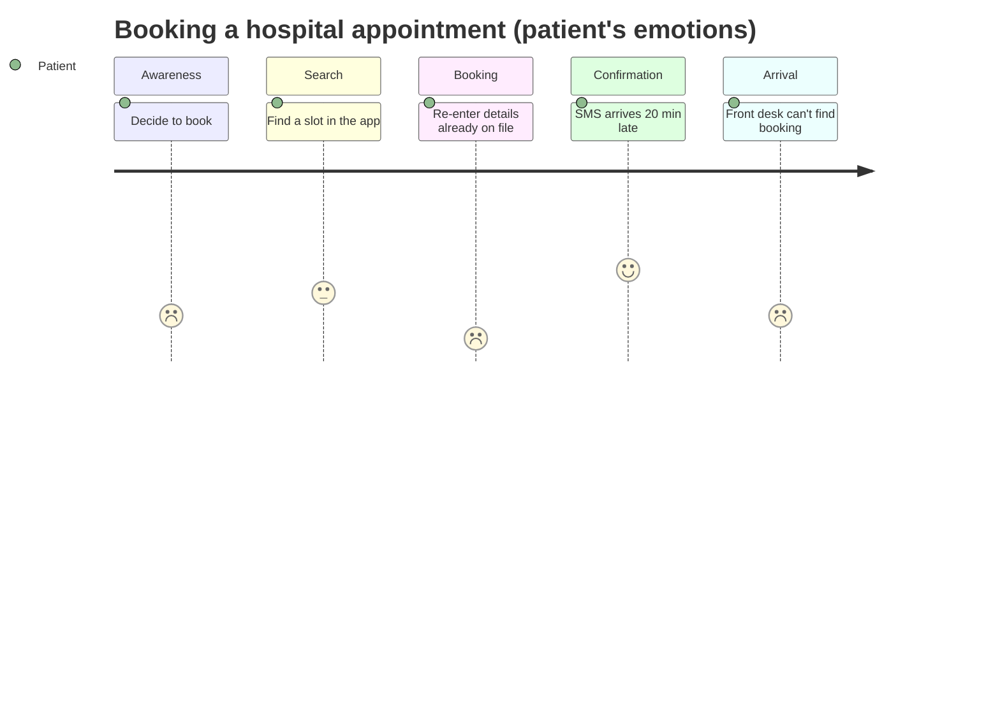

## 5.2 User Research

**Why it matters:** without research, designers rely on **assumptions** — and **designers are not representative** of a product's full user base. Research is the **Empathize** stage made concrete.

### Four Core Methods

<Tabs>
<Tab label="Interviews">

**One-on-one, semi-structured conversations** exploring users' **experiences and pain points in depth**.

*Good for:* understanding **why** people behave as they do; uncovering needs users can put into words.
*Limit:* people don't always do what they say, and often forget moments of confusion.

</Tab>
<Tab label="Surveys">

**Structured questionnaires** gathering **quantitative or qualitative data at scale**.

*Good for:* measuring how common a problem is across **hundreds or thousands** of users (e.g., "How many students have missed a registration deadline?").
*Limit:* can't probe or follow up; depends on question wording.

</Tab>
<Tab label="Contextual inquiry">

**Interview + observation in the user's real environment while they perform real tasks.**

*Good for:* seeing **exactly where people hesitate or make errors** — details they would never mention in a survey.
*Example:* researchers **sit with students as they enrol** on the existing course-enrolment system, watching where they hesitate or misclick.

</Tab>
<Tab label="Field studies">

**Broader observational research over time**, capturing **workarounds and interruptions** in real settings.

*Good for:* understanding the whole context — e.g., spending several days in a hospital ward to see how nurses are interrupted while using a records system.
*Limit:* time-consuming and costly.

</Tab>
</Tabs>

### Qualitative vs Quantitative

| | Qualitative | Quantitative |
|---|---|---|
| **Data** | **Rich, descriptive** — words, observations, stories | **Numerical** — counts, ratings, times, click data |
| **Answers** | **Why?** | **What? How many?** |
| **Methods** | Interviews, contextual inquiry, field studies | Surveys, analytics |

> **Effective UCD combines both.** **Amazon** pairs usability interviews (qualitative "**why**") with behavioural data such as click patterns and cart abandonment (quantitative "**what**") to guide checkout redesigns.

**Industry insight:** **testing with just 5 representative users can reveal about 85% of major usability problems** in a qualitative study (Nielsen, 2000). **Small-scale research is still far more valuable than no research at all.**

<ExamTip>
The contextual-inquiry example is a classic: students **rarely notice their own moments of confusion afterwards**, so a survey alone would miss them — **watching beats asking, sometimes**. If a question asks which method reveals *actual* behaviour, choose contextual inquiry or field study; if it asks for *scale*, choose surveys.
</ExamTip>

---

## 5.3 Personas

> A **persona** is **a fictional but research-based representation of a key user type** — described by a **name, demographic details, goals, frustrations and behavioural patterns**.

**Why it matters:** over a long project, design teams struggle to keep a **shared mental model of "the user"**. Personas give everyone a **common, human reference point** — "Would Adaeze understand this screen?"

### How to Build Personas

<Step step="1" title="Research a representative sample">
Conduct research across a **representative sample** of users (interviews, surveys, observation).
</Step>

<Step step="2" title="Find patterns">
Identify **patterns and clusters** of similar goals and pain points.
</Step>

<Step step="3" title="Choose the key clusters">
Select the most significant clusters — **most projects use 2–4 primary personas**, not one per possible user.
</Step>

<Step step="4" title="Write them up">
Write each persona with **enough narrative detail to feel real**, while staying **grounded in research data**.
</Step>

### Worked Example: Meet Adaeze

**Adaeze Okonkwo** · 29 · Primary school teacher · Mid-sized city · Moderate tech comfort

> *"I just need to know my money is going to the right place, quickly, without having to think too hard about it."*

<Tabs>
<Tab label="Goals">

- **Check her account balance quickly** between classes
- **Transfer money to family members**
- **Avoid banking-hall queues** that conflict with work hours

</Tab>
<Tab label="Frustrations">

- The old app needed **too many steps** for a simple transfer
- **Anxious about errors** — can't easily verify the money went to the right person
- **Limited data allowance** makes slow, heavy apps unwelcome

</Tab>
<Tab label="Behaviour patterns">

- Uses her phone during **short 5–10 minute breaks**
- Prefers **large, clearly labelled buttons** over icon-only navigation
- **Previously abandoned a competitor's app** after a confusing transfer confirmation

</Tab>
<Tab label="Design implications">

*(What the team does with the persona.)*
- A **two-tap transfer** to saved family beneficiaries
- A **clear confirmation screen** showing the recipient's full name and bank before sending
- A **lightweight app** that works on slow data
- **Labelled buttons**, not icon-only navigation

</Tab>
</Tabs>

**Industry example:** major **digital banks** keep a small set of personas — **a busy young professional, a small business owner, an elderly pensioner** — so that simplifications made for one group **don't accidentally harm another**.

<ExamTip>
**Common mistake:** writing a persona that is a **generic "average user"** with no distinctive goals or frustrations. Effective personas are **specific and even slightly idiosyncratic** — real research rarely produces a bland, universally average user.
</ExamTip>

<Reveal question="Quick quiz: a persona with no specific goals or quirks, just generic traits, is most likely a symptom of… A) Too much research B) Assumption, not real data C) Too many personas D) Good design">
**B — Assumption, not real data.** Real research produces specific goals, frustrations and behaviours.
</Reveal>

<Reveal question="Think–pair–share: what's wrong with 'Chidi, 25, likes technology and wants an app that is easy to use and looks nice'? Rewrite it with one specific, research-grounded detail.">
It is **generic** — every user wants an easy, nice-looking app; nothing in it would change a design decision. Improved: **"Chidi, 25, a Lagos ride-hailing driver, checks the app while waiting at traffic lights and needs to accept trips with one thumb in under three seconds; he switched apps last year because the accept button moved after an update."** Now the team knows to keep a large, fixed-position accept button in the thumb zone.
</Reveal>

---

## 5.4 User Journey Mapping

> A **journey map** traces a user's **actions, thoughts and emotions** across a **complete experience** — spanning **touchpoints** (points of interaction) and **pain points** (moments of frustration).

### Worked Example: Booking a Hospital Appointment

| Stage | Emotion | Touchpoint | Pain point |
|---|---|---|---|
| **Awareness** | Mildly stressed | Personal decision | None |
| **Search** | Neutral | Mobile app | Slot list **not filtered by specialty** |
| **Booking** | **Frustrated** | Mobile app form | **Re-enters information already on file** |
| **Confirmation** | Relieved | SMS notification | **SMS arrives 20 minutes late** |
| **Arrival** | **Confused** | Front desk | **Staff can't find the digital booking** |

The same journey as an emotion curve (5 = happy, 1 = very unhappy):

**Where to focus redesign:** the **emotional low points** — Booking (re-entering data) and Arrival (lost booking). Fixes: pre-fill the form from the patient record; sync bookings to the front-desk system; send the SMS instantly.

> **Tip:** at each stage, always ask **"How does the user feel right now?"** — not just "What does the user do?" **Emotional low points are often the strongest signal** of where redesign effort matters most.

- **Industry example:** **airlines** map the full passenger journey — booking, check-in, security, boarding, in-flight, baggage claim — because **one severe pain point (chaotic boarding) can dominate the overall impression** even if every other touchpoint was excellent.
- **Common mistake:** mapping an **idealised "happy path"** with no real pain points, which **defeats the whole purpose**.
- **Best practice:** base every stage on **genuine research**, and pair each journey map with a **specific persona and clearly defined goal**.

<Reveal question="Quick quiz: 'SMS notification' is a touchpoint. 'SMS arrives 20 minutes late' is a… A) Persona B) Pain point C) HMW question D) Prototype">
**B — Pain point** — a moment of frustration at that touchpoint.
</Reveal>

---

## Practice Questions

<Reveal question="Compare interviews and contextual inquiry. When would you choose each?">
**Interviews** are one-on-one conversations about experiences and pain points — good for understanding motivations and "why", and when you can't be present during the task. **Contextual inquiry** combines interviewing with **observing users doing real tasks in their real environment** — good for discovering **actual behaviour**, hesitations and workarounds that users don't notice or report. Choose contextual inquiry when the task can be observed (e.g., course enrolment); interviews when you need depth on attitudes or past experiences.
</Reveal>

<Reveal question="Describe the steps in constructing personas and state two benefits of using them.">
**Steps:** research a representative sample; identify patterns and clusters of goals and pain points; select the most significant clusters (usually 2–4 personas); write each with realistic, research-grounded detail. **Benefits:** they give the team a **shared, human reference point** throughout the project, and they help ensure design decisions serve **real user types** without harming others (e.g., a bank's pensioner vs young professional).
</Reveal>

<Reveal question="What is the difference between a touchpoint and a pain point in a journey map?">
A **touchpoint** is a **point of interaction** between the user and the service (app, SMS, front desk). A **pain point** is a **moment of frustration** that occurs at or between touchpoints (re-entering data, a late SMS, a lost booking).
</Reveal>

<Reveal question="According to Nielsen (2000), how many users are typically needed to find most usability problems, and what does this imply?">
Testing with about **5 representative users** reveals roughly **85% of major usability problems** in a qualitative study. It implies that **small, frequent rounds of testing** are practical and far better than none — test with 5, fix, and test again.
</Reveal>

<Takeaway>
**User research** replaces assumption with evidence: **interviews** (depth, why), **surveys** (scale, how many), **contextual inquiry** (watch real tasks in real settings) and **field studies** (context over time). Combine **qualitative** "why" with **quantitative** "what"; even **5 users** reveal most major problems. **Personas** are **fictional but research-based** user types (usually 2–4) with names, goals, frustrations and behaviours — specific, never "average". **Journey maps** trace a persona's **actions, emotions, touchpoints and pain points** across a whole experience; the **emotional low points** show where to redesign.
</Takeaway>

## Exam Tips

**What lecturers test:**
- The four research methods and when to use each; qualitative vs quantitative
- Definition and construction of **personas** — write one for a scenario
- **Journey maps**: stages, emotions, touchpoints, pain points — draw one for a scenario
- The 5-user / 85% finding

**Common mistakes:**
- Personas based on the design team rather than research
- Journey maps showing only the happy path
- Confusing touchpoints with pain points

**Likely question:**
> "Using a university hostel-allocation system as an example, construct one persona and a five-stage user journey map, identifying touchpoints and pain points." (15 marks)
