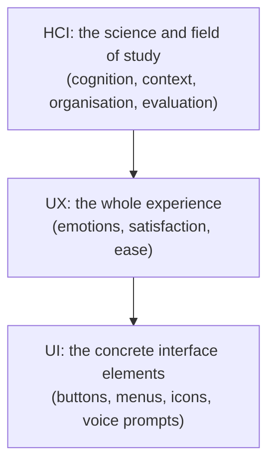
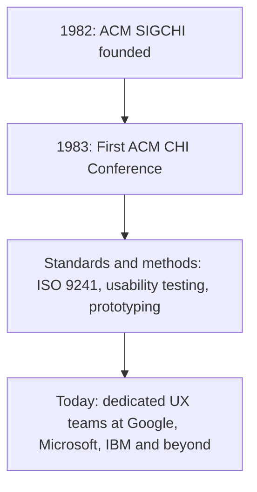

## You Use HCI Every Day

Think of four ordinary moments:

- **withdrawing cash** at an ATM,
- **unlocking a phone** with your fingerprint,
- **booking a flight** online,
- **asking a smart speaker** to play music.

Every one of them is **Human-Computer Interaction**. Whenever a person and a computer work together, someone had to decide how that conversation would go — which button goes where, what the screen says, what happens if you make a mistake.

> In one sentence: **HCI is the study of how people interact with computers, and the design of technology that lets them do so usefully, safely and pleasantly.**

---

## 1.1 Defining HCI

The standard textbook definition (memorise it):

> **"HCI is the multidisciplinary field concerned with the design, evaluation, and implementation of interactive computing systems for human use, and the study of the phenomena surrounding that use."**
> — *Dix, Finlay, Abowd & Beale (2004)*

Break it down:

| Part of the definition | What it means |
|---|---|
| **Multidisciplinary** | Draws on computer science, psychology, design, ergonomics and more (Topic 3) |
| **Design** | Creating interfaces that fit people |
| **Evaluation** | Testing whether they actually work for people (usability testing) |
| **Implementation** | Building them |
| **Interactive computing systems for human use** | Any system a person operates — phones, ATMs, cars, medical devices |
| **Phenomena surrounding that use** | How people think, feel, err, learn and cooperate while using technology |

Two words you must separate:

| Term | Meaning | Example |
|---|---|---|
| **Interface** | The **point of contact** between person and system | Screen, keyboard, touch surface, microphone |
| **Interaction** | The **ongoing exchange of actions and responses over time** | Tapping "Transfer", seeing a confirmation, entering a PIN, getting a receipt |

**Real-life example:** in a mobile banking app, HCI is the discipline behind making the **"Confirm" and "Cancel" buttons clearly distinguishable** — preventing a costly mistake like sending ₦500,000 to the wrong account.

<ExamTip>
**Common student mistake:** equating HCI with "making things look nice". Visual polish is only **one** part. HCI is equally concerned with **error prevention, learnability and accessibility**. If an exam asks "What is HCI?", never answer only with appearance.
</ExamTip>

---

## UI vs UX vs HCI

<Tabs>
<Tab label="UI">

**User Interface (UI)** — the **visual, auditory or physical elements** through which a user communicates with a system: buttons, menus, icons, voice prompts.

> **What you see and touch.**

*Example:* the green "Pay Now" button and the keypad on a payment screen.

</Tab>
<Tab label="UX">

**User Experience (UX)** — the **broader, holistic impression** a person forms while using a product, including **emotions and satisfaction**.

> **How you feel.**

*Example:* feeling relieved and confident because a payment went through quickly with a clear receipt — or frustrated because it failed silently.

</Tab>
<Tab label="HCI">

**Human-Computer Interaction (HCI)** — the **overarching field** that studies **both UI and UX**, plus the **cognitive and organisational factors** shaping human-computer work.

> **The science behind both.**

*Example:* researching why people mistype account numbers, and designing and testing an interface that prevents it.

</Tab>
</Tabs>

### Think–Pair–Share: Classify the Experience

> *"A first-time user opens a food delivery app. The buttons are large and colourful, but she still can't figure out how to track her order, and she closes the app feeling frustrated."*

<Reveal question="Is the problem a UI problem, a UX problem, or both? What would HCI do about it?">
The **UI** looks fine on the surface (large, colourful buttons), but the **UX** is poor — she can't complete her task (tracking the order) and leaves **frustrated**. This shows that good visuals don't guarantee a good experience. **HCI** would study *why* she couldn't find order tracking — e.g., the feature is hidden in a menu or badly labelled — then redesign it (a visible "Track order" button on the home screen) and **test** the new design with first-time users.
</Reveal>

---

## 1.2 The History of HCI

### From Switches to Syntax

*Figure: Programmers Betty Jennings and Frances Bilas preparing ENIAC for its 1946 demonstration — "programming" meant setting switches and plugging cables. Image: U.S. Army photo, public domain, via Wikimedia Commons.*

- **1940s–1950s:** machines like **ENIAC** were operated **directly via plugboards and switches** — barely an "interface" at all. Only engineers could use them.
- **1950s–1970s:** **punched cards** and **teletype terminals** gave rise to the **command-line interface (CLI)**. Users typed **precise, memorised syntax**, e.g. `COPY FILE1.TXT FILE2.TXT`. One typing error and the command failed.

*Figure: An 80-column punched card — each column encoded one character by the position of its holes. Image: Harke, CC BY-SA 3.0, via Wikimedia Commons.*

### Three Pioneers, Three Ideas

<FlowDiagram title="Conceptual foundations of HCI">
<FlowStep title="1945 · Vannevar Bush — Memex">
A **hypothetical device** for storing and retrieving **linked documents** via "associative trails", described in his essay *As We May Think*. It was an early vision of **hypertext** — the idea behind every web link you click.
</FlowStep>
<FlowStep title="1963 · Ivan Sutherland — Sketchpad">
Let users **draw and manipulate shapes directly on screen with a light pen**. It pioneered **direct manipulation** (acting on objects you can see) and **computer-aided design (CAD)**.
</FlowStep>
<FlowStep title="1968 · Douglas Engelbart — NLS and the mouse">
The **"Mother of All Demos"** introduced **hypertext linking**, **collaborative editing** and the **first computer mouse**.
</FlowStep>
</FlowDiagram>

*Figure: The first computer mouse prototype, invented by Douglas Engelbart's team at SRI (1964) — a wooden shell with two perpendicular wheels underneath. Image: SRI International, CC BY-SA 3.0, via Wikimedia Commons.*

### GUI, Web, Mobile and Natural Interaction

<Tabs>
<Tab label="GUI era">

**Xerox PARC's Alto and Star** introduced **windows, icons, menus and pointer — WIMP** — and the **desktop metaphor** (files, folders, trash can). **Apple's 1984 Macintosh** commercialised it; **Microsoft Windows** followed.

*Figure: The Xerox Alto (1973), the first computer designed around a GUI and mouse. Image: Joho345, public domain, via Wikimedia Commons.*

*Figure: The Apple Macintosh (1984) brought the GUI to the mass market. Image: Grm wnr, CC BY-SA 3.0, via Wikimedia Commons.*

</Tab>
<Tab label="Web era">

The **World Wide Web** introduced **hyperlink navigation**, connecting documents globally — finally realising Bush's Memex and Engelbart's hypertext for everyone.

</Tab>
<Tab label="Multi-touch">

The **2007 iPhone** popularised **tapping, swiping and pinching** directly on the screen — no mouse, no stylus. Touch is now the dominant way most people in Nigeria use computers.

</Tab>
<Tab label="Natural interaction">

**Voice assistants, gesture recognition and emerging AR/VR** move interaction closer to **natural human behaviour** — speaking, pointing, moving.

</Tab>
</Tabs>

<ExamTip>
**Common mistake: "newer is always better."** Command-line interfaces are still **faster than GUIs for many expert tasks** (system administration, batch file operations, programming). A good HCI answer judges an interface by its **users, tasks and context**, not its age.
</ExamTip>

### Table 1.1 — Major Eras in HCI History

| Era | Period | Dominant style | Example |
|---|---|---|---|
| Early computing | 1940s–1950s | Direct hardware manipulation | ENIAC |
| Command-line era | 1950s–1970s | Typed text commands | Teletype, early UNIX |
| Conceptual foundations | 1945–1968 | Associative & direct manipulation | Memex, Sketchpad, NLS |
| GUI era | 1970s–1980s | Windows, icons, menus, pointer | Xerox Alto/Star, Macintosh |
| Mainstream GUI era | 1990s–2000s | Mouse-and-keyboard desktop | Microsoft Windows |
| Multimodal / natural era | 2007–present | Touch, voice, gesture, AI | Smartphones, smart speakers, AR/VR |

**Best practice from the lecture:** study historical interfaces as **case studies** — ask **what problem each innovation solved**, and **whether it still exists today** (the CLI does; the plugboard doesn't).

---

## 1.3 Evolution of HCI as a Field

HCI didn't start as a discipline — it grew out of practice.

- HCI emerged as a **distinct field in the early 1980s**, once it became clear that **psychology and design — not engineering alone** — were essential to usable systems.
- **ACM** established **SIGCHI** (Special Interest Group on Computer-Human Interaction) in **1982**; the **first ACM CHI conference** followed in **1983**.
- Formalisation brought **standardisation** (e.g., **ISO 9241**, the international standard for the ergonomics of human-system interaction) and **rigorous, research-backed methods** — usability testing, design theory and prototyping.
- **Industry today:** Google, Microsoft and IBM maintain **dedicated UX research teams** — a role that barely existed before the 1990s.

---

## Practice Questions

<Reveal question="Give the Dix et al. (2004) definition of HCI.">
HCI is **"the multidisciplinary field concerned with the design, evaluation, and implementation of interactive computing systems for human use, and the study of the phenomena surrounding that use."**
</Reveal>

<Reveal question="Distinguish between UI, UX and HCI with one example each.">
**UI** — the concrete elements a user communicates through ("what you see and touch"), e.g., the buttons and keypad of a POS terminal. **UX** — the overall impression and feelings from using the product ("how you feel"), e.g., satisfaction when a transfer completes quickly. **HCI** — the overarching field studying both, plus cognitive and organisational factors ("the science behind both"), e.g., researching why users mistype account numbers and testing a fix.
</Reveal>

<Reveal question="Match each pioneer to their contribution: Vannevar Bush, Ivan Sutherland, Douglas Engelbart.">
**Vannevar Bush (1945)** — the **Memex**, an early vision of hypertext via associative trails. **Ivan Sutherland (1963)** — **Sketchpad**, direct manipulation of shapes with a light pen, pioneering CAD. **Douglas Engelbart (1968)** — **NLS and the "Mother of All Demos"**: hypertext linking, collaborative editing and the first computer mouse.
</Reveal>

<Reveal question="What does WIMP stand for, and where was it first developed?">
**Windows, Icons, Menus, Pointer.** It was developed at **Xerox PARC** (Alto and Star), then commercialised by **Apple's Macintosh (1984)** and followed by Microsoft Windows.
</Reveal>

<Reveal question="Are command-line interfaces still superior to GUIs for some users? Justify your view.">
Yes, for **expert users doing repetitive or complex tasks**. CLIs are faster once commands are memorised, can be **scripted** to automate work, use few resources and work remotely over slow connections — so system administrators and programmers often prefer them. For **novices**, GUIs are better because they rely on **recognition rather than recall** and are easier to learn. The best interface depends on the **user, task and context**.
</Reveal>

<Takeaway>
**HCI** is the multidisciplinary field of designing, evaluating and implementing interactive systems for human use (Dix et al., 2004) — the **science behind both UI (what you see and touch) and UX (how you feel)**, concerned with error prevention, learnability and accessibility, not just looks. Interaction evolved from **ENIAC's switches** and **punched cards/command lines**, through the ideas of **Bush (Memex, 1945), Sutherland (Sketchpad, 1963) and Engelbart (mouse, 1968)**, to the **Xerox PARC GUI (WIMP)**, the **Macintosh (1984)**, the **web**, **multi-touch (iPhone, 2007)** and today's **voice, gesture, AR/VR and AI**. HCI became a formal discipline with **ACM SIGCHI (1982)** and the **first CHI conference (1983)**, bringing standards like **ISO 9241** and research-based methods.
</Takeaway>

## Exam Tips

**What lecturers test:**
- Definition of HCI (Dix et al.) and the difference between **interface** and **interaction**
- **UI vs UX vs HCI**
- The eras of HCI history (Table 1.1) and the three pioneers with dates
- The founding of SIGCHI (1982) and CHI (1983)

**Common mistakes:**
- Saying HCI is just about appearance
- Assuming newer interfaces are always better
- Mixing up the pioneers (Sketchpad = Sutherland; mouse = Engelbart; Memex = Bush)

**Likely question:**
> "Define Human-Computer Interaction and distinguish it from UI and UX. Trace the evolution of interaction styles from the 1940s to the present day." (15 marks)
