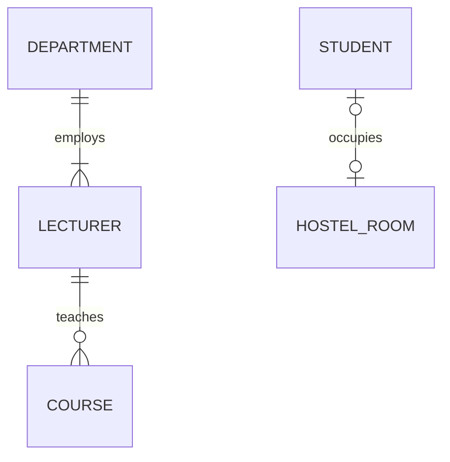
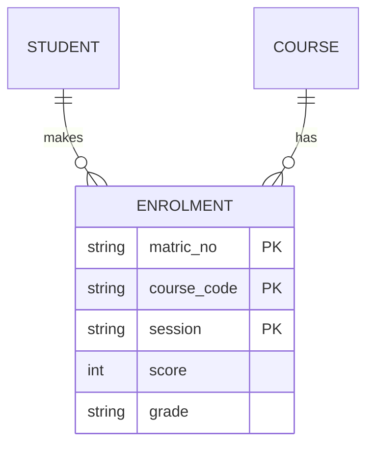
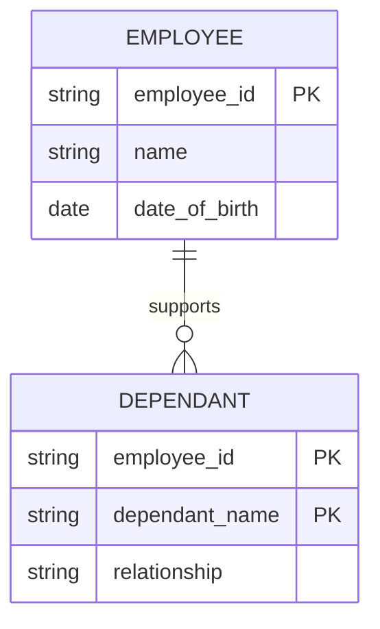
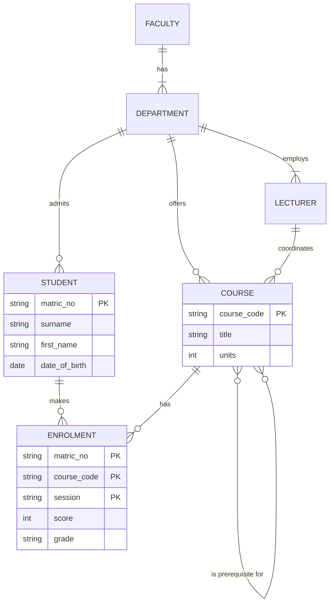

## Process Models vs Data Models

A DFD shows **what a system does with data** (processes). An **Entity-Relationship (ER) model** shows **what data the system must keep and how that data is related** — the structure behind the data stores.

> The **ER model** forms the basis of an **ER diagram (ERD)**. An ERD represents the **conceptual database as viewed by the end user**. ERDs depict the database's three main components: **entities, attributes and relationships**.

The two models must agree: the **data stores** on low-level DFDs usually correspond to **entities** in the ERD, and the data elements in DFD **data flows** must be **attributes** of those entities.

<Analogy>
If a DFD is a map of **how goods move** through a market, the ERD is the **stock register** of every shop: what items exist (entities), what we record about each item (attributes), and which items belong together (relationships). You need both to run the market.
</Analogy>

---

## Entities

> An **entity** is a **person, place, object, event or concept** in the user environment **about which the organisation wishes to maintain data**.

| Category | Examples |
|---|---|
| Person | STUDENT, EMPLOYEE, PATIENT |
| Place | STATE, BRANCH, HOSTEL |
| Object | BUILDING, PRODUCT, VEHICLE |
| Event | REGISTRATION, SALE, ADMISSION |
| Concept | COURSE, ACCOUNT, DEPARTMENT |

### Entity Type vs Entity Instance

| Term | Meaning | Example |
|---|---|---|
| **Entity type (entity set)** | A collection of entities sharing common properties — described **once** in the model | STUDENT |
| **Entity instance (occurrence)** | A **single occurrence** of an entity type — there may be thousands in the database | The student with matric number 245678 |

In an ERD, an entity **refers to the entity set, not a single occurrence**. In a relational database it **corresponds to a table, not a row**.

**Naming rules:** an entity name is a **noun**, **singular**, written in **CAPITAL LETTERS** (STUDENT, not Students). In both Chen and Crow's Foot notation, an entity is drawn as a **rectangle** containing its name.

<ExamTip>
A true entity has **many possible instances**, each with a distinguishing characteristic and other descriptive data. **Don't turn DFD external entities, users or reports into ER entities automatically.** In a church accounting system with **one** treasurer who enters the data, TREASURER is *not* an entity — there's only one, and we keep no data about her. An *expense report* is also not an entity — it is computed from ACCOUNT and EXPENSE data, so it's a data flow.
</ExamTip>

---

## Attributes

> An **attribute** is a **named property or characteristic of an entity** that is of interest to the organisation.

*STUDENT: Matric_No, Surname, First_Name, Date_of_Birth, Phone, Department*

Attributes are named as nouns with an initial capital (Student_Name). How they are drawn depends on the notation:
- **Chen notation:** each attribute is an **oval** connected to its entity rectangle by a line.
- **Crow's Foot notation:** attributes are **listed in a box below the entity name**.

### Types of Attributes

<Tabs>
<Tab label="Required / Optional">

**Required attribute** — **must** have a value for every instance (e.g., Surname). **Optional attribute** — may be left empty (e.g., Middle_Name, Alternative_Phone).

In many tools, required attributes are shown in **bold**.

</Tab>
<Tab label="Identifier (key)">

A **candidate key** is an attribute (or combination) that **uniquely identifies each instance** of an entity type. An **identifier (primary key)** is the candidate key **chosen** to be the unique identifier. It is **underlined** on an ERD (marked **PK** in Crow's Foot tools).

A **composite identifier** uses more than one attribute — e.g., GAME identified by Home_Team + Visiting_Team.

**Rules for choosing an identifier:**
1. Choose a key that **will not change** over the life of the instance (Name + Address is poor — both can change).
2. Choose a key that is **never null** and always valid.
3. **Avoid "intelligent keys"** whose structure encodes meaning (e.g., first two digits = warehouse) — the meaning changes and the key breaks.
4. Consider a **single-attribute surrogate key** (Game_ID) instead of a large composite key.

</Tab>
<Tab label="Simple / Composite">

**Simple (atomic) attribute** — cannot be meaningfully subdivided (e.g., Gender, Age).

**Composite attribute** — can be subdivided into meaningful parts. *Address → Street, City, State*; *Name → Surname, First_Name, Middle_Name*. Written as Address(Street, City, State).

Decide based on how the data will be used: if you'll search students by State, store State separately.

</Tab>
<Tab label="Single / Multivalued">

**Single-valued** — one value per instance (Matric_No).

**Multivalued** — may take **more than one value** per instance. *An EMPLOYEE may have several Skills; a STUDENT may have several Phone numbers.* Shown as `{Skill}` in curly brackets, or a **double oval** in Chen notation.

A set of multivalued attributes that repeat together is a **repeating group** (e.g., each dependant's name, age and relationship).

**M:N relationships and multivalued attributes should NOT be implemented directly** in a relational database. Resolve a multivalued attribute by either:
1. **Creating several new attributes** — one per component (Home_Phone, Mobile_Phone, Office_Phone), or
2. **Creating a new entity** composed of the multivalued attribute(s) — e.g., a PHONE or DEPENDANT entity related to the original (the usual solution).

</Tab>
<Tab label="Derived">

**Derived attribute** — its value **can be calculated from other attributes**, so it **need not be physically stored** in the database. *Age* from Date_of_Birth; *CGPA* from grades and course units; *Number_of_Students* by counting.

Shown as a **dashed oval** in Chen notation, or in **[square brackets]** — e.g., [Age].

Storing a derived value speeds up reading but risks it becoming out of date; calculating it is always accurate but costs processing time.

</Tab>
</Tabs>

---

## Relationships

> A **relationship** is an **association between instances of one or more entity types** that is of interest to the organisation. Relationships are the **"glue"** that holds an ER model together.

A relationship usually means an **event has occurred** or a **natural link exists**, so it is labelled with a **verb phrase**: a STUDENT *registers for* a COURSE; a DEPARTMENT *employs* a LECTURER. In Chen notation a relationship is a **diamond**; in Crow's Foot it is a **line** with a label.

### Degree of a Relationship

The **degree** is **the number of entity types participating** in the relationship.

| Degree | Name | Example |
|---|---|---|
| 1 | **Unary (recursive)** — between instances of **one** entity type | EMPLOYEE *manages* EMPLOYEE; PERSON *is married to* PERSON; COURSE *is a prerequisite for* COURSE |
| 2 | **Binary** — between **two** entity types (the most common) | STUDENT *registers for* COURSE |
| 3 | **Ternary** — a **simultaneous** relationship among **three** entity types | VENDOR *supplies* PART *to* WAREHOUSE |

A **ternary relationship is not the same as three binary relationships.** In VENDOR–PART–WAREHOUSE, *Unit_Cost* belongs to the particular part shipped by a particular vendor to a particular warehouse — it can't be attached to any single pair.

### Connectivity and Cardinality

**Connectivity** describes the relationship classification — **1:1, 1:M or M:N**. **Cardinality** expresses the **minimum and maximum number of instances** of one entity that can (or must) be associated with each instance of the other.

| Connectivity | Meaning | Example |
|---|---|---|
| **One-to-one (1:1)** | Each A relates to at most one B, and vice versa | An EMPLOYEE *is assigned* one PARKING_SPACE |
| **One-to-many (1:M)** | Each A relates to many B; each B to one A | A DEPARTMENT *offers* many COURSEs; each course belongs to one department |
| **Many-to-many (M:N)** | Each A relates to many B, and each B to many A | A STUDENT *registers for* many COURSEs; each course has many students |

- **Minimum cardinality 0** → the entity is an **optional** participant.
- **Minimum cardinality 1** → the entity is a **mandatory** participant.
- **Maximum cardinality** is 1, a fixed number (e.g., at most 4), or **many**.

*Example:* a MOVIE *is stocked as* DVD — a movie may have **zero** copies in stock (optional) or **many** (maximum many).

### Reading Crow's Foot Symbols

Each end of a relationship line carries two marks: the **inner** mark (nearest the line's middle) is the **minimum**, the **outer** mark (next to the entity) is the **maximum**.

| Symbol at the entity end | Reads as |
|---|---|
| `○\|` (circle + bar) | **Zero or one** (optional one) |
| `\|\|` (bar + bar) | **Exactly one** (mandatory one) |
| `○<` (circle + crow's foot) | **Zero or many** (optional many) |
| `\|<` (bar + crow's foot) | **One or many** (mandatory many) |

Reading the diagram: a DEPARTMENT employs **one or many** LECTURERs; each LECTURER belongs to **exactly one** department. A LECTURER teaches **zero or many** COURSEs; each COURSE is taught by exactly one lecturer. A STUDENT occupies **zero or one** HOSTEL_ROOM, and a room is occupied by zero or one student (a single-occupancy hostel).

<ExamTip>
Always read a relationship **in both directions** and say both minimum and maximum: "A department employs **at least one and possibly many** lecturers; a lecturer is employed by **exactly one** department." Examiners give marks for each direction.
</ExamTip>

---

## Existence Dependence, Weak Entities and Relationship Strength

**Existence-dependent entity** — can exist in the database **only when it is associated with another related entity**. A DEPENDANT (child of an employee) cannot exist without the EMPLOYEE.

**Weak entity** — an entity that is existence-dependent **and** whose primary key is **partially or totally derived from the parent entity**. It has only a **partial key** (dashed underline in Chen). *Example:* DEPENDANT identified by (Employee_ID + Dependant_Name). Drawn as a **double rectangle** in Chen notation.

**Strong (regular) entity** — can be identified by its own attributes alone.

| Relationship strength | Meaning |
|---|---|
| **Weak (non-identifying) relationship** | The child's primary key does **not** contain the parent's primary key (drawn as a **dashed line** in Crow's Foot) |
| **Strong (identifying) relationship** | The child's primary key **contains** the parent's primary key (solid line; **double diamond** in Chen) |

**Participation:**
- **Optional participation** — an entity occurrence does **not** require a corresponding occurrence in the relationship (a LECTURER may teach no course this semester).
- **Mandatory participation** — an occurrence **requires** a corresponding occurrence (every COURSE must be offered by a DEPARTMENT). In Chen notation, mandatory (total) participation is shown with a **double line**.

---

## Associative (Composite / Bridge) Entities

Relationships can have their **own attributes**. If we record the **date** an employee completed a training course, *Date_Completed* belongs to neither EMPLOYEE (they complete many courses on different dates) nor COURSE (completed on many dates) — it belongs to the **relationship**.

> An **associative entity** is a relationship that the modeller chooses to represent **as an entity type**, because it has attributes of its own. It is how an **M:N relationship is resolved** into two 1:M relationships.

STUDENT *registers for* COURSE is M:N. We create **ENROLMENT**: each enrolment belongs to exactly one student and one course, and holds the attributes of the relationship itself — **session, score and grade**. Its identifier combines the identifiers of the entities it links (Matric_No + Course_Code, plus Session so a student can retake a course).

---

## Chen Notation vs Crow's Foot Notation

<Tabs>
<Tab label="Chen notation">

*Figure: A sample ERD in Chen notation. Image: TheMattrix / Jorrit nl, CC BY-SA 3.0, via Wikimedia Commons.*

How to read the Chen symbols in this figure:

| Symbol | Meaning | In the figure |
|---|---|---|
| Rectangle | Entity | Account, Region, Item |
| **Double rectangle** | **Weak entity** | Character, Item Instantiation |
| Diamond | Relationship | Contains, RanInto |
| **Double diamond** | **Identifying** relationship (links a weak entity to its owner) | Has, IsType |
| Oval | Attribute | Password, Level |
| **Underlined** attribute | Identifier (primary key) | AcctName, RegionName |
| **Dashed underline** | Partial key of a weak entity | CharName, IDNum |
| **Double oval** | Multivalued attribute | Foliage |
| **Dashed oval** | Derived attribute | PlayersIn |
| 1, n, m on lines | Connectivity | Account 1 — n Character |
| Double line | Mandatory (total) participation | Character side of *Has* |

</Tab>
<Tab label="Crow's Foot notation">

Crow's Foot is the notation most CASE tools (e.g., Microsoft Visio) use and the one in your textbook.

- **Entity** — rectangle with the name on top and **attributes listed inside**; the primary key is marked **PK** and underlined.
- **Relationship** — a **line** labelled with a verb phrase.
- **Cardinality** — shown by the **symbols at each end of the line** (bar, circle, crow's foot).
- **Weak relationship** — dashed line; **strong** relationship — solid line.

DEPENDANT is a **weak entity**: its key includes employee_id from EMPLOYEE (a strong/identifying relationship).

</Tab>
</Tabs>

---

## Developing an ERD: An Iterative Process

**Database design is an iterative process.** The steps:

<FlowDiagram title="Developing an ER diagram" cycle>
<FlowStep title="Describe operations">
Create a **detailed narrative** of the organisation's description of operations — how it actually works.
</FlowStep>
<FlowStep title="Identify business rules">
Identify the **business rules** from that description — e.g., "a student may register for at most 24 units per semester", "each course is offered by one department".
</FlowStep>
<FlowStep title="Find entities & relationships">
Identify the **main entities and relationships** from the business rules. Nouns often become entities; verbs become relationships.
</FlowStep>
<FlowStep title="Initial ERD">
Develop the **initial ERD**.
</FlowStep>
<FlowStep title="Attributes & keys">
Identify the **attributes and primary keys** that adequately describe the entities.
</FlowStep>
<FlowStep title="Revise & review">
**Revise and review** the ERD with users — then repeat until it is complete and correct.
</FlowStep>
</FlowDiagram>

### Design Challenges: Conflicting Goals

Database designers must make **design compromises**, because goals conflict:
- **Design standards** (a clean, well-structured model),
- **Processing speed** (fast queries may need extra stored/derived data),
- **Information requirements** (every report users need).

It is important to meet **logical requirements and design conventions**, but **a design is of little value unless it delivers all specified query and reporting requirements**. Some problems simply don't have "clean" solutions.

---

## Worked Example: University Records

**Business rules (from interviews):**
1. A **faculty** has many departments; each department belongs to one faculty.
2. A **department** employs one or more lecturers and offers many courses.
3. A **lecturer** belongs to one department and may coordinate zero or more courses; each course has exactly one coordinator.
4. A **student** belongs to one department and may register for many courses; a course may have many students. For each registration we record the session, score and grade.
5. A course may be a **prerequisite** for other courses.

**Walk-through:**
- The M:N between STUDENT and COURSE (rule 4) is resolved by the **associative entity ENROLMENT**, which holds session, score and grade.
- "Is prerequisite for" is a **unary (recursive)** M:N relationship on COURSE (rule 5). When implemented, it too becomes a bridge table (COURSE_PREREQUISITE).
- A student's **CGPA** is a **derived attribute** — calculated from ENROLMENT scores and COURSE units, so it isn't stored.

---

## Practice Questions

<Reveal question="Define entity, attribute and relationship, giving an example of each from a hospital.">
An **entity** is a person, place, object, event or concept about which data is kept — e.g., PATIENT. An **attribute** is a property of an entity — e.g., Patient_ID, Blood_Group. A **relationship** is an association between entity instances — e.g., a DOCTOR *treats* a PATIENT.
</Reveal>

<Reveal question="Classify each attribute of STUDENT: Matric_No, Address, Phone_Numbers, Age, Middle_Name.">
**Matric_No** — identifier (simple, single-valued, required). **Address** — composite (street, city, state). **Phone_Numbers** — multivalued. **Age** — derived (from date of birth). **Middle_Name** — optional.
</Reveal>

<Reveal question="Why can't an M:N relationship be implemented directly, and how is it resolved?">
A relational table can't hold a list of related keys in one field, so an M:N relationship can't be stored directly (and it often has attributes of its own). It is resolved by creating an **associative (bridge) entity** that has a 1:M relationship with each original entity; its key combines the keys of both, and it holds the relationship's attributes — e.g., ENROLMENT between STUDENT and COURSE.
</Reveal>

<Reveal question="Give one example each of a unary, binary and ternary relationship.">
**Unary:** EMPLOYEE *supervises* EMPLOYEE. **Binary:** LECTURER *teaches* COURSE. **Ternary:** DOCTOR *prescribes* DRUG *to* PATIENT (dosage belongs to the combination of all three).
</Reveal>

<Reveal question="What is a weak entity? Give an example and state how it is drawn in Chen notation.">
A **weak entity** is existence-dependent on another (owner) entity and cannot be uniquely identified by its own attributes alone — its key includes the owner's key. Example: DEPENDANT of EMPLOYEE, identified by Employee_ID + Dependant_Name. In Chen notation it is a **double rectangle**, linked by a **double diamond** (identifying relationship), with its partial key **dash-underlined**.
</Reveal>

<Takeaway>
An **ERD** models the data a system must keep: **entities** (singular nouns in capitals, drawn as rectangles), their **attributes** (required/optional, simple/composite, single/multivalued, derived, with an underlined **identifier**), and **relationships** (verb phrases) described by **degree** (unary, binary, ternary), **connectivity** (1:1, 1:M, M:N) and **cardinality** (minimum 0 = optional, 1 = mandatory; maximum 1 or many). **Weak entities** depend on an owner for existence and identity; **associative entities** resolve M:N relationships and hold the relationship's own attributes. Chen and Crow's Foot notations show the same ideas differently, and ERDs are developed **iteratively** from business rules.
</Takeaway>

## Exam Tips

**What lecturers test:**
- Draw an ERD for a scenario (hospital, library, school, bank), showing keys and cardinality
- Types of attributes with examples
- Degree and connectivity of relationships
- Resolving M:N relationships with an associative entity
- Weak vs strong entities; Chen vs Crow's Foot notation

**Common mistakes:**
- Plural entity names (STUDENTS) — use the singular
- Leaving M:N relationships unresolved when a question asks for a logical design
- Forgetting cardinality at **both** ends of each line
- Making a report or the system's single user into an entity

**Likely question:**
> "A library lends books to members. Each book may have several copies; each copy can be borrowed by one member at a time, and a member may borrow up to five copies. Draw an ERD in Crow's Foot notation showing all entities, primary keys, attributes and cardinalities." (15 marks)
