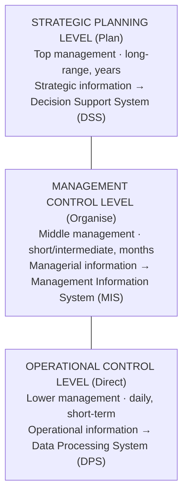

## Systems Analysis and Design in One Sentence

**Systems Analysis and Design (SAD) is a step-by-step process for developing high-quality information systems.** An **information system** combines **technology, people and data** to support business functions such as order processing, inventory control, human resources and accounting.

Some information systems handle routine day-to-day tasks; others help managers make better decisions, spot marketplace trends and reveal patterns hidden in stored data. To understand them you need three ideas: **data vs information**, **the levels of management an IS serves**, and **the person who builds them — the systems analyst**.

---

## Data vs Information

| | Data | Information |
|---|---|---|
| **Definition** | Raw facts and figures that are **not organised** and convey little or no meaning | **Processed data** communicated for effective planning and control of an organisation's activities |
| **Role** | Input to data processing | **Output** of a data processing system |
| **Example** | `12, 58, 71, 45, 90` | "Average CA score for INS 204 is 55.2; 2 of 5 students scored below 50" |

Information is derived from data that has gone through data processing operations, which convert groups of related but meaningless data into a form useful to its recipients.

<Analogy>
Data is like **raw yam tubers**; information is **pounded yam** ready to eat. The tubers have value, but nobody can use them at the dinner table until they have been processed. A pile of attendance ticks is data; "Chidi has missed 6 of 13 lectures and is at risk of being barred from the exam" is information.
</Analogy>

### The Qualities of Valuable Information

Your notes list **twelve** qualities. Information that lacks them is poor information, however much of it you have.

| Quality | What it means |
|---|---|
| **Accuracy** | Correct and free from errors |
| **Accessibility** | Readily available; not difficult to access or refer to |
| **Verifiable** | Allows decision makers to **confirm** questionable details |
| **Timely** | Delivered at the right time for the decision to be made |
| **Organised** | Arranged to suit the requirement or purpose for which it is needed |
| **Meaningful** | **Relevant** to the person who receives it |
| **Useful** | Results in action being taken — or specifically **not** taken |
| **Cost-effective** | The cost of producing it is **less than its value**; benefits must exceed the cost of acquiring it |
| **Completeness** | Includes **all** important and required facts |
| **Objective** | Free from bias, sentiment or error |
| **Flexible** | Can be used by decision makers in various instances |
| **Simple** | Omits unnecessary complexity |

<ExamTip>
You will rarely be asked for all twelve, but "State and explain **five** qualities of good information" is common. Pick ones you can explain with an example — *accuracy, timeliness, completeness, relevance (meaningful) and cost-effectiveness* are the easiest to illustrate.
</ExamTip>

### Data Processing

**Data processing** is the major activity in Management Information Systems. It is defined as *all the activities involved in the manipulation and conversion of data into meaningful information for managerial functions.* The purpose of MIS is to use **formalised procedures** to gather and process data so that the information produced satisfies users' needs in terms of **relevance, timing, accuracy and value**.

For data processing to be effective it must be **systematised, dynamic and directly integrated**, so that the final output genuinely helps the business run efficiently.

---

## What Is an Information System?

An **information system (IS)** is a system that **gathers data and disseminates information**, with the sole purpose of providing information to its users. Information systems vary according to the type of users they serve, but they share the characteristics of systems in general (input, process, output, feedback, control).

In a business, the IS is a **subsystem of the business system**. The business has goals — increasing profits, expanding market share, providing service to customers — and the IS supports them:

- Information systems that help management **allocate resources effectively** to achieve business objectives are called **tactical systems**.
- Information systems that support the **strategic plans** of the business are called **strategic planning systems**.

Information gives managers the **feedback** they need to reallocate resources, redesign jobs or reorganise procedures. Note that organisational information systems are a **logical** rather than physical way of thinking about MIS.

### Management Levels and the Information They Need

There are **three management levels**, each with its own kind of information and its own kind of system:

| Category | Needed by | Time horizon | Examples | Supporting system |
|---|---|---|---|---|
| **Strategic information** | Top management | Long-range planning for the next few years | Trends in revenue, financial investment, human resources, population growth | **Decision Support System (DSS)** |
| **Managerial information** | Middle management | Short and intermediate range (months) | Sales analysis, cash-flow projection, annual financial statements | **Management Information System (MIS)** |
| **Operational information** | Lower management | Daily and short-term | Employee attendance records, overdue purchase orders, current stock available | **Data Processing System (DPS)** |

<Analogy>
Think of a Nigerian bank. The **branch operations officer** needs to know today's cash position and which cheques bounced (operational). The **regional manager** needs monthly deposit growth for each branch (managerial). The **MD and board** need to know whether to open branches in a new state over the next five years (strategic). Same bank, three very different information needs.
</Analogy>

---

## Types of Information Systems

<Tabs>
<Tab label="TPS">

**Transaction Processing System (TPS)** — a computerised system that **performs and records the daily routine transactions** necessary to conduct business.

Examples: automated teller machines (ATMs), credit card authorisations, online bill payments, sales order entry, hotel reservation systems, payroll, employee record keeping, shipping.

TPS sits at the **operational** level. It is the foundation that produces the data every other system uses.

</Tab>
<Tab label="MIS">

**Management Information System (MIS)** — the study of **people, technology, organisations and the relationships among them**. MIS professionals help firms realise maximum benefit from investment in personnel, equipment and business processes.

MIS is a **people-oriented** field with an emphasis on **service through technology**. As a system, it produces the periodic summary reports (e.g., monthly sales by region) that middle managers use.

</Tab>
<Tab label="DSS">

**Decision Support System (DSS)** — a computerised program used to **support determinations, judgements and courses of action** in an organisation.

A DSS sifts through and analyses **massive amounts of data**, compiling comprehensive information used to solve problems and make decisions — e.g., "what happens to profit if we raise prices by 10%?" It serves **top management** and unstructured decisions.

</Tab>
<Tab label="OAS">

**Office Automation System (OAS)** — designed to **increase the productivity of clerical workers and knowledge workers** and enhance communication in the workplace.

Examples: word processing, desktop publishing, voice mail, e-mail, videoconferencing and multimedia systems.

</Tab>
</Tabs>

| System | Main users | Main job | Typical output |
|---|---|---|---|
| TPS | Operational staff | Record daily transactions | Receipts, payslips, bookings |
| MIS | Middle managers | Summarise for control | Periodic reports |
| DSS | Senior managers | Analyse for decisions | What-if analyses, forecasts |
| OAS | Clerical & knowledge workers | Productivity & communication | Documents, e-mails, meetings |

---

## The Five Components of an Information System

An information system has **five key components**: **Hardware, Software, Data, Processes and People.**

<FlowDiagram title="Five components of an information system">
<FlowStep title="Hardware">
Everything in the **physical layer**: servers, workstations, networks, telecommunications equipment, fibre-optic cables, scanners, hand-held computers.
</FlowStep>
<FlowStep title="Software">
Programs that control the hardware and produce the desired information. **System software** manages hardware, controls data flow, provides data security and manages network operations. **Application software** supports day-to-day business functions.
</FlowStep>
<FlowStep title="Data">
The **raw material** an information system transforms into useful information. Data is stored in **tables**; by **linking the tables**, the system extracts specific information.
</FlowStep>
<FlowStep title="Processes">
The tasks and business functions that users, managers and IT staff perform to achieve specific results. Processes are the **building blocks** of an IS because they represent actual day-to-day business operations — so analysts must understand and document them carefully.
</FlowStep>
<FlowStep title="People">
Everyone with an interest in the system — the **stakeholders**: the management group responsible for it, users inside and outside the company, and IT staff (systems analysts, programmers, network administrators).
</FlowStep>
</FlowDiagram>

### Horizontal vs Vertical Application Software

| Horizontal system | Vertical system |
|---|---|
| Can be **adapted for use in many different types of companies** | Designed to meet the **unique requirements of a specific business or industry** |
| e.g., an inventory or payroll application | e.g., software for a web-based retailer, a hospital records system, a school result-processing system |

---

## Who Is a Systems Analyst?

A **systems analyst** is a valued member of the IT team who helps **plan, develop and maintain** information systems. More simply: *a person who studies an organisation's existing system and implements a new one for better performance and productivity.*

### Roles of a Systems Analyst

- Advising the employer on **software suitable** for the company
- Performing **system problem solving**
- **Meeting with users** to define business needs
- Performing **project management**
- Serving as a **team leader** and supervising lower-level IT staff

### The Four Attributes of a Systems Analyst

<Tabs>
<Tab label="1. Business skills">

A clear vision of the **business environment and business strategy**. The analyst must understand the nature of the business and its processes, consider the business environment, and **align the information system with the business strategy**.

</Tab>
<Tab label="2. IT skills">

Solid knowledge of **contemporary information technology** plus fluent practical skills in systems analysis and design. Analysts know best how the organisation can apply IT to support day-to-day operations and decision making at every managerial level.

</Tab>
<Tab label="3. Human interaction skills">

Understanding users' needs and **involving users** in development. Dealing with relationships, **training users**, and conducting **surveys and interviews** are an important part of the job.

</Tab>
<Tab label="4. Managerial skills">

Managing **people, pressure and risks**. Showing **leadership** in the project team and analytical problem-solving ability, and dealing with co-workers, managers and users **fairly, honestly and ethically**.

</Tab>
</Tabs>

<ExamTip>
The four attributes form a neat mnemonic: **B-I-H-M** — *Business, IT, Human interaction, Managerial*. Examiners like "Discuss the attributes of a good systems analyst" — explain each with one sentence of *why it matters*, not just the heading.
</ExamTip>

---

## The Systems Approach to Problem Solving

The **systems approach** and **systems analysis** are not the same thing:

| Systems approach | Systems analysis |
|---|---|
| A **set of procedures for solving a particular problem** | A **management technique** for designing a new system or improving an existing one |
| Applies **scientific methods** to observe, clarify, identify and solve a problem, paying special attention to the inter-relatedness of elements | Applies the systems approach specifically to information systems development |

The systems approach takes into account the **goals, environment and internal workings** of the system. It has six steps:

<FlowDiagram title="Systems approach to problem solving" cycle>
<FlowStep title="Define the problem">
State precisely what is wrong. *Example:* "Customers wait over 40 minutes to be served at the dealership."
</FlowStep>
<FlowStep title="Gather data">
Collect data that describes the problem — waiting times, number of staff, peak hours, complaints.
</FlowStep>
<FlowStep title="Identify alternatives">
List possible solutions — hire more staff, introduce an online booking system, re-arrange service counters.
</FlowStep>
<FlowStep title="Evaluate alternatives">
Compare each alternative on cost, benefit, feasibility and risk.
</FlowStep>
<FlowStep title="Select and implement">
Choose the best alternative and put it into action.
</FlowStep>
<FlowStep title="Follow up">
Check whether the solution is working. If not, the cycle begins again with a newly defined problem.
</FlowStep>
</FlowDiagram>

---

## System Development

**System development** is the creation of a new system entirely different from the existing one, **or** improving the existing system to reflect modern requirements — for example, changing from manual to computerised operation, or improving a computerised system by networking it online.

It can also be defined as *the process of defining, designing, testing and implementing a new software application or program.* It may involve internal development of customised systems, creation of database systems, or acquisition of third-party software. Management must define standards and adopt an appropriate **system development life cycle (SDLC)** methodology — the subject of the next topic.

### Purposes of System Development

- **Extension of business** by opening new branches
- **Inability of the present system** to process data to the required time schedule
- Need for **more control** of information than the present system can provide
- To maintain a **competitive position**
- To take advantage of **new technology**
- To maintain **data warehouse and data storage** systems

---

## Documentation in Systems Analysis

<Tabs>
<Tab label="Program documentation">

Describes the **inputs, outputs and processing logic for all program modules**. It starts in the analysis phase and continues during implementation. It guides **programmers**, who build modules supported by internal and external comments that are easy to understand and maintain.

</Tab>
<Tab label="System documentation">

The **technical specification** of the IS and how its objectives are achieved. It describes each program and the entire system. Users, managers and owners **never need** to reference it — it exists so that technical staff understand the system when **modifications** are made.

</Tab>
<Tab label="User documentation">

Instructions and information for the **users** who interact with the system — user manuals, help guides and tutorials. It is valuable for **training** and **reference**, and must be clear, understandable and readily accessible to users at all levels. Users, owners, analysts and programmers all contribute to the user's guide.

</Tab>
</Tabs>

| Documentation | Audience | Content |
|---|---|---|
| Program | Programmers | Module inputs, outputs, logic, comments |
| System | Technical staff maintaining the system | Technical specification of the whole IS |
| User | End users | How to use the system: manuals, help, tutorials |

---

## Practice Questions

<Reveal question="Distinguish between data and information, and state four qualities of valuable information.">
**Data** are raw, unorganised facts and figures that convey little or no meaning. **Information** is processed data communicated for effective planning and control; it is the output of data processing. Four qualities: **accuracy** (free from errors), **timeliness** (available when the decision is made), **completeness** (includes all required facts), **cost-effectiveness** (value exceeds the cost of producing it).
</Reveal>

<Reveal question="Match each management level to the type of information it needs and the system that supports it.">
**Strategic planning level** (top management) → strategic information (long-range) → **DSS**. **Management control level** (middle management) → managerial information (months) → **MIS**. **Operational control level** (lower management) → operational information (daily) → **Data Processing System / TPS**.
</Reveal>

<Reveal question="List the five components of an information system and explain why processes are called its building blocks.">
**Hardware, software, data, processes and people.** Processes are the building blocks because they represent the **actual day-to-day business operations** the system exists to support — an analyst who does not understand and document the processes cannot build a system that fits the business.
</Reveal>

<Reveal question="How does a horizontal system differ from a vertical system?">
A **horizontal** system (e.g., payroll or inventory software) can be adapted for use in many different kinds of companies. A **vertical** system is built for the unique requirements of a specific business or industry (e.g., a web-based retailer's system).
</Reveal>

<Reveal question="Give the six steps of the systems approach to problem solving.">
(1) Define the problem; (2) gather data describing the problem; (3) identify alternative solutions; (4) evaluate the alternatives; (5) select and implement the best alternative; (6) follow up to determine whether the solution is working.
</Reveal>

<Takeaway>
**Data** is raw fact; **information** is processed data that is accurate, timely, complete, relevant and worth more than it costs. Information systems serve three management levels — **operational (DPS/TPS)**, **management control (MIS)** and **strategic (DSS)** — with OAS supporting office productivity. Every IS has five components: **hardware, software, data, processes and people**. The **systems analyst** needs business, IT, human-interaction and managerial skills, and uses the **systems approach** (define → gather → alternatives → evaluate → implement → follow up). Good development produces **program, system and user documentation**.
</Takeaway>

## Exam Tips

**What lecturers test:**
- Data vs information and the qualities of information
- The three management levels with their information types and supporting systems
- TPS, MIS, DSS and OAS with examples
- The five components of an IS; horizontal vs vertical systems
- Roles and the four attributes of a systems analyst
- The three types of documentation

**Common mistakes:**
- Saying DSS serves operational staff — DSS supports **top management's** strategic decisions
- Confusing the **systems approach** (general problem-solving procedure) with **systems analysis** (a management technique for designing/improving systems)
- Describing system documentation as something for users — it is for **technical staff**

**Likely question:**
> "Who is a systems analyst? Discuss the four attributes a systems analyst must possess and explain the types of documentation produced during systems analysis." (15 marks)
