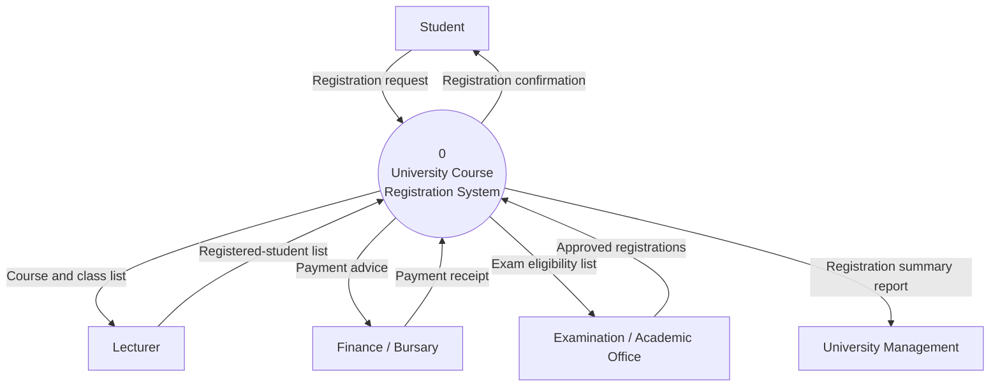
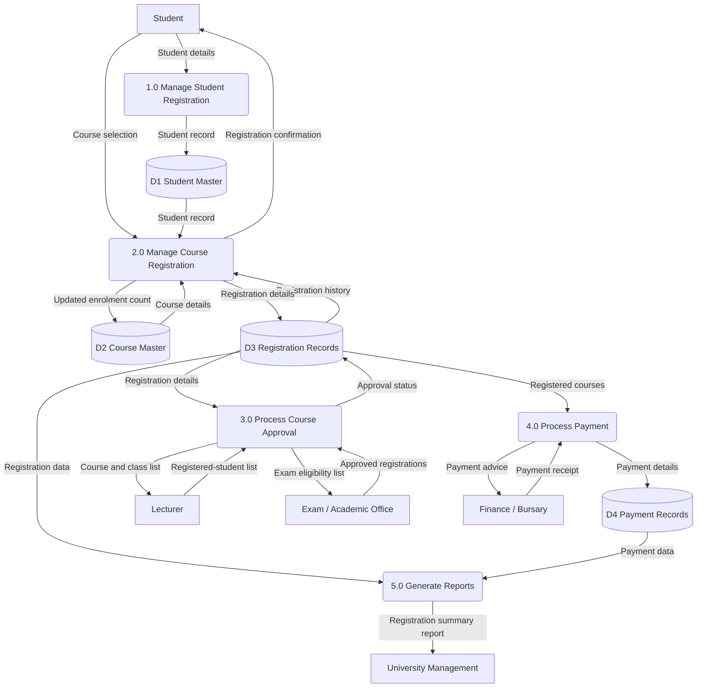
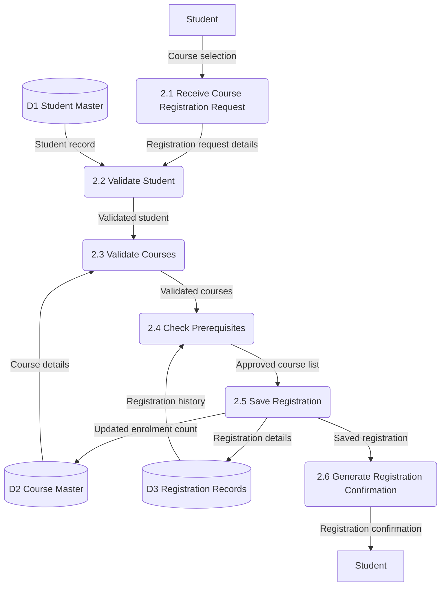
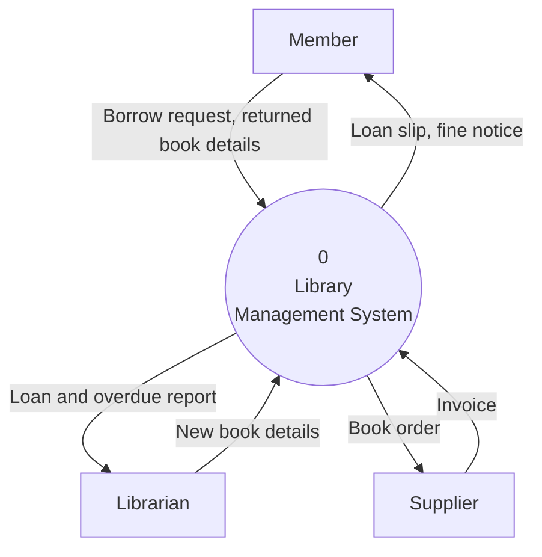

## What Is a Data Flow Diagram?

> A **Data Flow Diagram (DFD)** is a graphical model showing **how data enters a system, is transformed by processes, is stored, and leaves the system** — without describing **when** or **in what order** processing happens.

A DFD focuses on the **logical movement and transformation of data**. It deliberately does **not** show:

- the **sequence or timing** in which processes run,
- **decision logic** or conditional branching,
- **volumes, frequencies** or performance characteristics.

<Analogy>
A DFD is like a map of Lagos showing where goods travel — from the port, to warehouses, to markets, to homes. It shows **what moves where**, but not the time each lorry leaves or which driver turns left first. A **flowchart** is the driver's turn-by-turn instructions. Don't confuse the map with the directions.
</Analogy>

---

## The Four DFD Symbols

Every DFD, at every level, is built from **exactly four symbol types**. Two notation families are in common use — **Yourdon & DeMarco** and **Gane & Sarson**. They carry **identical meaning**; the choice is a matter of organisational or tool convention, but you **must be consistent within one diagram set**.

*Figure: The four DFD symbols in both notations.*

| Symbol | Meaning | Naming convention | Example |
|---|---|---|---|
| **External entity** | A person, organisation or other system **outside the boundary** that sends data to or receives data from the system | **Noun** | Student, Lecturer, Finance/Bursary |
| **Process** | An activity that **transforms incoming data flows into outgoing data flows** | **Verb + object**, numbered | 1.0 Manage Student Registration |
| **Data flow** | The **movement of a specific package of data** between an entity, a process and/or a data store | **Noun** describing the data | Course selection, Payment receipt |
| **Data store** | A repository where data is **held at rest** between processes | **Noun**, prefixed **D + number** | D1 Student Master |

---

## Ten Rules for Constructing DFDs

<Tabs>
<Tab label="Rules 1–5">

1. **Every process must have at least one meaningful input and one meaningful output.** A process with inputs but no output is a **"black hole"**; one with outputs but no input is a **"miracle"** — both mean analysis is missing.
2. **Every data flow must have a clear source and destination.**
3. **Never connect an external entity directly to another external entity** without a process.
4. **Never connect an external entity directly to a data store** without a process.
5. **Never connect one data store directly to another data store** without a process.

</Tab>
<Tab label="Rules 6–10">

6. **Label data flows with meaningful data names** (Registration form, Payment receipt). Give each data store a **unique reference and descriptive name** (D1 Student Master).
7. **Use meaningful process names that describe actions** — e.g., Validate Registration.
8. **Avoid physical implementation details** in a logical DFD.
9. **Keep process numbering consistent** across levels.
10. **Maintain balance** between parent and child DFDs.

</Tab>
</Tabs>

<ExamTip>
Rules 3, 4 and 5 boil down to one sentence: **data can only move between entities and stores by passing through a process.** Something must *do* something to the data. If you draw an arrow from Student straight into D1, ask "who or what records it?" — that's the missing process.
</ExamTip>

**About the diagrams in this lesson:** the diagrams below are drawn with a diagramming tool, so they use slightly different shapes from the hand-drawn symbols above: **rectangles = external entities**, **rounded boxes/circles = processes**, **cylinders = data stores**, **labelled arrows = data flows**. In your exam, use one of the two standard notations shown in the figure.

---

## Case Study: University Course Registration System

We develop one running case study through every level:

> Students register for courses each semester; **lecturers** receive course and class lists and return registered-student lists; the **Finance/Bursary** office receives payment advice and issues payment receipts; the **Examination/Academic Office** receives exam-eligibility lists and returns approved registrations; and **University Management** periodically receives a registration summary report.

---

## Step 1: The Context Diagram

> A **context diagram** is the **highest-level DFD**: it represents the **entire system as a single process (numbered 0)** and shows **every external entity** that exchanges data with the system, together with the major data flows. Its purpose is to **fix the boundary of the system** — what is inside, and what is outside in the environment.

**Characteristics of a context diagram:**
- **Exactly one process, always numbered 0**, representing the whole system.
- **No data stores** — stores are internal and only appear once decomposition starts.
- Shows **every external entity** and every major data flow to or from each one.
- Shows **no internal processing detail** — that is deferred to Level-0 and below.

**Reading the context diagram:**

| # | External entity | Sends into the system | Receives from the system |
|---|---|---|---|
| 1 | Student | Registration request | Registration confirmation |
| 2 | Lecturer | Registered-student list (once registration closes) | Course and class list for their courses |
| 3 | Finance/Bursary | Payment receipt (once payment is confirmed) | Payment advice (how much a student owes) |
| 4 | Examination/Academic Office | Approved registrations (after checking academic standing) | Exam eligibility list |
| 5 | University Management | — | Registration summary report (periodic, for oversight) |

---

## Step 2: The Level-0 DFD

> The **Level-0 DFD** is the **first decomposition** of the single context process (0) into the system's **major functional processes**. **Every external entity and every data flow crossing the boundary in the context diagram must still appear, unchanged, in the Level-0 diagram.**

From the notes, the major processes and data stores are:

| Processes | Data stores |
|---|---|
| 1.0 Manage Student Registration | D1 Student Master |
| 2.0 Manage Course Registration | D2 Course Master |
| 3.0 Process Course Approval | D3 Registration Records |
| 4.0 Process Payment | D4 Payment Records |
| 5.0 Generate Reports | |

The diagram below is **one valid Level-0 DFD** for the case study. (On paper the Level-0 diagram would show all the flows in one picture; tap through the explorer after it to study one process at a time.)

<FlowDiagram title="Level-0 process explorer">
<FlowStep title="1.0 Manage Student Registration">
**In:** Student details (from Student).
**Out:** Student record (to D1 Student Master).
Captures and maintains each student's personal and programme data.
</FlowStep>
<FlowStep title="2.0 Manage Course Registration">
**In:** Course selection (from Student); Student record (D1); Course details (D2); Registration history (D3).
**Out:** Registration details (to D3); Updated enrolment count (to D2); Registration confirmation (to Student).
Registers the student for the chosen courses after validation.
</FlowStep>
<FlowStep title="3.0 Process Course Approval">
**In:** Registration details (D3); Approved registrations (from Exam/Academic Office); Registered-student list (from Lecturer).
**Out:** Exam eligibility list (to Exam/Academic Office); Course and class list (to Lecturer); Approval status (to D3).
Obtains academic approval and distributes class lists.
</FlowStep>
<FlowStep title="4.0 Process Payment">
**In:** Registered courses (D3); Payment receipt (from Bursary).
**Out:** Payment advice (to Bursary); Payment details (to D4).
Works out what each student owes and records payment.
</FlowStep>
<FlowStep title="5.0 Generate Reports">
**In:** Registration data (D3); Payment data (D4).
**Out:** Registration summary report (to University Management).
Produces periodic oversight reports.
</FlowStep>
</FlowDiagram>

### Is the Level-0 Diagram Balanced with the Context Diagram?

The context diagram's **"Registration request"** appears at Level-0 as two flows: **"Student details"** (into 1.0) and **"Course selection"** (into 2.0). This is allowed **provided the data dictionary defines the composite flow**:

> **Registration request = Student details + Course selection**

Every other boundary flow — registration confirmation, course and class list, registered-student list, payment advice, payment receipt, exam eligibility list, approved registrations and registration summary report — appears **unchanged**. The data stores are new, but that's expected: stores are internal and first appear at Level-0. **The two levels balance.** *(Ability to trace every entity and flow from level to level is exactly what "balancing" means.)*

---

## Step 3: The Level-1 DFD (Decomposing 2.0)

> A **Level-1 DFD** takes **one process from the Level-0 diagram** and decomposes it into its component sub-processes.

Decomposing **2.0 Manage Course Registration** gives six sub-processes — numbered with the parent's number as a prefix:

- 2.1 Receive Course Registration Request
- 2.2 Validate Student
- 2.3 Validate Courses
- 2.4 Check Prerequisites
- 2.5 Save Registration
- 2.6 Generate Registration Confirmation

*(The Student entity is drawn twice to keep lines from crossing — a common, acceptable convention. It is the same entity.)*

**What the Level-1 reveals:** where Level-0 showed one "Manage Course Registration" bubble, Level-1 shows the activities that accomplish it — the request is received (2.1); the student is validated against **D1** (2.2); the courses are validated against **D2** (2.3); prerequisites are checked against **D3** (2.4); the registration is saved (2.5); and a confirmation is returned to the student (2.6).

---

## Step 4: DFD Balancing

> **Balancing** is the rule that **a child diagram, taken as a whole, must have exactly the same inputs and outputs as the single parent process it decomposes.** Nothing may be added and nothing lost when a process is "exploded" into a lower-level diagram.

### Balancing Check: Process 2.0 (Level-0) vs its Level-1 Diagram

| Flow on parent process 2.0 | Direction | Present on Level-1 boundary? |
|---|---|---|
| Course selection (from Student) | In | ✅ into 2.1 |
| Student record (from D1) | In | ✅ into 2.2 |
| Course details (from D2) | In | ✅ into 2.3 |
| Registration history (from D3) | In | ✅ into 2.4 |
| Registration details (to D3) | Out | ✅ from 2.5 |
| Updated enrolment count (to D2) | Out | ✅ from 2.5 |
| Registration confirmation (to Student) | Out | ✅ from 2.6 |

Every parent flow appears on the child, and the child introduces **no new boundary flow**. Flows such as "Validated student" and "Approved course list" are **internal** to the child (between 2.x processes), so they don't affect balancing. **The diagrams balance.**

**Why balancing matters:**
1. It guarantees that **every level describes the same system**, only in different detail — so a reader can trust any level.
2. It **catches missing or forgotten requirements early**: if a flow can't be accounted for in the child, either the parent was wrong or an analysis step was skipped.
3. It is **the single most common thing** a lecturer, client or CASE tool checks when validating a DFD set.

---

## Step 5: The Level-2 DFD (Decomposing 2.3)

> A **Level-2 DFD** decomposes one process from a Level-1 diagram further.

Decomposing **2.3 Validate Courses**:

| Process | Input | Output |
|---|---|---|
| 2.3.1 Retrieve Course Information | Course code (from 2.2) | Course details (to 2.3.2) |
| 2.3.2 Check Course Availability | Course details | Availability status (to 2.3.4) |
| 2.3.3 Check Prerequisite Requirements | Student record (D1), course details | Prerequisite status (to 2.3.4) |
| 2.3.4 Validate Course Selection | Availability status, prerequisite status | Validation outcome (to 2.3.5) |
| 2.3.5 Return Validation Result | Validation outcome | Validated request (to 2.4, as on Level-1) |

At Level-2, processes are so fine-grained that they are **usually shown in indented textual form** — a numbered process list with its flows — rather than a full diagram.

### When to Stop Decomposing

Decompose further **only** if a process still bundles **more than one distinct transformation of data**, or its logic **can't be described in a short, unambiguous way**. Stop once a process is a **functional primitive** — e.g., **2.3.2 Check Course Availability**, whose entire logic (*compare enrolled count against course capacity*) fits in one short process specification.

Splitting 2.3.2 into "read enrolled count", "read capacity" and "compare" would add **clutter without insight** — a common mistake.

---

## The Fifteen Most Common DFD Mistakes

<Tabs>
<Tab label="Flow errors">

| Mistake | Incorrect example | Correction |
|---|---|---|
| **1. Missing data flows** | "Compute Fine" with no incoming "Loan due date" | Trace each process's required inputs back to their source and add the flow |
| **2. Unlabelled data flows** | An arrow with no label | Give every flow a specific noun label, e.g. "Payment receipt", not "data" |
| **3. Entity → entity flow** | Arrow straight from Student to Finance/Bursary | Insert the mediating process, e.g. 4.0 Process Payment |
| **4. Entity → data store flow** | Arrow from Student straight into D1 Student Master | Route it through 1.0 Manage Student Registration |
| **5. Store → store flow** | Arrow from D2 Course Master straight into D3 Registration Records | Add the process that reads one store, transforms the data and writes the other |

</Tab>
<Tab label="Process errors">

| Mistake | Incorrect example | Correction |
|---|---|---|
| **6. "Miracle"** (no input) | 5.0 Generate Reports with outgoing flows only | Add the inputs it needs, e.g. Registration data from D3 |
| **7. "Black hole"** (no output) | A process receives Payment but produces nothing | Add the output, e.g. Payment confirmation |
| **8. Overly complex diagram** | One diagram with more than about 7–9 processes | Decompose further; keep each diagram to **7 ± 2** processes |
| **9. Excessive decomposition** | Splitting "Check Course Availability" into read/read/compare | Stop once a process can be described in one short paragraph |
| **10. Incorrect numbering** | Children of 2.0 numbered 1.1, 1.2 | Prefix each child with its parent's number: 2.1, 2.2 |

</Tab>
<Tab label="Model errors">

| Mistake | Incorrect example | Correction |
|---|---|---|
| **11. Unbalanced DFDs** | A flow on Level-1 of 2.0 that is absent from 2.0 on Level-0 | Apply the balancing check before finalising |
| **12. Mixing physical and logical** | "Clerk types data into Excel spreadsheet" | Rename to the logical activity: "Record Registration Data" |
| **13. Vague process names** | "2.0 Process Data", "2.0 Handle Registration Stuff" | Specific verb + object: "2.0 Manage Course Registration" |
| **14. Processing inside a data store** | Drawing validation logic inside the store symbol | Stores hold data at rest; all transformation belongs in a process |
| **15. Treating DFDs as flowcharts** | Decision diamonds, loops, "first do this, then that" arrows | A DFD shows **data movement**, not control flow or sequence |

</Tab>
</Tabs>

---

## Practice Questions

<Reveal question="Draw a context diagram for a library system with external entities Member, Librarian and Supplier.">

Check your answer: **one process numbered 0**, **no data stores**, every entity outside the boundary, and every flow labelled with a noun.
</Reveal>

<Reveal question="What is wrong with a process called 'Clerk enters data in spreadsheet'?">
It mixes **physical implementation details** (clerk, spreadsheet) into a **logical** DFD, and the name is vague about what data is processed. Rename it to a logical verb + object such as **"Record Registration Data"**.
</Reveal>

<Reveal question="A Level-1 diagram for process 4.0 shows a new output 'SMS alert to Student' that is not on 4.0 in the Level-0 diagram. What rule is broken and how do you fix it?">
The **balancing** rule — the child adds a boundary flow the parent doesn't have. Either **add "SMS alert" to process 4.0 on the Level-0 diagram** (and to the context diagram, since it crosses the system boundary) if it is a genuine requirement, or **remove it from the Level-1 diagram** if it isn't.
</Reveal>

<Reveal question="Explain the terms 'black hole' and 'miracle' in DFDs.">
A **black hole** is a process with inputs but **no outputs** — data goes in and disappears. A **miracle** is a process with outputs but **no inputs** — it produces data from nothing. Both break the rule that every process needs at least one input and one output, and both indicate missing analysis.
</Reveal>

<Reveal question="State four characteristics of a context diagram.">
(1) It has exactly **one process, numbered 0**, representing the whole system; (2) it shows **no data stores**; (3) it shows **every external entity** and every major data flow to/from each; (4) it shows **no internal processing detail**. Its purpose is to fix the **system boundary**.
</Reveal>

<Takeaway>
A **DFD** models the logical movement and transformation of data — not timing, sequence or decisions. It uses four symbols (**external entity, process, data flow, data store**) in either **Yourdon/DeMarco** or **Gane & Sarson** notation. The **context diagram** shows the whole system as process **0** with its external entities and no stores; **Level-0** decomposes it into major processes (1.0, 2.0…) and introduces data stores; **Level-1** and **Level-2** decompose single processes further until each is a **functional primitive**. Data may only move between entities and stores **through a process**, every process needs an input and an output, and every child diagram must be **balanced** with its parent.
</Takeaway>

## Exam Tips

**What lecturers test:**
- Draw a **context diagram** and a **Level-0 DFD** for a given scenario (hospital, library, hostel, ATM, registration)
- Identify and correct errors in a given DFD
- Define and illustrate **balancing**
- The DFD symbols in both notations and their naming conventions
- The rules for constructing DFDs

**Common mistakes:**
- Putting data stores on the context diagram
- Unlabelled arrows, or labels that are verbs ("sends") instead of nouns ("Payment receipt")
- Numbering children incorrectly (children of 3.0 must be 3.1, 3.2 …)
- Drawing decision diamonds — that's a flowchart, not a DFD

**Likely question:**
> "A hospital wants a patient appointment system. Patients book appointments, doctors receive daily schedules, and the accounts department receives billing information. Draw the context diagram and a Level-0 DFD, and explain how you would check that they are balanced." (20 marks)
