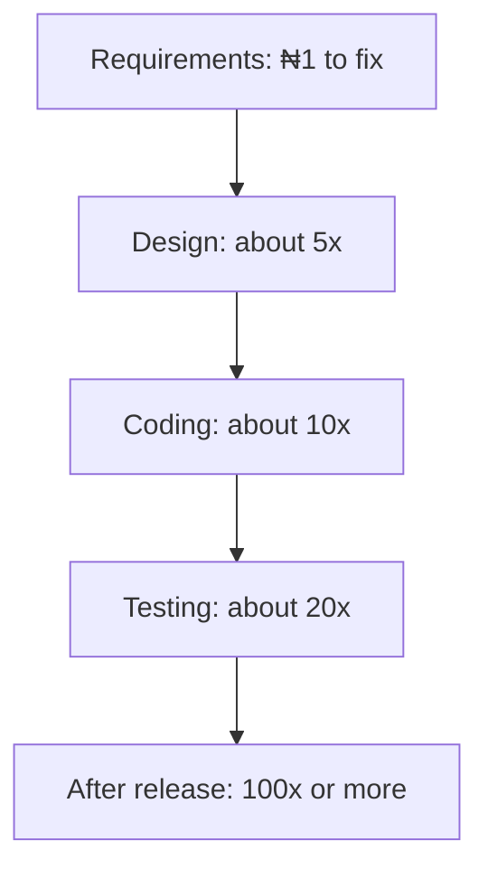
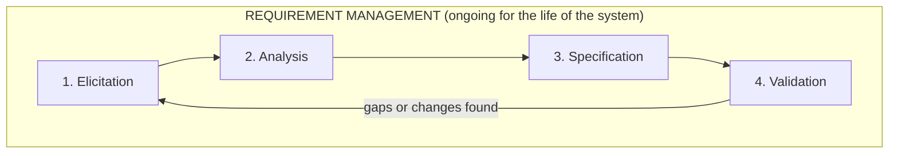

## Two Sides of the Same Coin

At the heart of every successful system is one demanding question: **what exactly must the system do, for whom — and is it worth building?**

- Answering *"what must it do, for whom?"* is the work of **requirement gathering**.
- Answering *"is it worth building?"* is the work of the **feasibility study** (next topic).

> Requirement gathering defines **what should be built**; the feasibility study confirms **whether it should be built at all**.

Industry surveys consistently show that a large share of IT project failures trace back to **poorly understood requirements and inadequate feasibility assessment**, not to programming or hardware faults (Pereira, Varajão & Takagi, 2024). When analysts rush requirements, the system fails to match what the organisation needs — leading to **costly rework, missed deadlines and user rejection**.

---

## What Is a Requirement?

> A **requirement** is a statement of **what a proposed system must do**, **how well it must do it**, or **a constraint under which it must operate**, in order to solve a problem or achieve an objective for a stakeholder. *(Wiegers & Beatty, 2013)*

The **IEEE Standard** defines a software requirement as *"a condition or capability needed by a user to solve a problem or achieve an objective"* that must be met or possessed by a system to satisfy a contract, standard, specification or other formally imposed document.

In everyday language, a requirement answers: *what must this system be capable of, and under what conditions, for it to be considered successful by the people who will use, pay for and be affected by it?*

### Requirements Exist at Different Levels of Abstraction

| Who says it | Level | Example |
|---|---|---|
| Business executive | Broad goal | "Reduce registration queues on campus." |
| Registrar | Process-level need | "Students should register for courses without visiting the department." |
| Programmer | Precise, testable statement | "The system shall reject a course registration if the student has not paid the required tuition instalment." |

The systems analyst elicits requirements at **all** these levels and translates them into a **coherent, unambiguous specification** that developers can implement and testers can verify.

---

## Requirement Gathering

**Requirement gathering** is *the systematic process of collecting, analysing and documenting what a project, system or product must achieve.* It involves working closely with stakeholders and users to define functional needs, scope and expectations **early** in the life cycle, to prevent costly errors.

It has **five key stages**:

<FlowDiagram title="Five stages of requirement gathering" cycle>
<FlowStep title="Elicitation">
**Collecting information** from stakeholders — through interviews, questionnaires, observation and the other fact-finding techniques below.
</FlowStep>
<FlowStep title="Analysis">
**Evaluating and organising** the data: removing conflicts, classifying and prioritising requirements.
</FlowStep>
<FlowStep title="Documentation">
**Writing clear specifications** — e.g., the Software Requirements Specification (SRS).
</FlowStep>
<FlowStep title="Validation">
**Confirming accuracy with the client** — do the documented requirements truly reflect what stakeholders need?
</FlowStep>
<FlowStep title="Management">
**Tracking changes** as the project moves forward, so everyone works from the current version.
</FlowStep>
</FlowDiagram>

### Why Requirement Gathering Matters

Requirement gathering is arguably **the single most important phase of the SDLC**, because design, coding, testing, deployment and maintenance all depend on requirements being **correct and complete**.

1. **Reduces the risk of building the wrong system.** The cost of fixing a defect grows **exponentially** the later it is discovered — a wrong requirement found after implementation is far more expensive than one caught in analysis.
2. **Creates a shared, documented understanding** between stakeholders and developers, reducing disputes over scope.
3. **Provides the basis for planning and estimation** — negotiating schedule, cost and quality trade-offs.
4. **Supports traceability** — every delivered feature maps back to a legitimate business need, and every need is addressed.
5. **Improves user acceptance** — users consulted early are more likely to trust and use the system.

*Illustrative only: the exact multipliers vary between studies, but the pattern — cost of fixing an error rises sharply the later it is found — is well established.*

---

## Functional vs Non-Functional Requirements

### Functional Requirements

A **functional requirement** describes **what the system must do** — the specific behaviours, functions or services it performs, including its responses to inputs. They specify:
- the **inputs** the system accepts,
- the **processing** it carries out, and
- the **outputs** it produces.

They are usually the **easiest** for stakeholders to state, because they map onto tasks people already perform. They form the backbone of **use cases, user stories and process models**, and are the requirements users can **see directly** in the final product.

*Examples:* "The system shall allow a student to register for a course." "The system shall print an exam eligibility list for each course."

### Non-Functional Requirements

A **non-functional requirement** specifies something about the system itself — **how well it performs its functions**. They are also called **performance requirements** or **quality-of-service requirements**. Examples:

> performance · efficiency · usability · availability · reliability · supportability · testability · portability · maintainability · (measurable) ease of use · security

They are **quality constraints** the system must satisfy under the project contract. They constrain design and implementation and are **frequently the deciding factor** in whether users accept an otherwise complete system. A non-functional requirement can sometimes be broken down into functional ones, or turned into a **process requirement** when it is not easily measurable.

| Aspect | Functional | Non-functional |
|---|---|---|
| Focus | **What** the system does | **How well** it does it |
| Expression | "The system shall…" action statements | Quality attributes and constraints |
| Verification | Tested by **exercising a function** | Tested by **measurement** (load test, security audit) |
| Example | Allow a student to register for a course | Handle 5,000 concurrent registrations within 3 seconds |
| Origin | Business processes and user tasks | Standards, regulations, user expectations, architecture |
| Status | Mandatory | Non-mandatory (varies by project) |
| Capture | In use cases; **easy** to capture | As quality attributes; **hard** to capture |
| End result | Product **features** | Product **properties** |
| Documentation | Describes what the product does | Describes how the product works |

<ExamTip>
A quick test: if you can phrase it as **"The system shall [verb]…"** it's functional. If it's about **speed, security, availability, usability or capacity** ("within 3 seconds", "99.9% uptime", "usable on 2G connections") it's non-functional.
</ExamTip>

### Business, User and System Requirements

Requirements can also be classified by the **organisational level** at which they are expressed:

<Tabs>
<Tab label="Business">

**Business requirements** describe **high-level organisational objectives that justify the project — the "why"**. They include financial and marketing reasons for building the product.

*Example (Nigerian university):* "Reduce the average time a student spends completing course registration from three days to under thirty minutes, and reduce registration-related staff overtime by 50% within one academic session."

Documented in a **Business Requirements Document (BRD)** or vision-and-scope document; owned by **sponsors and senior management**.

</Tab>
<Tab label="User">

**User requirements** describe **tasks that specific user groups must be able to accomplish**, usually in natural language, use cases or **user stories**.

*Example:* "As a student, I want to view my provisional results before registering for the next session, so that I do not register for a course I have already passed."

The team analyses the product from the **user's point of view** to find which functionality will improve user experience most — e.g., "a customer profile that is easy to manage and loads fast even in low-bandwidth conditions."

</Tab>
<Tab label="System">

**System requirements** translate user requirements into **detailed technical specifications** for developers: precise functional statements, data definitions, interface specifications and quality attributes.

They are the **most detailed and least ambiguous** level and form the **contractual basis** against which the delivered system is verified.

*Example:* "Use JavaScript to build a dynamic single-page application."

</Tab>
</Tabs>

---

## The Requirement Engineering (RE) Process

**Requirement engineering** is the umbrella discipline governing how requirements are discovered, refined, documented, validated and managed throughout a project. It is an **iterative cycle of four core activities — elicitation, analysis, specification and validation — wrapped inside an ongoing management activity.**

<Step step="1" title="Requirement elicitation">
**Discovering requirements** by engaging stakeholders, studying existing systems and documents, and observing work as it is actually performed. It is fundamentally a **communication and discovery** activity — which is why interpersonal skill matters as much as technical skill for an analyst.
</Step>

<Step step="2" title="Requirement analysis">
**Detecting conflicts, overlaps, ambiguities and gaps**; **classifying** requirements (functional, non-functional, business, user, system); **prioritising** them; and **modelling** them with use-case diagrams, DFDs and ER diagrams. It also means **negotiating** when requirements conflict — e.g., the Bursary wants strict payment verification before registration, while the Academic Office wants provisional registration pending payment.

A popular prioritisation technique is **MoSCoW**: **M**ust have · **S**hould have · **C**ould have · **W**on't have this time.
</Step>

<Step step="3" title="Requirement specification">
**Documenting** the analysed requirements in a **structured, unambiguous and verifiable** form — most commonly a **Software Requirements Specification (SRS)** following a standard such as **IEEE 830** (1998). A well-written specification is summarised by **CUT-VC**: **C**omplete, **U**nambiguous, **T**estable, **V**erifiable, **C**onsistent — and **traceable** to its source.
</Step>

<Step step="4" title="Requirement validation">
Checking that the documented requirements **genuinely reflect stakeholder needs** and are consistent, feasible and testable **before** major design effort is committed. Techniques: **reviews and walkthroughs**, **prototyping** (a throw-away mock-up users can react to), **test-case generation** (*if a requirement can't be turned into a test case, it's probably badly specified*), and **formal sign-off**.
</Step>

<Step step="5" title="Requirement management">
Requirements **change** as understanding deepens and the business evolves. Management tracks changes through a **formal change-control process**, maintains **traceability** from requirements to design, code and test cases, and keeps **version history** so the current baseline is always known. The standard tool is the **Requirements Traceability Matrix (RTM)**.
</Step>

---

## Stakeholders in Requirement Gathering

A **stakeholder** is *any individual, group or organisation that can affect, be affected by, or perceive itself to be affected by a project.* Requirement gathering succeeds only when the analyst engages the **full range** of stakeholders — not just the most vocal or most senior. **Failing to consult a stakeholder group is one of the most common causes of incomplete requirements** (Hoblos, Sandeep & Pan, 2023).

**Typical stakeholders in a University Course Registration project:**

| Stakeholder | Typical role / interest |
|---|---|
| Vice-Chancellor / Provost (executive sponsor) | Approves funding, sets strategic goals, resolves cross-department conflicts |
| Registrar / Academic Office | Owns registration policy; **primary source of business rules** |
| Students | **Primary end users**; want ease of use and speed |
| Course advisers / lecturers | Approve course selections; need visibility of student choices |
| Bursary / Finance | Verifies fee payment before registration is finalised |
| ICT Directorate | Owns infrastructure; concerned with integration and security |
| Systems analyst / project team | Elicits, analyses, documents and validates requirements |
| National Universities Commission (regulator) | Sets external compliance rules, e.g., minimum credit load |

---

## Requirement Documentation

The documents most used in practice, including in Nigeria:

| Document | Purpose | Primary audience |
|---|---|---|
| **Business Requirements Document (BRD)** | States the business problem, objectives and scope | Sponsors, senior management |
| **Software/System Requirements Specification (SRS)** | Detailed, testable functional and non-functional requirements | Designers, developers, testers |
| **Use-case specifications / user stories** | User–system interactions from the user's viewpoint | Business analysts, developers, QA |
| **Requirements Traceability Matrix (RTM)** | Maps each requirement to its source, design element and test case | Project managers, QA, auditors |
| **Data dictionary** | Defines the meaning, format and constraints of every data element | Developers, database administrators |

---

## Fact-Finding Techniques

**Fact-finding techniques** are the practical methods analysts use to carry out **elicitation**. **No single technique is sufficient on its own** — skilled analysts combine two or more to **triangulate** the true requirements.

<Tabs>
<Tab label="Interviews">

**Interview** — a **planned, face-to-face (or virtual) conversation** between analyst and stakeholder, structured around prepared questions, to elicit detailed information about needs, processes and constraints.

**Objectives:** obtain in-depth, contextual information written instruments can't capture; clarify ambiguous or conflicting statements in real time; build rapport and trust.

**Advantages**
- Allows **probing follow-up questions** and clarification
- Analyst can observe **non-verbal cues** (tone, hesitation, body language)
- **Flexible** — structured, semi-structured or unstructured

**Disadvantages**
- **Time-consuming** to plan, conduct and transcribe
- Subject to **interviewer and interviewee bias**
- Hard to schedule with senior or dispersed stakeholders

**Use when:** early in the project with a **few key or senior** stakeholders; requirements are **complex, sensitive or poorly understood**; rich qualitative detail matters more than statistical breadth.

</Tab>
<Tab label="Questionnaires">

**Questionnaire** — a **structured set of written questions** distributed to **many** respondents to gather **quantifiable** data about needs, preferences or current practice, mostly closed-ended (multiple choice, rating scales) with a few open-ended questions.

**Objectives:** reach a large, dispersed population economically; collect statistically analysable data; allow **anonymous** answers for candour.

**Advantages**
- **Cost-effective** for large populations
- Easy to **tabulate and analyse** statistically
- **Anonymity** produces more honest feedback

**Disadvantages**
- Poorly worded questions give **ambiguous or biased** data
- **Low response rates** are common and may skew results
- **No chance to probe** or clarify answers

**Use when:** the population is **large** (e.g., all 25,000 students); measuring preferences or satisfaction on a scale; **validating interview findings** across a wider group.

</Tab>
<Tab label="Observation">

**Observation** — the analyst **directly watches** stakeholders performing tasks in their real working environment, recording the true **as-is** process rather than a verbal description of it.

**Objectives:** capture what people **actually do** (not what they say they do); reveal informal **workarounds, bottlenecks and exceptions**; understand the physical and organisational context.

**Advantages**
- **Objective, first-hand** data free from recollection bias
- Reveals inefficiencies and workarounds interviews miss
- Needs **no literacy or communication skill** from the person observed

**Disadvantages**
- **Time-consuming** — may span days or shifts to catch rare events
- **Hawthorne effect** — people change behaviour because they know they're being watched
- Can't reveal **reasoning or intentions**, or exceptions that didn't occur during the session

**Use when:** manual processes are poorly documented (e.g., how a bursary clerk manually verifies payment); a gap is suspected between documented procedure and practice; to **verify** interview findings.

</Tab>
<Tab label="Document analysis">

**Document analysis** — the **systematic review of existing documents**: forms, manuals, policies, reports, regulations and system documentation, to extract requirements, business rules and data definitions.

**Objectives:** understand the current system and its embedded business rules; identify data elements, forms and reports already in use; uncover regulatory and policy constraints.

**Advantages**
- **Doesn't consume stakeholders' time**; can start before interviews
- Provides **authoritative, traceable evidence** of official rules and terminology
- Shows **historical context** behind existing constraints

**Disadvantages**
- Documents may be **outdated**
- Can't reveal **informal exceptions or tacit knowledge**
- Large volumes are **time-consuming** to review

**Use when:** at the **very start**, to build background knowledge; formal rules constrain the system (e.g., **NUC minimum credit-load rules**); legacy documentation must be reconciled with new requirements.

</Tab>
<Tab label="JAD workshop">

**Joint Application Design (JAD)** — a **structured, facilitated workshop** bringing key stakeholders, users and IT specialists together in an intensive session (or series) to **jointly define requirements** under a trained facilitator.

**Objectives:** rapidly **build consensus** among stakeholders with conflicting views; reduce the calendar time needed compared with sequential interviews; produce a **jointly owned** requirement set.

**Advantages**
- **Surfaces and resolves conflicts in real time**, in front of everyone affected
- **Much faster** than many separate interviews
- Builds **buy-in and shared ownership**

**Disadvantages**
- Needs a **highly skilled, neutral facilitator** — otherwise the most senior/vocal person dominates
- **Hard to schedule** many busy people at once
- Can be **expensive** (venue, travel)

**Use when:** several departments hold **conflicting requirements**; executive sponsorship can compel attendance; medium-to-large projects where the time saved justifies the cost.

</Tab>
<Tab label="Brainstorming">

**Brainstorming** — a **group creativity technique** in which stakeholders generate **many ideas** in a short session, **deferring judgement** until idea generation is complete.

**Objectives:** generate a broad range of candidate requirements or innovative features quickly; encourage **outside-the-box** thinking; engage stakeholders and build enthusiasm.

**Advantages**
- **Low cost** and quick to organise
- Encourages quieter stakeholders when well facilitated (e.g., **silent brainwriting**)
- Produces **innovative, forward-looking** requirements, not just automation of the status quo

**Disadvantages**
- Produces lots of **low-quality or irrelevant** ideas to filter later
- Can be **dominated by strong personalities**
- **Not suited** to precise, detailed or regulatory requirements

**Use when:** **early**, to explore what is possible; creativity matters more than precision; as a **complement** to interviews and document analysis, not a replacement.

</Tab>
</Tabs>

### Comparison of the Six Techniques

| Technique | Data type | Cost / time | Best for |
|---|---|---|---|
| Interviews | Qualitative, in-depth | High per stakeholder | Complex, sensitive or poorly understood requirements |
| Questionnaires | Quantitative, broad | Low per respondent | Large, dispersed populations |
| Observation | Behavioural, objective | High (time-intensive) | Actual as-is processes and exceptions |
| Document analysis | Textual, authoritative | Low to moderate | Business rules, policies, legacy data definitions |
| JAD | Consensus, negotiated | High cost but fast overall | Reconciling conflicting departmental requirements |
| Brainstorming | Creative, exploratory | Low | Innovative candidate features early on |

<Analogy>
A doctor diagnosing a patient uses several techniques at once: **asks questions** (interview), **reads the medical records** (document analysis), **examines the patient** (observation), and may send a **health survey** to many patients for a study (questionnaire). Relying on the patient's words alone could miss what the examination reveals. Analysts triangulate the same way.
</Analogy>

---

## Practice Questions

<Reveal question="Classify each requirement as functional or non-functional: (a) The system shall generate a student's transcript. (b) The portal shall be available 99.5% of the time during registration week. (c) The system shall send an SMS when results are published. (d) Pages shall load within 3 seconds on a 3G connection.">
(a) **Functional** — something the system does. (b) **Non-functional** — availability. (c) **Functional**. (d) **Non-functional** — performance.
</Reveal>

<Reveal question="What does MoSCoW stand for and at which RE activity is it used?">
**M**ust have, **S**hould have, **C**ould have, **W**on't have (this time). It is a prioritisation technique used during **requirement analysis**.
</Reveal>

<Reveal question="Explain the Hawthorne effect and the fact-finding technique it affects.">
The **Hawthorne effect** is the tendency of people to **change their behaviour because they know they are being watched**. It is a disadvantage of **observation** — the analyst may record an unusually careful, "best behaviour" process instead of the real as-is process.
</Reveal>

<Reveal question="The Bursary and the Academic Office disagree on whether provisional registration should be allowed before fees are paid. Which fact-finding technique best resolves this, and why?">
A **JAD workshop**. It brings both departments (and the sponsor) together with a neutral facilitator so the conflict can be **surfaced and resolved in real time**, producing a jointly owned requirement. Separate interviews would only record the two positions without reconciling them.
</Reveal>

<Reveal question="State three purposes of the Requirements Traceability Matrix.">
It maps each requirement to its **source** (who asked for it), to the **design elements and code** that implement it, and to the **test cases** that verify it. This lets the team confirm every requirement is delivered and tested, assess the impact of changes, and show auditors that every feature has a legitimate business need.
</Reveal>

<Takeaway>
A **requirement** is what a system must do, how well, or under what constraint. Requirement gathering (elicitation → analysis → documentation → validation → management) is the most important SDLC activity because errors found late cost far more. Requirements are **functional** (what) or **non-functional** (how well), and exist at **business** (why), **user** (tasks) and **system** (technical) levels. Engage **all stakeholders**, document with a **BRD, SRS, use cases, RTM and data dictionary**, and combine fact-finding techniques — **interviews, questionnaires, observation, document analysis, JAD and brainstorming** — choosing each for the situation it suits.
</Takeaway>

## Exam Tips

**What lecturers test:**
- Define *requirement* (Wiegers & Beatty or IEEE)
- Functional vs non-functional requirements — with examples
- Business vs user vs system requirements
- The RE process activities (elicitation, analysis, specification, validation, management)
- Fact-finding techniques: advantages, disadvantages and **when to use each**

**Common mistakes:**
- Listing fact-finding techniques without saying **when** each is appropriate — that's where the marks are
- Calling "the system must be fast" a good requirement — non-functional requirements must be **measurable** ("within 3 seconds")
- Forgetting the **Hawthorne effect** when discussing observation

**Likely question:**
> "Discuss four fact-finding techniques a systems analyst could use to gather requirements for a hospital records system, stating one advantage, one disadvantage and one appropriate situation for each." (20 marks)
