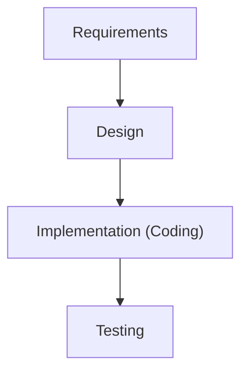
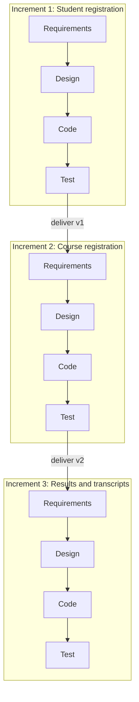

## What Is an SDLC Model?

The SDLC tells you **which phases** a project goes through. An **SDLC model** tells you **the order in which those phases are executed** — once, in a line, in repeated loops, or in overlapping cycles.

> Software development life cycle models describe the phases of the software cycle and the **order** in which those phases are executed. There are many models, and many companies adopt their own, but **all have very similar patterns**.

### The General Model

According to **Raymond Lewallen (2005)**, the general, basic model has four activities, each producing a deliverable used by the next:

Every other model is a different way of arranging, repeating or overlapping these activities.

<Analogy>
Think of two ways to paint a portrait. **Incremental:** paint the eyes perfectly, then the nose perfectly, then the mouth — each piece is finished before the next. **Iterative:** sketch the whole face roughly, then refine the whole thing, then refine again until it's done. **Waterfall** is deciding every brushstroke on paper before touching the canvas. Keep this picture in mind as you read the models.
</Analogy>

---

## 1. The Waterfall Model

*Figure: The Waterfall model. Image: Peter Kemp / Paul Smith, CC BY 3.0, via Wikimedia Commons.*

The **oldest, simplest and most structured** methodology. Development flows **steadily downwards, like a waterfall**, through requirements analysis, design, implementation, testing (validation), integration and maintenance. **Each phase depends on the outcome of the previous one.**

**Basic principles:**
- The project is divided into **sequential phases**, with some overlap and "splash back" acceptable between phases.
- Emphasis is on **planning, time schedules, target dates, budgets** and implementing the **entire system at one time**.
- **Tight control** is maintained through **extensive written documentation, formal reviews, and approval/sign-off** by the user and IT management at the end of most phases before the next begins.

| Advantages | Disadvantages |
|---|---|
| Simple and easy to use | Adjusting scope during the life cycle can **kill a project** |
| Easy to manage — each phase has specific deliverables and a review | **No working software until late** in the life cycle |
| Phases are processed and completed one at a time | High amounts of **risk and uncertainty** |
| Works well for **small projects with very well-understood requirements** | Poor for **complex, object-oriented, long or ongoing** projects, and where requirements are likely to change |

**Best for:** small, well-defined projects where requirements will not change.

---

## 2. The V-Shaped Model

*Figure: The V-model — each development phase on the left is paired with a testing phase on the right. Image: Herman Bruyninckx, CC BY-SA 3.0, via Wikimedia Commons.*

In the V-model, **verification and validation run in parallel**: each development (verification) phase on the left has an **associated testing (validation) phase** on the right. Each phase must finish before the next begins. **Testing is emphasised more than in the Waterfall model**, because **test procedures are written early**, before any coding.

How it works, step by step:

<Step step="1" title="Requirements → System test plan">
Requirements start the life cycle, as in Waterfall. **Before development starts, a system test plan is created**, focused on meeting the functionality specified in requirements.
</Step>

<Step step="2" title="High-level design → Integration test plan">
High-level design focuses on **system architecture**. An **integration test plan** is created to test whether the pieces of the software work together.
</Step>

<Step step="3" title="Low-level design → Unit tests">
The actual software **components** are designed, and **unit tests** are created for them.
</Step>

<Step step="4" title="Implementation, then up the right side">
All coding happens at the bottom of the V. Execution then climbs the **right side**, where the test plans written earlier are used: unit testing → integration testing → system testing.
</Step>

| Advantages | Disadvantages |
|---|---|
| Simple and easy to use | **Very rigid**, like Waterfall |
| Each phase has specific deliverables | Little flexibility; adjusting scope is **difficult and expensive** |
| **Higher chance of success than Waterfall** because test plans are developed early | Software is only built in implementation — **no early prototypes** |
| Works well for small projects with easily understood requirements | No clear path for problems found during testing |

---

## 3. The Incremental Model

The incremental model is *an intuitive approach to the waterfall model* — a **"multi-waterfall" cycle**. Multiple development cycles take place; they are broken into **smaller, more easily managed iterations**, and **each iteration goes through requirements, design, implementation and testing**.

It focuses on **addition and delivery in parts**: the product is broken into distinct **chunks or modules** built one after another, and **each new piece adds fully working functionality** to the final system.

| Advantages | Disadvantages |
|---|---|
| Generates **working software quickly and early** | Each phase of an iteration is **rigid** and phases do not overlap |
| More **flexible** — inexpensive to change scope and requirements | **Architecture problems** may arise because requirements are not gathered upfront for the whole system |
| **Easier to test and debug** a smaller iteration | |
| Easier to **manage risk** — risky pieces are handled in their own iteration | |
| Each iteration is an easily managed **milestone** | |

**Best for:** projects that need flexibility and must adapt to change over time.

---

## 4. The Iterative Model

The team **begins with a small set of requirements** and **iteratively enhances versions** until the software is ready for production. It focuses on **repetition and refinement**:

- You build a **rough or incomplete version of the whole product first**,
- then continually **update, polish and change it through multiple cycles** (iterations) based on feedback.

The **first iteration produces a working version**, so working software exists early; later iterations build on it.

- ✅ Easy to manage risks; working software early
- ❌ Repeated cycles can cause **scope change** and **underestimation of resources**

**Best for:** projects needing **high flexibility in requirements** that have the resources to handle multiple iterations.

<ExamTip>
**Incremental vs iterative** is a classic trap. **Incremental** = build and deliver **one complete piece at a time** (module by module). **Iterative** = build a **rough version of the whole**, then **refine it** repeatedly. Many real projects are both ("iterative and incremental"), but in an exam, state the difference clearly.
</ExamTip>

---

## 5. The Spiral Model

*Figure: Boehm's spiral model (1988). The distance from the centre represents cumulative cost; moving around represents progress. Image: Conny / Marctroy, public domain, via Wikimedia Commons.*

The spiral model is **similar to the incremental model, with much more emphasis on risk analysis.** It has **four phases**, and the project passes through them repeatedly in loops called **spirals**:

<FlowDiagram title="One loop of the spiral" cycle>
<FlowStep title="Planning">
**Requirements are gathered.** In the diagram this is quadrant 1, *determine objectives*. In the very first (**baseline**) spiral, requirements are gathered and risk assessed; every later spiral builds on it.
</FlowStep>
<FlowStep title="Risk Analysis">
A process is carried out to **discover risks and alternative solutions**. **A prototype is produced at the end of this phase** (quadrant 2, *identify and resolve risks*).
</FlowStep>
<FlowStep title="Engineering">
**Software is produced**, with **testing at the end** of the phase (quadrant 3, *development and test*).
</FlowStep>
<FlowStep title="Evaluation">
The **customer evaluates the output so far** before the project continues to the next spiral (quadrant 4, *plan the next iteration*).
</FlowStep>
</FlowDiagram>

In the spiral diagram, **the angular component denotes progress** and **the radius denotes cost** — the further out you spiral, the more money has been spent.

The model combines the **iterative model's repeated cycles** with the **waterfall model's linear flow** to prioritise risk analysis. It also combines design and prototyping-in-stages to get the advantages of **top-down and bottom-up** concepts.

| Advantages | Disadvantages |
|---|---|
| **High amount of risk analysis** | Can be **costly** to use |
| Good for **large and mission-critical** projects | Risk analysis requires **highly specific expertise** |
| Software is produced **early** in the life cycle | Project success is **highly dependent on the risk-analysis phase** |

**Best for:** complex, high-risk projects with frequent changes. Too expensive for small projects.

---

## 6. The Agile Model

Agile **arranges the SDLC phases into several short development cycles**, with the team delivering **small, incremental changes** in each cycle. **At each iteration the product is tested.**

Agile methods develop a system incrementally by building a series of prototypes and **constantly adjusting them to user requirements**. Developers revise, extend and merge earlier versions into the final product. Agile emphasises **continuous feedback** — each step is shaped by what was learned in the previous one.

<FlowDiagram title="An agile iteration (sprint)" cycle>
<FlowStep title="Plan">
Pick the highest-priority features the customer wants next.
</FlowStep>
<FlowStep title="Design & Build">
Design and code just those features.
</FlowStep>
<FlowStep title="Test">
Test the increment — **every iteration is tested**.
</FlowStep>
<FlowStep title="Review & Feedback">
Show the working software to the customer; collect feedback that shapes the next iteration.
</FlowStep>
</FlowDiagram>

- ✅ Highly efficient; rapid cycles **identify issues early** before they grow
- ❌ **Over-reliance on customer feedback** can cause excessive scope change or even project termination

---

## 7. The Big Bang Model

Developers **jump right into coding without much planning**. Requirements are implemented as they arrive, with **no clear roadmap**. If changes are needed, the software may need a **complete revamp**.

- **Best for:** academic or practice projects, or small projects with **one or two developers**, where requirements aren't well understood and there's no fixed release date.
- **Not suitable** for large projects.

---

## 8. Rapid Application Development (RAD)

RAD is a methodology involving **iterative development and the construction of prototypes**. The term was introduced by **James Martin in 1991**.

**Basic principles of RAD:**
- **Fast development and delivery** of a high-quality system at relatively **low investment cost**.
- Reduces project risk by breaking the project into **smaller segments** and making change easier.
- Achieves speed through **iterative prototyping**, **active user involvement** and **computerised development tools** — GUI builders, **CASE tools**, DBMSs, fourth-generation languages, code generators and object-oriented techniques.
- **Business need comes first**; technological or engineering excellence is of lesser importance.
- Project control uses **"timeboxes"** — if the project slips, **requirements are reduced to fit the timebox; the deadline is not extended**.
- Generally includes **Joint Application Design (JAD)**, where users are intensely involved in design through structured workshops.
- **Active user involvement is imperative.**
- Produces **production software**, not a throwaway prototype, plus the documentation needed for future maintenance.
- Standard SAD methods can fit into this framework.

---

## 9. The Prototyping Model

A **prototype** is an **early working version of an information system**. It serves as an initial model used as a **benchmark to evaluate the finished system**, or it can be **developed into the final version**. Prototyping **tests system concepts** and lets users examine **inputs, outputs and user interfaces before final decisions are made**.

- ✅ **Speeds up development significantly**; users see something real early
- ❌ **Important decisions might be made too early**, before business or IT issues are thoroughly understood

---

## Comparing the Models

| Model | Shape | Working software appears | Handles changing requirements | Best for |
|---|---|---|---|---|
| Waterfall | Linear, one pass | Late | Poorly | Small, well-defined projects |
| V-shaped | Linear with paired tests | Late | Poorly | Small projects needing strong testing |
| Incremental | Several mini-waterfalls | Early (first module) | Well | Systems that can be split into modules |
| Iterative | Repeated refinement of the whole | Early (rough version) | Well | Projects needing high flexibility |
| Spiral | Risk-driven loops | Early (prototypes) | Well | Large, high-risk, mission-critical projects |
| Agile | Short tested cycles | Very early and continuous | Very well | Fast-changing business needs |
| Big Bang | No plan | Whenever | — | Tiny/academic projects |
| RAD | Timeboxed prototyping | Early | Well | Business apps needed quickly |

---

## The Analyst's Toolkit

Besides understanding business operations, analysts use **modelling, prototyping and CASE tools** to plan, design and implement systems — usually in a team with users, managers and IT staff.

### 1. Modelling

**Modelling** produces a **graphical representation of a concept or process** that developers can analyse, test and modify. An analyst describes and simplifies a system using several model types:

| Model | Describes |
|---|---|
| **Business / requirements model** | The information the system must provide |
| **Data model** | The data structures a database requires |
| **Object model** | Objects, which combine data and processes |
| **Network model** | The network the system runs on |
| **Process model** | The processes/logic of the system |

A **data model** is a conceptual representation of the data structures required by a database: the **data objects**, the **associations** between them, and the **rules** governing operations on them. Two major methodologies create data models:
- the **Entity-Relationship (ER) approach**, and
- the **Object model**.

**Data modelling** is the process of creating a visual representation of a system (or parts of it) to communicate connections between data points and structures. The predominant data-modelling types are **hierarchical, network, relational and entity-relationship.**

Analysts often use multipurpose charting tools such as **Microsoft Visio** to draw business process diagrams, flowcharts, organisation charts, network diagrams, floor plans, project timelines and workflow diagrams.

### 2. Prototyping (as a tool)

As described above, prototyping lets the team examine inputs, outputs and interfaces early. It is used both as a **model** (the Prototyping model) and as a **technique** inside other models (Spiral, RAD, Agile).

### 3. CASE Tools

**Computer-Aided Software Engineering (CASE)** is *the scientific application of a set of tools and methods to software, resulting in high-quality, defect-free and maintainable software products.* CASE uses powerful software — **CASE tools** — to help analysts **develop and maintain** information systems.

- CASE tools provide an **overall framework** for systems development and support many methodologies, including **structured analysis** and **object-oriented analysis**.
- **CASE functions** include **analysis, design and programming**.
- CASE tools **automate methods for designing, documenting and producing structured computer code** in the desired language.

**Two key ideas of CASE:**
1. **Foster computer assistance** in software development and/or maintenance.
2. An **engineering approach** to software development and/or maintenance.

<Reveal question="Extra (commonly examined): what is the difference between upper CASE and lower CASE tools?">
*(General knowledge beyond your notes.)* **Upper CASE** tools support the **early phases** — planning, analysis and design (e.g., drawing DFDs, ER diagrams and UML, maintaining a data dictionary). **Lower CASE** tools support the **later phases** — code generation, testing, debugging and maintenance. **Integrated CASE (I-CASE)** tools cover the whole life cycle. Examples of modern tools with CASE features: Visual Paradigm, Enterprise Architect, StarUML, Lucidchart and draw.io.
</Reveal>

---

## Practice Questions

<Reveal question="Why is the V-model said to have a higher chance of success than the Waterfall model?">
Because **test plans are developed early** — the system test plan during requirements, the integration test plan during high-level design, and unit tests during low-level design — before any coding. Testing is therefore built into every stage, so defects in requirements and design are caught against planned tests rather than discovered late.
</Reveal>

<Reveal question="Name the four phases of the spiral model and state what the radius and angle of the spiral represent.">
**Planning, Risk Analysis, Engineering and Evaluation.** The **angular** component represents **progress**; the **radius** represents **cumulative cost**.
</Reveal>

<Reveal question="Give three disadvantages of the Waterfall model.">
Any three: adjusting scope mid-project can kill it; no working software until late; high risk and uncertainty; poor for complex, object-oriented, long or ongoing projects; poor where requirements are likely to change.
</Reveal>

<Reveal question="In RAD, what happens if a project begins to slip behind schedule?">
RAD uses **timeboxes**. If the project slips, the emphasis is on **reducing requirements to fit the timebox**, not on extending the deadline.
</Reveal>

<Reveal question="A start-up is building a mobile banking app whose features will change as customers react. Which model would you choose?">
An **Agile** (or iterative/incremental) model. Requirements are expected to change, the business needs working software quickly, and continuous customer feedback is valuable. Waterfall or V-model would be too rigid, and Big Bang is unsuitable for a regulated financial product.
</Reveal>

<Takeaway>
SDLC models differ in **how** they order the phases. **Waterfall** and **V-model** are linear and rigid (V adds early test planning). **Incremental** delivers working modules one at a time; **iterative** refines a rough whole. **Spiral** loops through planning, risk analysis, engineering and evaluation — ideal for large, risky projects. **Agile** delivers small tested increments with continuous feedback; **RAD** (James Martin, 1991) uses timeboxed prototyping and heavy user involvement; **Big Bang** suits only tiny projects. Analysts support all of these with **modelling** (business, data, object, network, process), **prototyping** and **CASE tools**.
</Takeaway>

## Exam Tips

**What lecturers test:**
- Explain any two/three models with advantages and disadvantages (Waterfall, Spiral and V-model are favourites)
- Draw the Waterfall, V or Spiral model
- Principles of RAD
- Define CASE and state its two key ideas
- Types of models an analyst uses; the two data-modelling methodologies (ER and Object)

**Common mistakes:**
- Mixing up incremental and iterative
- Forgetting that the spiral model's defining feature is **risk analysis**
- Saying RAD extends deadlines — it **cuts requirements** to fit the timebox

**Likely question:**
> "With the aid of diagrams, compare the Waterfall and Spiral models of the SDLC, stating two advantages and two disadvantages of each." (15 marks)
