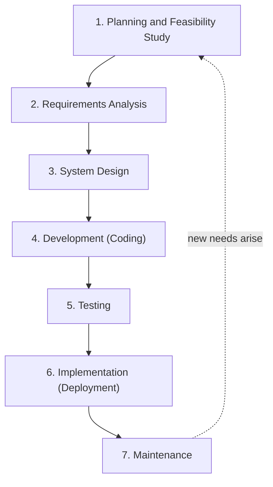

## What Is the SDLC?

The **Systems (Software) Development Life Cycle (SDLC)** is a **conceptual model used in project management that describes the stages involved in an information system development project** — from the first idea to the day the system is retired.

Your notes give three definitions worth remembering:

1. A conceptual framework describing **all activities in a software development project from planning to maintenance**.
2. **A series of phases that provide a common understanding of the software building process.**
3. A **networked sequence of activities, objects, transformations and events** that embody strategies for accomplishing software evolution.

From the analyst's point of view, the SDLC is *the set of activities that analysts, designers and users carry out to develop and implement an information system.*

<Analogy>
Building software without an SDLC is like building a house without an architect's plan. You might get walls up quickly, but you'll discover too late that the kitchen has no plumbing and the stairs lead into a wall. The SDLC forces you to survey the land (planning), agree on what rooms are needed (requirements), draw the plan (design), build (development), inspect (testing), move in (implementation) and repair over the years (maintenance).
</Analogy>

---

## A Brief History

- Formal software development frameworks **did not emerge until the 1960s**.
- According to **Elliott (2004)**, the SDLC is the **oldest formalised methodology framework** for building information systems.
- Its main idea was *"to pursue the development of information systems in a very deliberate, structured and methodical way, requiring each stage of the life cycle — from inception of the idea to delivery of the final system — to be carried out rigidly and sequentially."*
- In the 1960s the target was **large-scale functional business systems** for large business conglomerates, where IS work revolved around **heavy data processing and number-crunching routines**.

### Why Use an SDLC? (Seven Benefits)

| # | Benefit |
|---|---|
| 1 | Provides a **standardised framework** that defines activities and deliverables |
| 2 | Aids **project planning, estimating and scheduling** |
| 3 | Makes **project tracking and control** easier |
| 4 | Increases **visibility** of every aspect of the life cycle to all stakeholders |
| 5 | Increases the **speed of development** and improves **client relations** |
| 6 | **Decreases project risks** |
| 7 | Decreases **project management expenses** and the overall **cost of production** |

---

## The Seven Phases of the SDLC

Tap each phase to see its purpose and main output. The cycle repeats: maintenance eventually reveals the need for a new system, which starts planning again.

<FlowDiagram title="The seven phases of the SDLC" cycle>
<FlowStep title="Planning & Feasibility">
Review and **prioritise project requests**, allocate resources and identify the development team. Carry out the **preliminary investigation**: request clarification → feasibility study → request approval. *Output:* an approved, scheduled project.
</FlowStep>
<FlowStep title="Requirements Analysis">
Gain a **detailed understanding of the business** under investigation — its goals, processes and constraints — through interviews, observation, questionnaires and study of manuals/reports. *Output:* requirements documented with DFDs and context diagrams.
</FlowStep>
<FlowStep title="System Design">
Specify **how** the system will meet the requirements: outputs and reports first, then inputs, processing and stored data. Called **logical design**. *Output:* design specification handed to programmers.
</FlowStep>
<FlowStep title="Development (Coding)">
**Buy** (install purchased software) or **build** (write custom programs). The choice depends on cost, time available and availability of programmers. *Output:* working software.
</FlowStep>
<FlowStep title="Testing">
Use the system **experimentally** with special test data, and let a limited number of users try it, to discover surprises **before** the organisation depends on it. *Output:* tested, corrected system.
</FlowStep>
<FlowStep title="Implementation">
Install equipment and the application, **train users**, build data files, and **change over** from the old system (direct, parallel or pilot). Then **evaluate** the system. *Output:* a live system.
</FlowStep>
<FlowStep title="Maintenance">
**Eliminate errors** found during the working life and **tune the system** to changes in its environment, keeping it up to standard. *Output:* a system that stays useful — until it needs replacing.
</FlowStep>
</FlowDiagram>

---

## Phase 1: Planning and Feasibility Study

The **project planning** part involves:
- Reviewing the various **project requests**
- **Prioritising** the project requests
- **Allocating resources**
- Identifying the **project development team**

When someone requests an information system, the first systems activity is the **preliminary investigation**. It has **three parts**:

<Step step="1" title="Request clarification">
Many requests from employees and users are **not clearly defined**. The request must be examined and clarified properly before any systems investigation is considered. ("We need a better system" is not a request an analyst can act on; "Lecturers need to upload CA scores online so results are ready in two weeks instead of six" is.)
</Step>

<Step step="2" title="Feasibility study">
Determines whether the requested system is **feasible**. It is carried out by a **small group** who know information-systems techniques, understand the parts of the business affected, and are skilled in systems analysis and design. The notes highlight three aspects:
- **Technical feasibility** — can the work be done with existing technology, software and personnel? Does the organisation have (or can it obtain) the hardware, software and people to deliver and support the system?
- **Economic feasibility** — are there enough benefits to make the cost acceptable? Do lifetime **benefits exceed lifetime costs**? (Assessed by **cost-benefit analysis**: payback, return on investment and present value — covered fully in the Feasibility Study topic.)
- **Operational feasibility** — will the system be **used** if it is developed? Will users like it? Will it change their work environment?
</Step>

<Step step="3" title="Request approval">
Feasible and desirable projects are **put into a schedule**. Development may start at once, but systems staff are often busy on other projects, so management decides which projects are **most urgent**. For each approved request, the **costs, priority, completion time and personnel requirements** are estimated and used to place it on the project list.
</Step>

<ExamTip>
"State the three parts of the preliminary investigation" → **request clarification, feasibility study, request approval.** Don't confuse these with the three *feasibility* aspects (technical, economic, operational), which are all inside part 2.
</ExamTip>

---

## Phase 2: Requirements Analysis

Requirements analysis means gaining a **detailed understanding of all important facets of the business** under investigation — its goals, processes and constraints. The analyst asks:

| Question | Why it matters |
|---|---|
| What is being done? | Identifies the activities in scope |
| How is it being done? | Reveals the current procedure |
| How frequently does it occur? | Determines processing load |
| How great is the volume of transactions or decisions? | Sizes storage and hardware |
| How well is the task being performed? | Measures current performance |
| Does a problem exist? How serious is it? | Justifies (or rejects) change |
| What is the underlying cause? | Stops you treating symptoms |

To answer these, the analyst talks to different categories of people to collect **facts** about the business process and their **opinions** on why things happen as they do and how they could change. The analyst creates a **detailed blueprint** of the system using:
- **Data flow diagrams** and **context diagrams**
- **Interviews**, **on-site observation** and **questionnaires**
- Study of **manuals and reports**

Once structured analysis is complete, the analyst has a firm understanding of **what** is to be done.

---

## Phase 3: System Design

System design specifies **how the system will accomplish the objectives** stated earlier. It produces the details that clearly describe how the system will meet the requirements identified in analysis.

| Logical design | Physical design |
|---|---|
| What systems specialists call the **design stage** — describes how requirements will be met, independent of technology | The process of **developing the program software** itself |

The design process **begins by identifying the reports and other outputs** the system will produce (remember: output first!). It then describes the data to be **input, processed or stored**. The detailed design is then passed to the programming team.

---

## Phase 4: Development of Software

Software developers may:
- **Install purchased software** (off-the-shelf), or
- **Develop new, custom-designed programs.**

The choice depends on **the cost of each option, the time available and the availability of programmers.**

**Structured analysis** supports this work: a systematic development method that uses **graphical tools** to analyse and refine the objectives of an existing system and develop a new system specification that users can easily understand.

---

## Phase 5: Systems Testing

During testing the system is **used experimentally to ensure the software does not fail**:
- **Special test data** are input and the results examined.
- A **limited number of users** may use the system so the analyst can see whether they use it in **unforeseen ways**.

The goal is to **discover any surprises before the organisation implements the system and depends on it.**

---

## Phase 6: Implementation and Evaluation

**Implementation** is the process of having systems personnel:
- check out and put **new equipment** into use,
- **train users**,
- **install the new application**, and
- construct any **data files** needed to use it.

It is **less creative** than design. Depending on the organisation's size and the risk involved, developers choose how to switch from the old system to the new one.

### Changeover (Conversion) Methods

<Tabs>
<Tab label="Direct">

**Direct changeover** — the old system is **stopped completely** and the new system started. All data that used to go into the old system now goes into the new one.

- ✅ Cheapest and fastest; no duplication of work
- ❌ **Highest risk** — if the new system fails, there is nothing to fall back on

*Use when:* the system is small, well tested, or the old system simply cannot continue.

</Tab>
<Tab label="Parallel">

**Parallel changeover** — the old and new systems are **operated side by side** until there is enough confidence in the new one to discontinue the old. All data input into the old system is **also** input into the new one, so results can be **compared**.

- ✅ **Lowest risk** — the old system is a safety net
- ❌ **Most expensive** — double data entry, double staff effort

*Use when:* errors would be very costly (e.g., payroll, banking).

</Tab>
<Tab label="Pilot">

**Pilot changeover** — the new system is first **piloted in one part** of the organisation (one branch, one department). Once it runs successfully there, it is introduced to all other departments.

- ✅ Problems are contained to one area; staff there become trainers for others
- ❌ Takes longer to reach the whole organisation

*Use when:* the organisation has several similar units (e.g., bank branches, faculties).

</Tab>
<Tab label="Phased (extra)">

**Phased changeover** *(not in your lecture notes, but commonly examined in SAD)* — the new system is introduced **one module or function at a time** (e.g., first registration, then results, then transcripts), while the rest of the old system keeps running.

- ✅ Lower risk than direct; staff learn gradually
- ❌ Old and new parts must work together during the transition

</Tab>
</Tabs>

| Method | Risk | Cost | Speed |
|---|---|---|---|
| Direct | Highest | Lowest | Fastest |
| Parallel | Lowest | Highest | Slow |
| Pilot | Low–medium | Medium | Medium |

### Post-Implementation Evaluation

Evaluation identifies the system's **strengths and weaknesses** along four dimensions:

| Dimension | What is assessed |
|---|---|
| **Operational evaluation** | How the system functions: ease of use, response time, overall reliability, level of utilisation |
| **Organisational impact** | Benefits to the organisation: financial, operational efficiency, competitive impact |
| **User/manager assessment** | Attitudes of senior managers, user managers and end-users |
| **Development performance** | The development process itself: overall time and effort, conformance to budgets and standards, other project-management criteria |

---

## Phase 7: Maintenance

Maintenance is necessary to:
- **Eliminate errors** in the working system during its working life, and
- **Tune the system** to variations in its working environment.

Small deficiencies are often found as a system goes into operation, and changes are made to remove them. **System planners must always plan for resource availability** to carry out maintenance. Its purpose is to **continue to bring the system to standard.**

<Reveal question="Extra (commonly examined): what are the four types of maintenance?">
These come from general software-engineering practice rather than your notes, but they help you write a fuller answer:
- **Corrective** — fixing errors (bugs) discovered after delivery
- **Adaptive** — changing the system to work in a changed environment (new OS, new tax law)
- **Perfective** — improving performance or adding features users request
- **Preventive** — restructuring the system to prevent future problems (e.g., cleaning up code, updating documentation)
</Reveal>

---

## Practice Questions

<Reveal question="Define the SDLC and list its seven phases in order.">
The SDLC is a conceptual model used in project management that describes the stages involved in an information system development project, from planning to maintenance. Phases: **(1) Planning & feasibility study, (2) Requirements analysis, (3) System design, (4) Development (coding), (5) Testing, (6) Implementation (deployment), (7) Maintenance.**
</Reveal>

<Reveal question="A bank wants to replace its customer-account system across 120 branches. Which changeover method would you recommend and why?">
**Pilot** changeover (possibly combined with parallel running in the pilot branch). Errors in account balances would be extremely costly, so a **direct** changeover is too risky; running **parallel** in all 120 branches would be very expensive. Piloting in one or two branches contains any problems, lets the bank verify results against the old system, and produces trained staff who can support the other branches during roll-out.
</Reveal>

<Reveal question="What questions does an analyst ask during requirements analysis?">
What is being done? How is it being done? How frequently does it occur? How great is the volume of transactions or decisions? How well is the task being performed? Does a problem exist? If so, how serious is it, and what is the underlying cause?
</Reveal>

<Reveal question="State four dimensions along which a new system is evaluated after implementation.">
**Operational evaluation** (ease of use, response time, reliability, utilisation), **organisational impact** (financial, efficiency and competitive benefits), **user/manager assessment** (attitudes of managers and end-users), and **development performance** (time, effort, budget and standards conformance).
</Reveal>

<Takeaway>
The SDLC — the oldest formal methodology (1960s) — structures development into **planning & feasibility, requirements analysis, design, development, testing, implementation and maintenance**. Planning begins with a **preliminary investigation** (request clarification → feasibility study → request approval). Design starts from the **outputs**. Implementation includes training, data conversion and a **changeover** (direct = risky and cheap, parallel = safe and expensive, pilot = contained roll-out), followed by **evaluation**. Maintenance keeps the system correct and in tune with its environment until a new cycle begins.
</Takeaway>

## Exam Tips

**What lecturers test:**
- Definition and importance of the SDLC (list at least five benefits)
- Explanation of each phase, especially the **preliminary investigation** and **implementation**
- **Changeover methods** with advantages and disadvantages
- Dimensions of **post-implementation evaluation**

**Common mistakes:**
- Treating "feasibility study" and "preliminary investigation" as the same — feasibility is one of the **three parts** of the preliminary investigation
- Describing implementation as only "installing software" — it also includes **training, building data files and changeover**
- Forgetting that design begins with **outputs/reports**

**Likely question:**
> "Explain the phases of the System Development Life Cycle. With reasons, recommend a changeover method for a university moving from manual to online result processing." (20 marks)
