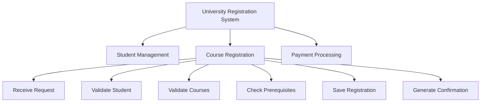
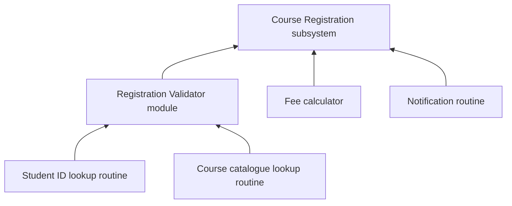

## Where Structured Analysis Fits

Every information system is, at its core, **a network of processes that receive data (input), transform it (processing) and produce information (output)**. Before any code is written, the analyst must describe that network clearly enough that a **client, a project sponsor and a programmer can all agree** on what the system does.

Structured analysis sits **inside the analysis phase of the SDLC**: once requirements have been gathered and feasibility confirmed, the analyst **organises and models** those requirements into a rigorous, unambiguous representation of what the proposed system must do.

> Structured analysis, with its central technique the **Data Flow Diagram (DFD)**, was the dominant method from the **late 1970s** onward. Its ideas — **decomposition, process modelling and balanced levels of detail** — reappear in every modern notation you will meet later, including UML use-case and activity diagrams and BPMN process maps.

---

## What Is Structured System Analysis?

Two definitions from your notes:

1. **A disciplined, step-by-step methodology for studying an existing system and specifying a new one, using standard, graphical, non-technical tools that both technical and non-technical stakeholders can understand.**
2. **A systematic approach to analysing information systems by breaking a complex problem into smaller, understandable processes and representing the movement and transformation of data.** It emphasises logical models, functional decomposition, clear documentation and consistency between levels of detail.

It emerged in the **1970s** from the work of **Tom DeMarco, Chris Gane, Trish Sarson and Edward Yourdon**.

### Key Characteristics

| Characteristic | Meaning |
|---|---|
| **Process-oriented** | Focuses on what the system **does with data** |
| **Hierarchical** | Large processes are **decomposed** into smaller sub-processes |
| **Logical** | Describes required behaviour **without prematurely committing to technology** |
| **Model-driven** | **Diagrams and structured specifications** communicate requirements |
| **Traceable** | A process can be followed from the high-level view down to low-level detail |

### What Does "Structured" Mean?

The word signals two things:
1. The analysis follows an **orderly sequence of well-defined steps**, not ad-hoc investigation.
2. The model is built from a **small number of standard, precisely defined graphical components** (the four DFD symbols) rather than free-form narrative — so **any analyst reading the diagram interprets it the same way**.

**Example — a simple library.** An *unstructured* description:

> "Members borrow books, the librarian checks them out, fines apply if they are late, and periodically reports are produced."

A *structured* analyst instead asks:

| Question | Answer for the library |
|---|---|
| What are the **external entities**? | Member, Librarian |
| What **processes** transform data? | Issue Book, Receive Return, Compute Fine, Produce Report |
| What **data stores** are needed? | Book Catalogue, Loan Records |
| What **data flows** connect them? | Borrow request, Loan details, Fine notice, Loan report… |

The result is a small, unambiguous diagram a programmer can implement directly.

---

## Five Principles of Structured Analysis

| Principle | What it means |
|---|---|
| **Graphic representation** | Models are expressed mainly as **diagrams** (DFDs, ERDs, decision trees), not paragraphs, because diagrams are faster to read and easier to check for consistency |
| **Partitioning / decomposition** | A complex system is broken into smaller subsystems and processes, each simple enough to understand and verify on its own |
| **Top-down development** | Start with a single high-level view of the whole system and **progressively add detail** — not low-level detail first, hoping it adds up |
| **Logical before physical** | Complete the **logical model** (what data, what processing) **before** physical decisions (which database, which language) |
| **Redundancy elimination** | Each fact (data item, business rule) is captured **once** and referenced wherever needed, avoiding conflicting copies |

<ExamTip>
"Logical before physical" is examined often. A **logical** model says *"Validate student"*; a **physical** model says *"Clerk checks the student's name in the Excel sheet"*. Structured analysis insists you finish the logical model first so technology choices don't distort your understanding of the business.
</ExamTip>

---

## Design Approaches

### 1. The Top-Down Approach

**Top-down design** begins with the **complete system or major business function** and **progressively decomposes it** into smaller subsystems and modules until each is simple enough to specify or implement directly. **It is the design strategy structured analysis is built on**, and it is most useful when the **overall business goal is well understood**.

**How it works:**

<Step step="1" title="State the overall purpose as one function">
e.g., "Register students for courses."
</Step>

<Step step="2" title="Identify the major sub-functions">
e.g., validate student, validate courses, process payment.
</Step>

<Step step="3" title="Decompose each sub-function further">
…until every piece is small enough to be fully understood, tested, and assigned to a single developer.
</Step>

<Step step="4" title="Verify at every level">
Check that the sub-functions, taken together, **fully and correctly implement** the function they came from.
</Step>

**Practical example — Student Course Registration System:**
- **Level 0 (whole system):** "Manage Course Registration."
- **Level 1:** Receive Request → Validate Student → Validate Courses → Check Prerequisites → Save Registration → Generate Confirmation.
- **Level 2 (decomposing "Validate Courses"):** Retrieve Course Information → Check Course Availability → Check Prerequisite Requirements → Validate Course Selection → Return Validation Result.

### 2. The Bottom-Up Approach

**Bottom-up design** starts from **existing, well-understood low-level components** (routines, modules, existing programs, reusable data structures) and **combines them progressively** into larger functions until the complete system emerges.

**How it works:**
1. Identify existing, **reusable low-level components** (e.g., an existing student-verification routine, an existing payment-gateway module).
2. **Group related components** into intermediate modules (e.g., combine student verification and course-eligibility checking into a "Registration Validation" module).
3. **Continue combining upward** until they form the complete system.
4. **Verify** that the assembled system satisfies the overall requirements.

**Practical example:** start with a **student ID lookup**, a **course-catalogue lookup** and a **fee calculator**; combine the two lookups into a **Registration Validator**; combine that with the fee calculator and a notification routine into the complete **Course Registration** subsystem.

### Top-Down vs Bottom-Up

| | Top-down | Bottom-up |
|---|---|---|
| Starting point | The **whole system** / overall goal | **Existing low-level components** |
| Direction | Decompose downward | Combine upward |
| Best when | The business goal is **well understood** | Good **reusable components** already exist |
| Strength | Keeps every part aligned to the overall objective | Maximises **reuse**; early working pieces |
| Risk | Low-level problems discovered late | Assembled parts may not add up to the overall goal |
| Link to structured analysis | **The basis of structured analysis and DFD levels** | Used alongside, e.g., when integrating legacy modules |

<Analogy>
**Top-down** is writing an essay from an outline: title → main sections → paragraphs → sentences. **Bottom-up** is building a Lego model from a box of bricks you already own: small assemblies first, then join them into the final model. Most real projects mix both — plan top-down, but reuse existing modules bottom-up.
</Analogy>

---

## 3. Modularisation

**Modular design** divides a system into **relatively independent modules**, each with a **clear responsibility** and a **well-defined interface** through which it communicates with other modules. A module may be a subsystem, a program or a single procedure, depending on the level of design.

Good modules aim for **HIGH COHESION and LOW COUPLING**.

<Tabs>
<Tab label="Cohesion (want HIGH)">

**Cohesion** is *the degree to which the tasks performed inside a single module are functionally related* — the **intra-dependability** of elements within a module; how well they work together towards a common purpose.

**Higher cohesion is better.**

*High cohesion:* a `CalculateFees` module that only computes tuition, levies and penalties.
*Low cohesion:* a `Utilities` module that calculates fees, sends emails, formats dates and backs up the database — unrelated jobs thrown together.

</Tab>
<Tab label="Coupling (want LOW)">

**Coupling** is *the degree of interdependence between separate modules* — how much one module relies on the internal details of another, or how strongly it depends on other modules.

**Lower coupling improves maintainability.**

*Low coupling:* the Registration module calls `Payment.isPaid(matricNo)` and gets back yes/no.
*High coupling:* the Registration module reads and edits the Payment module's internal tables directly — change Payment's tables and Registration breaks.

</Tab>
</Tabs>

**Characteristics of a good module:**
- Performs **one clearly identifiable function** (single responsibility)
- Has a **well-defined interface** — clearly specified inputs and outputs
- **Hides its internal implementation** from other modules (**information hiding**)
- Can be **developed, tested and modified** with minimal effect on other modules
- Is of **manageable size** — small enough for one developer to understand

A good module also has a **meaningful name**, a **focused responsibility**, **controlled inputs/outputs** and **minimal unnecessary dependencies**.

<ExamTip>
Memorise the pairing: **"High cohesion, low coupling."** Cohesion is *inside* one module (how related its parts are); coupling is *between* modules (how dependent they are). Mixing them up is the most common error in this area.
</ExamTip>

---

## 4. Decomposition

**Decomposition** is *the systematic process of breaking a complex function into smaller, more manageable sub-functions, repeated until every sub-function is simple enough to be fully specified without further breakdown.*

- It is **the mechanism by which top-down and modular design are actually carried out**.
- It is **the mechanism that produces the successive levels of a DFD**.

**Functional decomposition** decomposes a system by **what it does** (its functions/processes), as distinct from decomposing it by the data it holds. This is what DFDs do: **one process at one level becomes several more detailed processes at the next level.**

Decomposition is **not unlimited** — it stops once a process is a **single, atomic unit of work** (a **functional primitive**).

### Decomposition and DFD Levels

<FlowDiagram title="How decomposition creates DFD levels">
<FlowStep title="Context diagram">
**Zero decomposition** — the whole system shown as **one process, numbered 0**.
</FlowStep>
<FlowStep title="Level-0 DFD">
The **first decomposition** of process 0 into the system's **major functions** (1.0, 2.0, 3.0 …).
</FlowStep>
<FlowStep title="Level-1 DFD">
Decomposes **one Level-0 process** into its sub-processes (e.g., 2.0 → 2.1, 2.2, 2.3 …).
</FlowStep>
<FlowStep title="Level-2 DFD">
Decomposes **one Level-1 process** further (e.g., 2.3 → 2.3.1, 2.3.2 …). Usually stops here, at functional primitives.
</FlowStep>
</FlowDiagram>

Each level is a **finer-grained functional decomposition** of the level above — and, critically, **each child diagram must be balanced against its parent process** (covered in the next topic).

*(Note: some textbooks — and your notes in one place — call the context diagram "Level 0" and the first decomposition "Level 1". Both conventions are used; state the one you are using.)*

---

## 5. System Documentation

**System documentation** is *the organised record of the system's requirements, models, processes, data, design decisions, operating procedures and maintenance information.*

| Type | Contents | Main audience |
|---|---|---|
| **User documentation** | How to use the system, procedures, FAQs | End users |
| **Technical / system documentation** | Architecture, models, interfaces, configurations | Analysts, developers, administrators |
| **Program documentation** | Code structure, modules, APIs, comments | Developers and maintainers |
| **Process documentation** | Business processes, workflows, **DFDs** and rules | Analysts and stakeholders |
| **Data documentation** | **Data dictionary**, entities, fields and definitions | Analysts and database designers |

---

## 6. CASE Tools in Structured Analysis

**CASE (Computer-Aided Software Engineering)** tools provide software support for requirements modelling, diagramming, documentation, database modelling, **consistency checking**, project management and sometimes **code generation**. They automate parts of the SDLC that would otherwise be done by hand — such as **drawing and cross-checking DFDs** or **maintaining a data dictionary**.

| Type | Supports |
|---|---|
| **Upper CASE** | Early activities — planning, requirements and analysis |
| **Lower CASE** | Later activities — detailed design, coding and testing |
| **Integrated CASE (I-CASE)** | Multiple stages across the whole life cycle |

Examples of modelling/CASE-oriented tools: **Visual Paradigm, Enterprise Architect, Lucidchart and diagrams.net**. The choice depends on institutional requirements, licensing, collaboration needs and the notation being taught.

For our registration case study, a CASE tool would let the analyst draw the context, Level-0, Level-1 and Level-2 DFDs on screen, **automatically maintain data-dictionary entries** for every flow and store, and **automatically flag** if a data flow entering process 2.0 on the Level-0 diagram is missing from its Level-1 diagram — that is, it **performs balancing checks**.

---

## Practice Questions

<Reveal question="State the five principles of structured analysis.">
**Graphic representation**, **partitioning/decomposition**, **top-down development**, **logical before physical**, and **redundancy elimination**.
</Reveal>

<Reveal question="Distinguish between cohesion and coupling. Which should be high and which low?">
**Cohesion** measures how functionally related the tasks **inside one module** are — it should be **high**. **Coupling** measures how dependent **separate modules** are on each other — it should be **low**. High cohesion and low coupling make modules easier to understand, test and change independently.
</Reveal>

<Reveal question="When should decomposition stop? Give an example.">
When a process becomes a **functional primitive** — a single, atomic unit of work whose logic can be described in one short, unambiguous specification. Example: **"Check Course Availability"** (compare enrolled count with capacity). Splitting it into "read enrolled count", "read capacity" and "compare" adds clutter without insight.
</Reveal>

<Reveal question="Who developed structured analysis, and when?">
It emerged in the **1970s** from the work of **Tom DeMarco, Chris Gane, Trish Sarson and Edward Yourdon**.
</Reveal>

<Reveal question="Explain how a CASE tool helps with DFD balancing.">
The tool stores every data flow attached to each process. When the analyst draws the child (lower-level) diagram of a process, the tool compares the child's boundary flows with the parent's flows and **automatically flags any flow that has been added or lost**, so unbalanced diagrams are caught immediately.
</Reveal>

<Takeaway>
**Structured analysis** (DeMarco, Gane, Sarson, Yourdon — 1970s) models a system as processes that transform data, using a few standard graphical symbols. It is process-oriented, hierarchical, logical, model-driven and traceable, and follows five principles: **graphics, partitioning, top-down development, logical before physical, and no redundancy**. **Top-down** design decomposes the whole downward; **bottom-up** combines existing components upward. Good **modules** have **high cohesion and low coupling**. **Functional decomposition** produces the DFD levels and stops at **functional primitives**. Documentation covers users, systems, programs, processes and data, and **CASE tools** automate diagramming, data dictionaries and balancing checks.
</Takeaway>

## Exam Tips

**What lecturers test:**
- Define structured analysis and state its characteristics/principles
- Compare **top-down and bottom-up** design with an example
- Define **cohesion and coupling** and the characteristics of a good module
- Explain **decomposition** and its link to DFD levels
- Types of CASE tools (upper, lower, integrated)

**Common mistakes:**
- Saying "high coupling is good" — it's **low** coupling
- Treating decomposition as endless — it stops at the **functional primitive**
- Mixing physical details ("type into Excel") into a logical model

**Likely question:**
> "Explain the top-down and bottom-up approaches to system design using a student registration system as an example. What is meant by 'high cohesion, low coupling'?" (15 marks)
