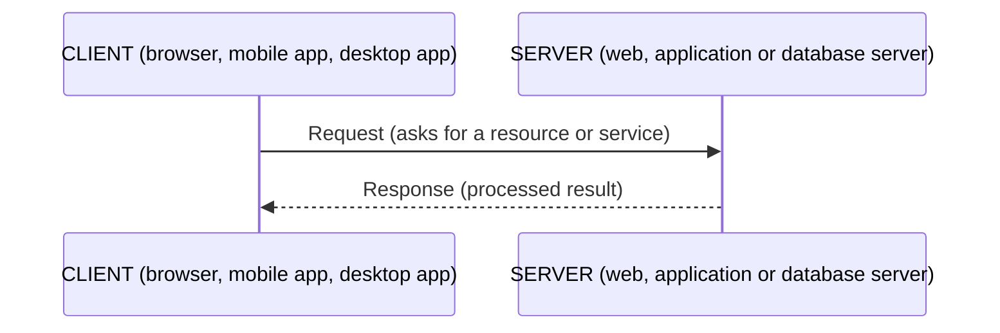
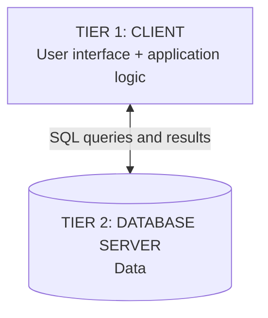
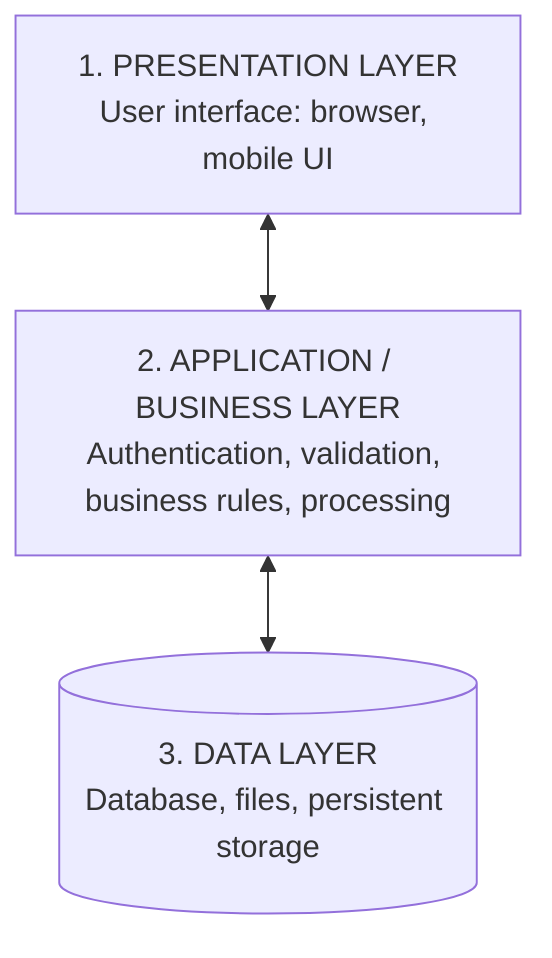
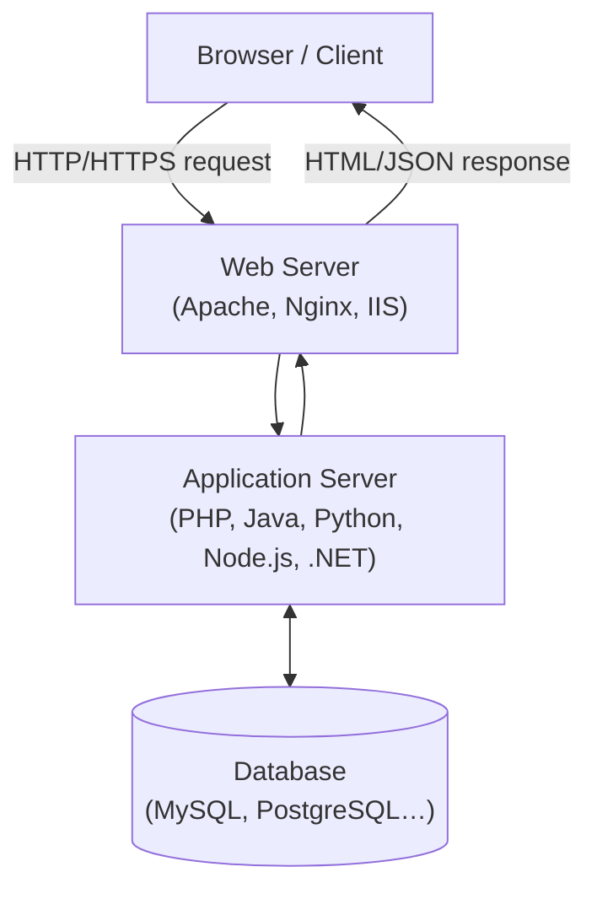
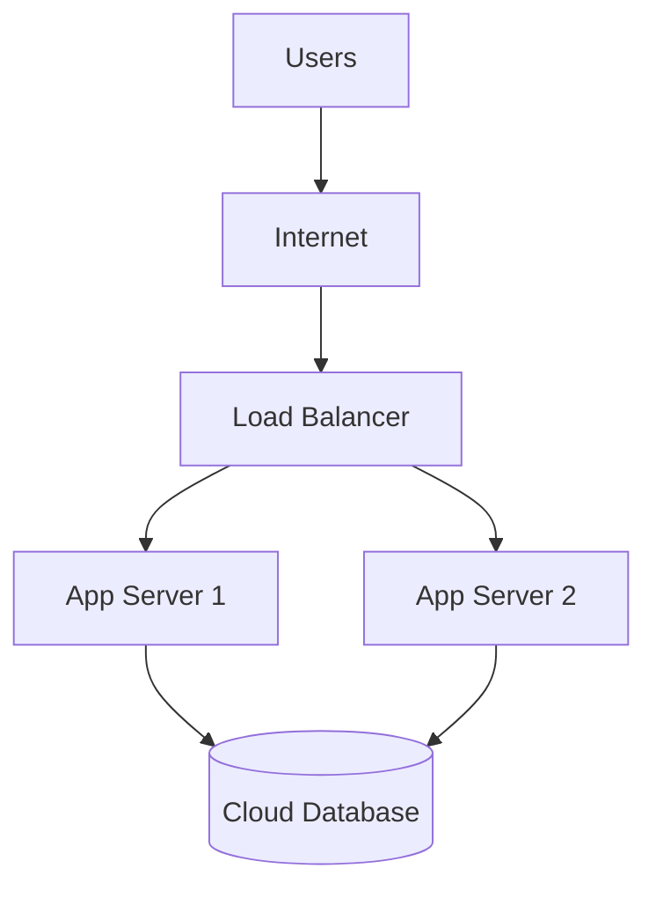
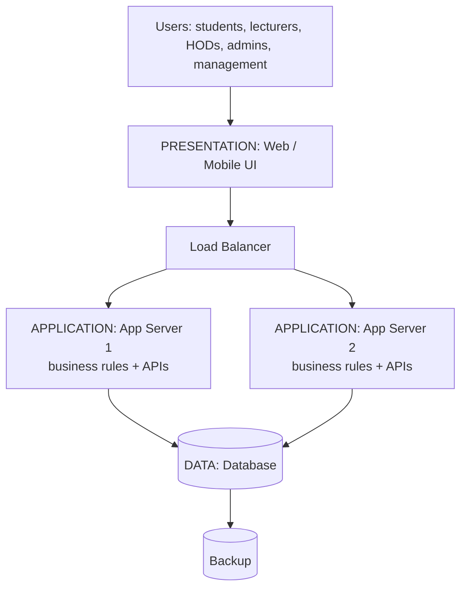

## What Is System Architecture?

> **System architecture** is the **high-level structure of a system**: its **major components, responsibilities, connections, data flows and deployment environment**.

Every architectural design answers one **core question**:

> **Where should the user interface, business processing, data, security and infrastructure reside — and how should they communicate?**

| Aspect | Includes |
|---|---|
| **Components** | Clients, servers, databases, networks, APIs, storage, external services |
| **Connections** | Protocols, APIs, requests, responses, messaging and data flows |
| **Constraints** | Performance, security, scalability, availability, cost, maintainability |

<Analogy>
Architecture is to a system what a **building plan** is to a hostel: before anyone lays bricks, you decide where the reception, rooms, kitchen and store go, how people move between them, and where the generator and water tank sit. Changing the plan after the building is up is extremely expensive — the same is true of software architecture.
</Analogy>

### Why Architectural Design Matters

| Quality | Question the architecture must answer |
|---|---|
| **Performance** | How quickly does the system respond? |
| **Scalability** | Can it support more users and workload? |
| **Security** | How are identities, data and services protected? |
| **Availability** | Can the system remain usable when components fail? |
| **Maintainability** | Can components be changed without breaking the whole system? |
| **Cost** | What infrastructure and operational resources are required? |

---

## Client–Server Architecture

In **client–server architecture**, a **client** asks a **server** for a resource or service, and the server **processes the request and returns a response**. Communication normally happens **over a network**.

- **Client examples:** web browser, mobile app, desktop application
- **Server examples:** web server, application server, database server

---

## Two-Tier vs Three-Tier Architecture

<Tabs>
<Tab label="Two-tier">

The **client** holds both the **user interface and the application (business) logic**, and talks **directly to the database server**.

- ✅ **Strength:** simple to build; suitable for **small applications**
- ❌ **Weakness:** clients may **connect directly to the database** (security risk; every client must be updated when rules change)
- **Typical use:** small departmental or desktop database applications (e.g., an office Access database shared on a network)

</Tab>
<Tab label="Three-tier">

The system is split into **three layers**, each with a focused responsibility. The client **never talks to the database directly** — it goes through the application layer.

</Tab>
</Tabs>

### Why Three-Tier Architecture?

| Benefit | Explanation |
|---|---|
| **Separation of concerns** | Each layer has a focused responsibility |
| **Security** | Clients do **not** normally access the database directly |
| **Maintainability** | Business rules can change **without redesigning the user interface** |
| **Scalability** | Application servers can be **scaled independently** |
| **Reusability** | Web, mobile and other clients can **consume the same services** |
| **Testability** | Layers can be tested with clearer boundaries |

<ExamTip>
"Differentiate two-tier and three-tier architectures" is in the lecturer's own exam list. Key point: in **two-tier**, business logic sits **in the client** and the client talks **directly to the database**; in **three-tier**, business logic moves to a **separate application layer** between the UI and the database — improving security, maintainability and scalability.
</ExamTip>

---

## Web Architecture

| Component | Role |
|---|---|
| **Browser** | Sends **HTTP/HTTPS requests** and **displays** results |
| **Web server** | Handles **HTTP traffic** and serves web resources (pages, images, scripts) |
| **Application server + database** | Executes **business logic** and **stores/retrieves** data |

### What Is an Application Server?

> An **application server** is a server environment that **runs application/business logic** and provides services needed by clients.

- **Typical responsibilities:** authentication, validation, calculations, business rules, sessions, API endpoints and database access.
- **Application platforms:** PHP, Java, Python, Node.js, .NET.
- **PHP example:** a PHP application runs behind a web server such as **Apache or Nginx**, with PHP executing the server-side logic. (This is exactly the XAMPP stack you use in IFT 302.)
- In some deployments, the **web server and application server functions are combined** on one machine.

---

## Cloud Architecture

| Characteristic | Meaning |
|---|---|
| **Resource pooling** | Shared pools of computing resources serve many customers |
| **Elasticity** | Resources can be **adjusted as workload changes** — add servers during registration week, remove them afterwards |
| **On-demand services** | Compute, storage, databases and networking are provisioned **as services** |

The **load balancer** spreads incoming requests across several application servers, so no single server is overwhelmed and one can fail without taking the system down.

---

## Centralized vs Distributed Systems

<Tabs>
<Tab label="Centralized">

**Processing and/or data are concentrated in one central location**; users connect to a central server.

- ✅ **Advantages:** centralized administration, **simpler backup**, **consistent data**
- ❌ **Risk:** the central server can become a **bottleneck** or a **single point of failure**

</Tab>
<Tab label="Distributed">

**Multiple networked computers cooperate** to provide services or process workloads.

- ✅ Higher scalability; can **tolerate the failure of some nodes**
- ❌ **Key challenges:** network failures, synchronisation, distributed security, data consistency and debugging

</Tab>
</Tabs>

| Aspect | Centralized | Distributed |
|---|---|---|
| Processing | Mainly central | Across multiple nodes |
| Scalability | More limited | Generally higher |
| Administration | Simpler | More complex |
| Failure | Central failure can stop the service | Can tolerate selected node failures |
| Data management | Usually simpler | Consistency/synchronisation may be harder |
| Network dependence | Lower internally | Higher |
| Typical fit | Small/simple systems | Large or highly available systems |

---

## Hardware and Software Considerations

<Tabs>
<Tab label="Hardware">

| Resource | Consider |
|---|---|
| **CPU** | Processing capacity for concurrent users and workload |
| **RAM** | Memory for applications, caches, database operations and concurrent requests |
| **Storage** | Database, application files, logs, backups and **growth** |
| **Network** | Bandwidth, latency, reliability, redundancy and security |
| **Servers** | Web, application, database, backup or virtual servers |
| **Redundancy** | Power, storage, network and server redundancy for critical systems |

**Design principle:** size resources from the **expected workload** — not simply from the number of features. Consider **peak demand, future growth, backup requirements and recovery objectives**. (In Nigeria, power redundancy — UPS, inverter, generator — is a real architectural concern.)

</Tab>
<Tab label="Software">

| Layer | Options |
|---|---|
| **Operating system** | Linux distributions or Windows Server |
| **Web server** | Apache, Nginx or IIS |
| **Application platform** | PHP, Java, Python, Node.js, .NET |
| **Database** | MySQL, PostgreSQL, SQL Server, Oracle Database |
| **Security** | Authentication, authorisation, TLS/HTTPS, firewall, monitoring |
| **Operations** | Backup, logging, monitoring, updates, deployment and recovery tools |

</Tab>
</Tabs>

---

## The Architectural Design Process

<FlowDiagram title="Ten steps of architectural design">
<FlowStep title="Identify users">
Who will use the system, and how many (including at peak)?
</FlowStep>
<FlowStep title="Identify requirements">
Functional and non-functional requirements — performance, availability, security.
</FlowStep>
<FlowStep title="Identify clients">
Browser, mobile app, desktop, other systems?
</FlowStep>
<FlowStep title="Identify application services">
What business logic and APIs are needed?
</FlowStep>
<FlowStep title="Identify data">
What data must be stored, where, and how much?
</FlowStep>
<FlowStep title="Select architecture">
Two-tier, three-tier, web, cloud, centralized or distributed — **justified from requirements**.
</FlowStep>
<FlowStep title="Select hardware/software">
Servers, OS, web server, platform, database.
</FlowStep>
<FlowStep title="Design communication">
Protocols, APIs, request/response flows between components.
</FlowStep>
<FlowStep title="Address security">
Authentication, authorisation, HTTPS, firewalls, backups.
</FlowStep>
<FlowStep title="Evaluate">
Check the design against the requirements and constraints; revise.
</FlowStep>
</FlowDiagram>

### Decisions That Must Be Justified

Every architectural choice **must be justified from the requirements**: Why client–server? Why two- or three-tier? Why web-based? Why centralized or distributed? Why cloud or conventional hosting? How many servers? Where should the database reside? How will users authenticate? How will failure and backup be handled? How will the system scale?

### Common Architectural Mistakes

1. **Choosing technology before understanding requirements.**
2. **Putting every responsibility into one component.**
3. **Ignoring peak workload and future growth.**
4. **Designing without security, backup and failure recovery.**
5. **Drawing boxes without explaining the communication between them.**

---

## Worked Example: University Student Information System

**Users and needs:**
- **Students** — register courses, view results
- **Lecturers** — enter and submit results
- **Heads of Department** — review and approve results
- **Administrators** — manage users, courses and academic data
- **Management** — generate reports
- **Scale:** a large user population with **heavy peaks** during registration and result release

**Architectural direction:** a **three-tier web architecture with cloud deployment** where scalability and availability are required.

**Why?** It **separates UI, business logic and data**; **protects the database**; supports **multiple client types** (web and mobile); and allows **scaling** during peaks.

| Layer | Contains |
|---|---|
| **Presentation** | Browser / mobile interface |
| **Application** | Business rules and APIs (running on two or more servers behind a load balancer) |
| **Data** | Database plus backup |

---

## Practice Questions

<Reveal question="Define system architectural design and state five factors that influence it.">
System architectural design is the design of the **high-level structure** of a system — its major components, responsibilities, connections, data flows and deployment environment — deciding where the UI, business processing, data, security and infrastructure reside and how they communicate. Influencing factors: **performance, scalability, security, availability, maintainability and cost** (any five).
</Reveal>

<Reveal question="Explain the role of an application server in a web information system.">
The application server **runs the business logic**: it authenticates users, validates input, applies business rules, performs calculations, manages sessions, exposes API endpoints and accesses the database on behalf of clients. It sits between the web server/presentation layer and the database, so clients never reach the database directly.
</Reveal>

<Reveal question="Identify five hardware and five software considerations.">
**Hardware:** CPU, RAM, storage, network, servers (plus redundancy). **Software:** operating system, web server, application platform, database, security software/configuration, and operations tools (backup, logging, monitoring).
</Reveal>

<Reveal question="Classroom scenario: a university's Course Registration and Result Management System has heavy traffic during registration and result release. Propose and justify an architecture.">
**Users/clients:** students, lecturers, HODs, admins and management using browsers and mobile apps. **Services:** registration, score entry, result approval, user/course management, reporting. **Data:** students, courses, registrations, scores, approvals. **Architecture:** a **three-tier web architecture on the cloud**: presentation (web/mobile UI), application layer on **several app servers behind a load balancer**, and a managed database with **automatic backups**. **Justification:** separation of concerns and security (no direct DB access); **elastic scaling** for peak weeks; availability if one server fails; one set of APIs serves both web and mobile. **Software:** Linux, Nginx/Apache, PHP or Java, MySQL/PostgreSQL, HTTPS with role-based authentication.
</Reveal>

<Takeaway>
**System architecture** is the blueprint of how an information system's major parts are organised and communicate; it answers **where the UI, business logic, data, security and infrastructure reside and how they talk**, balancing performance, scalability, security, availability, maintainability and cost. **Client–server** is the base pattern; **two-tier** puts logic in the client and connects it straight to the database; **three-tier** adds a separate **application layer**, improving security, maintainability and scalability. **Web architecture** adds a web server and **application server**; **cloud architecture** adds load balancing and elastic, on-demand resources. **Centralized** systems are simple but have a single point of failure; **distributed** systems scale and tolerate failures but are harder to manage. Good architecture connects **requirements to technology decisions** — and every choice must be justified.
</Takeaway>

## Exam Tips

**What lecturers test** (straight from the lecturer's discussion questions):
1. Define system architectural design and state five influencing factors
2. Explain client–server architecture with a diagram
3. Differentiate two-tier and three-tier architectures
4. Explain the role of an application server
5. Compare centralized and distributed systems
6. Identify five hardware and five software considerations
7. Design and **justify** an architecture for a university information system

**Common mistakes:**
- Drawing architecture boxes without labelling the communication between them
- Choosing "cloud" or "three-tier" without saying **why** (justify from requirements)
- Forgetting security, backup and peak load

**Likely question:**
> "With the aid of diagrams, differentiate between two-tier and three-tier architectures and explain why a three-tier web architecture is preferred for a university portal." (15 marks)
