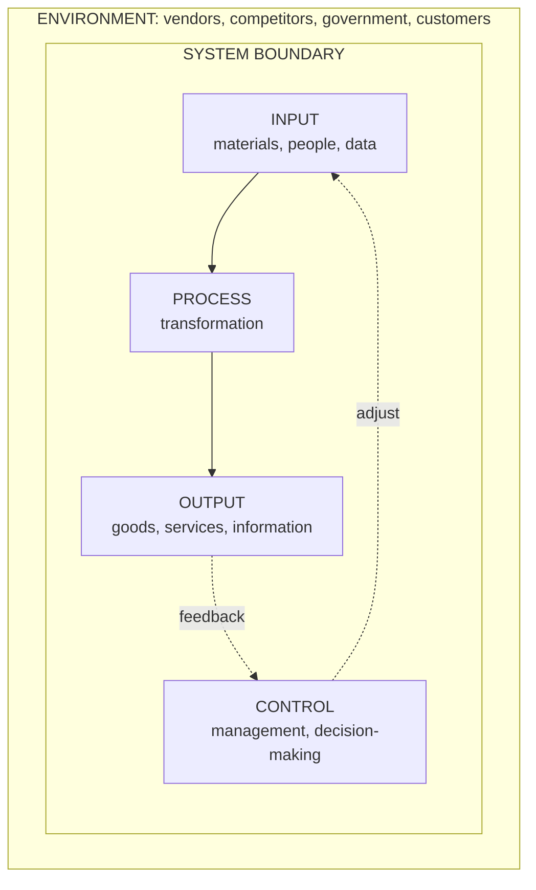

## Why Start With "What Is a System?"

Systems Analysis and Design (SAD) is the process of **examining a business situation with the intent of improving it** through better procedures and methods. Before you can analyse or design anything, you need a precise understanding of the thing you are analysing — the **system** itself.

System development has two major components:

| Component | Question it answers | What it involves |
|---|---|---|
| **Systems Analysis** | *What* should the system do? | Gathering and interpreting facts, diagnosing problems, and using that information to recommend improvements |
| **Systems Design** | *How* will the system do it? | Planning a new system, or replacing or complementing an existing one |

> **Memory line:** *Analysis specifies WHAT the system should do. Design states HOW to accomplish the objectives.*

Design cannot start until the analyst thoroughly understands the existing system and has decided how computers can best be used to make its operation more effective.

---

## Defining a System

The word *system* comes from the Greek **systema**, meaning *an organised relationship among functioning units or components*. We meet systems every day: the transportation system, the communication system, the accounting system, the production system, the economic system and, of course, the computer system.

The lecture notes give three complementary definitions — know at least one word-for-word:

1. A system is **a combination of interrelated and interdependent elements, or sub-systems**, organised in such a way as to ensure the efficient functioning of the whole, which requires a high degree of co-ordination between the sub-systems, each designed to achieve a specific purpose.
2. A system is **the detailed plan of management** for the interrelationship and interaction of available resources to accomplish a given task.
3. A system is **a group of interrelated components working together toward a common goal by accepting inputs and producing outputs in an organised transformation process.**

Every system therefore has these basic interacting functions: **Input, Processing, Output, Feedback and Control.**

<Analogy>
Your INS 204 class is a system. The **components** are the lecturer, the students, the textbooks and the lecture hall. The **input** is knowledge from the lecturer and materials; the **process** is teaching and studying; the **output** is students who can analyse and design systems; **feedback** comes from tests and CA scores; and **control** is the lecturer or department adjusting the teaching when scores are poor. Remove any component and the goal (learning) becomes hard to achieve.
</Analogy>

A **business** is also a system. It uses resources such as people, capital, materials and facilities to achieve the goal of making a profit. Business procedures — order handling, marketing research, financial planning, manufacturing — are the interactions that must be managed to achieve that goal.

---

## The Six Elements of a System

To reconstruct (analyse and redesign) any system, the analyst must consider six key elements. Tap through the diagram, then read the detail below it.

<FlowDiagram title="The elements of a system" cycle>
<FlowStep title="Inputs">
Inputs are the **elements that enter the system for processing**: materials, human resources and information. A bank's teller system takes in deposit slips, cash and customer details as inputs.
</FlowStep>
<FlowStep title="Process">
The **operational component** — the actual transformation of input into output. As the output specification changes, the processing changes too. In a payroll system, the process computes gross pay, deductions and net pay.
</FlowStep>
<FlowStep title="Outputs">
The **outcome of processing** — goods, services or information that must have value to the user and meet the user's expectations. Determining the output comes **first**: it tells you the nature, amount and regularity of input needed.
</FlowStep>
<FlowStep title="Feedback">
Output is **measured against a standard** and the result is fed back to the input and/or to management. Feedback can be **positive** (reinforces performance; routine) or **negative** (gives the controller information for action).
</FlowStep>
<FlowStep title="Control">
The **decision-making subsystem** that monitors feedback and guides input, processing and output towards the goal. In an organisation this is management; in a computer it is the control unit and operating system; in a human it is the brain.
</FlowStep>
</FlowDiagram>

The **environment** and **boundaries/interface** surround all five of these, so they are treated separately below.

### 1. Outputs and Inputs

A major objective of any system is to **produce an output that has value to its user**. Whatever the nature of the output (goods, services or information), it must be in line with the expectations of the intended user.

- **Inputs** — the elements (material, human resources and information) that **enter the system** for processing.
- **Output** — the **outcome of processing**.

A system feeds on input to produce output in the same way that a business brings in human, financial and material resources to produce goods and services.

<ExamTip>
A favourite short-answer point: **"Determining the output is the first step in specifying the nature, amount and regularity of the input needed to operate a system."** Analysts design backwards — decide what the users need out of the system, then work out what must go in.
</ExamTip>

### 2. Process

The process is the element that involves **the actual transformation of input into output**. It is the **operational component** of a system.

- Processors may modify the input **totally or partially**, depending on the output specification.
- As the output specification changes, **so does the processing**.
- In some cases, the input itself is modified so that the processor can handle the transformation.

### 3. Control

Control involves **monitoring and evaluating feedback** to determine whether the system is moving towards its goal. Every system has a control unit to guide it:

| System | Its control element |
|---|---|
| Human body | The brain |
| Computer system | The control unit (plus the operating system and software) |
| Organisation | Management — the decision-making body |

Control is the **decision-making subsystem** that governs the pattern of activities in input, processing and output. In an organisation, management controls the inflow, handling and outflow of activities that affect the welfare of the business.

Two practical implications for the analyst:
- **Output specifications determine what and how much input is needed** to keep the system in balance.
- **Management support is essential.** The attitude of the person who controls the area where a computer is being introduced can make the difference between the success and failure of the installation.

### 4. Feedback

Feedback is information about **performance** — suggestions, complaints and remarks about how the system is doing. **Control in a dynamic system is achieved by feedback.**

Feedback measures **output against a standard** using a cybernetic procedure (communication plus control). Output information is fed back to the input and/or to management for deliberation. After comparison with performance standards, changes may be made to the input or processing — and consequently to the output.

| Type of feedback | Meaning |
|---|---|
| **Positive feedback** | Reinforces the performance of the system; routine in nature |
| **Negative feedback** | Gives the controller information for **action** (something must change) |

Feedback matters to the analyst at two moments:
1. **During analysis** — users may confirm that problems in the current application justify the need for change.
2. **After implementation** — users report how the new system performs, which often leads to **enhancements**.

### 5. Environment

The environment is the **"supra-system"** within which an organisation operates. It is **whatever lies outside the boundaries of the system but interacts with it**, and it often determines how a system must function.

- The nervous system exists within the body and cannot survive outside it — the body is its environment.
- A business's environment includes **vendors, competitors, government and customers**. These provide constraints that influence the business's actual performance.

### 6. Boundaries and Interface

A system is defined by its **boundaries** — the limits that identify its components, processes and interrelationships when it interfaces with another system. Each system's boundary determines its **sphere of influence and control**.

**Example:** a bank **teller system** is restricted to deposits, withdrawals and related activities on customers' current and savings accounts. It **excludes** mortgage foreclosures, trust activities and so on — those belong to other systems.

The boundary (the **scope** of the system) serves **three purposes**:
1. It **encloses** the system's activities.
2. It **demarcates** the system from other systems in the external environment.
3. It **reflects** the system's objectives.

The **interface** is where one system meets another and exchanges inputs and outputs across its boundary.

---

## Types (Classes) of Systems

Systems can be classified in six pairs or groups. Use the tabs to study each one.

<Tabs>
<Tab label="Open vs Closed">

**Closed system** — does **not** interact with its environment. It is isolated and completely self-contained. This is of **theoretical interest only**, because real systems show different degrees of openness.

**Open system** — **interacts** with its environment, exchanging inputs and outputs with it. This regular interaction makes open systems harder to study (Checkland, 1981).

A system can be *open* with regard to some entities and processes but *closed* with respect to others. A business is an open system: it buys from suppliers, sells to customers and must obey government regulation.

</Tab>
<Tab label="Deterministic / Probabilistic / Random">

**Deterministic** — outputs are **certain**. Relationships between components are fully known, so given an input the output is fully predictable. *Example:* the **common entrance examination** for entry into secondary school — all entities and their interrelationships are known.

**Probabilistic** — output is predictable only according to **probability values**. *Example:* the **portfolio investment system** of an asset management company investing in the stock market.

**Random** — completely **unpredictable**. You do not know the components or their relationships, so the output is random. *Example:* the **transport system** — given an input, you cannot be sure of the output.

</Tab>
<Tab label="Human / Machine">

**Human system** — humans are the components. It is an **open** system with **probabilistic** behaviour. *Example:* a department within an organisation.

**Machine system** — composed entirely of machines and machine subsystems. It is **deterministic** and relatively **closed**. *Example:* a **fire alarm system**.

**Human–machine system** — consists of both. **Information systems are human–machine systems.** They are **deterministic in delivery but probabilistic in interpretation**: the computer reliably produces the same report, but people may interpret and act on it differently.

</Tab>
<Tab label="Abstract / Concrete">

**Abstract system** — an **ordered arrangement of concepts**. It can be **procedural** or **conceptual** (e.g., a theory, a set of rules, an organisation chart as an idea).

**Concrete system** — a system in which **at least two components are objects**. Concrete systems can be **physical** (a computer network) or **social** (a club with members).

</Tab>
<Tab label="Adaptive / Non-adaptive">

**Adaptive system** — **modifies itself** when its environment changes. *Example:* a **democratic system of government**, which changes to accommodate changes in the environment.

**Non-adaptive system** — does **not** react to changes in its environment. *Example:* an **autocratic system of governance**.

</Tab>
<Tab label="Simple / Complex">

**Simple system** — **few** interrelated entities. *Example:* a **bicycle**.

**Complex system** — **many** components with many interrelations. *Example:* a **motorcycle** — it has many entities and subsystems (engine, electrics, fuel system), and each subsystem can itself be viewed as a simple system.

</Tab>
</Tabs>

### Summary table of system types

| Classification | Type | Key idea | Example from the notes |
|---|---|---|---|
| Interaction with environment | Closed | No interaction; theoretical | — |
| | Open | Exchanges inputs/outputs with environment | A business |
| Predictability | Deterministic | Output certain | Common entrance exam |
| | Probabilistic | Output predictable by probability | Stock-market portfolio |
| | Random | Output unpredictable | Transport system |
| Composition | Human | People; open, probabilistic | A department |
| | Machine | Machines; deterministic, closed | Fire alarm |
| | Human–machine | Both | Information system |
| Nature | Abstract | Ordered concepts | Procedural/conceptual models |
| | Concrete | At least two objects | Physical or social systems |
| Response to change | Adaptive | Modifies itself | Democracy |
| | Non-adaptive | Does not change | Autocracy |
| Complexity | Simple | Few entities | Bicycle |
| | Complex | Many entities & interrelations | Motorcycle |

---

## Three Implications of the Systems Concept

We talk of a business as a system of interrelated departments (subsystems) — production, sales, personnel and an information system. Studying systems concepts has **three basic implications**:

1. A system must be designed to achieve a **predetermined objective**.
2. **Interrelationships and interdependence** must exist among the components.
3. The **objectives of the organisation as a whole have a higher priority** than the objectives of its subsystems.

<Analogy>
In a football team, a striker's personal goal might be to score a hat-trick, but the team's objective — winning the match — comes first. A striker who refuses to pass just to protect a personal record is a subsystem putting its own objective above the system's. Implication 3 says the whole always wins.
</Analogy>

---

## Five Characteristics of Every System

Every system has **organisation, interaction, interdependence, integration and a central objective.** A handy mnemonic: **"O-I-I-I-C"** — *Order, Interaction, Interdependence, Integration, Central objective.*

| Characteristic | Meaning | Illustration |
|---|---|---|
| **Organisation (order)** | Structure and order — the arrangement of components that helps achieve objectives | An organisation chart showing who reports to whom |
| **Interaction** | The manner in which each component functions with other components | The purchasing unit must interact with production, which interacts with sales |
| **Interdependence** | Parts depend on one another; they are coordinated and linked according to a plan. **No subsystem can function in isolation** — it needs inputs from other subsystems | Payroll depends on attendance data from HR |
| **Integration** | The **holism** of systems — how the system is tied together. Parts work together even though each has a unique function. Successful integration produces a **synergistic effect** (the whole achieves more than the parts separately) | A registration portal that links bursary, departments and exams |
| **Central objective** | The goal of the system. Objectives may be **real or stated** — organisations sometimes state one objective and pursue another | "Improve customer service" may really mean "cut staff costs" |

The central objective deserves attention. **Users must know the central objective of a computer application early in the analysis** for successful design and conversion. Political and organisational considerations often cloud the real objective, so the analyst must work around such obstacles to identify it.

<ExamTip>
Students often confuse **interaction** with **interdependence**. *Interaction* is about **how** components work with each other (the manner). *Interdependence* is about **needing** each other — a component cannot function without inputs from others. *Integration* is about the system being **tied together as a whole**.
</ExamTip>

---

## Putting It Together: A Worked Example

**Scenario:** A university's **course registration system**.

| Element / idea | Applied to course registration |
|---|---|
| Input | Student matric number, selected courses, evidence of fee payment |
| Process | Check fee status, check course prerequisites and clashes, check class capacity, record registration |
| Output | Course registration form, class lists for lecturers, exam eligibility list |
| Feedback | Complaints about clashes; number of failed registrations each day |
| Control | Academic office/registry adjusting rules (e.g., extending the deadline) |
| Environment | NUC regulations, students, lecturers, the bank that processes fees |
| Boundary | Covers registration only — **not** hostel allocation or exam grading |
| Type | Open, human–machine, adaptive, complex |
| Central objective | Every eligible student correctly registered for the right courses before the deadline |

---

## Practice Questions

<Reveal question="Define a system and list its five basic interacting functions.">
A system is a group of interrelated components working together toward a common goal by accepting inputs and producing outputs in an organised transformation process. Its five basic functions are **Input, Processing, Output, Feedback and Control**.
</Reveal>

<Reveal question="State the three purposes served by a system's boundary.">
The boundary (1) **encloses** the system's activities, (2) **demarcates** the system from other systems in the external environment, and (3) **reflects** the system's objectives.
</Reveal>

<Reveal question="Why is an information system described as 'deterministic in delivery but probabilistic in interpretation'?">
Because it is a **human–machine system**. The machine part delivers outputs predictably (the same input always yields the same report), but the human part — the people reading and acting on that output — may interpret it in different ways, so the eventual outcome is probabilistic.
</Reveal>

<Reveal question="Distinguish between positive and negative feedback, giving the role of each.">
**Positive feedback** reinforces the performance of the system and is routine in nature — it says "keep going". **Negative feedback** provides the controller with information for **action** — it signals that input or processing must be changed to bring output back to the standard.
</Reveal>

<Reveal question="Classify a traffic-light controller at a junction using the system types in this lesson.">
It is a **machine** system, largely **deterministic** (fixed timing produces predictable light changes), relatively **closed**, and **simple** compared with a whole transport network. If it uses sensors to adjust timing to traffic, it becomes **adaptive** and more **open**.
</Reveal>

<Takeaway>
A system is a set of interrelated, interdependent components that accept **inputs**, **process** them into **outputs**, and use **feedback** and **control** to stay on course — all within a **boundary** that separates it from its **environment**. Systems are classified as open/closed, deterministic/probabilistic/random, human/machine/human–machine, abstract/concrete, adaptive/non-adaptive and simple/complex. Every system shows **organisation, interaction, interdependence, integration and a central objective** — and the whole system's objective always outranks its subsystems' objectives.
</Takeaway>

## Exam Tips

**What lecturers test:**
- Definitions of *system*, *systems analysis* and *systems design* (analysis = what, design = how)
- Listing and explaining the six elements of a system with examples
- The types of systems with the **specific examples from the notes** (common entrance exam, fire alarm, democracy vs autocracy, bicycle vs motorcycle)
- The five characteristics of a system

**Common mistakes:**
- Saying a closed system is common in practice — it is of **theoretical interest only**
- Mixing up *environment* (outside the boundary but interacting) with *boundary* (the limit/scope)
- Forgetting that **output is determined first** when specifying a system

**Likely question:**
> "With the aid of a diagram, explain the elements of a system. Classify an information system using the system types you know, and justify each classification." (15 marks)
