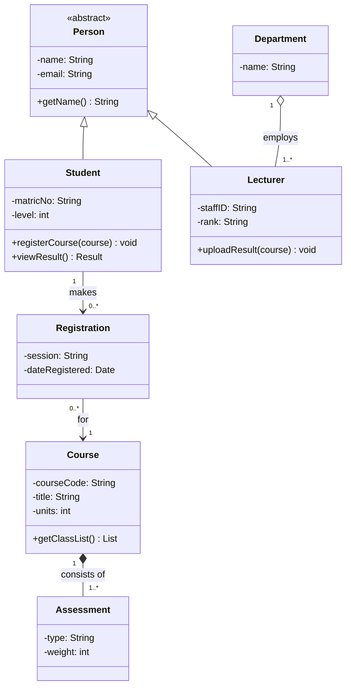
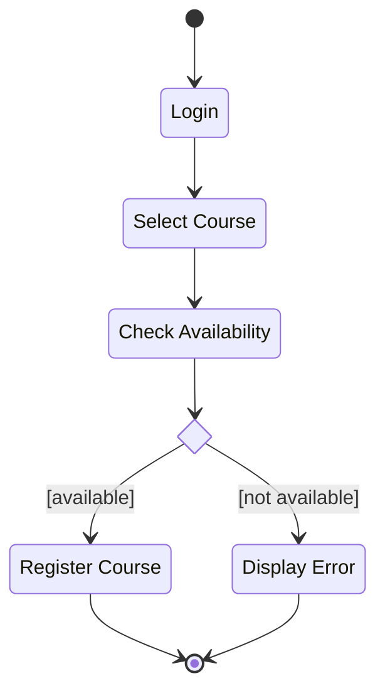
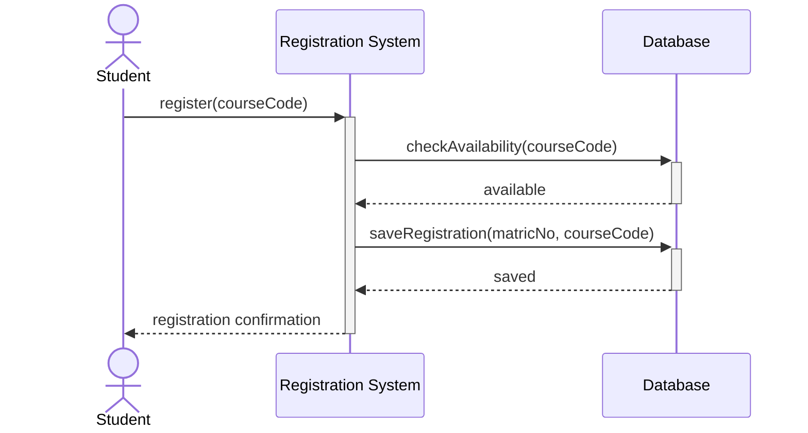
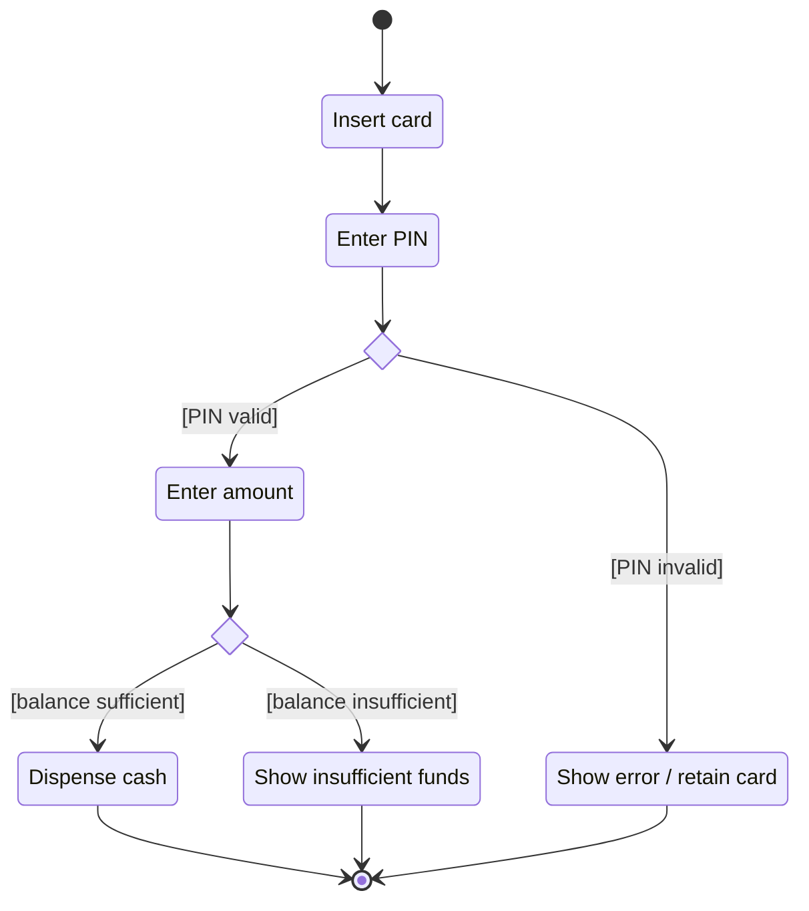

## What Is UML?

> **UML (Unified Modeling Language)** is a **standardised visual language used to visualise, specify, construct and document software systems.**

- The specification is published by the **Object Management Group (OMG)**; **UML 2.5.1** is a formal version of the specification.
- UML is **not a programming language or a method** — it is a **notation**. It helps analysts and developers **communicate requirements, structure and behaviour** before and during implementation.

Your course focuses on **four** UML diagrams. Learn the one-line purpose of each first:

| Diagram | Main question | Focus |
|---|---|---|
| **Use case** | **Who** does **what**? | Functional requirements and actors |
| **Class** | **What** is the system **made of**? | Static structure |
| **Activity** | **How** does the process **flow**? | Workflow and decisions |
| **Sequence** | **Who** communicates with **whom**, and **when**? | Messages over time |

<ExamTip>
The lecturer's **memory guide**: **USE CASE = WHO does WHAT? · CLASS = WHAT is the system made of? · ACTIVITY = HOW does the process FLOW? · SEQUENCE = WHO communicates with WHOM and WHEN?** An objective question matching diagrams to purposes is very likely.
</ExamTip>

---

## 1. Use Case Diagrams

A **use case diagram** models the **functional interaction between external actors and the system**. It answers: **WHO uses the system, and WHAT can they do?**

*Figure: Use case diagram for the University Course Registration System.*

### Elements of a Use Case Diagram

| Element | Symbol | Meaning |
|---|---|---|
| **Actor** | Stick figure | An **external entity** that interacts with the system — a **person, another system or a device** |
| **Use case** | Oval | A **service or function** the system provides (verb + noun: "Register Course") |
| **System boundary** | Rectangle around the use cases | Shows what is **inside** the system |
| **Association** | Solid line | Communication between an **actor and a use case** |
| **Include** | Dashed arrow labelled «include» | A **required/common behaviour** reused by another use case |
| **Extend** | Dashed arrow labelled «extend» | **Optional or conditional** behaviour that extends a base use case |

### Include vs Extend

<Tabs>
<Tab label="«include»">

The base use case **always** performs the included behaviour. The arrow points **from the base use case to the included one**.

*Every* course registration must check prerequisites, so: **Register Course → «include» → Check Prerequisites**.

Use «include» to **avoid repeating** a common step that several use cases need (e.g., many use cases might include "Verify Payment").

</Tab>
<Tab label="«extend»">

The extending use case adds behaviour **only under certain conditions**. The arrow points **from the extension to the base use case**.

Only students who register **after the deadline** pay a late fee, so: **Pay Late Registration Fee → «extend» → Register Course**.

The base use case is complete on its own; the extension is optional.

</Tab>
</Tabs>

<Analogy>
Buying food at a restaurant **includes** paying — you can't complete the order without it. Adding extra meat **extends** the order — only some customers do it, and the order is complete without it.
</Analogy>

---

## 2. Class Diagrams

A **class diagram** represents the **static structure** of a system — its **classes, attributes, operations and relationships**. It does not show order or timing.

### Visibility Notation

| Symbol | Visibility | Meaning |
|---|---|---|
| `+` | Public | Accessible from any class |
| `-` | Private | Accessible only within the class |
| `#` | Protected | Accessible within the class and its subclasses |
| `~` | Package | Accessible within the same package |

### Class Relationships

| Relationship | Notation | Meaning | Example |
|---|---|---|---|
| **Association** | Plain line (arrow optional) | A general relationship between classes | Student *registers for* Course |
| **Generalisation (inheritance)** | Line with a **hollow triangle** pointing to the parent | **IS-A** relationship | Student IS-A Person |
| **Aggregation** | Line with a **hollow diamond** at the whole | **Weak** whole–part: **parts can exist independently** | Department — Lecturers (a lecturer still exists if the department is dissolved) |
| **Composition** | Line with a **filled diamond** at the whole | **Strong** whole–part: the **part's life cycle is tied to the whole** | Building — Rooms (delete the building and its rooms go with it) |

**Multiplicity** is written at each end of a line: `1` (exactly one), `0..1` (zero or one), `*` or `0..*` (zero or more), `1..*` (one or more). Relationships can be **unary, binary, ternary or n-ary**, as in ER modelling.

**Reading the diagram:** Student and Lecturer **inherit** from the abstract class Person (hollow triangles). A Student makes **zero or more** Registrations, each for **exactly one** Course. A Department **aggregates** one or more Lecturers (hollow diamond — lecturers can exist without it). A Course is **composed of** Assessments (filled diamond — delete the course and its assessments go too).

<ExamTip>
**Hollow diamond = aggregation (weak, parts survive). Filled diamond = composition (strong, parts die with the whole).** Both diamonds sit at the **whole** end of the line. This pair is one of the most frequently tested UML facts.
</ExamTip>

---

## 3. Activity Diagrams

An **activity diagram** models a **workflow or flow of activities**. It is useful for showing the **steps, decisions and alternative paths** in a process.

| Element | Symbol | Meaning |
|---|---|---|
| **Initial node** | Filled black circle | Starting point |
| **Action / activity** | Rounded rectangle | A task or operation |
| **Decision node** | Diamond | A condition (guard in [brackets]) selects a path |
| **Control flow** | Arrow | Direction of flow |
| **Final node** | Bullseye (circle with a dot) | End of the activity |

**Example — Course Registration:** Start → Login → Select Course → Check Availability → [Available?] → Register Course **or** Display Error → End.

*The filled circle is the initial node, the small diamond is the decision node, and the circled dot is the final node.*

---

## 4. Sequence Diagrams

A **sequence diagram** shows how **actors and objects communicate through messages in time order**. It answers: **WHO communicates with WHOM, WHAT message is sent, and WHEN?** Time runs **down the page**.

| Element | Meaning |
|---|---|
| **Actor / object** | A participant in the interaction (boxes along the top) |
| **Lifeline** | **Vertical dashed line** representing the participant over time |
| **Message** | An arrow from one participant to another (solid = call; dashed = return) |
| **Activation** | A thin rectangle on a lifeline — the period during which the participant is **executing** an operation |

**Example:** the student requests registration; the system validates it against the database and stores it; the system returns a confirmation.

---

## Putting the Four Together

<FlowDiagram title="One system, four views">
<FlowStep title="Use case">
**Student** can *Login*, *Register Course* and *View Result*; **Lecturer** can *Upload Result*; **Administrator** can *Manage Courses*. → the system's **functions**.
</FlowStep>
<FlowStep title="Class">
**Person, Student, Lecturer, Course, Registration, Department** with their attributes, methods and relationships. → the system's **structure**.
</FlowStep>
<FlowStep title="Activity">
Login → Select Course → Check Availability → [available?] → Register or Display Error. → the **workflow** of one use case.
</FlowStep>
<FlowStep title="Sequence">
Student → Registration System → Database → Registration System → Student. → the **messages** that realise that workflow over time.
</FlowStep>
</FlowDiagram>

| Diagram | Static or dynamic? | Shows order? | Shows classes? | Shows actors? |
|---|---|---|---|---|
| Use case | Dynamic (behavioural) | No | No | **Yes** |
| Class | **Static** (structural) | No | **Yes** | No |
| Activity | Dynamic | **Yes** (flow) | No | Optional (swimlanes) |
| Sequence | Dynamic | **Yes** (time) | Objects | **Yes** |

---

## Practice Questions

<Reveal question="Draw a use case diagram for a Library Management System with Student and Librarian actors.">
**Actors:** Student, Librarian. **Use cases inside the boundary:** Search Catalogue, Borrow Book, Return Book, Reserve Book (Student); Add Book, Issue Book, Manage Members (Librarian); Login (both). **Relationships:** Borrow Book «include» Check Membership Status; Pay Fine «extend» Return Book (only when the book is overdue). Remember stick-figure actors **outside** the boundary, ovals **inside**, solid lines for associations and dashed «include»/«extend» arrows.
</Reveal>

<Reveal question="Draw an activity diagram for ATM cash withdrawal with at least one decision point.">

</Reveal>

<Reveal question="Distinguish aggregation from composition with one example each.">
**Aggregation** is a weak whole–part relationship in which parts **can exist independently** of the whole — e.g., a Team and its Players (players still exist if the team is disbanded). It is drawn with a **hollow diamond**. **Composition** is a strong whole–part relationship in which the part's **life cycle is tied to the whole** — e.g., an Order and its Order Lines (delete the order and its lines disappear). It is drawn with a **filled diamond**.
</Reveal>

<Reveal question="What is a lifeline and what is an activation in a sequence diagram?">
A **lifeline** is the vertical **dashed line** below a participant, representing that participant's existence over time. An **activation** is the thin rectangle on a lifeline showing the period during which the participant is **executing an operation**.
</Reveal>

<Reveal question="Which UML diagram would you use to show (a) what each type of user can do, (b) the order of messages when paying fees online, (c) the classes in a hotel system, (d) the steps in approving a leave request?">
(a) **Use case diagram**; (b) **sequence diagram**; (c) **class diagram**; (d) **activity diagram**.
</Reveal>

<Takeaway>
**UML** (OMG, version 2.5.1) is a standard visual notation for specifying and documenting software. The **use case diagram** shows **who does what** — actors, use cases, the system boundary, associations, «include» (always) and «extend» (conditional). The **class diagram** shows **static structure** — classes with visibility (+ − # ~), associations, generalisation (hollow triangle, IS-A), aggregation (hollow diamond), composition (filled diamond) and multiplicity. The **activity diagram** shows **workflow** — initial node, actions, decisions with guards, final node. The **sequence diagram** shows **messages over time** — participants, lifelines, messages and activations.
</Takeaway>

## Exam Tips

**What lecturers test:**
- Draw each of the four diagrams for a scenario (library, ATM, hospital, registration)
- Elements of each diagram and their symbols
- «include» vs «extend»; aggregation vs composition
- Visibility symbols and multiplicity
- Match diagrams to their purpose (objective questions)

**Common mistakes:**
- Drawing actors **inside** the system boundary
- Reversing the «include»/«extend» arrow directions
- Putting the diamond at the **part** end — it belongs at the **whole** end
- Using a sequence diagram to show decisions only — that's an activity diagram's job

**Likely question:**
> "For an online hostel allocation system, draw (a) a use case diagram with at least two actors and five use cases, and (b) a sequence diagram showing a student applying for a room." (20 marks)
