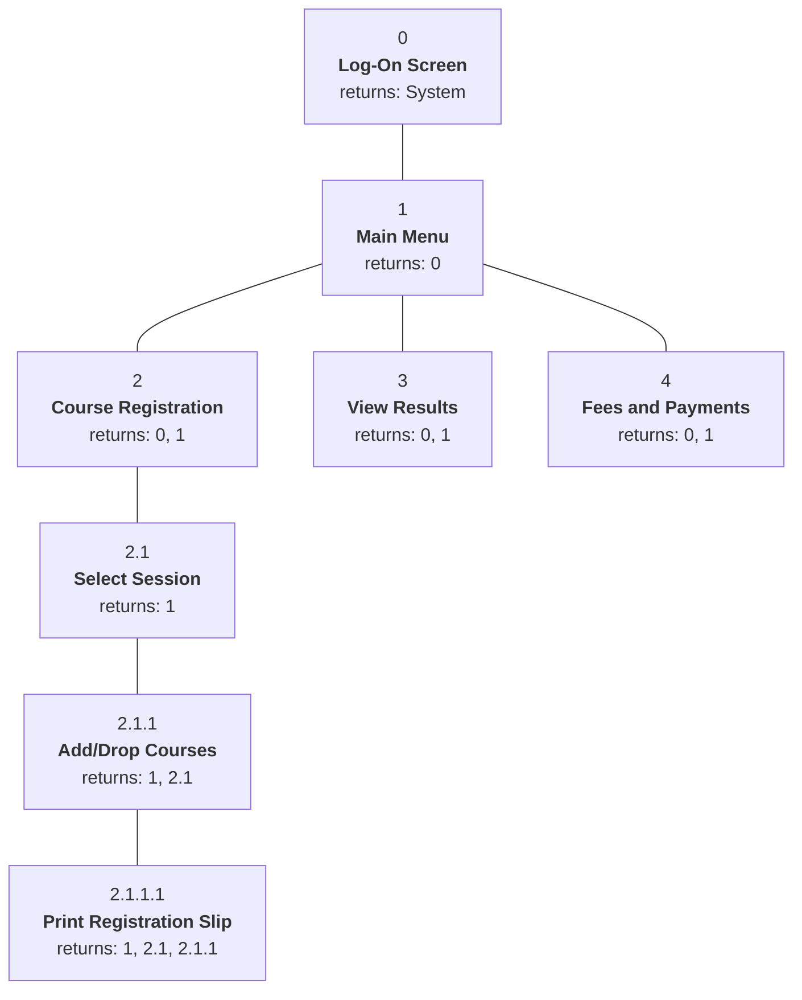

## What Is Interface and Dialogue Design?

> **Interface and dialogue design** focuses on **how information is provided to and captured from users.**

A **dialogue** is like a **conversation between two people**: the user says something (clicks, types), the system replies (displays, asks). The "grammar" both follow is the **human–computer interface**. A good interface provides a **uniform structure for finding, viewing and invoking** the different parts of a system.

Like forms and reports (Topic 14), interfaces are designed by **prototyping**: collect information (who, what, when, where, how many?), build a prototype, **assess usability**, refine.

<Analogy>
Using a well-designed interface is like being served by a good bank teller: they greet you (status), ask clear questions ("Which account — savings or current?" — prompts), tell you politely when something is wrong and how to fix it (error messages), and never lose your place in the queue if you step aside to fill a form (navigation). A bad teller mumbles codes and makes you start again. Interface design makes the system the good teller.
</Analogy>

---

## Types of User Interface

*(Commonly examined background — not all appear in your textbook chapter.)*

| Interface type | How the user interacts | Strength | Weakness | Example |
|---|---|---|---|---|
| **Command-line** | Types commands | Fast and powerful for experts | Hard to learn; must memorise commands | Windows Command Prompt, Linux terminal |
| **Menu-driven** | Chooses from lists of options | Easy for novices; little typing | Slow for experts; deep menus | ATM menus, USSD codes (*123#) |
| **Form-based (fill-in)** | Fills fields on a screen form | Natural for data entry | Needs good validation | Online registration form |
| **Graphical (GUI) / direct manipulation** | Windows, icons, menus, pointer (WIMP) | Intuitive, visual | Needs more screen space and resources | Windows, macOS, most apps |
| **Natural language / voice** | Speaks or types ordinary sentences | No training needed | Ambiguity; recognition errors | Voice assistants, chatbots |
| **Touch / gesture** | Taps, swipes, pinches | Direct and fast on mobile | Small targets, no hover | Smartphone apps |

---

## The Design Specification

The deliverable is a **design specification** — the same three sections as for forms and reports **plus one more**: the **dialogue sequence**.

<Step step="1" title="Narrative overview">
Interface/dialogue name; **user**, **task**, **system** and **environmental** characteristics.
</Step>

<Step step="2" title="Interface/dialogue designs">
Form/report designs **and dialogue sequence diagram(s)** with a narrative description — *this is the extra section*.
</Step>

<Step step="3" title="Testing and usability assessment">
Testing objectives, procedures and results, measured on five usability criteria: **time to learn, speed of performance, rate of errors, retention over time, and user satisfaction**.
</Step>

---

## Designing Layouts

- **Use standard formats** similar to the **paper forms** users already know, to ease training and data recording. Most forms have common areas: **header**, **sequence and time information**, **instructions**, **body (data details)**, **totals**, **authorisation/signatures** and **comments**.
- **Navigation between fields** should flow **left-to-right, top-to-bottom**, like a paper form.
- **Group related fields** into logical, labelled categories; make non-entry areas inaccessible.
- **Flexibility and consistency:** users should move **freely forward and backward**, and every form should be navigated the same way.
- **Don't save permanently until the user asks** — so users can abandon, back up or move on without damaging stored data.
- **Assign each key or command only one function**, consistently across the whole system.

**Usability checklist for an interface (Dumas, 1988):**

| Capability | Users should be able to… |
|---|---|
| **Cursor control** | Move to the next/previous field, to the first/last field, and forward/backward one character |
| **Editing** | Delete the character left of or under the cursor, delete a whole field, clear the whole form |
| **Exit** | Submit the screen, move to another screen, confirm saving before leaving |
| **Help** | Get help on a field and on a whole screen |

---

## Providing Feedback

Not giving feedback is **a sure way to frustrate and confuse** users. There are three types:

<Tabs>
<Tab label="Status information">

Keep users informed of what is going on: the **current customer name or time**, **titles** on screens, **"Screen 1 of 3"**, and — for operations longer than a second or two — messages like **"Please wait… generating your transcript"** or a progress bar. Confirm that input was **accepted** and **in the correct form**. Status information reassures users and makes them feel **in command**.

</Tab>
<Tab label="Prompting cues">

Be **specific** in what you ask for, with an example, default or format.

❌ `READY FOR INPUT: ______`

✅ `Enter your matric number (6 digits, e.g. 245678): ______`

</Tab>
<Tab label="Error & warning messages">

Make messages **specific**, free of **error codes and jargon**, **never scolding**, and **guide the user to a solution**. Use the **user's terms**, not the computer's ("end of file", "disk I/O error"). Keep messages in the **same format and place** every time.

| Poor message | Improved message |
|---|---|
| ERROR 56 OPENING FILE | The file name you typed was not found. Press F2 to list valid file names. |
| WRONG CHOICE | Please enter an option from the menu. |
| DATA ENTRY ERROR | The value you entered is outside the acceptable range. Press F9 for a list of acceptable values. |
| FILE CREATION ERROR | A file with that name already exists. Press F10 to overwrite it, or F2 to save with a new name. |

</Tab>
</Tabs>

---

## Providing Help: the SOS Guidelines

A user who asks for help is like **a ship in distress sending an SOS**. Design help with **SOS**:

| Guideline | Meaning |
|---|---|
| **S**implify | Short, simple wording, common spelling, complete sentences — only what users need, with a way to find more |
| **O**rganize | Use **lists** to break information into manageable pieces |
| **S**how | Provide **examples** of proper use and the outcomes |

**Types of help:** help on help, concepts, procedures, messages, menus, function keys, commands and words. Help can be at the **system**, **screen/form** and **field** level — field-level help is **context-sensitive help**. After help, **always return users to where they were**. Hypertext-based help is now standard because it **standardises help across applications** and lets users choose the **level of detail** they need.

---

## Designing Dialogues

> A **dialogue** is **the sequence in which information is displayed to and obtained from a user**. **Dialogue design** is the process of designing those sequences.

<FlowDiagram title="Dialogue design process" cycle>
<FlowStep title="Design the sequence">
Understand the user, task, technology and environment, then define the sequence of displays — e.g., request customer information → specify customer → select YTD summary → review → leave.
</FlowStep>
<FlowStep title="Build a prototype">
Create prototype displays (e.g., with a GUI builder or "demo builder") that users can click through as if using the real system.
</FlowStep>
<FlowStep title="Assess usability">
Test with users — time to learn, speed, errors, retention, satisfaction — then refine.
</FlowStep>
</FlowDiagram>

### Eight Guidelines for Human–Computer Dialogues

*(Based on Shneiderman et al.)* The **primary guideline is consistency**.

| Guideline | Explanation and example |
|---|---|
| **Consistency** | Same sequence of actions, keystrokes and terminology; the same labels for the same operations and the same location for the same information on every screen |
| **Shortcuts and sequence** | Let advanced users take **shortcuts** (Ctrl+C); follow a **natural sequence** (first name before surname) |
| **Feedback** | Give feedback for **every** action — confirm "Record saved", don't just show a blank form |
| **Closure** | Dialogues have a **beginning, middle and end**; the last screen shows there are no more |
| **Error handling** | Detect and report all errors with suggestions to fix them; accept **synonyms** (t, T or TRUE) |
| **Reversal** | Let users **undo**; never delete data **without confirmation** — show the record before deleting it. For rare, permanent actions use **double confirmation** |
| **Control** | Make users (especially experts) feel **in control** — e.g., consistent, acceptable response times |
| **Ease** | Simple ways to enter information and move forward, backward and to specific screens (first, last) |

<ExamTip>
Memorise the eight with **"C-S-F-C-E-R-C-E"** — *Consistency, Shortcuts, Feedback, Closure, Error handling, Reversal, Control, Ease*. If asked for "guidelines for dialogue design", **consistency** should come first — the textbook calls it the primary guideline.
</ExamTip>

### Dialogue Diagramming

> **Dialogue diagramming** is a formal method for designing and representing human–computer dialogues using **box-and-line diagrams**.

It has **only one symbol** — a **box with three sections**, each box representing **one display** (screen, form or window):

| Section | Contains |
|---|---|
| **Top** | A **unique display reference number** |
| **Middle** | The **name or description** of the display |
| **Bottom** | The **reference numbers of displays that can be reached** from this one |

Lines between boxes are **bidirectional** (no arrowheads) — users can always move forward and back. Use an arrowhead only for a one-way flow. Dialogue diagrams show three concepts: **sequence** (one display after another), **selection** (choosing one display among several — e.g., a menu) and **iteration** (repeating a display — e.g., entering several records).

**Example — Student Portal (in the style of the textbook's Customer Information System):**

Reading it: after **log-on (0)**, the **main menu (1)** offers a **selection** of displays 2, 3 and 4. Course registration then proceeds in **sequence** 2 → 2.1 → 2.1.1 → 2.1.1.1, and Add/Drop Courses (2.1.1) is used **iteratively** as the student adds several courses. The bottom line of each box lists where the user can jump back to.

---

## Web Interface Design

Web interfaces need extra care: many sites are built without UI expertise, browsers limit interactivity, and many links give no click feedback.

<Tabs>
<Tab label="Interface & dialogue errors">

| Error | Recommendation |
|---|---|
| Opening new browser windows | Avoid unless clearly marked — users get lost and "back" stops working |
| Breaking or slowing the Back button | Users must be able to return to previous pages |
| Complex URLs | Keep URLs short and meaningful |
| Orphan pages | Every page should have a "parent" users can return to |
| Navigation below the fold | Keep navigation links visible where the page opens |
| Lack of navigation support | Provide expected elements (e.g., logo linking home) in consistent places |
| Hidden or uninformative links | Use standard link colours; make link text say where it goes |
| Buttons with no click feedback | Buttons must visibly respond when clicked |

</Tab>
<Tab label="Page layout errors">

| Error | Recommendation |
|---|---|
| Non-standard use of GUI widgets | Radio buttons select; they shouldn't also trigger actions |
| Anything that looks like advertising | Users ignore banner-like content — don't style real information that way |
| Bleeding-edge technology | Don't require the newest browser or plug-ins |
| Scrolling text and looping animations | Hard to read and look like adverts |
| Non-standard link colours | Confuse users about what is a link or visited |
| Outdated information | Keep content current to stay credible |
| Slow downloads | Avoid large or many images — use **lightweight graphics** |
| Fixed-format text / long lists | Avoid horizontal scrolling; paginate long lists |

</Tab>
<Tab label="Good practice">

- **Menu-driven navigation** — menus stay in the **same place on every page**.
- **Cookie crumbs (breadcrumbs)** — a trail of links showing where the user is and has been: *Home → Courses → INS 204 → Topic 15*. They let users jump back quickly and show how far they are from home. *(Look at the top of this page — StudyOS uses one.)*
- **Lightweight graphics** — small, simple images so pages load fast (important on Nigerian mobile data).
- **Forms with data-integrity rules** — validate input on every form.
- **Template-based pages** — a consistent look across the whole site.

</Tab>
</Tabs>

---

## Practice Questions

<Reveal question="What extra section does a design specification for interfaces and dialogues contain compared with one for forms and reports?">
A **dialogue sequence** section — dialogue sequence diagram(s) with a narrative description of how users move from one display to another.
</Reveal>

<Reveal question="Rewrite this error message using good guidelines: 'ERR 404: INVALID INPUT'.">
Something like: **"We couldn't find a course with that code. Course codes look like INS 204 — please check the letters and numbers and try again, or tap Browse Courses to choose from the list."** It is specific, jargon-free, polite, and tells the user how to recover.
</Reveal>

<Reveal question="State the SOS guidelines for designing help.">
**Simplify** (short, simple wording; only what's needed), **Organize** (use lists to break up information), **Show** (give examples of proper use and outcomes).
</Reveal>

<Reveal question="Explain the three sections of a dialogue diagram box and the three concepts dialogue diagrams can show.">
**Top:** the display's unique reference number. **Middle:** the display's name/description. **Bottom:** the reference numbers of displays reachable from it. Dialogue diagrams show **sequence** (displays one after another), **selection** (choosing one display among several) and **iteration** (repeating a display).
</Reveal>

<Reveal question="List five of the eight guidelines for designing human–computer dialogues.">
Any five of: **consistency, shortcuts and sequence, feedback, closure, error handling, reversal, control, ease**.
</Reveal>

<Takeaway>
Interface and dialogue design decides **how information is exchanged between users and the system**, using prototyping and a design specification that adds a **dialogue sequence**. Good layouts mirror familiar paper forms, flow left-to-right/top-to-bottom, and navigate consistently. Users need **feedback** — status information, specific prompts, and helpful, jargon-free error messages — and **help** designed with **SOS** (Simplify, Organize, Show). Dialogues follow eight guidelines led by **consistency** (plus shortcuts, feedback, closure, error handling, reversal, control and ease) and are drawn as **dialogue diagrams** of three-section boxes showing sequence, selection and iteration. On the web, keep navigation consistent, use breadcrumbs and lightweight graphics, and avoid broken back buttons, hidden links and ad-like content.
</Takeaway>

## Exam Tips

**What lecturers test:**
- Types of feedback, with examples of good and poor error messages
- Guidelines for dialogue design (the eight guidelines)
- Draw a **dialogue diagram** for a described system
- Guidelines for designing help (SOS) and layouts
- Types of user interfaces with advantages and disadvantages

**Common mistakes:**
- Drawing arrowheads on every dialogue-diagram line — lines are bidirectional by default
- Error messages that blame the user ("You entered garbage!")
- Forgetting the extra **dialogue sequence** section of the specification

**Likely question:**
> "Discuss five guidelines for designing human–computer dialogues and draw a dialogue diagram for a hostel booking portal showing sequence, selection and iteration." (15 marks)
