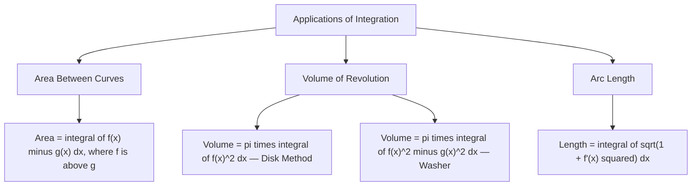

# Applications of Integration

Integration is not just an abstract calculation — it is a measurement tool. The definite integral measures area, volume, arc length, and many other physical quantities. This topic develops three core applications: finding areas between curves, computing volumes of revolution, and calculating arc lengths.

## 1. Area Between Two Curves

If $f(x)$ and $g(x)$ are continuous on $[a, b]$ and $f(x) \geq g(x)$ for all $x \in [a, b]$, the area of the region bounded above by $f$ and below by $g$ is:

$$A = \int_a^b [f(x) - g(x)]\,dx$$

**Intuition:** The area between two curves is the area under the top curve minus the area under the bottom curve.

**Real-world analogy:** If $f(x)$ is the revenue per unit and $g(x)$ is the cost per unit, the integral $\displaystyle\int_a^b [f(x) - g(x)]\,dx$ gives the total profit over the production range $[a, b]$.

---

### When the Curves Cross

If $f$ and $g$ intersect inside $[a, b]$, the "top" and "bottom" curves swap. In this case:

1. Find the intersection points by solving $f(x) = g(x)$.
2. Determine which curve is on top in each sub-interval.
3. Split the integral at each intersection point and use $|f(x) - g(x)|$ in each piece.

$$A = \int_a^c [f(x) - g(x)]\,dx + \int_c^b [g(x) - f(x)]\,dx$$

(if $f \geq g$ on $[a, c]$ and $g \geq f$ on $[c, b]$)

---

### Example 1 — Area Between Two Curves

**Problem:** Find the area enclosed by $f(x) = x + 2$ and $g(x) = x^2$.

**Step 1:** Find intersection points.
$$x + 2 = x^2 \implies x^2 - x - 2 = 0 \implies (x-2)(x+1) = 0$$
$$x = -1 \quad \text{and} \quad x = 2$$

**Step 2:** Determine which is on top on $(-1, 2)$. Test $x = 0$: $f(0) = 2 > 0 = g(0)$. So $f \geq g$ on $[-1, 2]$.

**Step 3:** Integrate.
$$A = \int_{-1}^{2} [(x+2) - x^2]\,dx = \int_{-1}^{2} (-x^2 + x + 2)\,dx$$

$$= \left[-\frac{x^3}{3} + \frac{x^2}{2} + 2x\right]_{-1}^{2}$$

At $x = 2$: $-\dfrac{8}{3} + 2 + 4 = -\dfrac{8}{3} + 6 = \dfrac{10}{3}$

At $x = -1$: $\dfrac{1}{3} + \dfrac{1}{2} - 2 = \dfrac{2 + 3 - 12}{6} = -\dfrac{7}{6}$

$$A = \frac{10}{3} - \left(-\frac{7}{6}\right) = \frac{20}{6} + \frac{7}{6} = \frac{27}{6} = \frac{9}{2}$$

---

### Example 2 — Area with Crossing Curves

**Problem:** Find the total area between $f(x) = \sin x$ and $g(x) = \cos x$ on $[0, \pi]$.

**Step 1:** Find where $\sin x = \cos x$ on $[0, \pi]$: $\tan x = 1 \implies x = \dfrac{\pi}{4}$.

**Step 2:** Determine which is larger:
- On $\left[0, \dfrac{\pi}{4}\right]$: $\cos x > \sin x$
- On $\left[\dfrac{\pi}{4}, \pi\right]$: $\sin x > \cos x$

**Step 3:** Integrate each piece.

$$A = \int_0^{\pi/4} (\cos x - \sin x)\,dx + \int_{\pi/4}^{\pi} (\sin x - \cos x)\,dx$$

$$= \Big[\sin x + \cos x\Big]_0^{\pi/4} + \Big[-\cos x - \sin x\Big]_{\pi/4}^{\pi}$$

First piece: $\left(\dfrac{\sqrt{2}}{2} + \dfrac{\sqrt{2}}{2}\right) - (0 + 1) = \sqrt{2} - 1$

Second piece: $(-(-1) - 0) - \left(-\dfrac{\sqrt{2}}{2} - \dfrac{\sqrt{2}}{2}\right) = 1 + \sqrt{2}$

$$A = (\sqrt{2} - 1) + (1 + \sqrt{2}) = 2\sqrt{2}$$

---

## 2. Volume of Revolution

When you rotate a region about an axis, you generate a three-dimensional solid. Integration computes the volume of these solids.

### Disk Method (about the $x$-axis)

If the region bounded by $y = f(x)$, $y = 0$, $x = a$, $x = b$ is rotated about the $x$-axis:

$$V = \pi \int_a^b [f(x)]^2\,dx$$

Each cross-section perpendicular to the $x$-axis is a disk of radius $f(x)$, with area $\pi[f(x)]^2$.

### Washer Method

If the region between $f(x)$ (outer) and $g(x)$ (inner, $0 \leq g \leq f$) is rotated about the $x$-axis:

$$V = \pi \int_a^b \left\{[f(x)]^2 - [g(x)]^2\right\}dx$$

---

### Example 3 — Volume by Disk Method

**Problem:** Find the volume generated when $y = x^2$ on $[0, 2]$ is rotated about the $x$-axis.

$$V = \pi \int_0^2 (x^2)^2\,dx = \pi \int_0^2 x^4\,dx = \pi\left[\frac{x^5}{5}\right]_0^2 = \pi \cdot \frac{32}{5} = \frac{32\pi}{5}$$

---

### Example 4 — Volume by Washer Method

**Problem:** Find the volume of the solid generated by rotating the region between $f(x) = \sqrt{x}$ and $g(x) = x$ on $[0, 1]$ about the $x$-axis.

**On $[0, 1]$:** $\sqrt{x} \geq x$ (check at $x = 0.25$: $0.5 > 0.25$). So $f$ is outer, $g$ is inner.

$$V = \pi \int_0^1 \left[(\sqrt{x})^2 - x^2\right]dx = \pi \int_0^1 (x - x^2)\,dx$$

$$= \pi \left[\frac{x^2}{2} - \frac{x^3}{3}\right]_0^1 = \pi\left(\frac{1}{2} - \frac{1}{3}\right) = \pi \cdot \frac{1}{6} = \frac{\pi}{6}$$

---

## 3. Arc Length

The **arc length** of a smooth curve $y = f(x)$ from $x = a$ to $x = b$ is:

$$L = \int_a^b \sqrt{1 + [f'(x)]^2}\,dx$$

**Derivation idea:** Approximate the curve with tiny straight-line segments of length $\sqrt{(\Delta x)^2 + (\Delta y)^2} = \sqrt{1 + \left(\dfrac{\Delta y}{\Delta x}\right)^2}\,\Delta x$. As segments shrink to zero, the sum becomes the integral above.

---

### Example 5 — Arc Length

**Problem:** Find the arc length of $f(x) = \dfrac{2}{3}x^{3/2}$ from $x = 0$ to $x = 4$.

**Step 1:** Find $f'(x)$.
$$f'(x) = \frac{2}{3} \cdot \frac{3}{2}x^{1/2} = x^{1/2} = \sqrt{x}$$

**Step 2:** Set up the arc length integral.
$$L = \int_0^4 \sqrt{1 + (\sqrt{x})^2}\,dx = \int_0^4 \sqrt{1 + x}\,dx$$

**Step 3:** Evaluate. Let $u = 1 + x$, $du = dx$. Limits: $u = 1$ to $u = 5$.

$$L = \int_1^5 \sqrt{u}\,du = \left[\frac{2}{3}u^{3/2}\right]_1^5 = \frac{2}{3}(5^{3/2} - 1) = \frac{2}{3}(5\sqrt{5} - 1)$$

---

### Example 6 — Arc Length of $y = x^{3/2}$ on $[0, 4]$

**Problem:** The curve $C = \{(x, x^{3/2}) : 0 \leq x \leq 4\}$. Find the arc length.

$$f(x) = x^{3/2}, \quad f'(x) = \frac{3}{2}x^{1/2}$$

$$[f'(x)]^2 = \frac{9}{4}x$$

$$L = \int_0^4 \sqrt{1 + \frac{9}{4}x}\,dx$$

Let $u = 1 + \dfrac{9}{4}x$, so $du = \dfrac{9}{4}dx$, i.e., $dx = \dfrac{4}{9}du$.

Limits: $x = 0 \implies u = 1$; $x = 4 \implies u = 1 + 9 = 10$.

$$L = \frac{4}{9}\int_1^{10} \sqrt{u}\,du = \frac{4}{9}\left[\frac{2}{3}u^{3/2}\right]_1^{10} = \frac{8}{27}(10^{3/2} - 1) = \frac{8}{27}(10\sqrt{10} - 1)$$

---

## Summary

---

## Key Takeaways

- Area between curves: integrate the top function minus the bottom function; split if curves cross.
- Volume (disk): $\pi \displaystyle\int [f(x)]^2\,dx$ — rotate a single curve about the $x$-axis.
- Volume (washer): $\pi \displaystyle\int \{[f(x)]^2 - [g(x)]^2\}\,dx$ — rotate the region between two curves.
- Arc length: $\displaystyle\int_a^b \sqrt{1 + [f'(x)]^2}\,dx$ — always compute $f'(x)$ first, then square it.
- For arc length problems, substitution is almost always needed to simplify $\sqrt{1 + [f'(x)]^2}$.

---

## Exam Tips

- For area problems: always find intersection points first, then determine which curve is on top.
- For volume by disks/washers: identify the outer and inner radii clearly — squaring a negative radius is a common error.
- Arc length integrals are often designed so that $1 + [f'(x)]^2$ simplifies to a perfect square — look for this.
- At UI, area-between-curves problems consistently appear in exam papers. Practice identifying intersection points and setting up the correct integral.
- Remember: total area is always positive. If your answer is negative, you have the top and bottom curves swapped.
