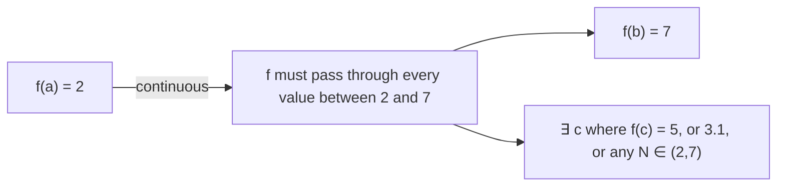

# Continuity on an Interval

Continuity at a single point is the building block, but calculus theorems — like the Intermediate Value Theorem and the Extreme Value Theorem — require a function to be continuous across an entire interval. This topic extends the point-wise definition to intervals and shows you how to determine where a function is continuous across its full domain.

## Continuity on an Open Interval

A function $f$ is **continuous on the open interval $(a, b)$** if it is continuous at every point $c$ where $a < c < b$.

That means for every interior point $c \in (a, b)$:
1. $f(c)$ is defined
2. $\displaystyle\lim_{x \to c} f(x)$ exists
3. $\displaystyle\lim_{x \to c} f(x) = f(c)$

There is no condition placed on the endpoints $a$ and $b$ themselves — they are not inside the open interval.

---

## Continuity on a Closed Interval

A function $f$ is **continuous on the closed interval $[a, b]$** if:

1. $f$ is continuous at every interior point $c \in (a, b)$.
2. $f$ is **right-continuous** at the left endpoint $a$: $\displaystyle\lim_{x \to a^+} f(x) = f(a)$
3. $f$ is **left-continuous** at the right endpoint $b$: $\displaystyle\lim_{x \to b^-} f(x) = f(b)$

**Why different conditions at the endpoints?** Because approaching from outside the interval is meaningless — only the direction pointing inward is relevant.

**Real-world analogy:** A stretch of road is smooth over the interval $[a, b]$. At the entry point $a$, you only need smooth entry from the inside (right side). At the exit point $b$, you only need a smooth exit from the inside (left side). What happens beyond the road does not matter.

---

## Standard Continuity Results

| Function type | Continuous on |
|---|---|
| Polynomials | All of $\mathbb{R} = (-\infty, \infty)$ |
| Rational $\dfrac{p(x)}{q(x)}$ | All $x$ where $q(x) \neq 0$ |
| $\sqrt{f(x)}$ (square root) | All $x$ where $f(x) \geq 0$ |
| $\ln f(x)$ | All $x$ where $f(x) > 0$ |
| $\sin x$, $\cos x$ | All of $\mathbb{R}$ |
| $\tan x$ | All $x \neq \dfrac{\pi}{2} + n\pi$ |
| $e^x$, $a^x$ ($a > 0$) | All of $\mathbb{R}$ |

---

## Finding Intervals of Continuity

**Step 1:** Identify all potential discontinuities (denominator zeros, radicand negatives, log argument non-positives).

**Step 2:** Find the domain (values where the function is defined).

**Step 3:** On every connected piece of the domain, the function is continuous (provided it is built from continuous components via sum, product, quotient, composition).

---

## Example 1 — Rational Function

**Problem:** Find the intervals on which $f(x) = \dfrac{2x + 1}{x^2 - x - 6}$ is continuous.

**Step 1:** Factor the denominator.
$$x^2 - x - 6 = (x - 3)(x + 2)$$

**Step 2:** Set denominator $\neq 0$:
$$x \neq 3 \quad \text{and} \quad x \neq -2$$

**Step 3:** The domain is $(-\infty, -2) \cup (-2, 3) \cup (3, \infty)$.

Since $f$ is a rational function, it is continuous on every connected interval of its domain:

$$f \text{ is continuous on } (-\infty, -2),\; (-2, 3),\; \text{and } (3, \infty)$$

---

## Example 2 — Square Root Function

**Problem:** Find the intervals on which $g(x) = \sqrt{x^2 - 4}$ is continuous.

**Step 1:** For the square root to be defined, the radicand must be $\geq 0$:
$$x^2 - 4 \geq 0 \implies (x-2)(x+2) \geq 0$$

**Step 2:** Solve the inequality. The expression $(x-2)(x+2) \geq 0$ when both factors share the same sign:

- Both $\geq 0$: $x \geq 2$
- Both $\leq 0$: $x \leq -2$

**Step 3:** Domain is $(-\infty, -2] \cup [2, \infty)$.

$g$ is continuous on $(-\infty, -2]$ and $[2, \infty)$.

Note the **closed brackets** — $g$ is defined and right/left-continuous at $x = \pm 2$.

---

## Example 3 — Combining Restrictions

**Problem:** Find the intervals of continuity for $h(x) = \dfrac{\sqrt{x - 1}}{x - 4}$.

**Restriction 1 (square root):** $x - 1 \geq 0 \implies x \geq 1$

**Restriction 2 (denominator):** $x - 4 \neq 0 \implies x \neq 4$

**Combined domain:** $x \geq 1$ and $x \neq 4$, i.e., $[1, 4) \cup (4, \infty)$.

$h$ is continuous on $[1, 4)$ and $(4, \infty)$.

---

## The Intermediate Value Theorem

The most important consequence of continuity on a closed interval:

**Theorem:** If $f$ is continuous on $[a, b]$ and $N$ is any number strictly between $f(a)$ and $f(b)$, then there exists at least one $c \in (a, b)$ such that $f(c) = N$.

$$f(a) < N < f(b) \implies \exists\, c \in (a, b) : f(c) = N$$

**In plain language:** A continuous function cannot skip a value. If it starts at $f(a)$ and ends at $f(b)$, it must pass through every value in between.

**Consequence:** If $f(a)$ and $f(b)$ have opposite signs — one positive, one negative — then $f$ has at least one root in $(a, b)$.

---

## Example 4 — Applying the IVT

**Problem:** Show that $f(x) = x^3 - 3x + 1$ has a root in the interval $(1, 2)$.

**Step 1:** $f$ is a polynomial — continuous everywhere, including on $[1, 2]$. ✓

**Step 2:** Evaluate at the endpoints.
$$f(1) = 1 - 3 + 1 = -1 < 0$$
$$f(2) = 8 - 6 + 1 = 3 > 0$$

**Step 3:** Since $f(1) < 0 < f(2)$ and $f$ is continuous on $[1, 2]$, by the IVT there exists at least one $c \in (1, 2)$ such that $f(c) = 0$.

Therefore, $f$ has a root in $(1, 2)$. $\square$

---

## Example 5 — Continuity of a Piecewise Function on an Interval

**Problem:** For what values of $a$ and $b$ is $f$ continuous on $(-\infty, \infty)$?

$$f(x) = \begin{cases} 2 & x \leq 0 \\ ax + b & 0 < x < 1 \\ -1 & x \geq 1 \end{cases}$$

**At $x = 0$:**
$$\lim_{x \to 0^-} f(x) = 2 \qquad \lim_{x \to 0^+} f(x) = a(0) + b = b$$
Continuity requires $b = 2$.

**At $x = 1$:**
$$\lim_{x \to 1^-} f(x) = a(1) + b = a + b \qquad \lim_{x \to 1^+} f(x) = -1$$
Continuity requires $a + b = -1$.

**Solving:** $b = 2$ and $a + 2 = -1 \implies a = -3$.

With $a = -3$, $b = 2$: the middle piece is $-3x + 2$, which connects smoothly at both endpoints.

---

## Key Takeaways

- Continuity on an open interval means continuous at every interior point; no endpoint condition is needed.
- Continuity on a closed interval additionally requires right-continuity at $a$ and left-continuity at $b$.
- Polynomials are continuous on all of $\mathbb{R}$; rational, radical, and logarithmic functions are continuous on their natural domains.
- The Intermediate Value Theorem guarantees that a continuous function on $[a, b]$ takes every value between $f(a)$ and $f(b)$ — it cannot skip values.
- To find where a function is continuous: find its domain and state the intervals.

---

## Exam Tips

- When asked "on what intervals is $f$ continuous?" your answer should list interval notation, not just say "everywhere except $x = c$."
- For the IVT, explicitly state: (i) $f$ is continuous on the interval, (ii) compute both endpoint values, (iii) show the target value lies between them — then conclude by name.
- Piecewise continuity over all of $\mathbb{R}$: check every junction point. At each junction, set LHL $=$ RHL and solve for the constants.
- Don't forget endpoint continuity for closed intervals: at $a$ only the right limit matters, at $b$ only the left limit matters.
