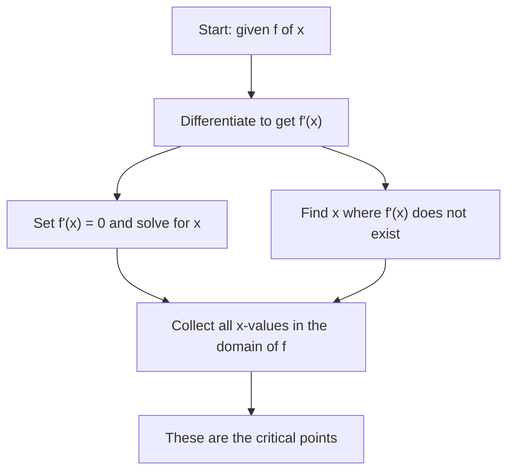

# Critical Points

Before you can find where a function reaches its highest or lowest values, you need to know where to look. Critical points are the candidates — the specific $x$-values where a maximum or minimum might occur. Every optimization problem in calculus starts here.

## What Is a Critical Point?

A **critical point** (also called a **critical value**) of a function $f$ is any point $x = c$ in the domain of $f$ where either:

1. $f'(c) = 0$ — the derivative equals zero (horizontal tangent), or
2. $f'(c)$ does not exist — the derivative is undefined at $c$.

**Why does $f'(c) = 0$ matter?** At a local maximum or minimum, the tangent to the curve is horizontal — it has slope zero. So $f'(c) = 0$ is the condition that singles out potential turning points.

**Why include points where $f'(c)$ is undefined?** Sharp corners and cusps can also be turning points. For example, $f(x) = |x|$ has a minimum at $x = 0$, even though $f'(0)$ does not exist.

**Real-world analogy:** Think of a hill. At the very top, the slope of the ground is zero — you're not going up or down. Critical points are the tops and bottoms of hills — not every zero-slope point is a peak, but every peak has zero slope.

---

## Finding Critical Points — Procedure

---

## Example 1 — Polynomial Function

**Problem:** Find all critical points of $f(x) = 2x^3 - 9x^2 + 12x - 4$.

**Step 1:** Differentiate.
$$f'(x) = 6x^2 - 18x + 12$$

**Step 2:** Set $f'(x) = 0$.
$$6x^2 - 18x + 12 = 0$$
$$x^2 - 3x + 2 = 0 \quad \text{(divide by 6)}$$
$$(x - 1)(x - 2) = 0$$
$$x = 1 \quad \text{or} \quad x = 2$$

**Step 3:** Check domain. $f$ is a polynomial — domain is all of $\mathbb{R}$, so both $x = 1$ and $x = 2$ are valid.

$f'(x)$ is a polynomial, which is defined everywhere, so no additional points from condition (ii).

**Critical points:** $x = 1$ and $x = 2$.

**Critical values (y-values):**
$$f(1) = 2 - 9 + 12 - 4 = 1$$
$$f(2) = 16 - 36 + 24 - 4 = 0$$

The critical points are $(1, 1)$ and $(2, 0)$.

---

## Example 2 — Function with Undefined Derivative

**Problem:** Find the critical points of $g(x) = x^{2/3}$.

**Step 1:** Differentiate using the power rule.
$$g'(x) = \frac{2}{3}x^{-1/3} = \frac{2}{3x^{1/3}}$$

**Step 2:** Set $g'(x) = 0$. The numerator is $2 \neq 0$, so $g'(x) = 0$ has no solution.

**Step 3:** Find where $g'(x)$ is undefined. $g'(x) = \dfrac{2}{3x^{1/3}}$ is undefined at $x = 0$.

**Step 4:** Check: $g(0) = 0^{2/3} = 0$ is defined, so $x = 0$ is in the domain.

**Critical point:** $x = 0$. At this point the graph has a cusp (sharp point) — a minimum.

---

## Example 3 — Rational Function

**Problem:** Find the critical points of $h(x) = \dfrac{x^2}{x^2 + 1}$.

**Step 1:** Differentiate using the quotient rule.
$$h'(x) = \frac{2x(x^2 + 1) - x^2(2x)}{(x^2 + 1)^2} = \frac{2x^3 + 2x - 2x^3}{(x^2 + 1)^2} = \frac{2x}{(x^2 + 1)^2}$$

**Step 2:** Set $h'(x) = 0$.
$$\frac{2x}{(x^2 + 1)^2} = 0 \implies 2x = 0 \implies x = 0$$

**Step 3:** The denominator $(x^2 + 1)^2 \geq 1 > 0$ for all $x$, so $h'(x)$ is never undefined.

**Critical point:** $x = 0$, with $h(0) = 0$.

---

## Example 4 — Trigonometric Function

**Problem:** Find the critical points of $f(x) = \sin x - \cos x$ on $[0, 2\pi]$.

**Step 1:** Differentiate.
$$f'(x) = \cos x + \sin x$$

**Step 2:** Set $f'(x) = 0$.
$$\cos x + \sin x = 0 \implies \sin x = -\cos x \implies \tan x = -1$$

**Step 3:** Solve on $[0, 2\pi]$.
$$x = \frac{3\pi}{4} \quad \text{and} \quad x = \frac{7\pi}{4}$$

$f'(x) = \cos x + \sin x$ is defined for all $x$, so no additional critical points.

**Critical points:** $x = \dfrac{3\pi}{4}$ and $x = \dfrac{7\pi}{4}$.

---

## Critical Points Do Not Guarantee Extrema

Not every critical point is a maximum or minimum. A horizontal tangent at $x = c$ means $f'(c) = 0$, but the function might continue in the same direction on both sides — this is called an **inflection point with horizontal tangent**.

**Example:** $f(x) = x^3$ at $x = 0$: $f'(0) = 3(0)^2 = 0$, but $x = 0$ is neither a max nor a min — the function is increasing on both sides.

To classify a critical point, you must use the First Derivative Test or Second Derivative Test (covered in the next topics).

---

## Key Takeaways

- A critical point is any $x = c$ in the domain where $f'(c) = 0$ or $f'(c)$ is undefined.
- Every local maximum and local minimum occurs at a critical point.
- Not every critical point is a maximum or minimum — always test before concluding.
- To find critical points: differentiate, find zeros of $f'(x)$, find where $f'(x)$ is undefined, and keep only points in the domain.
- Critical points are only the starting point for optimization — classification comes next.

---

## Exam Tips

- "Find the critical points" means find all $x$ where $f'(x) = 0$ or $f'(x)$ is undefined — show both steps.
- For quotient-rule derivatives: set the numerator to zero for $f'(x) = 0$ candidates; check the denominator for undefined points (but only include them if they are in the domain of the original function).
- At UI, polynomials and rational functions dominate critical point questions. Always simplify $f'(x)$ fully before solving — factored form makes the algebra much easier.
- Don't forget to report the $y$-value of each critical point: $f(c)$. Many exam questions ask for "the critical points" expecting both coordinates.
