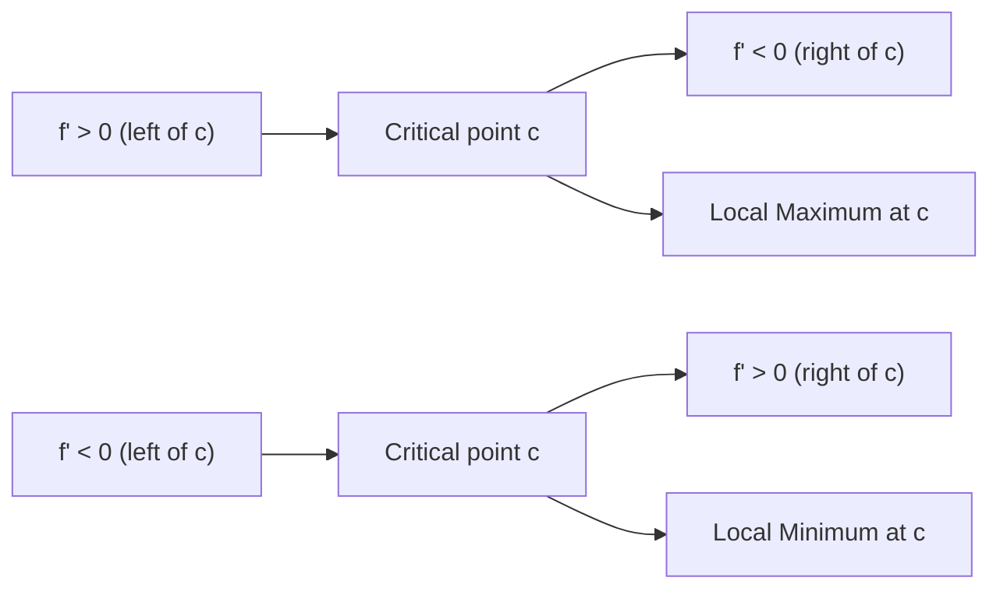

# Increasing and Decreasing Functions

The derivative does more than find turning points — its sign tells you the direction of motion of a function across its entire domain. Knowing where a function rises and falls gives you a complete picture of its shape, which is the foundation of curve sketching and optimization.

## Definitions

Let $f$ be defined on an interval $I$.

- $f$ is **increasing on $I$** if for every $x_1, x_2 \in I$ with $x_1 < x_2$: $f(x_1) < f(x_2)$.
- $f$ is **decreasing on $I$** if for every $x_1, x_2 \in I$ with $x_1 < x_2$: $f(x_1) > f(x_2)$.

In plain terms: increasing means "goes up as $x$ goes right"; decreasing means "goes down as $x$ goes right."

**Real-world analogy:** A stock price is increasing when every later price is higher than every earlier price in that period. It is decreasing when every later price is lower. The derivative is like the stock's daily rate of change — positive means the price is climbing.

---

## The Monotonicity Theorem

The connection between the derivative and monotonicity:

**Theorem:** Let $f$ be continuous on $[a, b]$ and differentiable on $(a, b)$.

- If $f'(x) > 0$ for all $x \in (a, b)$, then $f$ is **increasing** on $[a, b]$.
- If $f'(x) < 0$ for all $x \in (a, b)$, then $f$ is **decreasing** on $[a, b]$.
- If $f'(x) = 0$ for all $x \in (a, b)$, then $f$ is **constant** on $[a, b]$.

---

## The First Derivative Test

The First Derivative Test uses sign changes of $f'$ at a critical point to classify it as a local maximum, local minimum, or neither.

**Setup:** Let $c$ be a critical point of $f$ (so $f'(c) = 0$ or $f'(c)$ is undefined).

| Sign of $f'$ left of $c$ | Sign of $f'$ right of $c$ | Conclusion |
|---|---|---|
| $+$ (increasing) | $-$ (decreasing) | Local **maximum** at $c$ |
| $-$ (decreasing) | $+$ (increasing) | Local **minimum** at $c$ |
| $+$ | $+$ | No extremum (inflection) |
| $-$ | $-$ | No extremum (inflection) |

---

## Procedure: Finding Increasing/Decreasing Intervals

1. Find $f'(x)$.
2. Find all critical points: solve $f'(x) = 0$ and note where $f'(x)$ is undefined.
3. Place the critical points on a number line — they partition $\mathbb{R}$ into intervals.
4. Pick a test value from each interval and evaluate the sign of $f'$.
5. State the increasing intervals (where $f' > 0$) and decreasing intervals (where $f' < 0$).
6. Apply the First Derivative Test to classify each critical point.

---

## Example 1 — Polynomial

**Problem:** Find where $f(x) = x^3 - 3x^2 - 9x + 5$ is increasing and decreasing. Classify all critical points.

**Step 1:** Differentiate.
$$f'(x) = 3x^2 - 6x - 9 = 3(x^2 - 2x - 3) = 3(x - 3)(x + 1)$$

**Step 2:** Critical points from $f'(x) = 0$:
$$x = 3 \quad \text{and} \quad x = -1$$

**Step 3:** Sign chart for $f'(x) = 3(x-3)(x+1)$:

| Interval | Test value | $(x-3)$ | $(x+1)$ | $f'(x)$ |
|---|---|---|---|---|
| $(-\infty, -1)$ | $x = -2$ | $-$ | $-$ | $+$ |
| $(-1, 3)$ | $x = 0$ | $-$ | $+$ | $-$ |
| $(3, \infty)$ | $x = 4$ | $+$ | $+$ | $+$ |

**Step 4:** Conclusions.

- $f$ is **increasing** on $(-\infty, -1)$ and $(3, \infty)$.
- $f$ is **decreasing** on $(-1, 3)$.
- At $x = -1$: $f'$ changes from $+$ to $-$ → **local maximum**. $f(-1) = -1 - 3 + 9 + 5 = 10$.
- At $x = 3$: $f'$ changes from $-$ to $+$ → **local minimum**. $f(3) = 27 - 27 - 27 + 5 = -22$.

---

## Example 2 — Rational Function

**Problem:** Find the intervals of increase/decrease for $g(x) = \dfrac{x^2}{x - 1}$.

**Step 1:** Find the domain. Denominator $\neq 0$: $x \neq 1$. Domain: $(-\infty, 1) \cup (1, \infty)$.

**Step 2:** Differentiate using the quotient rule.
$$g'(x) = \frac{2x(x-1) - x^2(1)}{(x-1)^2} = \frac{2x^2 - 2x - x^2}{(x-1)^2} = \frac{x^2 - 2x}{(x-1)^2} = \frac{x(x-2)}{(x-1)^2}$$

**Step 3:** Critical points from $g'(x) = 0$ (numerator $= 0$, denominator $\neq 0$):
$$x(x - 2) = 0 \implies x = 0 \quad \text{or} \quad x = 2$$

Note: $x = 1$ makes $g'$ undefined but is not in the domain of $g$.

**Step 4:** Number line partitioned by $x = 0, 1, 2$:

| Interval | Test value | $x$ | $(x-2)$ | $(x-1)^2$ | $g'(x)$ |
|---|---|---|---|---|---|
| $(-\infty, 0)$ | $-1$ | $-$ | $-$ | $+$ | $+$ |
| $(0, 1)$ | $0.5$ | $+$ | $-$ | $+$ | $-$ |
| $(1, 2)$ | $1.5$ | $+$ | $-$ | $+$ | $-$ |
| $(2, \infty)$ | $3$ | $+$ | $+$ | $+$ | $+$ |

**Conclusions:**

- Increasing on $(-\infty, 0)$ and $(2, \infty)$.
- Decreasing on $(0, 1)$ and $(1, 2)$.
- At $x = 0$: $g'$ changes from $+$ to $-$ → **local maximum**. $g(0) = 0$.
- At $x = 2$: $g'$ changes from $-$ to $+$ → **local minimum**. $g(2) = \dfrac{4}{1} = 4$.

---

## Example 3 — Application

**Problem:** The profit function of a company is $P(x) = -2x^2 + 80x - 300$, where $x$ is the number of units sold (in hundreds). Find the range of $x$ for which profit is increasing.

**Differentiate:**
$$P'(x) = -4x + 80$$

**Set $P'(x) > 0$:**
$$-4x + 80 > 0 \implies x < 20$$

**Since $x \geq 0$ (units cannot be negative):** profit is increasing on $[0, 20)$.

At $x = 20$: $P'(20) = 0$ — this is the maximum profit point.

---

## Key Takeaways

- $f'(x) > 0$ on an interval means $f$ is increasing there; $f'(x) < 0$ means $f$ is decreasing.
- The First Derivative Test classifies critical points by looking at the sign change of $f'$ across the critical point.
- A sign change from $+$ to $-$ is a local max; from $-$ to $+$ is a local min; no sign change means no extremum.
- Build a sign chart: find critical points, partition the domain, test one value per interval.
- Increasing/decreasing intervals are always stated in open interval notation (the behavior at the endpoints themselves is not determined by the derivative).

---

## Exam Tips

- Always make a sign chart — never guess the sign of $f'$ on an interval.
- For rational derivatives, the denominator squared is always positive — only the numerator determines the sign.
- At UI, the most common question format is: find increasing/decreasing intervals, then classify critical points. Do both in one organised answer.
- State intervals in proper notation: "increasing on $(-1, 3)$" not "when $-1 < x < 3$."
- If $f'(c) = 0$ but $f'$ does not change sign at $c$, the point is a horizontal inflection — say this explicitly.
