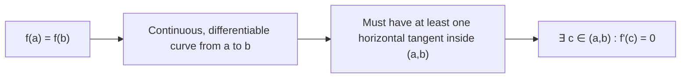

# Rolle's Theorem

Rolle's Theorem is one of the classical results in calculus. It makes a surprisingly elegant observation: if a function starts and ends at the same height on a closed interval, somewhere in between the function must level off — there must be a point where the slope is exactly zero. This seemingly simple idea is the foundation for the Mean Value Theorem and many other results.

## Statement of Rolle's Theorem

**Theorem:** Let $f$ be a function that satisfies all three conditions:

1. $f$ is **continuous** on the closed interval $[a, b]$
2. $f$ is **differentiable** on the open interval $(a, b)$
3. $f(a) = f(b)$ — equal values at both endpoints

Then there exists at least one point $c \in (a, b)$ such that:
$$f'(c) = 0$$

**In plain language:** If a smooth, unbroken curve starts and ends at the same height, it must have a horizontal tangent somewhere in between.

**Real-world analogy:** A ball thrown into the air and caught at the same height it was thrown must have — at some moment during its flight — zero vertical velocity. That moment is the peak of the arc. Rolle's Theorem guarantees this peak exists.

---

## Why All Three Conditions Are Necessary

The theorem can fail if any condition is violated:

### Condition 1 (Continuity) Fails

Consider $f(x) = \begin{cases} 1 & x \in [-1, 0) \cup (0, 1] \\ 0 & x = 0 \end{cases}$

Here $f(-1) = f(1) = 1$, but the function is discontinuous at $x = 0$. There is no point with $f'(c) = 0$ — the function never has a horizontal tangent.

### Condition 2 (Differentiability) Fails

Consider $f(x) = |x|$ on $[-1, 1]$:
- $f(-1) = f(1) = 1$ ✓
- $f$ is continuous ✓
- But $f'(0)$ does not exist (sharp corner)

There is no $c \in (-1, 1)$ where $f'(c) = 0$ — in fact $f'(x) = \pm 1$ for all $x \neq 0$.

### Condition 3 ($f(a) = f(b)$) Fails

Consider $f(x) = x$ on $[0, 1]$: continuous and differentiable, but $f(0) = 0 \neq 1 = f(1)$. Here $f'(x) = 1 \neq 0$ everywhere — no horizontal tangent.

---

## Proof Sketch

**Case 1:** If $f$ is constant on $[a, b]$, then $f'(x) = 0$ for all $x \in (a, b)$. Pick any $c \in (a, b)$.

**Case 2:** If $f$ is not constant, then $f$ takes values different from $f(a) = f(b)$. By the Extreme Value Theorem, $f$ attains both a maximum $M$ and minimum $m$ on $[a, b]$. Since $f$ is not constant, at least one of $M$, $m$ is attained at an interior point $c \in (a, b)$.

At this interior extremum, $f'(c)$ exists (by condition 2) and $f'(c) = 0$ (by Fermat's Theorem). $\square$

---

## Example 1 — Verifying and Applying Rolle's Theorem

**Problem:** For $f(x) = x^2 + 2x$ on $[-2, 0]$, verify that Rolle's Theorem applies and find $c$.

**Check the three conditions:**

1. $f$ is a polynomial → continuous on $[-2, 0]$. ✓
2. $f$ is a polynomial → differentiable on $(-2, 0)$. ✓
3. $f(-2) = 4 - 4 = 0$ and $f(0) = 0$. So $f(-2) = f(0) = 0$. ✓

**All conditions are satisfied.** There exists $c \in (-2, 0)$ with $f'(c) = 0$.

**Find $c$:**
$$f'(x) = 2x + 2$$
$$f'(c) = 0 \implies 2c + 2 = 0 \implies c = -1$$

Since $-1 \in (-2, 0)$, the theorem is confirmed: $c = -1$.

---

## Example 2 — Polynomial with Multiple Roots

**Problem:** For $f(x) = x^3 - 3x$ on $[-\sqrt{3}, \sqrt{3}]$, verify Rolle's Theorem and find all valid $c$.

**Check conditions:**

1. Polynomial → continuous. ✓
2. Polynomial → differentiable. ✓
3. $f(-\sqrt{3}) = -3\sqrt{3} + 3\sqrt{3} = 0$ and $f(\sqrt{3}) = 3\sqrt{3} - 3\sqrt{3} = 0$. ✓

**Find $c$:**
$$f'(x) = 3x^2 - 3$$
$$3c^2 - 3 = 0 \implies c^2 = 1 \implies c = \pm 1$$

Both $c = -1$ and $c = 1$ lie in $(-\sqrt{3}, \sqrt{3})$. Rolle's Theorem is satisfied at **two points**.

---

## Example 3 — Polynomial (from lecture slides)

**Problem:** For $f(x) = x^3 - 4x$ on $[-2, 2]$, verify Rolle's Theorem and find all $c$.

**Check conditions:**

1. Polynomial → continuous on $[-2, 2]$. ✓
2. Polynomial → differentiable on $(-2, 2)$. ✓
3. $f(-2) = -8 + 8 = 0$ and $f(2) = 8 - 8 = 0$. ✓

**Find $c$:**
$$f'(x) = 3x^2 - 4$$
$$3c^2 - 4 = 0 \implies c^2 = \frac{4}{3} \implies c = \pm\frac{2}{\sqrt{3}} = \pm\frac{2\sqrt{3}}{3}$$

Check: $\dfrac{2\sqrt{3}}{3} \approx 1.15 \in (-2, 2)$ and $-\dfrac{2\sqrt{3}}{3} \approx -1.15 \in (-2, 2)$. ✓

Both points are valid.

---

## Example 4 — Checking for Violation

**Problem:** Does Rolle's Theorem apply to $f(x) = \dfrac{x^2 - 1}{x}$ on $[-1, 1]$?

$f$ is undefined at $x = 0 \in [-1, 1]$ — the function is **not continuous** on $[-1, 1]$.

**Rolle's Theorem does not apply.** Even though $f(-1) = 0 = f(1)$, the discontinuity at $x = 0$ means the theorem's conclusion cannot be guaranteed (and indeed $f'(x) = 1 - \dfrac{1}{x^2} \neq 0$ for $x \in (-1, 0) \cup (0, 1)$).

---

## Geometric Interpretation

The graph starts and ends at the same height. If it goes up, it must come back down — and at some turning point the tangent is horizontal.

---

## Key Takeaways

- Rolle's Theorem requires: continuity on $[a, b]$, differentiability on $(a, b)$, and $f(a) = f(b)$.
- The conclusion: at least one $c \in (a, b)$ where $f'(c) = 0$.
- There may be more than one such $c$ — Rolle's guarantees at least one.
- If any condition fails, the theorem does not apply — and the conclusion may fail.
- Differentiability is the critical condition: a continuous function with a corner can fail the conclusion.

---

## Exam Tips

- "Verify Rolle's Theorem" means: explicitly check all three conditions (labelled), then find $c$ by solving $f'(x) = 0$, then confirm $c$ lies in the open interval $(a, b)$.
- Don't forget to state that $c$ lies in $(a, b)$: finding $c$ by algebra is not enough if you don't check it's in the right interval.
- Common trap: checking that $f(a) = f(b)$ — don't assume it from the problem statement, compute it.
- At UI, Rolle's Theorem questions follow a fixed pattern: state the three conditions, verify each, differentiate, solve, confirm. Practice this format until it is automatic.
