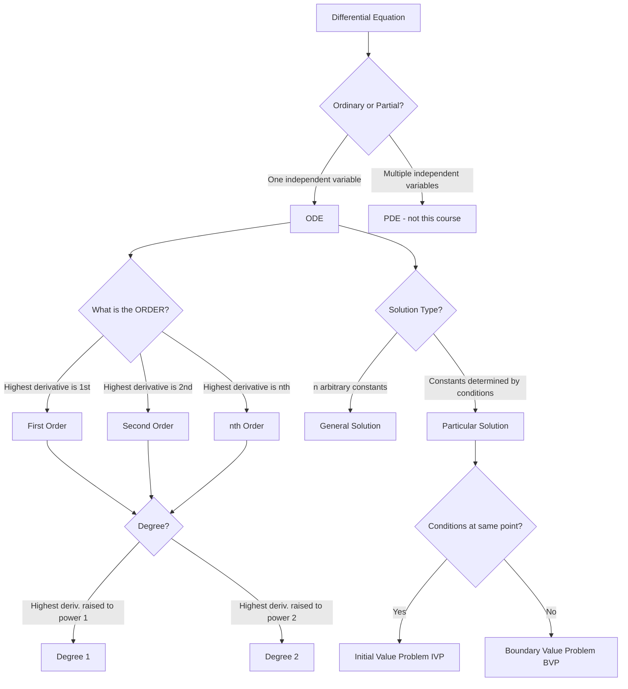

# Definition and Classification

Before you can solve differential equations, you need precise language to describe them. Order, degree, general solution, particular solution, initial conditions, boundary conditions — these terms have exact meanings, and confusing them costs marks.

## What Is an Ordinary Differential Equation?

An **ordinary differential equation (ODE)** is a relationship between an independent variable $x$, a dependent variable $y$, and one or more of $y$'s derivatives with respect to $x$.

*"Ordinary"* distinguishes these from *partial* differential equations, which involve partial derivatives with respect to multiple variables. In this course, all equations are ordinary.

Examples:

$$\frac{dy}{dx} = 2x $$

$$\frac{d^2y}{dx^2} + x\frac{dy}{dx} + 2y = 0 $$

$$\left(\frac{di}{dt}\right)^2 + i = 0 $$

$$\frac{d^3y}{dx^3}\frac{d^2y}{dx^2} = x $$

---

## Order

The **order** of an ODE is the order of the highest derivative that appears.

| Equation | Highest derivative | Order |
|---|---|---|
| $y' = 2x$ | $y' = \frac{dy}{dx}$ | **1** |
| $y'' + xy' + 2y = 0$ | $y''$ | **2** |
| $(i')^2 + i = 0$ | $i'$ | **1** |
| $y''' \cdot y'' = x$ | $y'''$ | **3** |

**Real-world analogy:** Order tells you how many times you need to integrate to recover the original function. Velocity (first derivative of position) requires one integration; acceleration (second derivative) requires two integrations.

---

## Degree

The **degree** of an ODE is the power to which the highest-order derivative is raised, once the equation is written as a polynomial in the derivatives.

| Equation | Highest derivative | Its power | Degree |
|---|---|---|---|
| $y' = 2x$ | $y'$ | $1$ | **1** |
| $y'' + xy' + 2y = 0$ | $y''$ | $1$ | **1** |
| $(i')^2 + i = 0$ | $i'$ | $2$ | **2** |
| $y''' \cdot y'' = x$ | $y'''$ | $1$ | **1** |

**Important:** Equations (2.1) and (2.2) are order 1 and 2 respectively, both degree 1. Equation (2.3) is order 1, degree 2.

---

## Solutions: General and Particular

The **solution** of an ODE is a function $y = f(x)$ that, when substituted into the equation, satisfies it identically.

### General Solution

A **general solution** contains the maximum number of independent arbitrary constants — exactly $n$ constants for an order-$n$ ODE.

**Example 2.1.** Solve $\frac{d^2y}{dx^2} = x$.

*Integrate once:*

$$\frac{dy}{dx} = \frac{1}{2}x^2 + A$$

*Integrate again:*

$$y = \frac{1}{6}x^3 + Ax + B $$

This is the general solution. It has two arbitrary constants $A$ and $B$, consistent with order 2.

**Example 2.2.** Show that $y = Ae^{2x} + Be^x$ is the general solution of $y'' - 3y' + 2y = 0$.

*Differentiate twice:*

$$y' = 2Ae^{2x} + Be^x, \qquad y'' = 4Ae^{2x} + Be^x$$

*Substitute:*

$$y'' - 3y' = (4Ae^{2x} + Be^x) - 3(2Ae^{2x} + Be^x) = -2Ae^{2x} - 2Be^x = -2y$$

Therefore $y'' - 3y' + 2y = 0$. $\checkmark$

The solution $y = Ae^{2x} + Be^x$ contains two arbitrary constants and so is the general solution.

---

### Particular Solution

A **particular solution** is obtained from the general solution by assigning specific values to the arbitrary constants, determined by **initial conditions** or **boundary conditions**.

#### Initial Conditions

**Initial conditions** specify the value of $y$ *and its first $n-1$ derivatives* all at the **same** point $x = x_0$.

For an order-$n$ ODE:

$$y(x_0) = a_0,\quad y'(x_0) = a_1,\quad \ldots,\quad y^{(n-1)}(x_0) = a_{n-1}$$

**Example 2.3.** From Example 2.1 with the condition $y = 1$ when $x = 0$:

$$y(0) = 0 + 0 + B = 1 \implies B = 1$$

But we still need a condition on $y'(0)$ to fix $A$. With just one condition the particular solution is $y = \frac{1}{6}x^3 + Ax + 1$ (one constant still free).

**Example 2.4.** For $y'' - 3y' + 2y = 0$ with conditions $y(0) = 0$, $y'(0) = 1$:

General solution: $y = Ae^{2x} + Be^x$

*Condition 1:* $y(0) = A + B = 0$

*Condition 2:* $y'(0) = 2A + B = 1$

Subtract: $A = 1$, then $B = -1$.

**Particular solution:** $y = e^{2x} - e^x$

#### Boundary Conditions

**Boundary conditions** specify the value of $y$ at **two different** points $x_0$ and $x_1$ (rather than derivatives at one point).

**Example (Boundary Value Problem).** For the general solution $y = Ae^{2x} + Be^x$ with conditions $y(0) = 0$ and $y(1) = 1$:

$$A + B = 0$$
$$Ae^2 + Be = 1$$

Solving: $B = \frac{e}{e^2 - e} = \frac{1}{e-1}$, $A = -\frac{1}{e-1}$, giving

$$y = \frac{1}{e-1}\left(e^x - e^{2x}\right)$$

---

## Classification Diagram

---

## Key Takeaways

- **Order** = order of the highest derivative present.
- **Degree** = power of the highest-order derivative (must be a polynomial in that derivative).
- The **general solution** of an order-$n$ ODE contains exactly $n$ arbitrary constants.
- Conversely, a function with $n$ arbitrary constants gives, on elimination of those constants, an ODE of order $n$.
- A **particular solution** has specific values assigned to all constants.
- **Initial conditions** specify $y, y', \ldots, y^{(n-1)}$ at *one* point.
- **Boundary conditions** specify $y$ at *two different* points.

---

## Exam Tips

- Read the question carefully: "order" and "degree" are different. Order 3, degree 1 is possible.
- When verifying a solution, always differentiate the proposed solution and substitute — never assume without checking.
- When solving an IVP, apply initial conditions *after* finding the general solution, not before.
- If you are given $y(0) = a$ and $y'(0) = b$ for a second-order ODE, you will get two equations in two unknowns $A$ and $B$. Solve them simultaneously.
- Boundary conditions can sometimes have *no solution* or *infinitely many solutions* — this is fine mathematically, but initial value problems for well-posed ODEs always have a unique solution.
