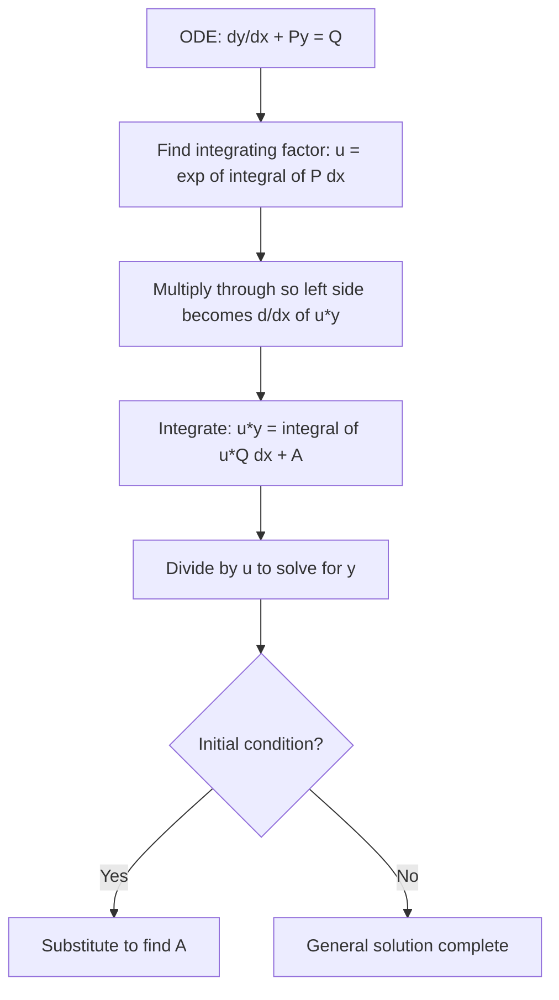

# Linear Equations

A first-order linear ODE is one of the workhorses of applied mathematics — it appears in electrical circuits, population models, mixing problems, and heat transfer. The method of the **integrating factor** converts it into something that can be integrated directly.

## Standard Form

A first-order ODE is **linear** if it can be written as:

$$\frac{dy}{dx} + P(x)\,y = Q(x) $$

where $P(x)$ and $Q(x)$ are functions of $x$ *only* (not of $y$).

The key feature: $y$ and $\frac{dy}{dx}$ each appear to the first power, with no products between them.

**Examples of linear equations:**
- $\frac{dy}{dx} + (\sin x)\,y = x^2 - 1$ — linear, $P = \sin x$, $Q = x^2 - 1$
- $x\frac{dy}{dx} - 4y = x^6$ — divide by $x$: $\frac{dy}{dx} - \frac{4}{x}y = x^5$ — linear, $P = -4/x$, $Q = x^5$

**Non-linear:** $y' + y^2 = x$ (the $y^2$ term makes it Bernoulli, not linear).

---

## Recognising Linear Equations

| Equation | Linear? | Type if not |
|---|---|---|
| $x^2 y' + (x^2+1)y = \tan x$ | Yes | — |
| $x^2 y' - y^2 = x^2 y$ | No | Involves $y^2$ |
| $\frac{dy}{dx} - \frac{x}{1+2y} = \frac{1}{3}$ | No | Involves $y$ in denominator non-linearly |
| $\cos x \sin y\, dx + \sin x \cos y\, dy = 0$ | No | Variable separable |
| $y' - \frac{x+y}{x} = 0$, i.e., $y' - \frac{y}{x} = 1$ | Yes | Also homogeneous |

---

## The Integrating Factor Method

### Derivation

Start with the standard form (5.1). Multiply both sides by an unknown function $u = u(x)$:

$$u\frac{dy}{dx} + uP(x)y = uQ(x) $$

We want the left side to be the derivative of a product $\frac{d}{dx}[u(x)\, y]$.

By the product rule: $\frac{d}{dx}[uy] = u\frac{dy}{dx} + y\frac{du}{dx}$.

So (5.2) equals $\frac{d}{dx}[uy]$ when:

$$\frac{du}{dx} = uP(x) $$

Separating and integrating: $\ln u = \int P(x)\,dx$, so:

$$u(x) = e^{\int P(x)\,dx} $$

This $u(x)$ is the **integrating factor**.

### Using the Integrating Factor

With $u$ from (5.4), equation (5.2) becomes:

$$\frac{d}{dx}[u(x)\,y] = u(x)\,Q(x) $$

Integrate both sides:

$$u(x)\,y = \int u(x)\,Q(x)\,dx + A $$

Divide by $u(x)$ to get $y$ explicitly.

### Step-by-Step Procedure

1. Write the ODE in standard form: $\frac{dy}{dx} + P(x)y = Q(x)$.
2. Compute $\int P(x)\,dx$ (no constant needed here).
3. Form the integrating factor: $u = e^{\int P\,dx}$.
4. Multiply through by $u$; verify the left side equals $\frac{d}{dx}[uy]$.
5. Integrate: $uy = \int uQ\,dx + A$.
6. Solve for $y$.

---

## Identity for Logarithmic Integrals

When $\int P\,dx$ involves logarithms, use:

$$e^{\log f(x)} = f(x)$$

**Example:** If $P = \frac{2}{3}\cot 2x$, then $\int P\,dx = \frac{1}{3}\ln|\sin 2x|$... wait, let me use a simpler illustration:

If $P = -\frac{1}{x}$, then $\int P\,dx = -\ln x = \ln(1/x)$, so $u = e^{\ln(1/x)} = \frac{1}{x}$.

If $P = \frac{x+4}{(x+3)(x+1)}$ — use partial fractions to integrate, then exponentiate.

---

## Example 5.2 — Basic Integration Factor

Solve:

$$x\frac{dy}{dx} - y = x^2 + x$$

**Step 1.** Divide by $x$ (standard form):

$$\frac{dy}{dx} - \frac{1}{x}y = x + 1$$

So $P(x) = -\frac{1}{x}$, $Q(x) = x + 1$.

**Step 2.** Integrating factor:

$$u = e^{\int -\frac{1}{x}\,dx} = e^{-\ln x} = \frac{1}{x}$$

**Step 3.** Multiply through by $\frac{1}{x}$:

$$\frac{1}{x}\frac{dy}{dx} - \frac{1}{x^2}y = 1 + \frac{1}{x}$$

Verify: $\frac{d}{dx}\left[\frac{y}{x}\right] = \frac{1}{x}\frac{dy}{dx} - \frac{y}{x^2}$. ✓

**Step 4.** Integrate:

$$\frac{y}{x} = \int\!\left(1 + \frac{1}{x}\right)dx = x + \ln x + A$$

$$y = x(x + \ln x + A) = x^2 + x\ln x + Ax$$

**General solution:** $y = x^2 + x\ln x + Ax$

---

## Example 5.3 — Trigonometric Integrating Factor

Solve:

$$\frac{dy}{dx} + y\!\left(\tan x - \frac{1}{x}\right) = \cos x$$

**Step 1.** $P = \tan x - \frac{1}{x}$, $Q = \cos x$.

**Step 2.** Compute $\int P\,dx$:

$$\int\!\left(\tan x - \frac{1}{x}\right)dx = -\ln|\cos x| - \ln x = \ln\!\left(\frac{1}{x\cos x}\right) = \ln\!\left(\frac{\sec x}{x}\right)$$

**Step 3.** Integrating factor:

$$u = e^{\ln(\sec x / x)} = \frac{\sec x}{x}$$

**Step 4.** Multiply and integrate using (5.6):

$$\frac{\sec x}{x}\cdot y = \int \frac{\sec x}{x}\cdot \cos x\,dx = \int \frac{1}{x}\,dx = \ln x + A$$

**Step 5.** Solve for $y$:

$$y = x\cos x\,(\ln x + A)$$

---

## Example 5.4 — Rational Coefficient

Solve:

$$x(x^2-1)\frac{dy}{dx} + y = 2x$$

**Step 1.** Divide by $x(x^2-1)$:

$$\frac{dy}{dx} + \frac{1}{x(x^2-1)}y = \frac{2}{x^2-1}$$

**Step 2.** Partial fractions for $P = \frac{1}{x(x^2-1)} = \frac{1}{x(x-1)(x+1)}$:

$$\frac{1}{x(x^2-1)} = -\frac{1}{x} + \frac{1/2}{x-1} + \frac{1/2}{x+1}$$

**Step 3.** Integrate:

$$\int P\,dx = -\ln x + \frac{1}{2}\ln(x-1) + \frac{1}{2}\ln(x+1) = \ln\!\sqrt{\frac{(x-1)(x+1)}{x^2}} = \ln\!\frac{\sqrt{x^2-1}}{x}$$

**Step 4.** Integrating factor:

$$u = \frac{\sqrt{x^2-1}}{x}$$

**Step 5.** Apply formula (5.6):

$$\frac{\sqrt{x^2-1}}{x}\cdot y = \int \frac{\sqrt{x^2-1}}{x}\cdot \frac{2}{x^2-1}\,dx = 2\int \frac{dx}{x\sqrt{x^2-1}} = 2\arcsin(1/x) + A$$

Hmm — alternatively using the textbook approach:

$$\frac{(x^2-1)^{1/2}}{x}\cdot y = 2(x^2-1)^{-1/2} + A$$

**General solution:** $y = 2x + Ax\sqrt{x^2-1}$ (after simplification with integration by parts or substitution).

The key textbook result is: $y = 2x + Ax(x^2-1)^{1/2}$.

---

## Summary Diagram

---

## Key Takeaways

- Standard form is $\frac{dy}{dx} + P(x)y = Q(x)$; always rewrite to this form first.
- The integrating factor is $u(x) = e^{\int P(x)\,dx}$ — no arbitrary constant needed in this integral.
- After multiplying by $u$, the left side *always* equals $\frac{d}{dx}[uy]$.
- The general solution is $uy = \int uQ\,dx + A$, then divide by $u$.
- Use the identity $e^{\ln f(x)} = f(x)$ to simplify $u$ whenever logarithms appear.

---

## Exam Tips

- If the ODE is not in standard form, divide through to isolate $\frac{dy}{dx}$ first.
- The most common error: forgetting to divide by $x$ (or whatever coefficient is in front of $y'$) before identifying $P$ and $Q$.
- When $\int P\,dx$ involves $\ln$, use the rule $e^{a\ln f} = f^a$ to simplify — for example, $e^{3\ln x} = x^3$.
- Check your integrating factor by verifying that $\frac{d}{dx}[uy]$ reproduces the left side before integrating.
- For exam problems, the integrating factor will almost always simplify nicely — if you get something messy, re-check the sign of $P$.
