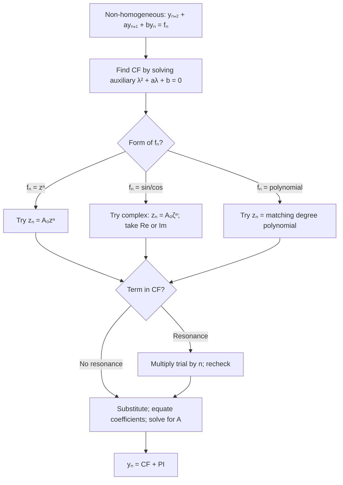

# Non-homogeneous Equations with Constant Coefficients

This final lecture applies the method of undetermined coefficients — already mastered for ODEs in Lecture 9 — to *difference* equations. The structure is exactly the same: find the homogeneous solution, guess a particular solution matching the forcing term, check for resonance.

## The Equation

$$y_{n+2} + ay_{n+1} + by_n = f_n $$

where $a$, $b$ are constants and $f_n$ is a given sequence (the "forcing term").

**General solution = Complementary Function + Particular Solution:**

$$y_n = y_n^{(c)} + z_n$$

where $y_n^{(c)}$ solves the homogeneous equation (Lecture 14) and $z_n$ is *any* particular solution.

---

## Method of Undetermined Coefficients

The forcing term $f_n$ must be one of these forms:

1. $f_n = z^n$ (geometric sequence)
2. $f_n = A_1 \sin cn + A_2 \cos cn$ (trigonometric sequence)
3. $f_n = A_0 + A_1 n + \cdots + A_m n^m$ (polynomial sequence)
4. Any combination of the above.

**Procedure:**

1. Find the homogeneous general solution $y_n^{(c)}$ (using the auxiliary equation — Lecture 14).
2. Write a trial particular solution $z_n$ in the same form as $f_n$ with undetermined coefficients.
3. If no term of $z_n$ appears in $y_n^{(c)}$ → substitute $z_n$ for $y_n$ in (15.1) and solve for the coefficients.
4. If some term of $z_n$ *appears* in $y_n^{(c)}$ (resonance) → multiply $z_n$ by $n$ (or $n^2$ if needed) until no term of the new trial is in $y_n^{(c)}$.
5. General solution: $y_n = y_n^{(c)} + z_n$.

---

## Case 1 — Geometric Forcing $f_n = z^n$

### Trial: $z_n = A_0 z^n$

---

### Example 15.1

Solve: $y_{n+2} - 5y_{n+1} + 6y_n = 5^{n+1}$ (equation 15.3)

**Step 1. CF.** Auxiliary: $\lambda^2 - 5\lambda + 6 = (\lambda-2)(\lambda-3) = 0$. Roots: $\lambda = 2, 3$.

$$y_n^{(c)} = A\cdot 2^n + B\cdot 3^n$$

**Step 2. PI.** $f_n = 5^{n+1} = 5\cdot 5^n$. Since $5^n$ does not appear in the CF, try $z_n = A_0 \cdot 5^{n+1}$.

Substitute $z_n$ for $y_n$ in (15.3):

$$A_0 5^{n+3} - 5A_0 5^{n+2} + 6A_0 5^{n+1} = 5^{n+1}$$

$$A_0 5^{n+1}(25 - 25 + 6) = 5^{n+1}$$

$$6A_0 = 1 \Rightarrow A_0 = \frac{1}{6}$$

$$z_n = \frac{5^{n+1}}{6}$$

**General solution:**

$$y_n = A\cdot 2^n + B\cdot 3^n + \frac{5^{n+1}}{6}$$

---

### Example 15.2 — Resonance with Geometric Term

Solve: $y_{n+2} - 5y_{n+1} + 6y_n = 2^n$ (equation 15.4)

**CF** is the same: $y_n^{(c)} = A\cdot 2^n + B\cdot 3^n$.

**Step 2.** Try $z_n = A_0 \cdot 2^n$. But $2^n$ is already in the CF — resonance!

**Fix:** Try $z_n = A_0 n \cdot 2^n$.

Substitute:

$$A_0(n+2)2^{n+2} - 5A_0(n+1)2^{n+1} + 6A_0 n\cdot 2^n = 2^n$$

Factor out $2^n$:

$$A_0 2^n\left[4(n+2) - 10(n+1) + 6n\right] = 2^n$$

$$A_0(4n + 8 - 10n - 10 + 6n) = 1$$

$$A_0(-2) = 1 \Rightarrow A_0 = -\frac{1}{2}$$

$$z_n = -\frac{n\cdot 2^n}{2} = -\frac{n}{2}\cdot 2^n$$

**General solution:**

$$y_n = A\cdot 2^n + B\cdot 3^n - \frac{n\cdot 2^n}{2}$$

---

## Case 2 — Trigonometric Forcing

### Trial: $z_n = A\cos cn + B\sin cn$

Use the polar/complex exponential form for efficiency.

---

### Example 15.3

Solve: $y_{n+2} + 8y_n = \sin\frac{\pi n}{2}$ (equation 15.5 — modifying from textbook)

**Step 1. CF.** From Lecture 14 Example 14.3: $\lambda^2 + 8 = 0$ gives $\lambda = \pm 2\sqrt{2}\,i$, $r = 2\sqrt{2}$, $\theta = \pi/2$.

$$y_n^{(c)} = (2\sqrt{2})^n\left(c_1\cos\frac{n\pi}{2} + c_2\sin\frac{n\pi}{2}\right)$$

**Step 2. PI.** Use complex: $\sin\frac{\pi n}{2} = \text{Im}(e^{in\pi/2}) = \text{Im}(\zeta^n)$ where $\zeta = e^{i\pi/2} = i$.

Try $z_n = A_0 \zeta^n = A_0 i^n$.

Check resonance: $|\zeta| = 1 \neq 2\sqrt{2} = r$. Not resonant. ✓

Substitute:

$$A_0 i^{n+2} + 8A_0 i^n = i^n$$

$$A_0(i^2 + 8) = 1$$

$$A_0(-1 + 8) = 1 \Rightarrow A_0 = \frac{1}{7}$$

PI:

$$z_n = \text{Im}\!\left(\frac{i^n}{7}\right) = \frac{1}{7}\sin\frac{n\pi}{2}$$

**General solution:**

$$y_n = (2\sqrt{2})^n\!\left(c_1\cos\frac{n\pi}{2} + c_2\sin\frac{n\pi}{2}\right) + \frac{1}{7}\sin\frac{n\pi}{2}$$

---

## Case 3 — Polynomial Forcing $f_n = $ polynomial in $n$

### Trial: $z_n = B_0 + B_1 n + \cdots + B_m n^m$ (same degree as $f_n$)

---

### Example 15.4

Solve: $y_{n+2} - 5y_{n+1} + 6y_n = n$ (equation 15.6)

**CF:** $y_n^{(c)} = A\cdot 2^n + B\cdot 3^n$

**Step 2. PI.** Since $f_n = n$ is degree 1, try $z_n = A_0 n + A_1$.

Substitute into (15.6):

$$A_0(n+2) + A_1 - 5(A_0(n+1) + A_1) + 6(A_0 n + A_1) = n$$

Expand:

$$A_0 n + 2A_0 + A_1 - 5A_0 n - 5A_0 - 5A_1 + 6A_0 n + 6A_1 = n$$

Group by power of $n$:

- $n^1$: $A_0 - 5A_0 + 6A_0 = 2A_0 = 1 \Rightarrow A_0 = \frac{1}{2}$
- $n^0$: $2A_0 - 5A_0 + A_1 - 5A_1 + 6A_1 = -3A_0 + 2A_1 = 0$

$2A_1 = 3A_0 = \frac{3}{2} \Rightarrow A_1 = \frac{3}{4}$

$$z_n = \frac{n}{2} + \frac{3}{4} = \frac{2n+3}{4}$$

**General solution:**

$$y_n = A\cdot 2^n + B\cdot 3^n + \frac{2n+3}{4}$$

---

## Resonance Rule (Summary)

When the trial $z_n$ contains a term that is part of the complementary function $y_n^{(c)}$:

- **Multiply the trial by $n$**.
- If $nz_n$ still contains a term from the CF (double root), **multiply by $n^2$**.

This mirrors the ODE rule: multiply trial PI by $x$ for each repetition of a root.

---

## Decision Flowchart

---

## Key Takeaways

- Non-homogeneous difference equations: general solution = CF (Lecture 14) + PI (this lecture).
- Method of undetermined coefficients for difference equations is identical in spirit to the ODE version.
- Resonance: if the trial PI matches a term in the CF, multiply the trial by $n$.
- For complex/trigonometric forcing, work in polar form and use the complex exponential trick.
- Equate coefficients of like powers of $\lambda$ (or like powers of $n$) to determine the undetermined coefficients.

---

## Exam Tips

- Always write down the CF before attempting the PI — resonance check depends on knowing the CF.
- When substituting a geometric trial $z_n = A_0 z^{n+k}$, factor out $z^n$ to simplify.
- For polynomial trials, include all powers from 0 to the degree of $f_n$ in the trial.
- If the degree of $f_n$ is 2, the trial is $A_0 n^2 + A_1 n + A_2$ — all three terms even if $f_n$ only has $n^2$.
- Double-check: substitute the particular solution back into the original difference equation to verify it works.
