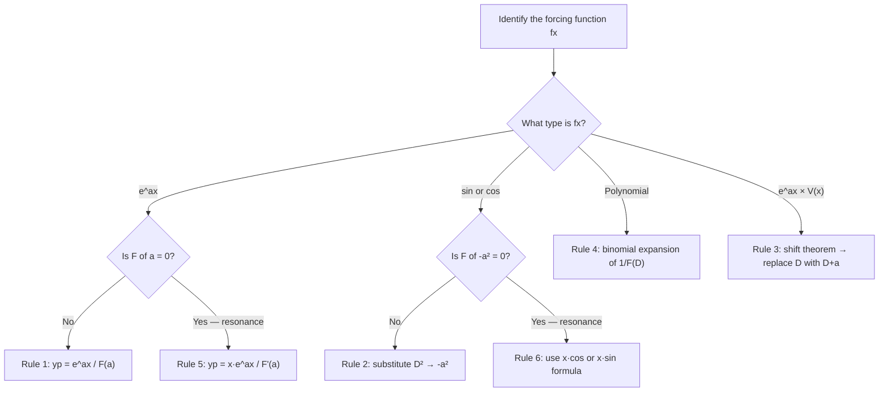

# The D-Operator Method

The D-operator method is an elegant algebraic shortcut that lets you find particular solutions of linear ODEs through symbol manipulation — almost like algebra on operators rather than functions. Once you get fluent with it, it is dramatically faster than undetermined coefficients for standard forcing functions.

The central idea is to treat the differentiation operator $D \equiv \frac{d}{dx}$ as if it were an algebraic variable. You can then factor, invert, and apply rules to it, just like you would with a number or polynomial. The ODE $y'' + 3y' + 2y = f(x)$ becomes $(D^2 + 3D + 2)y = f(x)$, and the particular solution is formally written as $y_p = \frac{1}{D^2 + 3D + 2} f(x)$. The operator $\frac{1}{F(D)}$ is the **inverse operator** — it "undoes" $F(D)$.

> **Analogy:** In ordinary algebra, if $3x = 12$, then $x = \frac{1}{3} \times 12 = 4$. The inverse operator works the same way: if $(D^2 + 3D + 2)y_p = f(x)$, then $y_p = \frac{1}{D^2 + 3D + 2} f(x)$. You're dividing both sides by the operator polynomial.

---

## D-Operator Notation

Define:

$$D y = y', \quad D^2 y = y'', \quad D^n y = \frac{d^n y}{dx^n}$$

Also: $\frac{1}{D} y = \int y\, dx$ (the inverse is integration).

A second-order ODE:
$$a y'' + by' + cy = f(x)$$

becomes:
$$(aD^2 + bD + c)y = f(x) \quad \Leftrightarrow \quad F(D)\, y = f(x)$$

The particular solution is:
$$y_p = \frac{1}{F(D)} f(x) = \frac{f(x)}{F(D)}$$

The complementary solution $y_c$ is found exactly as before (auxiliary equation, roots, same as in undetermined coefficients).

---

## The Inverse Operator Rules

These six rules do all the heavy lifting. Each one tells you how to evaluate $\frac{1}{F(D)}$ applied to a specific type of function.

### Rule 1: Exponential Function

$$\frac{1}{F(D)} e^{ax} = \frac{e^{ax}}{F(a)}, \quad \text{provided } F(a) \neq 0$$

You simply substitute $D = a$ into $F(D)$ and divide. This is by far the fastest rule.

**Why it works:** Applying $D$ to $e^{ax}$ just multiplies by $a$: $D e^{ax} = ae^{ax}$, $D^2 e^{ax} = a^2 e^{ax}$, and so on. So $F(D) e^{ax} = F(a) e^{ax}$, which means $\frac{1}{F(D)} e^{ax} = \frac{e^{ax}}{F(a)}$.

---

### Rule 2: Sine and Cosine

$$\frac{1}{F(D^2)} \sin(ax) = \frac{\sin(ax)}{F(-a^2)}, \quad \text{provided } F(-a^2) \neq 0$$

$$\frac{1}{F(D^2)} \cos(ax) = \frac{\cos(ax)}{F(-a^2)}, \quad \text{provided } F(-a^2) \neq 0$$

**Key:** Replace $D^2$ with $-a^2$ throughout $F(D)$, then divide.

**Important:** This rule applies only when the denominator is a function of $D^2$ alone (no odd powers of $D$). When odd powers of $D$ are present, you need an extra step — see the worked examples below.

---

### Rule 3: The Shift Theorem (Exponential × Function)

$$\frac{1}{F(D)}\left[e^{ax} V(x)\right] = e^{ax} \frac{V(x)}{F(D+a)}$$

This "shifts" the operator: replace $D$ with $D + a$ everywhere in $F$, then apply to $V(x)$.

**When to use:** Any forcing of the form $e^{ax} \sin(mx)$, $e^{ax} \cos(mx)$, or $e^{ax} \times \text{polynomial}$.

---

### Rule 4: Polynomial (Binomial Expansion)

When $f(x)$ is a polynomial in $x$, expand $\frac{1}{F(D)}$ as a power series in $D$ using:

$$\frac{1}{1+u} = 1 - u + u^2 - u^3 + \cdots, \qquad \frac{1}{1-u} = 1 + u + u^2 + u^3 + \cdots$$

You only need terms up to $D^n$ where $n$ is the degree of the polynomial, because $D^{n+1} x^n = 0$.

---

### Rule 5: Resonance — Exponential Failing Case

When $F(a) = 0$ (the rule above fails), use:

$$\frac{1}{F(D)} e^{ax} = \frac{x\, e^{ax}}{F'(a)}, \quad \text{provided } F'(a) \neq 0$$

If also $F'(a) = 0$:
$$\frac{1}{F(D)} e^{ax} = \frac{x^2 e^{ax}}{F''(a)}$$

---

### Rule 6: Resonance — Sinusoidal Failing Case

When $F(-a^2) = 0$ (sine/cosine rule fails):

$$\frac{1}{D^2 + a^2} \sin(ax) = -\frac{x\cos(ax)}{2a}, \qquad \frac{1}{D^2 + a^2} \cos(ax) = \frac{x\sin(ax)}{2a}$$

---

## Summary: Which Rule to Use?

---

## Worked Example 1: Exponential Forcing (Rule 1)

**Problem:** Find a particular integral of $y'' + y' - 2y = 3e^{-x}$.

Operator form: $(D^2 + D - 2)y = 3e^{-x}$, so $F(D) = D^2 + D - 2$.

$$y_p = \frac{3e^{-x}}{D^2 + D - 2}$$

Apply Rule 1 — substitute $D = -1$:
$$y_p = \frac{3e^{-x}}{(-1)^2 + (-1) - 2} = \frac{3e^{-x}}{1 - 1 - 2} = \frac{3e^{-x}}{-2} = -\frac{3}{2}e^{-x}$$

**Check:** $F(-1) = 1 - 1 - 2 = -2 \neq 0$, so Rule 1 applies cleanly.

$$\boxed{y_p = -\frac{3}{2}e^{-x}}$$

---

## Worked Example 2: Cosine Forcing (Rule 2 with Odd-Power Step)

**Problem:** Find a particular integral of $y'' + 3y' + 2y = 10\cos 2x$.

Operator form: $F(D) = D^2 + 3D + 2$.

$$y_p = \frac{10\cos 2x}{D^2 + 3D + 2}$$

Substitute $D^2 = -(2)^2 = -4$:
$$y_p = \frac{10\cos 2x}{-4 + 3D + 2} = \frac{10\cos 2x}{3D - 2}$$

There is still a $D$ in the denominator. To clear it, **multiply numerator and denominator by the conjugate** $(3D + 2)$ to get a denominator involving $D^2$ only:

$$y_p = \frac{(3D + 2) \cdot 10\cos 2x}{(3D - 2)(3D + 2)} = \frac{(3D + 2) \cdot 10\cos 2x}{9D^2 - 4}$$

Substitute $D^2 = -4$:
$$= \frac{(3D + 2) \cdot 10\cos 2x}{9(-4) - 4} = \frac{(3D + 2) \cdot 10\cos 2x}{-40}$$

Now apply $(3D + 2)$ to $10\cos 2x$:
- $D(\cos 2x) = -2\sin 2x$, so $3D(10\cos 2x) = -60\sin 2x$
- $2(10\cos 2x) = 20\cos 2x$

$$y_p = \frac{-60\sin 2x + 20\cos 2x}{-40} = \frac{3}{2}\sin 2x - \frac{1}{2}\cos 2x$$

$$\boxed{y_p = \frac{3}{2}\sin 2x - \frac{1}{2}\cos 2x}$$

This matches the answer from undetermined coefficients — a good sanity check.

---

## Worked Example 3: Polynomial Forcing (Rule 4 — Binomial Expansion)

**Problem:** Find a particular solution of $y'' + 2y' + 2y = x^2$.

Operator form: $F(D) = D^2 + 2D + 2$.

$$y_p = \frac{x^2}{D^2 + 2D + 2} = \frac{x^2}{2\left(1 + \frac{2D + D^2}{2}\right)} = \frac{1}{2}\left(1 + \frac{2D + D^2}{2}\right)^{-1} x^2$$

Let $u = \frac{2D + D^2}{2}$. Expand $(1 + u)^{-1} = 1 - u + u^2 - \cdots$, keeping terms up to $D^2$ (since $D^3 x^2 = 0$):

$$\left(1 + u\right)^{-1} \approx 1 - \frac{2D + D^2}{2} + \left(\frac{2D + D^2}{2}\right)^2 + \cdots$$

The last term: $\left(\frac{2D}{2}\right)^2 = D^2$ contributes. The full expansion to $D^2$ is:

$$1 - D - \frac{D^2}{2} + D^2 = 1 - D + \frac{D^2}{2}$$

So:
$$y_p = \frac{1}{2}\left(1 - D + \frac{D^2}{2}\right) x^2$$

Apply term by term:
- $x^2$ stays as $x^2$
- $Dx^2 = 2x$
- $D^2 x^2 = 2$

$$y_p = \frac{1}{2}\left(x^2 - 2x + \frac{1}{2}(2)\right) = \frac{1}{2}\left(x^2 - 2x + 1\right)$$

$$\boxed{y_p = \frac{1}{2}(x - 1)^2 = \frac{x^2}{2} - x + \frac{1}{2}}$$

---

## Worked Example 4: Shift Theorem with Resonance

**Problem:** Find a particular solution of $y'' + 2y' + 2y = e^{-x}\sin x$.

Operator form: $F(D) = D^2 + 2D + 2$.

$$y_p = \frac{e^{-x}\sin x}{D^2 + 2D + 2}$$

Apply the **shift theorem** (Rule 3) with $a = -1$, $V(x) = \sin x$:

$$y_p = e^{-x} \cdot \frac{\sin x}{(D-1)^2 + 2(D-1) + 2}$$

Expand the new denominator:
$$(D-1)^2 + 2(D-1) + 2 = D^2 - 2D + 1 + 2D - 2 + 2 = D^2 + 1$$

Now apply Rule 2 to $\frac{\sin x}{D^2 + 1}$ — but first check: $F(-1^2) = -1 + 1 = 0$. This is the **failing case** (Rule 6):

$$\frac{\sin x}{D^2 + 1} = -\frac{x\cos x}{2 \cdot 1} = -\frac{x\cos x}{2}$$

Therefore:
$$y_p = e^{-x} \cdot \left(-\frac{x\cos x}{2}\right)$$

$$\boxed{y_p = -\frac{x\, e^{-x}\cos x}{2}}$$

---

## Worked Example 5: Exponential Resonance (Rule 5)

**Problem:** Find a particular solution of $y'' - y = e^x$.

$F(D) = D^2 - 1$. Check: $F(1) = 1 - 1 = 0$. **Resonance — Rule 5.**

$$F'(D) = 2D, \quad F'(1) = 2 \neq 0$$

$$y_p = \frac{x\, e^x}{F'(1)} = \frac{x\, e^x}{2}$$

$$\boxed{y_p = \frac{x e^x}{2}}$$

---

> **Key Takeaways**
>
> - Write the ODE as $F(D)y = f(x)$, then $y_p = \frac{f(x)}{F(D)}$
> - **Rule 1 (exponential):** substitute $D = a$, divide. Fastest rule — use it whenever $f(x) = e^{ax}$
> - **Rule 2 (sin/cos):** substitute $D^2 = -a^2$. If odd powers of $D$ remain in the denominator, multiply top and bottom by the conjugate
> - **Rule 3 (shift theorem):** for $e^{ax} V(x)$, factor out $e^{ax}$ and replace $D \to D + a$ in $F$
> - **Rule 4 (polynomial):** write $F(D) = c(1 + \text{stuff})$, expand $(1 + \text{stuff})^{-1}$ as a binomial series, stop when derivative exceeds the polynomial degree
> - **Always check for resonance** ($F(a) = 0$ or $F(-a^2) = 0$) before applying Rules 1 or 2 — if resonance, use the $x e^{ax}/F'(a)$ or $x\sin/\cos$ failing-case formulas
> - The operator method and undetermined coefficients give the same $y_p$ — use whichever is faster

---

> **Exam Tips**
>
> - **Rule 1 is your fastest tool for exam speed.** For $e^{ax}$ forcing with no resonance, you can write the answer in one line.
> - **The conjugate trick for cosine/sine with odd-$D$ denominators** (multiply by the conjugate to get a $D^2$-only denominator) is tested explicitly — know it cold.
> - **Resonance check is mandatory before every application of Rules 1 and 2.** Write $F(a) = \ldots$ explicitly in your working, even if it seems obvious. Examiners look for this.
> - **The shift theorem** typically appears in exam questions as $e^{-x}\sin x$ or $e^{2x}\cos 3x$ forcing. After shifting ($D \to D+a$), you almost always end up needing Rule 2 or the resonance form for sine/cosine.
> - **Binomial expansion for polynomials:** a degree-2 polynomial needs at most $D^2$ terms; degree-3 needs $D^3$ terms. If you stop too early, you get a wrong answer. Stop too late and the extra terms are just zero.
> - **The operator method finds $y_p$ only.** You still need to find $y_c$ from the auxiliary equation and write the complete general solution $y = y_c + y_p$.
