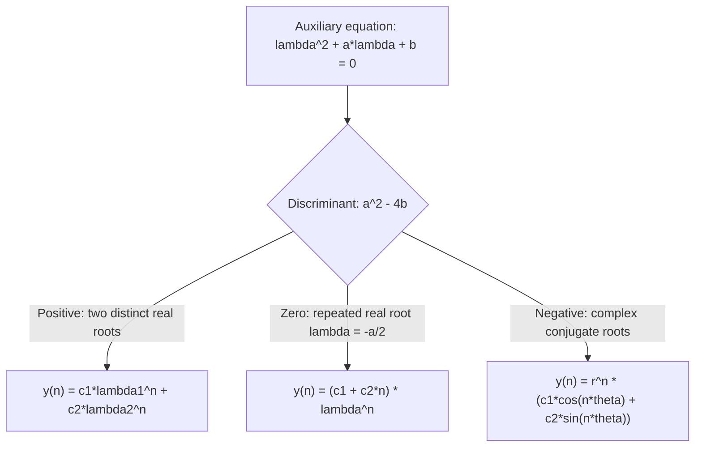

# Properties of Solutions

This lecture develops the theory of homogeneous second-order difference equations with constant coefficients. The treatment mirrors Lecture 8 (ODEs) almost exactly — there is an auxiliary equation, three cases based on the discriminant, and a general solution built from linearly independent solutions.

## The Setting

Consider the homogeneous second-order linear difference equation:

$$y_{n+2} + a y_{n+1} + b y_n = 0, \quad b \neq 0 $$

A **solution** is a sequence $y_0, y_1, y_2, \ldots$ satisfying (14.1) for all integers $n \geq 0$.

**Linear combinations:** If $x_n$ and $y_n$ are solutions of (14.1), then so is $Ax_n + By_n$ for any real constants $A$, $B$.

*Proof:* Substitute $z_n = Ax_n + By_n$ into (14.1):

$$z_{n+2} + az_{n+1} + bz_n = A(x_{n+2}+ax_{n+1}+bx_n) + B(y_{n+2}+ay_{n+1}+by_n) = 0 + 0 = 0 \checkmark$$

---

## The Casoration (Discrete Wronskian)

The analogue of the Wronskian for difference equations is the **Casoration**:

$$C_n(x, y) = x_n y_{n+1} - x_{n+1} y_n $$

**Properties:**
- $x_n$ and $y_n$ are linearly independent if and only if $C_n(x,y) \neq 0$ for some (equivalently, any) integer $n \geq 0$ — provided $b \neq 0$.
- If $b = 0$, the equation reduces in order and must be handled separately.

**Comparison with Wronskian:** The Wronskian for ODEs is $W(y_1, y_2) = y_1 y_2' - y_2 y_1'$. The Casoration replaces derivatives with *forward shifts* — $y_n' \to y_{n+1}$.

---

## Trial Solution and the Auxiliary Equation

Try $y_n = \lambda^n$ as a solution of (14.1):

$$\lambda^{n+2} + a\lambda^{n+1} + b\lambda^n = \lambda^n(\lambda^2 + a\lambda + b) = 0$$

Since this must hold for $n \geq 0$, we need (for $n=0$):

$$\lambda^2 + a\lambda + b = 0 $$

This is the **auxiliary equation** for the difference equation.

The roots are: $\lambda_{1,2} = \frac{-a \pm \sqrt{a^2 - 4b}}{2}$

---

## Three Cases (Paralleling ODEs)

---

## Case I — Distinct Real Roots ($a^2 - 4b > 0$)

If $\lambda_1 \neq \lambda_2$ are real, the general solution is:

$$y_n = c_1 \lambda_1^n + c_2 \lambda_2^n $$

---

### Example 14.1

Solve: $y_{n+2} - y_{n+1} - 6y_n = 0$

with initial conditions $y_0 = 1$, $y_1 = 8$.

**Step 1.** Auxiliary: $\lambda^2 - \lambda - 6 = (\lambda-3)(\lambda+2) = 0$

Roots: $\lambda_1 = 3$, $\lambda_2 = -2$.

**Step 2.** General solution:

$$y_n = c_1 \cdot 3^n + c_2 \cdot (-2)^n $$

**Step 3.** Apply initial conditions:

$y_0 = c_1 + c_2 = 1$

$y_1 = 3c_1 - 2c_2 = 8$

**Solve:** From the first: $c_1 = 1 - c_2$. Substitute:

$3(1-c_2) - 2c_2 = 8 \Rightarrow 3 - 5c_2 = 8 \Rightarrow c_2 = -1$, $c_1 = 2$.

**Particular solution:**

$$y_n = 2 \cdot 3^n - (-2)^n$$

---

## Case II — Repeated Real Root ($a^2 - 4b = 0$)

The repeated root is $\lambda = -\frac{a}{2}$.

One solution is $y_n = \lambda^n$. A second independent solution is $y_n = n\lambda^n$.

*Verification:* Substitute $y_n = n\lambda^n$ into the left side of (14.1):

$$(n+2)\lambda^{n+2} + a(n+1)\lambda^{n+1} + bn\lambda^n$$

$$= \lambda^n\left[n(\lambda^2+a\lambda+b) + (2\lambda^2 + a\lambda)\right]$$

$$= \lambda^n\left[n \cdot 0 + \lambda(2\lambda + a)\right] = \lambda^{n+1}(2\lambda + a)$$

Since $\lambda = -a/2$, we have $2\lambda + a = 0$. So $n\lambda^n$ is indeed a solution. ✓

**General solution:**

$$y_n = (c_1 + c_2 n)\lambda^n, \qquad \lambda = -\frac{a}{2} $$

---

### Example 14.2

Solve: $y_{n+2} - 4y_{n+1} + 4y_n = 0$, with $y_0 = 1$, $y_1 = -2$.

**Step 1.** Auxiliary: $\lambda^2 - 4\lambda + 4 = (\lambda-2)^2 = 0$. Repeated root $\lambda = 2$.

**Step 2.** General solution: $y_n = (c_1 + c_2 n)\cdot 2^n$

**Step 3.** Apply conditions:

$y_0 = c_1 = 1$

$y_1 = (c_1 + c_2)\cdot 2 = 2(1 + c_2) = -2 \Rightarrow c_2 = -2$.

**Particular solution:**

$$y_n = (1 - 2n)\cdot 2^n$$

---

## Case III — Complex Conjugate Roots ($a^2 - 4b < 0$)

The roots are $\lambda_{1,2} = \alpha \pm i\beta$ where $\alpha = -\frac{a}{2}$, $\beta = \frac{\sqrt{4b-a^2}}{2}$.

In **polar form**: $\lambda = re^{i\theta}$ where $r = |\lambda| = \sqrt{\alpha^2+\beta^2}$ and $\theta = \arctan(\beta/\alpha)$.

Since $\lambda^n = r^n e^{in\theta} = r^n(\cos n\theta + i\sin n\theta)$, the two real independent solutions are:

$$x_n^* = r^n \cos n\theta, \qquad y_n^* = r^n \sin n\theta$$

**General solution:**

$$y_n = r^n(c_1 \cos n\theta + c_2 \sin n\theta) $$

where $r = \sqrt{\alpha^2+\beta^2}$, $\theta = \arctan(\beta/\alpha)$, $0 < \theta < 2\pi$.

---

### Example 14.3

Find the general solution of $y_{n+2} + 8y_n = 0$.

**Step 1.** Auxiliary: $\lambda^2 + 8 = 0$, so $\lambda^2 = -8$.

$\lambda = \pm 2i\sqrt{2}$. So $\alpha = 0$, $\beta = 2\sqrt{2}$.

$r = 2\sqrt{2}$, $\theta = \arctan(2\sqrt{2}/0) = \pi/2$.

**General solution:**

$$y_n = (2\sqrt{2})^n\left(c_1 \cos\frac{n\pi}{2} + c_2 \sin\frac{n\pi}{2}\right)$$

**With $y_0 = 0$, $y_1 = 2000$:**

From $y_0$: $c_1\cos 0 + c_2 \sin 0 = c_1 = 0$.

From $y_1$: $(2\sqrt{2})^1 c_2 \sin(\pi/2) = 2\sqrt{2}\cdot c_2 = 2000 \Rightarrow c_2 = \frac{1000}{\sqrt{2}} = 500\sqrt{2}$.

**Particular solution:**

$$y_n = (2\sqrt{2})^n \cdot 500\sqrt{2} \cdot \sin\frac{n\pi}{2}$$

---

## Parallel Summary: ODEs vs Difference Equations

| Feature | 2nd-Order ODE | 2nd-Order Difference Eq |
|---|---|---|
| Reduced equation | $ay'' + by' + cy = 0$ | $y_{n+2} + ay_{n+1} + by_n = 0$ |
| Auxiliary equation | $am^2 + bm + c = 0$ | $\lambda^2 + a\lambda + b = 0$ |
| Two distinct real roots | $Ae^{m_1 x} + Be^{m_2 x}$ | $c_1\lambda_1^n + c_2\lambda_2^n$ |
| Repeated root | $(A+Bx)e^{mx}$ | $(c_1+c_2 n)\lambda^n$ |
| Complex roots $p \pm iq$ | $e^{px}(A\cos qx + B\sin qx)$ | $r^n(c_1\cos n\theta + c_2\sin n\theta)$ |
| Independence test | Wronskian $W = y_1y_2' - y_2y_1'$ | Casoration $C_n = x_n y_{n+1} - x_{n+1}y_n$ |

---

## Key Takeaways

- The auxiliary equation for $y_{n+2} + ay_{n+1} + by_n = 0$ is $\lambda^2 + a\lambda + b = 0$.
- Three cases determined by $a^2 - 4b$: distinct real, repeated, complex.
- Complex roots in polar form: $r = \sqrt{\alpha^2+\beta^2}$, $\theta = \arctan(\beta/\alpha)$, giving $r^n\cos n\theta$ and $r^n\sin n\theta$.
- The Casoration $C_n = x_n y_{n+1} - x_{n+1}y_n$ tests linear independence.
- Two initial conditions ($y_0$ and $y_1$) determine the two arbitrary constants.

---

## Exam Tips

- The auxiliary equation for a difference equation is formed the same way as for ODEs: replace $y_{n+k}$ with $\lambda^k$.
- In Case III, find $r$ and $\theta$ carefully. $r = |\lambda|$, $\theta$ = argument of $\lambda$ (not just $\arctan(\text{Im}/\text{Re})$ — check the quadrant).
- For the repeated root case, the second solution is $n\lambda^n$ — do not confuse with the ODE case where it's $xe^{mx}$. Both multiply by the "index" variable.
- Always apply two initial conditions to get two equations in $c_1$ and $c_2$.
- Verify your solution by substituting $y_0$, $y_1$ into the recurrence to check $y_2$ is correct.
