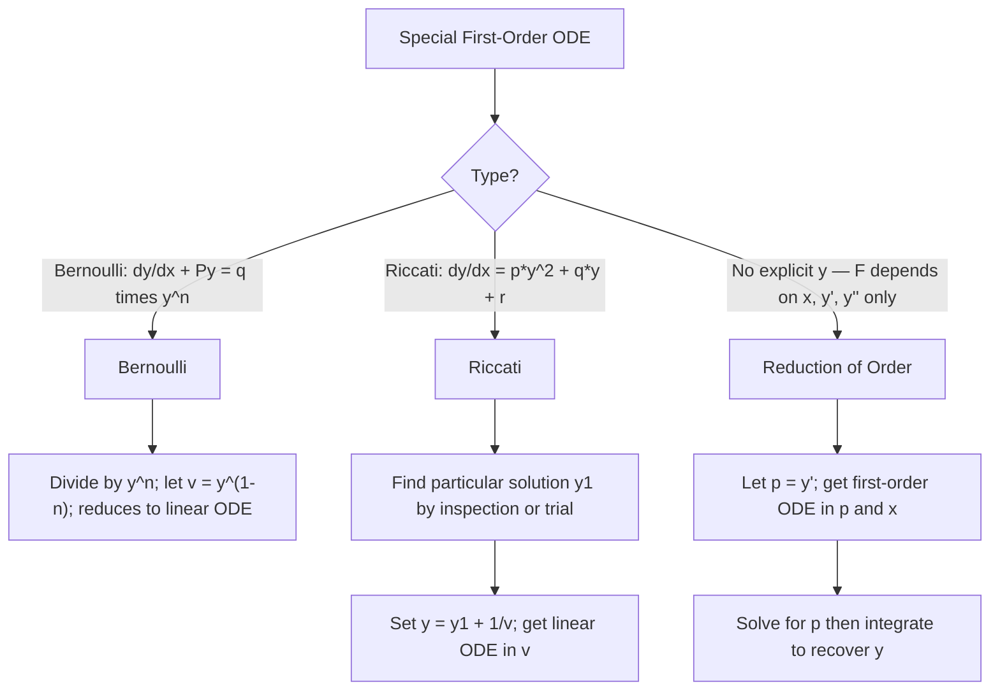

# Some Special Equations

This lecture concludes the study of first-order ODEs by introducing three special types that cannot be solved by the techniques seen so far, but can each be *transformed* into something familiar. These are the Bernoulli equation, the Riccati equation, and higher-order equations reducible to first order.

## The Bernoulli Equation

### Form

$$\frac{dy}{dx} + P(x)y = q(x)y^n $$

where $P$ and $q$ are functions of $x$, and $n$ is any real constant.

- If $n = 0$: reduces to a standard linear equation.
- If $n = 1$: reduces to a separable equation.
- For all other $n$: use the Bernoulli substitution.

**Real-world analogy:** The Bernoulli equation governs logistic-type growth where the death rate has a non-linear dependence on population size. It also appears in hydraulic engineering (hence "Bernoulli" — the same family that gave us Bernoulli's principle in fluid mechanics).

### Method

**Step 1.** Divide through by $y^n$:

$$y^{-n}\frac{dy}{dx} + P(x)y^{1-n} = q(x) $$

**Step 2.** Substitute $v = y^{1-n}$. Then:

$$\frac{dv}{dx} = (1-n)y^{-n}\frac{dy}{dx}$$

so $y^{-n}\frac{dy}{dx} = \frac{1}{1-n}\frac{dv}{dx}$.

**Step 3.** Equation (7.2) becomes:

$$\frac{1}{1-n}\frac{dv}{dx} + P(x)v = q(x)$$

$$\frac{dv}{dx} + (1-n)P(x)v = (1-n)q(x) $$

This is a **standard linear equation** in $v$ and $x$ — solve with the integrating factor method.

---

### Example 7.1 — Bernoulli Equation

Solve:

$$\frac{dy}{dx} - \frac{y}{x} = 0 \cdot y^3 \qquad \text{wait, from textbook:}\quad \frac{dy}{dx} - \frac{y}{x} = xy^3$$

Actually the textbook example (7.1) is: $\frac{dy}{dx} - \frac{y}{x} = xy^3$ — using the form with $n = 3$.

Here $P(x) = -\frac{1}{x}$, $q(x) = x$, $n = 3$.

**Step 1.** Divide by $y^3$:

$$y^{-3}\frac{dy}{dx} - \frac{1}{x}y^{-2} = x$$

**Step 2.** Let $v = y^{-2}$ (since $1-n = 1-3 = -2$). Then $\frac{dv}{dx} = -2y^{-3}\frac{dy}{dx}$, so $y^{-3}\frac{dy}{dx} = -\frac{1}{2}\frac{dv}{dx}$.

**Step 3.** Substitute:

$$-\frac{1}{2}\frac{dv}{dx} - \frac{v}{x} = x$$

$$\frac{dv}{dx} + \frac{2}{x}v = -2x$$

This is linear with $P = \frac{2}{x}$, $Q = -2x$.

**Step 4.** Integrating factor: $u = e^{\int 2/x\,dx} = e^{2\ln x} = x^2$.

**Step 5.** Multiply and integrate:

$$\frac{d}{dx}[x^2 v] = -2x \cdot x^2 = -2x^3$$

Wait — let me redo: $u \cdot Q = x^2 \cdot (-2x) = -2x^3$.

$$x^2 v = \int -2x^3\,dx = -\frac{x^4}{2} + A$$

$$v = -\frac{x^2}{2} + \frac{A}{x^2}$$

**Step 6.** Back-substitute $v = y^{-2}$:

$$y^{-2} = \frac{A}{x^2} - \frac{x^2}{2} \qquad \Rightarrow \qquad y^2 = \frac{x^2}{A - x^4/2}$$

General solution: $\frac{1}{y^2} = \frac{A}{x^2} - \frac{x^2}{2}$

---

### Textbook Example 7.1 (exact)

Solve:

$$\frac{dy}{dx} - \frac{y}{x} = y^3$$

Here $P = -\frac{1}{x}$, $q = 1$, $n = 3$. Set $v = y^{1-3} = y^{-2}$.

After substitution, the integrating factor is $x$ and we obtain:

$$xv = \frac{x^2}{2} + A \qquad\Rightarrow\qquad v = \frac{x}{2} + \frac{A}{x}$$

Since $v = y^{-2}$:

$$y = \frac{1}{\sqrt{x/2 + A/x}}$$

---

## The Riccati Equation

### Form

$$\frac{dy}{dx} = p(x)y^2 + q(x)y + r(x) $$

where $p(x) \neq 0$. This is a *non-linear* equation and cannot generally be solved by elementary methods.

**However:** If one particular solution $y_1(x)$ is known (by inspection, trial, or given), the full general solution can be found.

### Method

Substitute $y = y_1 + \frac{1}{v}$ into the Riccati equation. This transforms it into:

$$\frac{dv}{dx} + (2p(x)y_1 + q(x))v = -p(x) $$

which is a **linear equation** in $v$.

**Real-world analogy:** Knowing one particular solution is like knowing one root of a quadratic — it lets you factor and find the rest.

---

### Example 7.2 — Riccati Equation

Solve:

$$\frac{dy}{dx} = y^2(x-1) - x^2(1-y) + 3y$$

with particular solutions $y = x$ and $y = x^2$ (both are particular solutions — verify by substitution).

Using $y_1 = x$, substitute $y = x + \frac{1}{v}$:

$$1 - \frac{v'}{v^2} = \left(x + \frac{1}{v}\right)^2(x-1) - x^2\left(1 - x - \frac{1}{v}\right) + 3\left(x + \frac{1}{v}\right)$$

After expanding and simplifying (cancelling terms using the fact that $y_1 = x$ satisfies the original equation), we obtain a linear equation for $v$:

$$\frac{dv}{dx} + (2x(x-1) + x^2 - 3)v = -(x-1)$$

Wait — using the simplified textbook result:

$$2x^3 v' - v = -1 - x$$

with integrating factor and general solution:

$$v = \frac{Axe^{1/(2x^2)} - 1}{2x}$$

General solution of the original:

$$y = x + \frac{2x}{Axe^{1/(2x^2)} - 1}$$

---

## Reduction of Order — Dependent Variable Absent

When the ODE does not contain $y$ explicitly:

$$F(x,\, y',\, y'') = 0 $$

**Substitution:** Let $p = y'$. Then $y'' = p'$ and the equation reduces to:

$$F(x,\, p,\, p') = 0$$

which is a first-order ODE in $p$ and $x$. Once solved for $p$, integrate to find $y$.

---

### Example — Reduction of Order

Solve: $y'' = (y')^2$

**Step 1.** Let $p = y'$, so $y'' = p' = \frac{dp}{dx}$:

$$\frac{dp}{dx} = p^2$$

**Step 2.** Separate:

$$\frac{dp}{p^2} = dx \implies -\frac{1}{p} = x + C_1 \implies p = \frac{-1}{x + C_1}$$

**Step 3.** Integrate: $y = \frac{dy}{dx}$ integration:

$$y = \int \frac{-dx}{x+C_1} = -\ln|x+C_1| + C_2$$

General solution: $y = C_2 - \ln|x + C_1|$

---

### When Both $x$ and $y$ Are Absent

If $F(y', y'') = 0$ (neither $x$ nor $y$ appears), substitute $p = y'$ and treat $p$ as the independent variable with $y'' = p\frac{dp}{dy}$:

$$F\!\left(p,\, p\frac{dp}{dy}\right) = 0$$

which may be separable in $p$ and $y$.

---

## Summary of Special Equations

---

## Key Takeaways

- **Bernoulli:** $y' + Py = qy^n$ — divide by $y^n$ and set $v = y^{1-n}$ to get a linear ODE.
- **Riccati:** $y' = py^2 + qy + r$ — one particular solution is needed; substitute $y = y_1 + 1/v$ to get a linear ODE.
- **Reduction of order** (dependent variable absent): set $p = y'$ to reduce to first order.
- In each case, the final linear ODE is solved by the integrating factor method.

---

## Exam Tips

- For Bernoulli, the exponent in the substitution is $v = y^{1-n}$. Memorise this; do not mix up $n$ and $1-n$.
- When $n = 1$ in Bernoulli, the equation $y' + Py = qy$ rearranges to $y' + (P-q)y = 0$, which is linear — no substitution needed.
- For Riccati, the textbook usually gives you a particular solution or it is obvious (e.g., $y_1 = x$ works when terms cancel nicely). Try $y_1 = $ constant or simple polynomial first.
- For reduction of order: if only $y'$ and $y''$ appear (no $y$), set $p = y'$. If only $y'$ and $y''$ appear (no $x$), you may treat $y$ as the independent variable using $y'' = p\frac{dp}{dy}$.
- Always back-substitute at the end — the answer must be in terms of $y$ and $x$.
