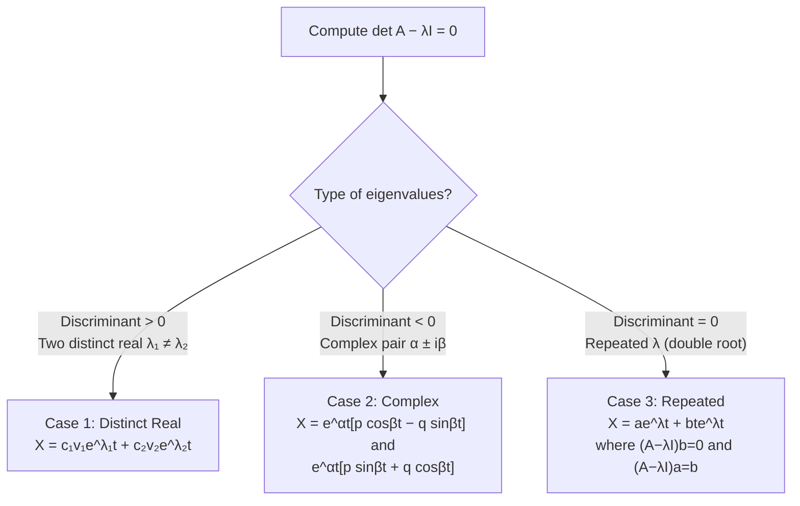

# Systems of ODEs: Eigenvalue Method

So far every technique has dealt with a single ODE in one unknown. But many real systems are described by **coupled equations** — the rate of change of one quantity depends on another. The concentration of one chemical depends on the concentration of a second. The voltage across one component depends on the current through another. In mechanical systems, the acceleration of one mass depends on the displacement of a coupled mass.

When these coupled equations are **linear and have constant coefficients**, they can be written in matrix form as $\mathbf{X}' = A\mathbf{X}$, and the eigenvalue method gives the complete solution systematically.

> **Analogy:** Imagine two populations of animals — rabbits and foxes — where rabbit growth depends on rabbit population but also on fox population (foxes eat rabbits), and fox growth depends on how many rabbits are available to eat. The two populations are coupled: you can't solve for one without knowing the other. Systems of ODEs model exactly this kind of interdependence. The eigenvalue method "decouples" the system by finding the natural modes — the special combinations of variables that evolve independently.

---

## Matrix Form of a Linear System

A two-equation first-order linear system:

$$y_1' = a_{11} y_1 + a_{12} y_2$$
$$y_2' = a_{21} y_1 + a_{22} y_2$$

is written compactly as $\mathbf{X}' = A\mathbf{X}$, where:

$$\mathbf{X} = \begin{pmatrix} y_1 \\ y_2 \end{pmatrix}, \quad A = \begin{pmatrix} a_{11} & a_{12} \\ a_{21} & a_{22} \end{pmatrix}, \quad \mathbf{X}' = \begin{pmatrix} y_1' \\ y_2' \end{pmatrix}$$

**Converting a higher-order ODE to a system:** a second-order ODE $y'' + by' + cy = 0$ becomes a first-order system by setting $y_1 = y$, $y_2 = y'$:

$$y_1' = y_2, \qquad y_2' = -cy_1 - by_2$$

In matrix form: $A = \begin{pmatrix} 0 & 1 \\ -c & -b \end{pmatrix}$ (the **companion matrix**).

---

## The Eigenvalue Method

Assume a solution of the form $\mathbf{X}(t) = \mathbf{v}\, e^{\lambda t}$, where $\mathbf{v}$ is a constant vector. Substituting into $\mathbf{X}' = A\mathbf{X}$:

$$\lambda \mathbf{v}\, e^{\lambda t} = A\mathbf{v}\, e^{\lambda t} \quad \Rightarrow \quad (A - \lambda I)\mathbf{v} = \mathbf{0}$$

This is the **eigenvalue equation**. For non-trivial solutions ($\mathbf{v} \neq \mathbf{0}$), the matrix $(A - \lambda I)$ must be singular:

$$\det(A - \lambda I) = 0 \quad \text{(characteristic equation)}$$

Solving this gives the **eigenvalues** $\lambda$. For each $\lambda$, solve $(A - \lambda I)\mathbf{v} = \mathbf{0}$ for the corresponding **eigenvector** $\mathbf{v}$.

The type of eigenvalue determines the form of the general solution:

---

## Case 1: Distinct Real Eigenvalues

When $\det(A - \lambda I) = 0$ has two distinct real solutions $\lambda_1 \neq \lambda_2$, find eigenvectors $\mathbf{v}_1$ and $\mathbf{v}_2$ for each. The general solution is:

$$\mathbf{X}(t) = c_1 \mathbf{v}_1 e^{\lambda_1 t} + c_2 \mathbf{v}_2 e^{\lambda_2 t}$$

### Worked Example 1: Distinct Real Eigenvalues

**Problem:** Find the general solution of $\mathbf{X}' = A\mathbf{X}$ where $A = \begin{pmatrix} 1 & 1 \\ 4 & 1 \end{pmatrix}$.

**Step 1: Characteristic equation**

$$\det(A - \lambda I) = \det\begin{pmatrix} 1-\lambda & 1 \\ 4 & 1-\lambda \end{pmatrix} = (1-\lambda)^2 - 4 = \lambda^2 - 2\lambda - 3 = 0$$

$$(\lambda - 3)(\lambda + 1) = 0 \Rightarrow \lambda_1 = 3, \quad \lambda_2 = -1$$

**Step 2: Eigenvector for $\lambda_1 = 3$**

$$(A - 3I)\mathbf{v} = \begin{pmatrix} -2 & 1 \\ 4 & -2 \end{pmatrix} \begin{pmatrix} v_1 \\ v_2 \end{pmatrix} = \begin{pmatrix} 0 \\ 0 \end{pmatrix}$$

From the first row: $-2v_1 + v_2 = 0 \Rightarrow v_2 = 2v_1$.

Take $v_1 = 1$: $\mathbf{v}_1 = \begin{pmatrix} 1 \\ 2 \end{pmatrix}$.

**Step 3: Eigenvector for $\lambda_2 = -1$**

$$(A + I)\mathbf{v} = \begin{pmatrix} 2 & 1 \\ 4 & 2 \end{pmatrix} \begin{pmatrix} v_1 \\ v_2 \end{pmatrix} = \begin{pmatrix} 0 \\ 0 \end{pmatrix}$$

$2v_1 + v_2 = 0 \Rightarrow v_2 = -2v_1$. Take $v_1 = 1$: $\mathbf{v}_2 = \begin{pmatrix} 1 \\ -2 \end{pmatrix}$.

**General solution:**

$$\boxed{\mathbf{X}(t) = c_1 \begin{pmatrix} 1 \\ 2 \end{pmatrix} e^{3t} + c_2 \begin{pmatrix} 1 \\ -2 \end{pmatrix} e^{-t}}$$

### Worked Example 2: Distinct Real Eigenvalues + IVP

**Problem:** Solve $\mathbf{X}' = \begin{pmatrix} 5 & -2 \\ 4 & -1 \end{pmatrix}\mathbf{X}$, subject to $\mathbf{X}(0) = \begin{pmatrix} 0 \\ 2 \end{pmatrix}$.

**Step 1: Characteristic equation**

$$\det\begin{pmatrix} 5-\lambda & -2 \\ 4 & -1-\lambda \end{pmatrix} = (5-\lambda)(-1-\lambda) + 8 = \lambda^2 - 4\lambda + 3 = (\lambda-1)(\lambda-3) = 0$$

$$\lambda_1 = 1, \quad \lambda_2 = 3$$

**Step 2: Eigenvectors**

For $\lambda_1 = 1$: $(A - I)\mathbf{v} = \begin{pmatrix} 4 & -2 \\ 4 & -2 \end{pmatrix}\mathbf{v} = 0 \Rightarrow 4v_1 = 2v_2 \Rightarrow v_2 = 2v_1$. So $\mathbf{v}_1 = \begin{pmatrix} 1 \\ 2 \end{pmatrix}$.

For $\lambda_2 = 3$: $(A - 3I)\mathbf{v} = \begin{pmatrix} 2 & -2 \\ 4 & -4 \end{pmatrix}\mathbf{v} = 0 \Rightarrow v_1 = v_2$. So $\mathbf{v}_2 = \begin{pmatrix} 1 \\ 1 \end{pmatrix}$.

**Step 3: General solution**

$$\mathbf{X}(t) = c_1\begin{pmatrix} 1 \\ 2 \end{pmatrix}e^t + c_2\begin{pmatrix} 1 \\ 1 \end{pmatrix}e^{3t}$$

**Step 4: Apply IVP at $t = 0$**

$$\mathbf{X}(0) = c_1\begin{pmatrix} 1 \\ 2 \end{pmatrix} + c_2\begin{pmatrix} 1 \\ 1 \end{pmatrix} = \begin{pmatrix} 0 \\ 2 \end{pmatrix}$$

System: $c_1 + c_2 = 0$ and $2c_1 + c_2 = 2$. Subtracting: $c_1 = 2$, so $c_2 = -2$.

$$\boxed{\mathbf{X}(t) = 2\begin{pmatrix} 1 \\ 2 \end{pmatrix}e^t - 2\begin{pmatrix} 1 \\ 1 \end{pmatrix}e^{3t} = \begin{pmatrix} 2e^t - 2e^{3t} \\ 4e^t - 2e^{3t} \end{pmatrix}}$$

---

## Case 2: Complex Eigenvalues

When the characteristic equation has complex roots $\lambda = \alpha \pm i\beta$, the eigenvectors are also complex: $\mathbf{v} = \mathbf{p} \pm i\mathbf{q}$.

Using Euler's formula $e^{i\beta t} = \cos\beta t + i\sin\beta t$, we extract **two real linearly independent solutions**:

$$\mathbf{X}_1(t) = e^{\alpha t}(\mathbf{p}\cos\beta t - \mathbf{q}\sin\beta t)$$
$$\mathbf{X}_2(t) = e^{\alpha t}(\mathbf{p}\sin\beta t + \mathbf{q}\cos\beta t)$$

The general solution is $\mathbf{X} = c_1 \mathbf{X}_1 + c_2 \mathbf{X}_2$.

**How to find $\mathbf{p}$ and $\mathbf{q}$:** Compute the eigenvector $\mathbf{v}$ for $\lambda = \alpha + i\beta$ (just one of the pair). Write $\mathbf{v} = \mathbf{p} + i\mathbf{q}$ by separating real and imaginary parts.

### Worked Example 3: Complex Eigenvalues

**Problem:** Find the general solution of $\mathbf{X}' = \begin{pmatrix} 0 & 1 \\ -1 & 0 \end{pmatrix}\mathbf{X}$.

**Step 1: Characteristic equation**

$$\det\begin{pmatrix} -\lambda & 1 \\ -1 & -\lambda \end{pmatrix} = \lambda^2 + 1 = 0 \Rightarrow \lambda = \pm i$$

So $\alpha = 0$, $\beta = 1$.

**Step 2: Eigenvector for $\lambda = i$**

$$(A - iI)\mathbf{v} = \begin{pmatrix} -i & 1 \\ -1 & -i \end{pmatrix}\begin{pmatrix} v_1 \\ v_2 \end{pmatrix} = \mathbf{0}$$

From the first row: $-iv_1 + v_2 = 0 \Rightarrow v_2 = iv_1$.

Take $v_1 = 1$: $\mathbf{v} = \begin{pmatrix} 1 \\ i \end{pmatrix} = \underbrace{\begin{pmatrix} 1 \\ 0 \end{pmatrix}}_{\mathbf{p}} + i\underbrace{\begin{pmatrix} 0 \\ 1 \end{pmatrix}}_{\mathbf{q}}$

**Step 3: Real solutions** (with $\alpha = 0$, so $e^{\alpha t} = 1$):

$$\mathbf{X}_1 = \mathbf{p}\cos t - \mathbf{q}\sin t = \begin{pmatrix} \cos t \\ -\sin t \end{pmatrix}$$

$$\mathbf{X}_2 = \mathbf{p}\sin t + \mathbf{q}\cos t = \begin{pmatrix} \sin t \\ \cos t \end{pmatrix}$$

**General solution:**

$$\boxed{\mathbf{X}(t) = c_1\begin{pmatrix} \cos t \\ -\sin t \end{pmatrix} + c_2\begin{pmatrix} \sin t \\ \cos t \end{pmatrix}}$$

---

## Case 3: Repeated Eigenvalues (Defective Matrix)

When the characteristic equation has a **double root** $\lambda$ but the matrix $A$ has only **one** linearly independent eigenvector, the matrix is called **defective**. The usual two solutions $\mathbf{v}_1 e^{\lambda t}$ and $\mathbf{v}_2 e^{\lambda t}$ collapse into one, so we need a second solution — analogous to the $xe^{rx}$ trick for scalar ODEs.

The general solution takes the form:

$$\mathbf{X}(t) = \mathbf{a}\, e^{\lambda t} + \mathbf{b}\, t e^{\lambda t}$$

where:
- $\mathbf{b}$ is the **eigenvector**: $(A - \lambda I)\mathbf{b} = \mathbf{0}$
- $\mathbf{a}$ is the **generalised eigenvector**: $(A - \lambda I)\mathbf{a} = \mathbf{b}$

**Derivation:** Substitute $\mathbf{X} = \mathbf{a} e^{\lambda t} + \mathbf{b} t e^{\lambda t}$ into $\mathbf{X}' = A\mathbf{X}$:

$$\lambda\mathbf{a} e^{\lambda t} + \mathbf{b} e^{\lambda t} + \lambda\mathbf{b} t e^{\lambda t} = A\mathbf{a} e^{\lambda t} + A\mathbf{b} t e^{\lambda t}$$

Matching coefficients of $e^{\lambda t}$ (constant term): $\lambda\mathbf{a} + \mathbf{b} = A\mathbf{a} \Rightarrow (A - \lambda I)\mathbf{a} = \mathbf{b}$.

Matching coefficients of $te^{\lambda t}$: $\lambda\mathbf{b} = A\mathbf{b} \Rightarrow (A - \lambda I)\mathbf{b} = \mathbf{0}$.

### Worked Example 4: Repeated Eigenvalue with IVP

**Problem:** Solve $\mathbf{X}' = \begin{pmatrix} 0 & 1 \\ -4 & 4 \end{pmatrix}\mathbf{X}$, $\mathbf{X}(0) = \begin{pmatrix} 1 \\ 3 \end{pmatrix}$.

**Step 1: Characteristic equation**

$$\det\begin{pmatrix} -\lambda & 1 \\ -4 & 4-\lambda \end{pmatrix} = \lambda({\lambda - 4}) + 4 = \lambda^2 - 4\lambda + 4 = (\lambda - 2)^2 = 0$$

$\lambda = 2$ (double root).

**Step 2: Eigenvector $\mathbf{b}$ — solve $(A - 2I)\mathbf{b} = \mathbf{0}$**

$$(A - 2I) = \begin{pmatrix} -2 & 1 \\ -4 & 2 \end{pmatrix}$$

From row 1: $-2b_1 + b_2 = 0 \Rightarrow b_2 = 2b_1$. Take $b_1 = 1$: $\mathbf{b} = \begin{pmatrix} 1 \\ 2 \end{pmatrix}$.

**Step 3: Generalised eigenvector $\mathbf{a}$ — solve $(A - 2I)\mathbf{a} = \mathbf{b}$**

$$\begin{pmatrix} -2 & 1 \\ -4 & 2 \end{pmatrix}\begin{pmatrix} a_1 \\ a_2 \end{pmatrix} = \begin{pmatrix} 1 \\ 2 \end{pmatrix}$$

From row 1: $-2a_1 + a_2 = 1 \Rightarrow a_2 = 1 + 2a_1$.

Choose $a_1 = 0$ (any value works; pick the simplest): $a_2 = 1$.

$$\mathbf{a} = \begin{pmatrix} 0 \\ 1 \end{pmatrix}$$

**Step 4: General solution**

$$\mathbf{X}(t) = \mathbf{a}\, e^{2t} + \mathbf{b}\, t e^{2t} = \begin{pmatrix} 0 \\ 1 \end{pmatrix}e^{2t} + \begin{pmatrix} 1 \\ 2 \end{pmatrix}te^{2t}$$

In component form, with integration constants $c_1$ and $c_2$ restored:

$$\mathbf{X}(t) = c_1\begin{pmatrix} 0 \\ 1 \end{pmatrix}e^{2t} + c_2\left[\begin{pmatrix} 0 \\ 1 \end{pmatrix}e^{2t} \cdot t + \begin{pmatrix} 1 \\ 2 \end{pmatrix}e^{2t}\right]$$

Actually, the general solution is: $\mathbf{X} = (c_1 \mathbf{b} + c_2 \mathbf{a})e^{\lambda t} + c_2 \mathbf{b} t e^{\lambda t}$. Let's write it properly:

$$\mathbf{X}(t) = e^{2t}\left[c_1\begin{pmatrix} 1 \\ 2 \end{pmatrix} + c_2\left(\begin{pmatrix} 0 \\ 1 \end{pmatrix} + \begin{pmatrix} 1 \\ 2 \end{pmatrix}t\right)\right]$$

**Step 5: Apply IVP at $t = 0$**

$$\mathbf{X}(0) = c_1\begin{pmatrix} 1 \\ 2 \end{pmatrix} + c_2\begin{pmatrix} 0 \\ 1 \end{pmatrix} = \begin{pmatrix} 1 \\ 3 \end{pmatrix}$$

From the first component: $c_1 = 1$.
From the second: $2c_1 + c_2 = 3 \Rightarrow c_2 = 1$.

$$\boxed{\mathbf{X}(t) = e^{2t}\begin{pmatrix} 1 \\ 2 \end{pmatrix} + e^{2t}\left(\begin{pmatrix} 0 \\ 1 \end{pmatrix} + \begin{pmatrix} 1 \\ 2 \end{pmatrix}t\right) = e^{2t}\begin{pmatrix} 1 + t \\ 3 + 2t \end{pmatrix}}$$

---

## Converting a Second-Order ODE to a System

**Problem:** Solve $y'' - 3y' - 4y = 0$ by converting to a system.

**Set $y_1 = y$, $y_2 = y'$.** Then:

$$y_1' = y_2, \qquad y_2' = y'' = 3y' + 4y = 4y_1 + 3y_2$$

Matrix form: $A = \begin{pmatrix} 0 & 1 \\ 4 & 3 \end{pmatrix}$.

**Characteristic equation:**

$$\det\begin{pmatrix} -\lambda & 1 \\ 4 & 3-\lambda \end{pmatrix} = -\lambda(3-\lambda) - 4 = \lambda^2 - 3\lambda - 4 = (\lambda-4)(\lambda+1) = 0$$

$\lambda_1 = 4$, $\lambda_2 = -1$. These match the auxiliary equation $m^2 - 3m - 4 = 0$, as expected.

For $\lambda_1 = 4$: $\mathbf{v}_1 = \begin{pmatrix} 1 \\ 4 \end{pmatrix}$ (since $v_2 = 4v_1$).
For $\lambda_2 = -1$: $\mathbf{v}_2 = \begin{pmatrix} 1 \\ -1 \end{pmatrix}$ (since $v_2 = -v_1$).

The first component $y_1 = y$ gives:

$$\boxed{y(x) = c_1 e^{4x} + c_2 e^{-x}}$$

---

> **Key Takeaways**
>
> - Write the system as $\mathbf{X}' = A\mathbf{X}$, then find eigenvalues from $\det(A - \lambda I) = 0$
> - **Case 1 (distinct real $\lambda_1 \neq \lambda_2$):** $\mathbf{X} = c_1\mathbf{v}_1 e^{\lambda_1 t} + c_2\mathbf{v}_2 e^{\lambda_2 t}$ — the most common exam case
> - **Case 2 (complex $\alpha \pm i\beta$):** compute eigenvector for one root, split into $\mathbf{p} + i\mathbf{q}$, write $\mathbf{X}_1 = e^{\alpha t}(\mathbf{p}\cos\beta t - \mathbf{q}\sin\beta t)$, $\mathbf{X}_2 = e^{\alpha t}(\mathbf{p}\sin\beta t + \mathbf{q}\cos\beta t)$
> - **Case 3 (repeated $\lambda$, defective):** need generalised eigenvector; $(A - \lambda I)\mathbf{b} = \mathbf{0}$, $(A - \lambda I)\mathbf{a} = \mathbf{b}$; solution is $\mathbf{X} = c_1\mathbf{b}e^{\lambda t} + c_2(\mathbf{a} + \mathbf{b}t)e^{\lambda t}$
> - For IVPs: build the complete general solution first, then substitute $t = 0$ to find the constants
> - Converting a second-order ODE to a system using the companion matrix gives the same eigenvalues as the auxiliary equation

---

> **Exam Tips**
>
> - **Identify the eigenvalue case quickly from the discriminant** of the characteristic equation. Before computing eigenvectors, check whether $\Delta = b^2 - 4c$ is positive (distinct real), negative (complex), or zero (repeated).
> - **Eigenvector calculation:** once you have $\lambda$, write $(A - \lambda I)$ and row-reduce. You only need to use one row (the two rows are always linearly dependent in a $2 \times 2$ system at an eigenvalue). Choose the simpler row.
> - **For complex eigenvalues, only compute one eigenvector** (for $\alpha + i\beta$). The other is its conjugate and gives no new information. Extract $\mathbf{p}$ and $\mathbf{q}$ by separating real and imaginary parts.
> - **Repeated eigenvalue error:** The most common mistake is forgetting the $t e^{\lambda t}$ term. When the discriminant is zero, always ask: "Do I have two linearly independent eigenvectors?" If $A \neq \lambda I$, you probably have only one, and you need the generalised eigenvector $\mathbf{a}$.
> - **IVP check:** at $t = 0$, $e^{\lambda \cdot 0} = 1$, so all exponentials evaluate to $1$ and you get a simple linear system in $c_1$ and $c_2$. If the system is inconsistent, you made an error in the eigenvectors.
> - **Converting higher-order ODEs:** the companion matrix for $y^{(n)} + a_{n-1}y^{(n-1)} + \cdots + a_0 y = 0$ has $1$'s on the superdiagonal, $-a_0, -a_1, \ldots, -a_{n-1}$ in the last row, and zeros everywhere else. The eigenvalues of this matrix are exactly the roots of the characteristic polynomial.
