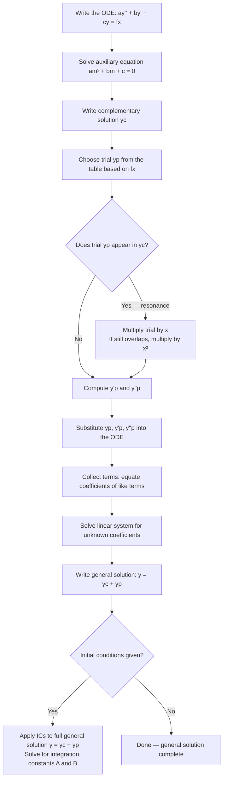

# Method of Undetermined Coefficients

Every linear ODE with constant coefficients splits into two parts: the **complementary solution** $y_c$, which describes the natural behaviour of the system with nothing driving it, and the **particular solution** $y_p$, which accounts for whatever external forcing is applied. Together, the **general solution** is $y = y_c + y_p$.

The method of undetermined coefficients is the most direct way to find $y_p$ when the forcing function $f(x)$ is a "nice" function — a polynomial, an exponential, a sine or cosine, or products and sums of these. The strategy is beautifully simple: **guess the shape of $y_p$ based on $f(x)$, then determine the unknown coefficients by plugging back into the equation.**

The method works because nice functions like $e^{kx}$, $\cos(kx)$, and polynomials have a special property — their derivatives are all of the same "family." When you differentiate $e^{2x}$ you still get an exponential; when you differentiate $\sin(3x)$ you get $\cos(3x)$ and vice versa. This means substituting the trial form into the ODE produces a system of equations you can solve.

---

## Background: The Complementary Solution

Before finding $y_p$, you always need $y_c$ first. For a second-order linear ODE with constant coefficients:

$$ay'' + by' + cy = f(x)$$

**Step 1:** Set $f(x) = 0$ to get the **homogeneous equation**:
$$ay'' + by' + cy = 0$$

**Step 2:** Write the **auxiliary (characteristic) equation** by substituting $y = e^{mx}$:
$$am^2 + bm + c = 0$$

**Step 3:** Solve for $m$ and write $y_c$ according to the root type:

| Root type | Roots | Complementary solution $y_c$ |
|-----------|-------|------------------------------|
| Distinct real | $m_1 \neq m_2$ | $Ae^{m_1 x} + Be^{m_2 x}$ |
| Repeated real | $m_1 = m_2 = m$ | $(A + Bx)e^{mx}$ |
| Complex conjugates | $m = \alpha \pm i\beta$ | $e^{\alpha x}(A\cos\beta x + B\sin\beta x)$ |

---

## The Trial Form Table

The guess for $y_p$ mirrors the structure of $f(x)$. Here are the standard trial forms:

| $f(x)$ | Trial form for $y_p$ |
|--------|----------------------|
| $e^{kx}$ | $Ae^{kx}$ |
| $\sin(kx)$ or $\cos(kx)$ | $A\cos(kx) + B\sin(kx)$ |
| Polynomial of degree $n$ | $A_0 + A_1 x + A_2 x^2 + \cdots + A_n x^n$ |
| $e^{kx}\sin(mx)$ or $e^{kx}\cos(mx)$ | $e^{kx}[A\cos(mx) + B\sin(mx)]$ |
| $e^{kx} \times \text{poly}(x)$ | $e^{kx} \times \text{(same-degree poly with unknown coeffs)}$ |
| Sum of the above | Sum of corresponding trial forms |

> **Analogy:** Think of the trial form as a photocopy of $f(x)$'s "skeleton" — same shape, but with blank spaces (unknown coefficients $A$, $B$, etc.) waiting to be filled in.

---

## The Resonance Rule

**The single most important exception in this method:** if your trial form for $y_p$ is already present in $y_c$, it will cancel out entirely when you substitute — you'll get $0 = f(x)$, which is useless.

**Fix:** Multiply the trial form by $x$. If that still overlaps with $y_c$, multiply by $x^2$.

$$\text{Resonance} \Rightarrow \text{multiply trial by } x \text{ (or } x^2 \text{ for double resonance)}$$

This happens when $f(x) = e^{mx}$ and $m$ is a root of the auxiliary equation, or when $f(x) = \sin(kx)/\cos(kx)$ and the homogeneous equation has pure imaginary roots $\pm ik$.

---

## Step-by-Step Procedure

---

## Worked Example 1: Cosine Forcing with Initial Conditions

**Problem:** Solve $y'' + 3y' + 2y = 10\cos 2x$, given $y(0) = 1$, $y'(0) = 0$.

### Step 1: Complementary Solution

Auxiliary equation: $m^2 + 3m + 2 = 0$

$$\Rightarrow (m+1)(m+2) = 0 \Rightarrow m = -1, \; m = -2$$

Two distinct real roots, so:
$$y_c = Ae^{-x} + Be^{-2x}$$

### Step 2: Choose Trial Form

$f(x) = 10\cos 2x$ is a cosine, so the trial form is:
$$y_p = C\cos 2x + D\sin 2x$$

Neither $\cos 2x$ nor $\sin 2x$ appears in $y_c$ (which contains only exponentials), so **no resonance**.

### Step 3: Compute Derivatives

$$y_p' = -2C\sin 2x + 2D\cos 2x$$
$$y_p'' = -4C\cos 2x - 4D\sin 2x$$

### Step 4: Substitute into the ODE

$$(-4C\cos 2x - 4D\sin 2x) + 3(-2C\sin 2x + 2D\cos 2x) + 2(C\cos 2x + D\sin 2x) = 10\cos 2x$$

Collect by $\cos 2x$ and $\sin 2x$:

$$\cos 2x\bigl[{-4C + 6D + 2C}\bigr] + \sin 2x\bigl[{-4D - 6C + 2D}\bigr] = 10\cos 2x$$

$$\cos 2x(-2C + 6D) + \sin 2x(-6C - 2D) = 10\cos 2x + 0 \cdot \sin 2x$$

### Step 5: Equate Coefficients

$$-2C + 6D = 10 \quad \text{(coefficients of } \cos 2x\text{)}$$
$$-6C - 2D = 0 \quad \text{(coefficients of } \sin 2x\text{)}$$

From the second equation: $D = -3C$.

Substitute into the first: $-2C + 6(-3C) = 10 \Rightarrow -2C - 18C = 10 \Rightarrow -20C = 10 \Rightarrow C = -\tfrac{1}{2}$.

Then $D = -3(-\tfrac{1}{2}) = \tfrac{3}{2}$.

$$y_p = -\frac{1}{2}\cos 2x + \frac{3}{2}\sin 2x$$

### Step 6: General Solution

$$y = Ae^{-x} + Be^{-2x} - \frac{1}{2}\cos 2x + \frac{3}{2}\sin 2x$$

### Step 7: Apply Initial Conditions

**At $x = 0$, $y = 1$:**
$$A + B - \frac{1}{2} = 1 \Rightarrow A + B = \frac{3}{2}$$

First differentiate: $y' = -Ae^{-x} - 2Be^{-2x} + \sin 2x + 3\cos 2x$

**At $x = 0$, $y' = 0$:**
$$-A - 2B + 3 = 0 \Rightarrow A + 2B = 3$$

Subtract the first equation from the second: $B = \tfrac{3}{2}$, so $A = 0$.

### Final Answer

$$\boxed{y(x) = \frac{3}{2}e^{-2x} - \frac{1}{2}\cos 2x + \frac{3}{2}\sin 2x}$$

---

## Worked Example 2: Polynomial Forcing

**Problem:** Find the general solution of $y'' + 4y' + 4y = 3x^2$.

### Step 1: Complementary Solution

Auxiliary equation: $m^2 + 4m + 4 = 0 \Rightarrow (m+2)^2 = 0 \Rightarrow m = -2$ (repeated root).

$$y_c = (A + Bx)e^{-2x}$$

### Step 2: Trial Form

$f(x) = 3x^2$ is a degree-2 polynomial, so:
$$y_p = C_0 + C_1 x + C_2 x^2$$

No overlap with $y_c$ (exponentials vs polynomial). No resonance.

### Step 3: Derivatives

$$y_p' = C_1 + 2C_2 x$$
$$y_p'' = 2C_2$$

### Step 4: Substitute

$$2C_2 + 4(C_1 + 2C_2 x) + 4(C_0 + C_1 x + C_2 x^2) = 3x^2$$

$$4C_2 x^2 + (8C_2 + 4C_1)x + (2C_2 + 4C_1 + 4C_0) = 3x^2$$

### Step 5: Equate Coefficients

- $x^2$: $4C_2 = 3 \Rightarrow C_2 = \tfrac{3}{4}$
- $x^1$: $8C_2 + 4C_1 = 0 \Rightarrow C_1 = -2C_2 = -\tfrac{3}{2}$
- $x^0$: $2C_2 + 4C_1 + 4C_0 = 0 \Rightarrow \tfrac{3}{2} - 6 + 4C_0 = 0 \Rightarrow C_0 = \tfrac{9}{8}$

$$y_p = \frac{9}{8} - \frac{3}{2}x + \frac{3}{4}x^2$$

### Final Answer

$$\boxed{y = (A + Bx)e^{-2x} + \frac{3}{4}x^2 - \frac{3}{2}x + \frac{9}{8}}$$

---

## Worked Example 3: Resonance Case

**Problem:** Find a particular solution of $y'' + y = \sin x$.

### Step 1: Complementary Solution

Auxiliary equation: $m^2 + 1 = 0 \Rightarrow m = \pm i$.

$$y_c = A\cos x + B\sin x$$

### Step 2: Trial Form — Resonance!

Normal trial for $\sin x$ would be $C\cos x + D\sin x$. But this is **exactly** what appears in $y_c$! We have resonance.

**Multiply by $x$:**
$$y_p = x(C\cos x + D\sin x) = Cx\cos x + Dx\sin x$$

### Step 3: Derivatives

$$y_p' = C\cos x - Cx\sin x + D\sin x + Dx\cos x$$
$$y_p'' = -2C\sin x - Cx\cos x + 2D\cos x - Dx\sin x$$

### Step 4: Substitute into $y'' + y = \sin x$

$$(-2C\sin x - Cx\cos x + 2D\cos x - Dx\sin x) + (Cx\cos x + Dx\sin x) = \sin x$$

The $x$-terms cancel:
$$-2C\sin x + 2D\cos x = \sin x$$

### Step 5: Equate Coefficients

$$-2C = 1 \Rightarrow C = -\frac{1}{2}, \qquad 2D = 0 \Rightarrow D = 0$$

### Particular Solution

$$\boxed{y_p = -\frac{1}{2}x\cos x}$$

---

## Worked Example 4: Mixed Forcing ($f(x)$ is a Sum)

**Problem:** Find a particular solution of $y'' - y = e^{3x} + x^2$.

**Principle for sums:** split $f(x)$ into parts and find a particular solution for each part separately. Then $y_p = y_{p1} + y_{p2}$.

### Part A: $f_1(x) = e^{3x}$

Auxiliary equation: $m^2 - 1 = 0 \Rightarrow m = \pm 1$. So $y_c = Ae^x + Be^{-x}$.

Trial: $y_{p1} = Ce^{3x}$. No resonance ($3 \neq \pm 1$).

$$y_{p1}'' - y_{p1} = 9Ce^{3x} - Ce^{3x} = 8Ce^{3x} = e^{3x} \Rightarrow C = \frac{1}{8}$$

$$y_{p1} = \frac{1}{8}e^{3x}$$

### Part B: $f_2(x) = x^2$

Trial: $y_{p2} = D_0 + D_1 x + D_2 x^2$.

$$y_{p2}'' - y_{p2} = 2D_2 - (D_0 + D_1 x + D_2 x^2) = -D_2 x^2 - D_1 x + (2D_2 - D_0) = x^2$$

- $x^2$: $-D_2 = 1 \Rightarrow D_2 = -1$
- $x^1$: $-D_1 = 0 \Rightarrow D_1 = 0$
- $x^0$: $2D_2 - D_0 = 0 \Rightarrow D_0 = 2D_2 = -2$

$$y_{p2} = -2 - x^2$$

### Final Answer

$$y_p = \frac{1}{8}e^{3x} - x^2 - 2$$

$$\boxed{y = Ae^{x} + Be^{-x} + \frac{1}{8}e^{3x} - x^2 - 2}$$

---

> **Key Takeaways**
>
> - The method applies when $f(x)$ is a polynomial, exponential, sine/cosine, or products/sums of these
> - The trial form for $y_p$ mirrors the structure of $f(x)$ with unknown coefficients
> - **Always find $y_c$ first** — you need it to check for resonance and to write the full general solution
> - **Resonance rule:** if the trial form duplicates any term in $y_c$, multiply the entire trial by $x$ (by $x^2$ for a double root)
> - **Apply initial conditions last** — only after combining $y = y_c + y_p$ into the full general solution
> - For $f(x)$ that is a sum, split into separate problems and add the particular solutions

---

> **Exam Tips**
>
> - **The most common exam setup:** "Solve $ay'' + by' + cy = f(x)$ subject to $y(0) = \alpha$, $y'(0) = \beta$." Work all 7 steps in order — examiners allocate marks to each step.
> - **Resonance is the most common source of errors.** Always write out $y_c$ completely before choosing your trial — then visually check whether any part of your trial matches $y_c$. If it does, multiply by $x$ immediately.
> - **For sine/cosine forcing, always include BOTH $A\cos(kx)$ and $B\sin(kx)$ in the trial**, even if $f(x)$ contains only one of them. Substitution will produce both terms.
> - **Applying initial conditions before writing $y = y_c + y_p$** is the most common procedural mistake in exams — it gives wrong constants. The ICs must be applied to the full expression.
> - **Mixed RHS like $f(x) = e^x + \sin 2x$:** take $y_p = Ae^x + B\cos 2x + C\sin 2x$. You can do the whole thing at once or split into two sub-problems — splitting is usually cleaner.
> - **$e^{kx}\cos(mx)$ or $e^{kx}\sin(mx)$:** trial is always $e^{kx}[A\cos(mx) + B\sin(mx)]$, even if only the sine appears in $f(x)$.
