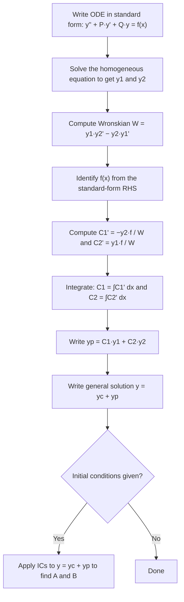

# Variation of Parameters

Undetermined coefficients and the D-operator method are fast, but they only work when $f(x)$ is a nice function whose derivatives cycle through a finite family. What do you do when $f(x) = \sec x$, $\tan x$, $\ln x$, $\frac{1}{x}$, or any other function that keeps producing new forms as you differentiate? There is no sensible "trial form" to guess.

**Variation of parameters** is the universal fallback — it works for **any** $f(x)$, provided you can carry out the resulting integrations. The trade-off is that it requires more computation than the shortcut methods, but it never fails on the existence question.

The key idea is clever: the complementary solution $y_c = Ay_1 + By_2$ has two arbitrary constants $A$ and $B$. What if instead of being constants, $A$ and $B$ were functions of $x$? Could we choose $C_1(x)$ and $C_2(x)$ — varying the parameters — so that $y_p = C_1(x)y_1(x) + C_2(x)y_2(x)$ satisfies the full non-homogeneous equation?

The answer is yes, and the algebra to find $C_1$ and $C_2$ leads to a clean, systematic method.

> **Analogy:** Imagine a ship whose compass heading is $y_c$ — the "natural" course with no currents. Variation of parameters adds $C_1(x)y_1 + C_2(x)y_2$ where the "steering corrections" $C_1(x)$ and $C_2(x)$ continuously adjust to counteract the forcing $f(x)$ (the current). Rather than a fixed correction, the ship continuously varies its response.

---

## Setup: The Two-Function Ansatz

For the second-order ODE in **standard form** (coefficient of $y''$ must be $1$):

$$y'' + P(x)y' + Q(x)y = f(x)$$

Suppose the homogeneous equation $y'' + Py' + Qy = 0$ has complementary solution:
$$y_c = Ay_1(x) + By_2(x)$$

We seek a particular solution of the form:
$$y_p = C_1(x)\, y_1(x) + C_2(x)\, y_2(x)$$

---

## Deriving the System

Differentiate $y_p$:
$$y_p' = C_1' y_1 + C_1 y_1' + C_2' y_2 + C_2 y_2'$$

To simplify the second derivative, we impose the **simplifying condition**:
$$C_1' y_1 + C_2' y_2 = 0 \quad \text{...(constraint)}$$

This is not a physical requirement — it's just a clever choice that keeps $y_p''$ from becoming unmanageable. With this constraint:
$$y_p' = C_1 y_1' + C_2 y_2'$$

Differentiating again:
$$y_p'' = C_1' y_1' + C_1 y_1'' + C_2' y_2' + C_2 y_2''$$

Substituting $y_p$, $y_p'$, $y_p''$ into the ODE and using the fact that $y_1$ and $y_2$ both satisfy the homogeneous equation, everything simplifies to a **second condition**:
$$C_1' y_1' + C_2' y_2' = f(x) \quad \text{...(second equation)}$$

---

## The Wronskian and the Formulas

We now have a $2 \times 2$ linear system in $C_1'$ and $C_2'$:

$$C_1' y_1 + C_2' y_2 = 0$$
$$C_1' y_1' + C_2' y_2' = f(x)$$

Solving by Cramer's rule (or elimination):

$$\boxed{W = y_1 y_2' - y_2 y_1'}$$

This quantity is the **Wronskian** of $y_1$ and $y_2$. It is non-zero precisely when $y_1$ and $y_2$ are linearly independent (which they are, since they form $y_c$).

$$C_1'(x) = -\frac{y_2(x)\, f(x)}{W(x)}, \qquad C_2'(x) = \frac{y_1(x)\, f(x)}{W(x)}$$

Integrate to get $C_1$ and $C_2$:
$$C_1(x) = -\int \frac{y_2 f}{W}\, dx, \qquad C_2(x) = \int \frac{y_1 f}{W}\, dx$$

(No constants of integration needed — they merge into $y_c$.)

$$y_p = C_1(x) y_1(x) + C_2(x) y_2(x)$$

---

## Step-by-Step Procedure

---

## Worked Example 1: Exponential Forcing (Verification Example)

**Problem:** Solve $y'' - y = e^{2x}$.

### Step 1: Find $y_1$, $y_2$

Auxiliary equation: $m^2 - 1 = 0 \Rightarrow m = \pm 1$.

$$y_1 = e^{-x}, \quad y_2 = e^x, \quad y_c = Ae^{-x} + Be^x$$

### Step 2: Wronskian

$$W = y_1 y_2' - y_2 y_1' = e^{-x} \cdot e^x - e^x \cdot (-e^{-x}) = 1 + 1 = 2$$

### Step 3: Identify $f(x)$

The equation is already in standard form: $f(x) = e^{2x}$.

### Step 4: Compute $C_1'$ and $C_2'$

$$C_1'= -\frac{y_2 f}{W} = -\frac{e^x \cdot e^{2x}}{2} = -\frac{e^{3x}}{2}$$

$$C_2' = \frac{y_1 f}{W} = \frac{e^{-x} \cdot e^{2x}}{2} = \frac{e^x}{2}$$

### Step 5: Integrate

$$C_1 = -\frac{e^{3x}}{6}, \qquad C_2 = \frac{e^x}{2}$$

### Step 6: Particular Solution

$$y_p = C_1 y_1 + C_2 y_2 = -\frac{e^{3x}}{6} \cdot e^{-x} + \frac{e^x}{2} \cdot e^x = -\frac{e^{2x}}{6} + \frac{e^{2x}}{2} = e^{2x}\!\left(\frac{1}{2} - \frac{1}{6}\right) = \frac{e^{2x}}{3}$$

### Final Answer

$$\boxed{y = Ae^{-x} + Be^x + \frac{e^{2x}}{3}}$$

**Sanity check (D-operator):** $y_p = \frac{e^{2x}}{D^2 - 1} = \frac{e^{2x}}{4 - 1} = \frac{e^{2x}}{3}$ ✓

---

## Worked Example 2: Tangent Forcing (Impossible by Other Methods)

**Problem:** Find the general solution of $y'' + y = \tan x$.

This is the classic example that **cannot** be solved by undetermined coefficients or the operator method — $\tan x$ has an infinite chain of derivatives and no finite trial form.

### Step 1: $y_1$, $y_2$

Auxiliary equation: $m^2 + 1 = 0 \Rightarrow m = \pm i$.

$$y_1 = \cos x, \quad y_2 = \sin x, \quad y_c = A\cos x + B\sin x$$

### Step 2: Wronskian

$$W = \cos x \cdot \cos x - \sin x \cdot (-\sin x) = \cos^2 x + \sin^2 x = 1$$

### Step 3: $f(x) = \tan x$

### Step 4: $C_1'$ and $C_2'$

$$C_1' = -\frac{y_2 f}{W} = -\frac{\sin x \cdot \tan x}{1} = -\frac{\sin^2 x}{\cos x} = -\frac{1 - \cos^2 x}{\cos x} = \cos x - \sec x$$

$$C_2' = \frac{y_1 f}{W} = \frac{\cos x \cdot \tan x}{1} = \sin x$$

### Step 5: Integrate

$$C_1 = \int (\cos x - \sec x)\, dx = \sin x - \ln|\sec x + \tan x|$$

$$C_2 = \int \sin x\, dx = -\cos x$$

### Step 6: $y_p$

$$y_p = (\sin x - \ln|\sec x + \tan x|)\cos x + (-\cos x)\sin x$$

$$= \cos x \sin x - \cos x \ln|\sec x + \tan x| - \sin x \cos x$$

$$= -\cos x \ln|\sec x + \tan x|$$

### Final Answer

$$\boxed{y = A\cos x + B\sin x - \cos x \ln|\sec x + \tan x|}$$

---

## Worked Example 3: With a Leading Coefficient

**Problem:** Find a particular solution of $2y'' + y' - y = 2e^{x/2}$.

**Important:** First put into standard form by dividing through by $2$:

$$y'' + \frac{1}{2}y' - \frac{1}{2}y = e^{x/2}$$

So $f(x) = e^{x/2}$.

### Step 1: $y_1$, $y_2$ from the homogeneous equation

Auxiliary equation (from original coefficients): $2m^2 + m - 1 = 0 \Rightarrow (2m - 1)(m + 1) = 0 \Rightarrow m = \frac{1}{2}, -1$.

$$y_1 = e^{x/2}, \quad y_2 = e^{-x}$$

### Step 2: Wronskian

$$y_1' = \frac{1}{2}e^{x/2}, \quad y_2' = -e^{-x}$$

$$W = e^{x/2}(-e^{-x}) - e^{-x}\!\left(\frac{1}{2}e^{x/2}\right) = -e^{-x/2} - \frac{1}{2}e^{-x/2} = -\frac{3}{2}e^{-x/2}$$

### Step 3: $C_1'$ and $C_2'$ (using $f(x) = e^{x/2}$, the standard-form RHS)

$$C_1' = -\frac{y_2 f}{W} = -\frac{e^{-x} \cdot e^{x/2}}{-\frac{3}{2}e^{-x/2}} = \frac{e^{-x/2}}{-\frac{3}{2}e^{-x/2}} \cdot (-1)^{-1}$$

Let's compute carefully:
$$C_1' = -\frac{e^{-x} \cdot e^{x/2}}{-\frac{3}{2}e^{-x/2}} = \frac{e^{-x/2}}{\frac{3}{2}e^{-x/2}} = \frac{2}{3}$$

$$C_2' = \frac{y_1 f}{W} = \frac{e^{x/2} \cdot e^{x/2}}{-\frac{3}{2}e^{-x/2}} = \frac{e^x}{-\frac{3}{2}e^{-x/2}} = -\frac{2}{3}e^{3x/2}$$

### Step 4: Integrate

$$C_1 = \frac{2}{3}x, \qquad C_2 = -\frac{2}{3} \cdot \frac{2}{3}e^{3x/2} = -\frac{4}{9}e^{3x/2}$$

### Step 5: $y_p$

$$y_p = \frac{2x}{3} \cdot e^{x/2} + \left(-\frac{4}{9}e^{3x/2}\right)\! e^{-x} = \frac{2x}{3}e^{x/2} - \frac{4}{9}e^{x/2} = e^{x/2}\!\left(\frac{2x}{3} - \frac{4}{9}\right)$$

$$\boxed{y_p = e^{x/2}\!\left(\frac{2x}{3} - \frac{4}{9}\right)}$$

---

> **Key Takeaways**
>
> - Variation of parameters works for **any** $f(x)$ — it is never blocked by the shape of the forcing function
> - The Wronskian $W = y_1 y_2' - y_2 y_1'$ must be non-zero; it always is if $y_1$, $y_2$ are linearly independent
> - The sign convention: $C_1' = -y_2 f / W$ (note the minus sign), $C_2' = +y_1 f / W$
> - Always put the ODE in standard form ($y''$ coefficient = $1$) before reading off $f(x)$
> - The constants from integration of $C_1$ and $C_2$ are dropped — they fold into the arbitrary constants $A$, $B$ of $y_c$
> - Use undetermined coefficients or the operator method first (they're faster); fall back to variation of parameters when $f(x)$ is "unguessable"

---

> **Exam Tips**
>
> - **The minus sign on $C_1'$** is the single most common error in exam answers. Write $C_1' = -y_2 f / W$ with the minus sign explicitly, every time.
> - **Standard form is non-negotiable.** If the ODE is $2y'' + \ldots = f(x)$, divide everything by $2$ before identifying $f(x)$. Using $f(x)$ from the non-standard form gives wrong $C_1'$ and $C_2'$.
> - **Wronskian shortcut for constant-coefficient equations:** if $y_1 = e^{m_1 x}$ and $y_2 = e^{m_2 x}$, then $W = (m_2 - m_1)e^{(m_1+m_2)x}$. For $y_1 = \cos\beta x$, $y_2 = \sin\beta x$: $W = \beta$. For $y_1 = e^{\alpha x}\cos\beta x$, $y_2 = e^{\alpha x}\sin\beta x$: $W = \beta e^{2\alpha x}$.
> - **When to use variation of parameters:** if $f(x)$ contains $\tan x$, $\sec x$, $\csc x$, $\cot x$, $\ln x$, $1/x$, $x^{-n}$ for integer $n$, or any function that doesn't close under differentiation into a finite family.
> - **Checking your answer:** substitute $y_p$ back into the ODE. For simple problems this takes 2 minutes and catches all errors.
> - **The integration step is where mistakes happen.** $\int \sec x\, dx = \ln|\sec x + \tan x|$, $\int \sec^2 x\, dx = \tan x$, $\int \tan x\, dx = \ln|\sec x|$. Know these.
