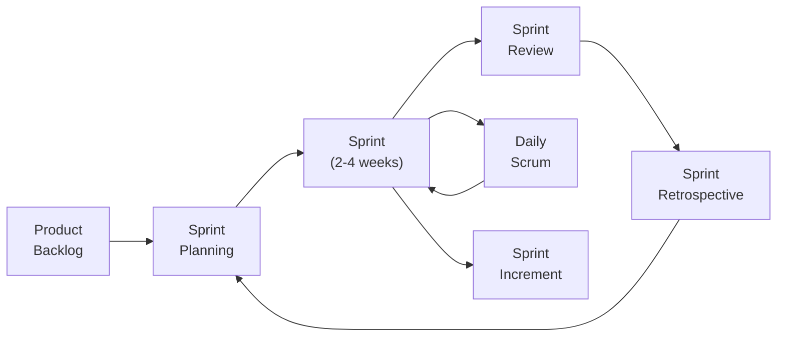

## The Problem Agile Solves

Plan-driven methods like Waterfall work well when requirements are stable and well-understood. But in most commercial software development:

- Requirements change frequently (customers discover what they really want only after seeing a prototype)
- Business environments shift (a competitor releases a feature, forcing reprioritisation)
- The market cannot wait 18 months for the full system — partial value delivered early is more useful

Agile methods were designed for exactly this environment: **rapidly changing requirements, need for early delivery, and ongoing customer involvement**.

---

## The Agile Manifesto (2001)

In 2001, 17 software practitioners gathered and published the Agile Manifesto. Four values:

> We are uncovering better ways of developing software by doing it and helping others do it. Through this work we have come to value:

| Value | Over |
|---|---|
| **Individuals and interactions** | Processes and tools |
| **Working software** | Comprehensive documentation |
| **Customer collaboration** | Contract negotiation |
| **Responding to change** | Following a plan |

> That is, while there is value in the items on the right, we value the items on the left more.

---

## 12 Principles of the Agile Manifesto

1. Satisfy the customer through early and continuous delivery of valuable software
2. Welcome changing requirements, even late in development
3. Deliver working software frequently (weeks rather than months)
4. Business people and developers work together daily
5. Build projects around motivated individuals; trust them
6. Face-to-face conversation is the most efficient communication
7. Working software is the primary measure of progress
8. Promote sustainable development — teams should maintain a constant pace
9. Continuous attention to technical excellence and good design
10. Simplicity — maximise the amount of work not done
11. Self-organising teams produce the best architectures and designs
12. Regularly reflect and adjust behaviour

---

## Scrum: The Most Popular Agile Framework

**Scrum** organises work into fixed-length iterations called **Sprints** (typically 2–4 weeks). Each Sprint delivers a potentially shippable increment of the product.

### Scrum Roles

| Role | Responsibilities |
|---|---|
| **Product Owner** | Represents the customer; maintains the Product Backlog; prioritises features |
| **Scrum Master** | Facilitates the process; removes obstacles; protects the team |
| **Development Team** | Self-organising team of 5–9 people; does the actual work |

### Scrum Artefacts

| Artefact | Description |
|---|---|
| **Product Backlog** | Ordered list of everything the product needs (features, bug fixes, requirements) |
| **Sprint Backlog** | The subset of Product Backlog items selected for the current Sprint |
| **Increment** | The working software produced at the end of the Sprint |

### The Scrum Sprint Cycle

**Daily Scrum (Stand-up):** 15-minute daily meeting. Each team member answers:
1. What did I do yesterday?
2. What will I do today?
3. Any blockers?

**Sprint Review:** Demonstrate the increment to stakeholders and get feedback.

**Sprint Retrospective:** Team reflects on the process — what worked, what to improve.

---

## Worked Example: Building a Student Portal

**Product Backlog (priority ordered):**
1. Student login and authentication
2. View course schedule
3. View grades
4. Register for courses
5. Download course materials
6. Submit assignments online
7. View lecturer office hours
8. Pay fees online

**Sprint 1 (2 weeks):** Items 1 and 2 → working: login + view schedule  
**Sprint 2 (2 weeks):** Items 3 and 4 → working: + grades + registration  
**Sprint 3 (2 weeks):** Items 5 and 6 → working: + materials + submission  
**Sprint 4 (2 weeks):** Items 7 and 8 → working: + office hours + payments

After Sprint 1, the university can already let students log in and check schedules — even though the full portal is incomplete. Early value delivery.

---

## Agile vs. Waterfall Comparison

| Aspect | Waterfall | Agile |
|---|---|---|
| Requirements | Fixed upfront | Evolve during development |
| Customer involvement | At start and end | Throughout |
| Delivery | Single release at end | Continuous increments |
| Documentation | Extensive formal docs | Just enough |
| Change | Expensive and resisted | Welcomed |
| Team structure | Hierarchical, specialised | Self-organising, cross-functional |
| Risk | Front-loaded (big uncertainty) | Distributed across sprints |
| Best for | Stable, well-understood requirements | Changing requirements, commercial software |

---

## When Agile Works Well — and When It Does Not

**Agile works best for:**
- Small to medium teams (< 100 people)
- Web and mobile applications with evolving features
- Startups and competitive markets requiring frequent releases
- Projects with active, available customer engagement

**Agile is more challenging for:**
- Very large teams across multiple locations
- Safety-critical systems (medical devices, aircraft) where documentation is legally mandated
- Systems with hardware dependencies where you cannot iterate quickly
- Projects with fixed contracts and fixed deliverables

---

## Key Takeaway

> Agile is a philosophy of software development built on iterative delivery, customer collaboration, and responding to change. The Agile Manifesto's four values prioritise working software and customer collaboration over heavy processes and documentation. Scrum is the most widely used Agile framework, organising work into short Sprints that deliver incremental working software. Agile suits changing requirements and rapid delivery; Waterfall suits stable, well-defined requirements.

---

## Exam Tips

**What lecturers test:**
- State the four Agile Manifesto values (always in the format: "X over Y")
- Describe the Scrum framework: roles (PO, SM, Team), artefacts (Backlog, Sprint Backlog, Increment), events (Sprint, Daily Scrum, Review, Retrospective)
- Compare Agile and Waterfall — when would you choose each?
- Describe a Sprint with an example (product backlog → sprint planning → sprint → review)

**Common mistakes:**
- Saying "Agile has no planning" — it has planning (Sprint Planning), just not all upfront
- Saying "Agile has no documentation" — it has "just enough" documentation, not zero
- Confusing Agile (a philosophy) with Scrum (a specific framework)

**Likely question:**
> "Explain the Scrum framework. Describe the three roles, three artefacts, and four events. Draw a diagram of the Scrum Sprint cycle." (14 marks)
