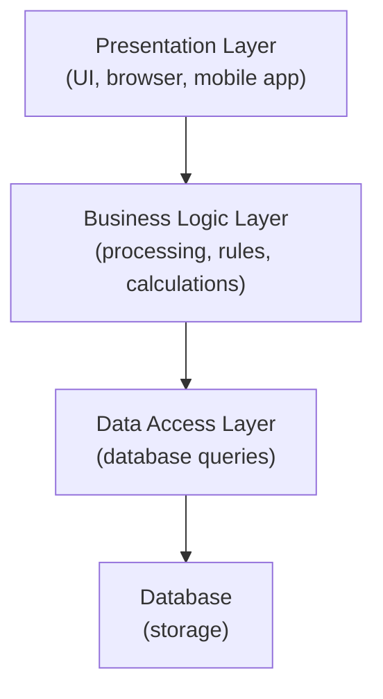
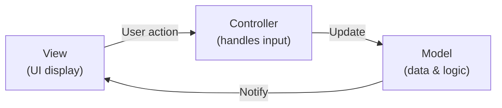
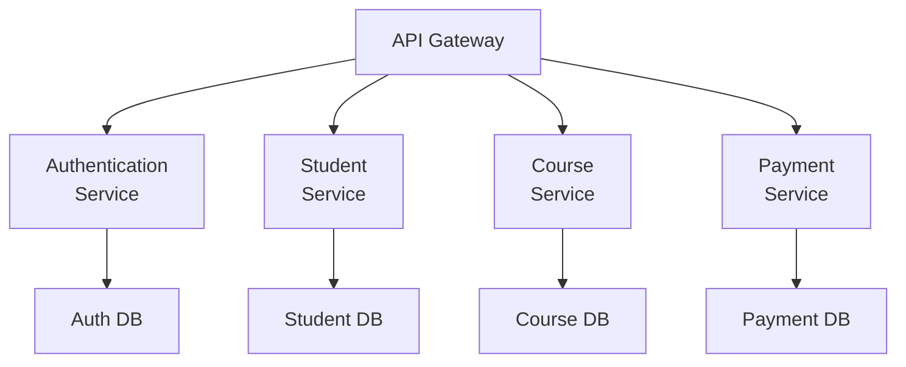
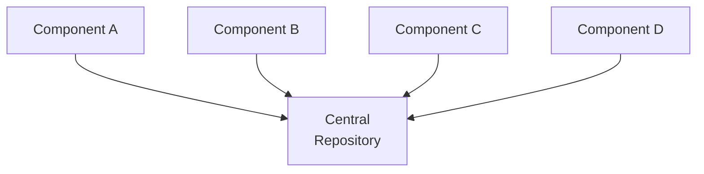

## What Is Software Architecture?

Software architecture defines the overall structure of a system: the major components (or subsystems), their responsibilities, and how they interact. It is the highest level of design.

**Analogy:** The architecture of a building defines the rooms, their sizes, their connections (doors, corridors), and the flow of people through the building. The individual room furnishings are low-level design. Architecture is the fundamental structure that constrains everything else.

**Why architecture matters:**
- Architectural decisions affect the entire system's quality attributes (performance, security, maintainability)
- They are extremely expensive to change after implementation
- They constrain the detailed design options available later
- They must be made early, before detailed design begins

---

## Architectural Styles

An **architectural style** is a named collection of architectural design decisions that recur across different systems. Think of them as "patterns at the system level."

### Style 1: Client-Server Architecture

The most common architecture for web and mobile applications.

**How it works:**
- Clients make requests to servers
- Servers process requests, access data, and return responses
- Clients and servers communicate over a network

**Examples:** Web browsers, mobile apps, email clients.

**Advantages:** Clients are thin (simple) — all logic on server. Easy to update (update server, all clients benefit). Can serve many clients simultaneously.

**Disadvantages:** Network latency. Server is a single point of failure. Server becomes a bottleneck under heavy load.

### Style 2: Layered (N-Tier) Architecture

Organises software into layers, where each layer provides services to the layer above and uses services from the layer below.

**The classic 3-tier architecture:**

| Layer | Responsibility | Technology example |
|---|---|---|
| Presentation | User interface | HTML/CSS/JavaScript, Android |
| Business Logic | Application rules | Java, Python, Node.js |
| Data Access | Database interaction | SQL, JDBC, ORM |

**Advantages:** Separation of concerns — each layer has one responsibility. Easy to change or replace one layer without affecting others. Good for large enterprise applications.

**Disadvantages:** Can add overhead (data must pass through all layers). Not ideal for performance-critical systems.

**Example:** A university student portal — browser (presentation) → Spring Java backend (logic) → MySQL database (data).

### Style 3: Model-View-Controller (MVC)

MVC separates the application into three components:

| Component | Responsibility |
|---|---|
| **Model** | Data and business logic; does not know about the UI |
| **View** | Displays data; does not contain logic |
| **Controller** | Receives user input; updates Model; selects View |

**Example:** In a web app using MVC:
- User clicks "View Grades" (View)
- Controller receives the click, calls `GradeService.getGrades(studentId)` (Controller)
- GradeService queries the database and returns a list (Model)
- Controller passes the list to the Grades View, which renders it (View)

### Style 4: Microservices Architecture

Large systems are decomposed into small, independently deployable services. Each service has its own process, its own database, and communicates via lightweight APIs (usually HTTP/REST).

**Advantages:**
- Each service can be deployed independently
- Services can be written in different languages
- Failure of one service does not crash the whole system
- Teams can work independently on different services

**Disadvantages:**
- Complex distributed system (network failures, consistency challenges)
- More infrastructure to manage
- Debugging spans multiple services

**Used by:** Netflix, Amazon, Uber, Google.

### Style 5: Repository (Data-Centred) Architecture

All components share data through a central repository (database). Components communicate by reading and writing to this shared store.

**Example:** Compiler pipelines, IDE tools, enterprise data warehouses.

---

## Choosing an Architecture

No single architecture is best for all systems. The choice depends on:

| Quality Attribute | Favoured Architecture |
|---|---|
| Performance | Microservices (individual scaling), direct communication |
| Security | Layered (controlled access between layers) |
| Modifiability | Layered, MVC (separation of concerns) |
| Scalability | Microservices, Client-Server |
| Simplicity | 3-tier for most business apps |

**Decision guide for this course:**

| System Type | Recommended Architecture |
|---|---|
| Simple CRUD web app | 3-tier (Presentation/Logic/Data) |
| Large enterprise system | Layered + MVC |
| Complex distributed platform | Microservices |
| Desktop application | MVC |

---

## Key Takeaway

> Software architecture defines the high-level structure of a system: its major components and how they interact. The main architectural styles are: Client-Server (service delivery), Layered/N-Tier (separation of concerns), MVC (separates data, UI, logic), Microservices (small independent services), and Repository (shared data store). Architectural decisions constrain the entire system and are costly to change — they must be made carefully, balancing the system's quality requirements.

---

## Exam Tips

**What lecturers test:**
- Draw and describe the 3-tier layered architecture — what is in each layer?
- Explain MVC: what are the three components and how do they interact?
- Compare Client-Server and Microservices: advantages and disadvantages of each
- For a given system description, justify which architectural style you would choose

**Likely question:**
> "Describe the Model-View-Controller (MVC) architectural pattern. Draw a diagram and explain the role of each component. Give an example of a web application that uses MVC." (10 marks)
