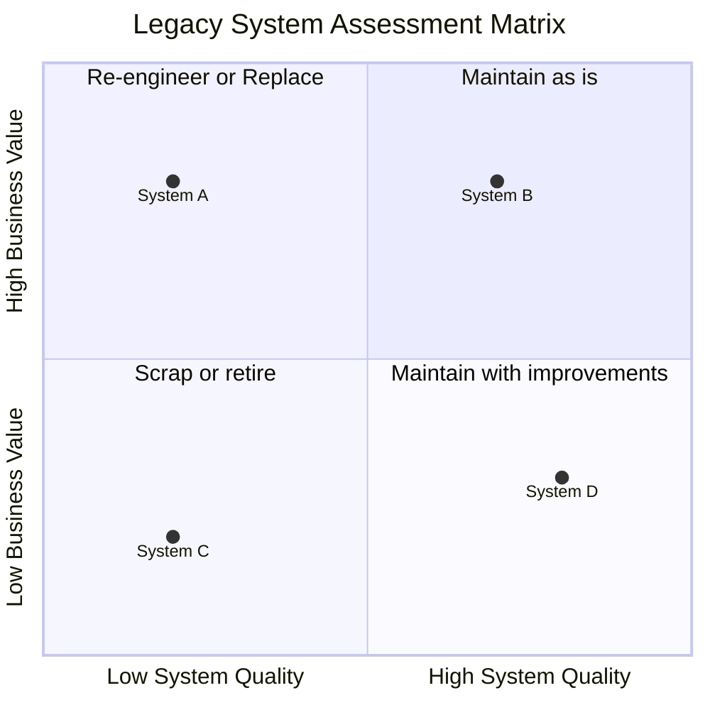
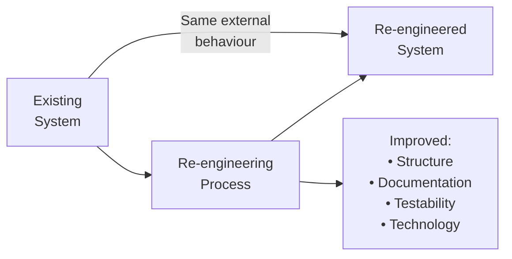

## What Is a Legacy System?

A **legacy system** is an old system that continues to be used because it performs important business functions, even though it is difficult to maintain and modify with modern technology.

**Key characteristics of legacy systems:**
- Built with outdated technology (COBOL, old FORTRAN, early Java EE)
- Original developers have left the organisation
- Documentation is minimal or nonexistent
- No automated test suite
- Highly complex, poorly structured code
- But: **still performing critical business functions**

**Real-world analogy:** A 1970s-era factory machine — mechanically complex, difficult to repair because no one makes the parts anymore, expensive to maintain. But it still produces the product reliably, and replacing it costs millions. Do you keep it running, modernise it, or replace it?

---

## Why Legacy Systems Persist

The paradox: companies know legacy systems are expensive and problematic, yet continue to use them.

**Reasons:**
1. **Replacement risk:** A full replacement project may fail (many large system replacement projects fail)
2. **Cost:** Full replacement is very expensive
3. **Knowledge:** The legacy system embodies decades of business rules — rules often not documented anywhere else
4. **Working:** The system works, even if it is hard to change. "If it ain't broke..."
5. **Dependent systems:** Other systems depend on the legacy system — replacing one requires coordinated changes to all

---

## Assessing Legacy Systems

Before deciding what to do with a legacy system, assess it on two dimensions:

### Business Value
How important is the system to the organisation?
- Does it support core business processes?
- Are its outputs critical for decision-making?
- What would happen if it were unavailable for a day? A week?

### System Quality
How maintainable and reliable is the system?
- Is the documentation adequate?
- Is the code comprehensible?
- How often does it fail?
- How long does it take to make changes?

**Decision matrix:**
- High value + Low quality → Re-engineer or replace (top priority)
- High value + High quality → Maintain as-is (if it works, don't disrupt)
- Low value + Low quality → Scrap or retire
- Low value + High quality → Maintain with minor improvements

---

## Legacy System Options

### Option 1: Leave It Alone (Continue Maintenance)
Continue maintaining the system as it is. Suitable when the system is stable and rarely needs to change.

**Risks:** Costs continue to rise. System becomes increasingly brittle.

### Option 2: Re-engineering (Modernisation)
Transform the system to improve its maintainability without changing its external behaviour. This is sometimes called "technical debt repayment."

### Option 3: Replace With New System
Build or buy a completely new system that performs the same functions. Highest cost and risk, but produces a modern, maintainable system.

**Used when:** The legacy system is so complex or outdated that re-engineering would cost almost as much as replacement.

---

## Software Re-engineering

**Software re-engineering** is the process of restructuring and redeveloping existing software to make it more maintainable, without changing its observable behaviour.

### Re-engineering Activities

**1. Source code translation**
Convert source code from an old language to a newer one.
- COBOL → Java
- Old PHP → Python
- Fortran → C++

**2. Restructuring (Refactoring)**
Improve the internal structure without changing behaviour.
- Break up "god classes" (one class that does everything)
- Rename variables and methods to be descriptive
- Remove duplicate code
- Replace conditional logic with polymorphism

**3. Re-documentation**
Generate or write documentation from the code.
- Automatic tools can generate UML diagrams from code
- Manual effort to document non-obvious design decisions

**4. Modularisation**
Reorganise code into well-defined modules with clear interfaces.
- Extract functions from long, tangled procedures
- Group related functions into modules/classes

**5. Data migration**
Move data from old storage formats to modern databases.
- Flat files → relational database
- Old database schema → normalised schema

---

## Re-engineering vs. Redevelopment

| Re-engineering | Redevelopment |
|---|---|
| Keep existing system running during process | Replace entire system |
| Lower risk — existing behaviour is preserved | Higher risk — new bugs, integration failures |
| Can be done incrementally | All-or-nothing (usually) |
| May not fix fundamental design flaws | Clean slate — address root problems |
| Lower cost | Higher cost |
| Preserves embedded business logic | Business logic must be rediscovered/re-specified |

---

## Worked Example: Re-engineering a Student Records System

**Legacy system:**
- Written in 1990s Visual Basic
- All student records in flat text files (no database)
- No documentation
- 50,000 lines of code in 3 files
- Works, but every change takes weeks and often breaks something else

**Assessment:** High business value (critical student records), very low quality.

**Re-engineering plan:**
1. **Automatic restructuring:** Use tools to break spaghetti code into smaller functions
2. **Source code translation:** Convert Visual Basic to Java
3. **Data migration:** Move flat files to MySQL database
4. **Test suite creation:** Write tests that capture current system behaviour (before restructuring)
5. **Modularisation:** Separate into modules: StudentRecord, Enrolment, GradeCalculator, Report
6. **Documentation:** Write design documentation based on recovered understanding

---

## Key Takeaway

> Legacy systems are old, difficult-to-maintain systems that still perform critical functions. They persist because replacement is risky and expensive, and they embody decades of undocumented business logic. Assess them on business value and system quality. Options are: maintain as-is, re-engineer (modernise structure without changing behaviour), or replace. Re-engineering activities include source translation, restructuring, re-documentation, modularisation, and data migration.

---

## Exam Tips

**What lecturers test:**
- Define legacy system and explain why organisations continue using them
- Describe the legacy system assessment matrix (2×2: value vs. quality)
- List re-engineering activities with examples
- Compare re-engineering and full redevelopment
- Explain why legacy system knowledge is valuable (business rules embedded in code)

**Likely question:**
> "What is a legacy system? Describe the factors that determine whether a legacy system should be re-engineered, maintained, or replaced. What activities are involved in software re-engineering?" (12 marks)
