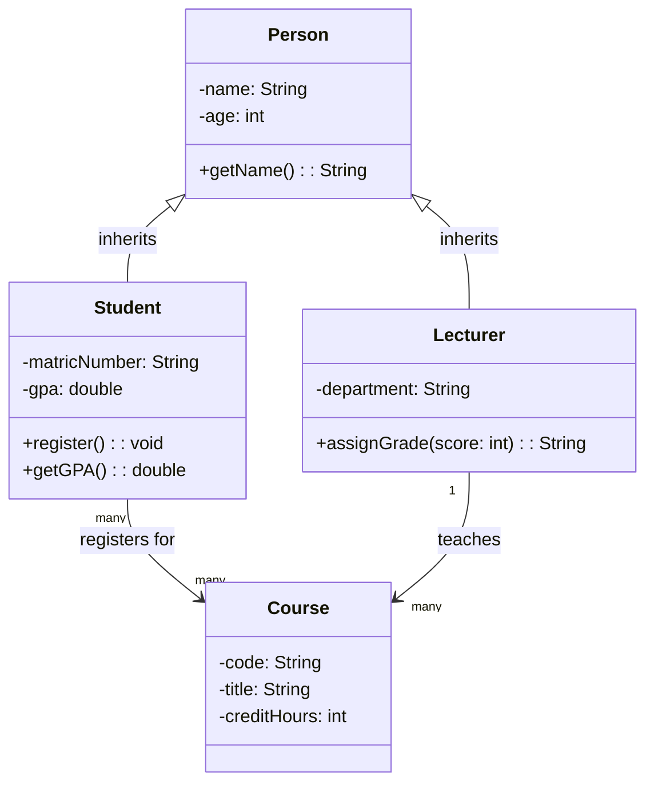
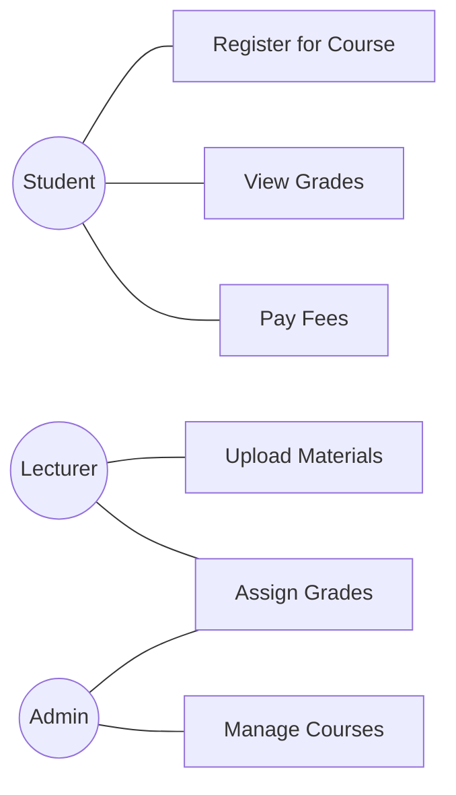
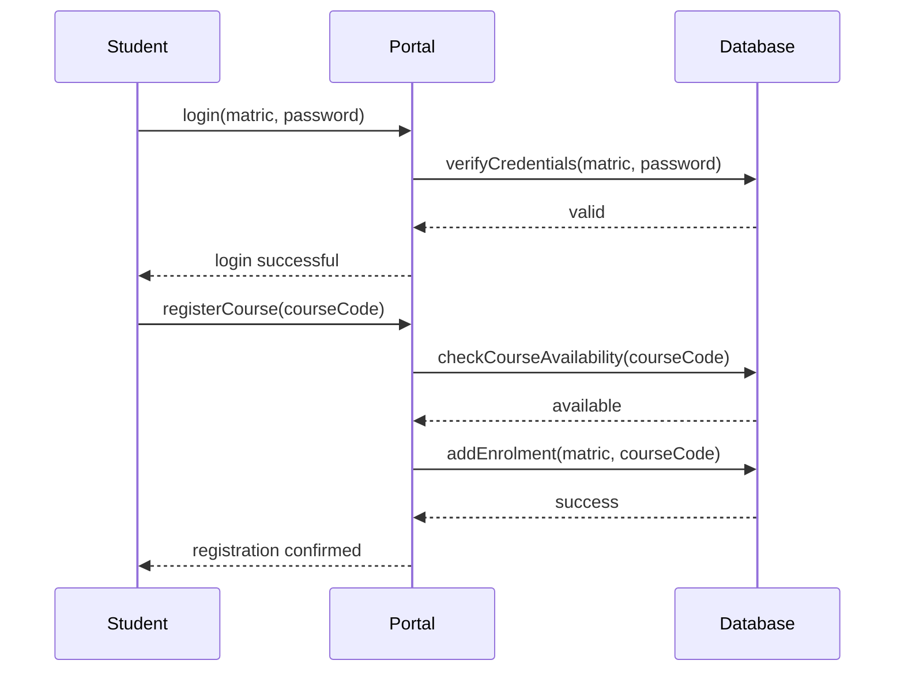
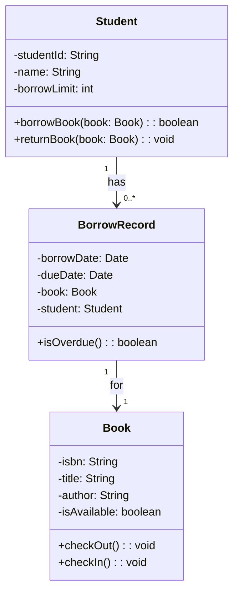

## Why Object-Oriented Design?

Object-oriented design (OOD) models software as a collection of collaborating **objects**. Each object is an instance of a **class** — a blueprint that defines:
- **Attributes (data):** what the object knows
- **Methods (behaviour):** what the object can do

**Real-world analogy:** Think of a university as a system of objects. A `Student` object knows their name, matric number, and GPA, and can `register()`, `payFees()`, and `viewGrades()`. A `Lecturer` object knows their name, department, and courses, and can `assignGrades()` and `uploadMaterials()`. They interact by calling each other's methods.

---

## The Four Pillars of OOP

### 1. Encapsulation
Bundle data and methods together; hide internal details. Other objects interact only through a well-defined interface.

```
CLASS BankAccount:
  PRIVATE balance        ← hidden internal data
  PRIVATE accountNumber  ← hidden

  PUBLIC deposit(amount) ← exposed interface
  PUBLIC withdraw(amount) ← exposed interface
  PUBLIC getBalance()    ← exposed
```

The `balance` field cannot be accessed directly — only through `deposit()`, `withdraw()`, and `getBalance()`. This prevents external code from setting `balance = -1000000`.

### 2. Inheritance
A subclass inherits attributes and methods from a parent class, adding or overriding behaviour.

```
Person
├── Student (inherits: name, age; adds: matric, GPA)
└── Lecturer (inherits: name, age; adds: department, courses)
```

**Benefit:** Code reuse. Common behaviour (name, age) is written once in `Person`; `Student` and `Lecturer` only define what is different.

### 3. Polymorphism
Objects of different classes can be treated as objects of a common parent class. Each responds to the same method call in its own way.

```
Animal.makeSound()
  Dog.makeSound()     → "Woof"
  Cat.makeSound()     → "Meow"
  Cow.makeSound()     → "Moo"
```

The caller just calls `animal.makeSound()` — the correct implementation runs automatically depending on the actual type.

### 4. Abstraction
Express complex systems in terms of high-level concepts, hiding irrelevant details.

A `DatabaseConnection` class provides `query()`, `insert()`, `update()` — without the caller needing to know about TCP connections, SQL parsing, or index trees.

---

## The Unified Modelling Language (UML)

**UML** is a standardised visual language for modelling software systems. It is not a programming language — it is a notation for communicating design.

The most important UML diagrams for this course:

| Diagram | Shows |
|---|---|
| **Class diagram** | Classes, attributes, methods, relationships |
| **Use case diagram** | System functionality from the user's perspective |
| **Sequence diagram** | Object interactions over time |
| **Activity diagram** | Workflow / process flow |
| **State diagram** | State transitions of an object |

---

## Class Diagrams

A class diagram shows the static structure of a system.

**Class notation:**

```
┌─────────────────────┐
│       Student       │  ← class name
├─────────────────────┤
│ - matricNumber: str │  ← attributes (- = private)
│ - name: str         │
│ - gpa: float        │
├─────────────────────┤
│ + register()        │  ← methods (+ = public)
│ + payFees(amount)   │
│ + getGPA(): float   │
└─────────────────────┘
```

**Relationships:**



**Relationship types:**

| Symbol | Name | Meaning |
|---|---|---|
| &lt;\|-- | Inheritance | B inherits from A |
| --&gt; | Association | A uses/knows B |
| *-- | Composition | B cannot exist without A (strong ownership) |
| o-- | Aggregation | B can exist without A (weak ownership) |
| ..&gt; | Dependency | A uses B temporarily |

---

## Use Case Diagrams

Show what the system does from an actor's (user's) perspective.



**Components:**
- **Actors:** external entities that interact with the system (oval shapes)
- **Use cases:** system functions (oval shapes within the system boundary)
- **Associations:** lines connecting actors to use cases

---

## Sequence Diagrams

Show the order of messages/method calls between objects over time.



---

## Worked Example: Designing a Library System

**Requirements:** A library system allows students to borrow and return books. Each book has a title, author, and ISBN. Each student has a name and a borrow limit.

**Class diagram:**



---

## Key Takeaway

> Object-oriented design models software as interacting objects — each combining data and behaviour. The four pillars (encapsulation, inheritance, polymorphism, abstraction) provide the conceptual foundation. UML provides the notation: class diagrams for static structure, use case diagrams for functional requirements from a user perspective, and sequence diagrams for object interactions over time. UML is a communication tool — it helps teams share and discuss designs before writing a single line of code.

---

## Exam Tips

**What lecturers test:**
- Draw a UML class diagram for a described system with correct notation (visibility symbols +/-,
 attribute types, methods)
- Draw a use case diagram showing actors and system functions
- Explain the four OOP pillars with examples
- Draw a sequence diagram for a described interaction

**Common mistakes:**
- Mixing up composition and aggregation — composition means the part cannot exist without the whole; aggregation is a weaker relationship
- Forgetting visibility symbols: `-` = private, `+` = public, `#` = protected
- Making use cases too detailed (they describe goals, not steps)

**Likely question:**
> "Draw a UML class diagram for a student attendance management system. The system tracks students, courses, and attendance records. Show inheritance, associations, and at least 3 attributes and 2 methods per class." (12 marks)
