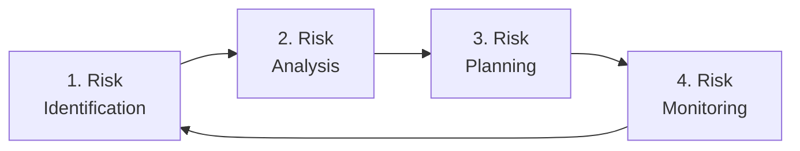
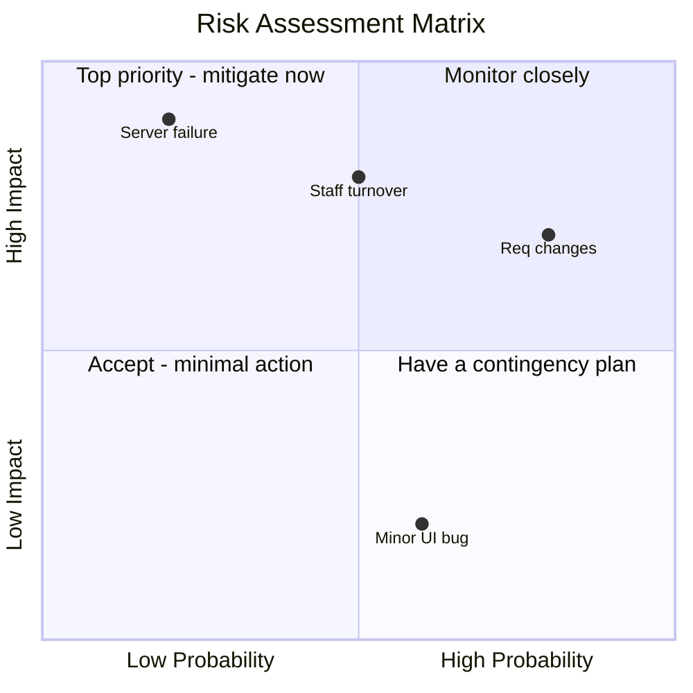

## What Is a Risk?

A **risk** is a potential future event that, if it occurs, will have a negative impact on the project. Risks are about uncertainty — they may or may not happen, but if they do, they cause problems.

**Real-world analogy:** When planning an outdoor wedding, rain is a risk. It might not rain — but if it does, the event is disrupted. A good planner identifies this risk in advance and prepares a mitigation (a tent, an indoor backup venue). Risk management is the same applied to projects.

**Key distinction:**
- A **risk** is a potential problem (has not happened yet)
- An **issue** is a problem that has already occurred

Risk management is proactive — it addresses problems before they happen.

---

## Categories of Software Project Risks

| Category | Description | Examples |
|---|---|---|
| **Project risks** | Affect schedule and resources | Staff turnover, budget cuts, unrealistic deadlines |
| **Product risks** | Affect the quality of the software | Requirements changes, performance problems, integration issues |
| **Business risks** | Affect the organisation | Competitor releases similar product, market changes, technology becomes obsolete |
| **Technical risks** | Related to technology | New unproven technology, complex algorithms, hardware dependencies |

---

## The Risk Management Process

### Step 1: Risk Identification
Brainstorm and list everything that could go wrong. Sources:
- Past project experience (lessons learned)
- Checklists of common risks
- Team brainstorming sessions
- Expert consultation

**Common software project risks:**
- Key staff leave during the project
- Requirements change significantly mid-project
- Underestimated complexity / schedule overrun
- Third-party component does not work as documented
- Integration with existing systems fails
- Customer is unavailable for feedback
- Technology chosen turns out to be inadequate

### Step 2: Risk Analysis
For each identified risk, assess two dimensions:

**Probability:** How likely is it to occur? (Low / Medium / High, or a percentage)  
**Impact:** How bad would it be? (Low / Medium / High / Catastrophic)

**Risk Exposure = Probability × Impact**

### The Risk Matrix

| Probability \ Impact | Low | Medium | High |
|---|---|---|---|
| **High** | Medium risk | High risk | **Critical risk** |
| **Medium** | Low risk | Medium risk | High risk |
| **Low** | Negligible | Low risk | Medium risk |

Focus resources on the **High** and **Critical** risks (top-right of the matrix).

### Step 3: Risk Planning (Mitigation Strategies)

For each significant risk, choose a strategy:

| Strategy | Description | Example |
|---|---|---|
| **Avoidance** | Eliminate the risk entirely | Use proven technology instead of an experimental one |
| **Reduction** | Reduce probability or impact | Cross-train team so no single person is irreplaceable |
| **Transfer** | Shift the risk to another party | Buy insurance; outsource a risky component |
| **Acceptance** | Accept the risk and prepare a contingency | Keep a buffer in the schedule for minor overruns |

### Step 4: Risk Monitoring
Risks change over time. Continuously:
- Review the risk register (the document listing all risks)
- Check if probabilities or impacts have changed
- Identify new risks that have emerged
- Verify that mitigation actions are working

---

## The Risk Register

A document (often a spreadsheet) tracking all identified risks:

| ID | Risk | Probability | Impact | Exposure | Mitigation | Owner | Status |
|---|---|---|---|---|---|---|---|
| R1 | Lead developer resigns | Medium | High | High | Document knowledge, pair programming | PM | Active |
| R2 | Requirements change | High | High | Critical | Agile approach, change control | BA | Active |
| R3 | Database performance | Low | Medium | Low | Load testing early | Tech Lead | Monitoring |
| R4 | Third-party API changes | Medium | Medium | Medium | Abstract API behind interface | Dev | Active |

---

## Worked Example: Risk Plan for a Student Portal Project

**Identified risks and mitigation:**

**R1 — Requirements creep (High probability, High impact):**
- Mitigation: Adopt Agile with fixed sprint scopes; use a change control board to evaluate all new requests
- Contingency: Maintain a prioritised backlog; defer low-priority changes to future releases

**R2 — Key developer leaves (Medium probability, High impact):**
- Mitigation: Document all design decisions; use pair programming so knowledge is shared
- Contingency: Maintain relationships with contract developers who can step in

**R3 — Integration with existing university database fails (Medium probability, High impact):**
- Mitigation: Conduct integration testing in the first sprint, not at the end
- Contingency: Build an adapter layer that can be reconfigured

**R4 — Peak-load performance during registration week (High probability, High impact):**
- Mitigation: Load testing simulating 5000 concurrent users; cloud auto-scaling
- Contingency: Stagger registration by department to spread load

---

## Risk Management in Agile vs. Plan-Driven

| Aspect | Plan-Driven | Agile |
|---|---|---|
| When risks are assessed | Upfront, in the project plan | Continuously, every sprint |
| Risk reduction mechanism | Detailed planning | Short iterations expose problems early |
| Documentation | Formal risk register | Lightweight, often in backlog |

Agile inherently reduces certain risks: short iterations mean problems surface within weeks, not at the end of an 18-month project.

---

## Key Takeaway

> A risk is a potential future problem. Risk management is proactive: identify risks, analyse them by probability and impact, plan mitigation strategies (avoidance, reduction, transfer, acceptance), and monitor continuously. The risk matrix prioritises which risks deserve attention — focus on high-probability, high-impact risks. A risk register documents all risks and their mitigation. Agile methods reduce risk inherently through short iterations that expose problems early.

---

## Exam Tips

**What lecturers test:**
- Define risk and distinguish it from an issue
- Describe the four steps of risk management (identify, analyse, plan, monitor)
- Explain the risk matrix (probability × impact) and how it prioritises risks
- List and explain the four mitigation strategies (avoidance, reduction, transfer, acceptance)
- Create a risk register for a given project scenario

**Likely question:**
> "Describe the risk management process. For a software project of your choice, identify three risks, assess each by probability and impact, and propose a specific mitigation strategy for each." (14 marks)
