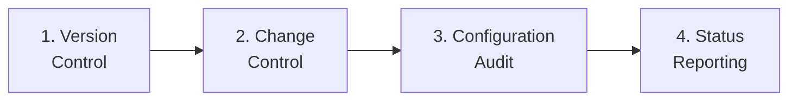
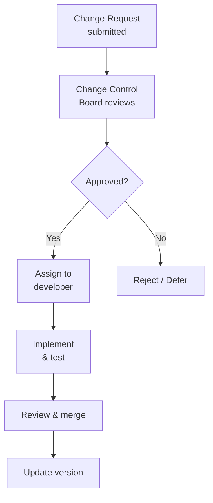
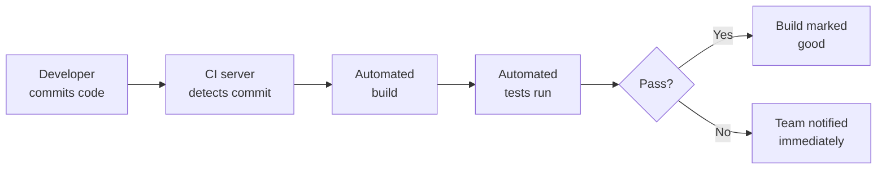

## The Problem SCM Solves

Imagine a team of 10 developers all editing the same codebase. Without coordination:
- Two developers edit the same file and overwrite each other's work
- Nobody knows which version is the "official" one
- A bug fix gets lost when someone deploys an old version
- A customer reports a bug, but nobody knows what version they have
- A change breaks the system, and there is no way to roll back

**Software Configuration Management (SCM)** is the discipline of controlling and tracking changes to all the components of a software system throughout its lifetime.

**Real-world analogy:** SCM is like a library's catalogue system. Every book (component) has a unique identifier, a known location, and a borrowing record. You always know what exists, where it is, who has it, and what condition it is in. Without this system, a large library would be chaos.

---

## What Is a Configuration Item?

A **configuration item (CI)** is any component that is managed under SCM. This includes more than just source code:

| Configuration Item | Examples |
|---|---|
| Source code | All `.java`, `.py` files |
| Documentation | Requirements, design docs, user manuals |
| Test artefacts | Test cases, test data, test scripts |
| Build scripts | Makefiles, build configurations |
| Libraries | Third-party dependencies and their versions |
| Configuration files | Settings, environment configs |

---

## The Four Core SCM Activities



### 1. Version Control (Configuration Identification)

Track every version of every configuration item. The most common tool is **Git**.

**Key concepts:**

| Concept | Meaning |
|---|---|
| **Repository** | The central store of all versions |
| **Commit** | A snapshot of changes with a message and timestamp |
| **Branch** | A parallel line of development |
| **Merge** | Combining changes from different branches |
| **Tag** | A named marker for a specific version (e.g., "v1.0") |

**Git workflow example:**

```
main branch:     A --- B --- C ----------- F (merge)
                              \            /
feature branch:                D --- E ---
```

A developer creates a feature branch, makes commits D and E, then merges back into main at commit F. Meanwhile main continued with no conflict.

### 2. Change Control

Not every proposed change should be made immediately. **Change control** manages how changes are requested, evaluated, approved, and implemented.

**Change control process:**



**Change Control Board (CCB):** A group that evaluates proposed changes, considering:
- Business value
- Cost and effort
- Risk and impact on other components
- Priority relative to other work

### 3. Configuration Audit

Verify that the actual system matches what the SCM records say it should be. Answers: "Does the deployed system contain exactly the components we think it does?"

### 4. Status Reporting

Report on the state of all configuration items: what versions exist, what changes are in progress, what has been released.

---

## Baselines

A **baseline** is a formally reviewed and agreed-upon version of a configuration item (or set of items) that serves as a reference point. Once a baseline is established, changes can only be made through formal change control.

**Common baselines:**

| Baseline | Established when |
|---|---|
| Requirements baseline | Requirements approved by customer |
| Design baseline | Design reviewed and approved |
| Product baseline | Software released to production |

**Why baselines matter:** They provide stable reference points. When someone says "fix the bug in version 2.1", everyone knows exactly which code is meant — version 2.1 is a baseline, frozen and identified.

---

## Build and Release Management

### Build Management
A **build** is the process of compiling source code into a working executable system. With many components, builds must be:
- Repeatable (same source → same build)
- Automated (no manual steps that can be forgotten)

**Continuous Integration (CI):** Developers integrate their work frequently (daily or more). Each integration triggers an automated build and test. This catches integration problems early.



### Release Management
A **release** is a version of the system delivered to customers. Release management controls:
- Which version is released
- What is included (release notes)
- How it is deployed
- Rollback plans if problems occur

---

## Semantic Versioning

A common convention for version numbers: **MAJOR.MINOR.PATCH**

| Part | Incremented when | Example |
|---|---|---|
| MAJOR | Incompatible changes (breaking) | 1.0.0 → 2.0.0 |
| MINOR | New features (backward-compatible) | 1.0.0 → 1.1.0 |
| PATCH | Bug fixes (backward-compatible) | 1.0.0 → 1.0.1 |

**Example:** Version 3.4.2 means: 3rd major version, 4th feature update, 2nd patch.

---

## Why SCM Is Essential for Large Projects

Without SCM:
- Lost work (overwrites)
- Inability to reproduce a reported bug (unknown version)
- No rollback capability
- Chaos in team coordination

With SCM:
- Every change is tracked and reversible
- Multiple developers work in parallel safely
- Any historical version can be reproduced exactly
- Clear record of what changed, when, and why

---

## Key Takeaway

> Software Configuration Management controls and tracks all changes to all components of a software system. Its four core activities are version control (track every version, usually with Git), change control (manage how changes are approved and implemented via a Change Control Board), configuration audit (verify the system matches records), and status reporting. Baselines provide frozen reference points. Build management automates compilation; CI catches integration problems early. SCM is what keeps large multi-developer projects from descending into chaos.

---

## Exam Tips

**What lecturers test:**
- Define a configuration item and give examples (more than just source code)
- Describe the four core SCM activities
- Explain version control concepts: repository, commit, branch, merge, tag
- Define a baseline and explain why baselines are important
- Explain Continuous Integration and its benefits
- Explain semantic versioning (MAJOR.MINOR.PATCH)

**Likely question:**
> "What is Software Configuration Management and why is it essential for large software projects? Describe the role of version control and baselines, and explain the change control process." (12 marks)
