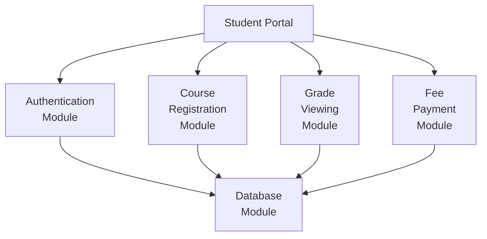
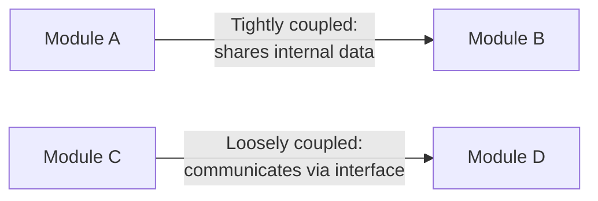
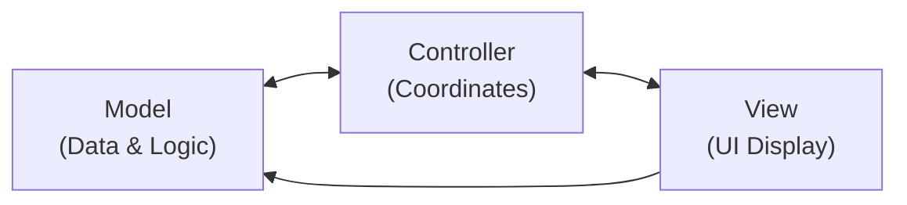
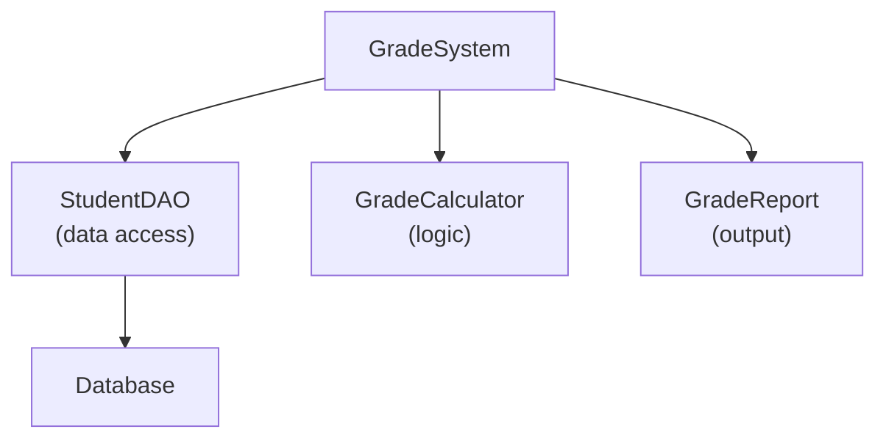

## Design: The Bridge Between Requirements and Code

Requirements say *what* the system must do. Design says *how* it will do it. Implementation writes the actual code. Design is the critical middle step — a well-designed system is easy to implement, test, and maintain; a poorly designed one is fragile, expensive, and painful throughout its lifetime.

**Real-world analogy:** An architect designs a building in full detail before construction begins. The design specifies room layouts, structural elements, plumbing, and electrical paths. The builders follow the design; they do not invent as they go. Software design plays the same role.

---

## Levels of Design

### Architectural Design (High-Level)
Define the overall structure — major components, their responsibilities, and how they communicate.

This is the "big picture" — roughly equivalent to a building's floor plan.

### Detailed Design (Low-Level)
Specify the internal design of each component — data structures, algorithms, class interfaces.

This is the "detailed blueprint" — equivalent to specifying the dimensions and materials of each structural element.

---

## Core Design Principles

### 1. Modularity
Divide the system into **modules** — independent, well-defined units that can be developed, tested, and maintained separately.

**Benefits:**
- Changes to one module do not affect others
- Modules can be developed in parallel by different teams
- Testing is simpler (test each module independently)
- Reuse: modules can be used in other systems



### 2. Coupling
**Coupling** measures how dependent modules are on each other.

- **Low coupling (desired):** Modules interact minimally. A change in module A is unlikely to require a change in module B.
- **High coupling (undesired):** Modules are tightly intertwined. A change in A breaks B, C, and D.

**Analogy:** Low coupling is like using standard electrical sockets — you can replace any appliance without rewiring the building. High coupling is like all appliances being hardwired to the same circuit — changing one requires rewiring everything.



### 3. Cohesion
**Cohesion** measures how focused a module is on a single, well-defined purpose.

- **High cohesion (desired):** The module does one thing, and does it well. All its functions relate to the same purpose.
- **Low cohesion (undesired):** The module does many unrelated things — a "grab-bag" of functionality.

**Analogy:** A Swiss Army knife has low cohesion — it does many things, none perfectly. A specialised chef's knife has high cohesion — it does one thing exceptionally well.

**Principle:** Design for **high cohesion AND low coupling**. This combination produces modules that are easy to understand, test, and modify.

### 4. Information Hiding (Encapsulation)
Module internals should be hidden from other modules. Only a well-defined **interface** is exposed.

**Why:** If module internals are hidden, they can be changed without affecting other modules. The interface is a contract — as long as the contract is maintained, the implementation can change freely.

---

## Design Patterns

Design patterns are reusable solutions to commonly occurring design problems. They are templates, not code.

| Pattern | Category | Problem it solves |
|---|---|---|
| **Singleton** | Creational | Ensure only one instance of a class exists |
| **Observer** | Behavioural | Notify multiple objects when one changes |
| **Factory** | Creational | Create objects without specifying exact class |
| **Decorator** | Structural | Add behaviour to objects without modifying them |
| **MVC** | Architectural | Separate data, UI, and logic |

**Model-View-Controller (MVC):**



MVC separates concerns: data (Model), presentation (View), and coordination (Controller). A change to the View (e.g., switch from web to mobile UI) does not require changing the Model.

---

## Implementation

Implementation translates the design into executable code.

### Implementation Activities

1. **Code writing** — implement each module according to the design
2. **Code review** — peers inspect the code for errors before testing
3. **Unit testing** — test each module in isolation as it is completed
4. **Version control** — commit code to a repository (Git) to track changes and enable collaboration

### Implementation Principles

| Principle | Why it matters |
|---|---|
| Write for readability | Code is read many more times than it is written |
| Keep functions small and focused | Each function should do one thing |
| Use meaningful names | `calculateGPA()` is better than `calc()` |
| Avoid magic numbers | Use `final double PASS_MARK = 40.0`, not `if (score > 40.0)` |
| Comment the "why", not the "what" | The code shows what; comments explain why |

---

## Worked Example: Designing a Grade System

**Requirements:**
- Students can view their grades for each course
- Calculate overall GPA
- Flag courses where the student failed

**Architectural design:**



**Detailed design of GradeCalculator:**

```
CLASS GradeCalculator:
  METHOD calculateGPA(grades: List<Grade>) → double
    - iterate through grades
    - compute grade points × credit hours for each
    - divide total grade points by total credit hours
    - return GPA

  METHOD identifyFailures(grades: List<Grade>) → List<Grade>
    - return grades where score < 40

  METHOD assignLetterGrade(score: int) → String
    - if score >= 70: return "A"
    - if score >= 60: return "B"
    - etc.
```

This is a **high cohesion** design — GradeCalculator does only grade-related calculations — and **low coupling** — it does not know how data is stored or how the report looks.

---

## Key Takeaway

> Software design transforms requirements into a system structure. Good design achieves high cohesion (each module has one focused purpose) and low coupling (modules minimally depend on each other). Architectural design defines the big picture; detailed design specifies component internals. Design patterns provide proven solutions to recurring problems. Implementation follows design — not intuition — and is guided by readability, modularity, and testability.

---

## Exam Tips

**What lecturers test:**
- Define modularity, coupling, and cohesion. State whether high or low is desired for each.
- Draw an architectural diagram for a described system
- Explain information hiding — why is it a good design principle?
- Define MVC and draw its component interaction
- Describe two design patterns and the problems they solve

**Likely question:**
> "Explain the concepts of coupling and cohesion in software design. Distinguish between high and low coupling/cohesion. Why is high cohesion and low coupling desirable?" (10 marks)
