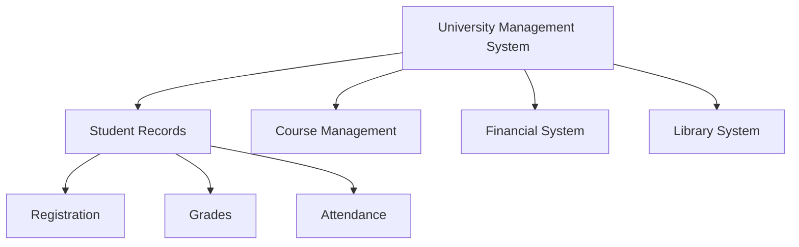
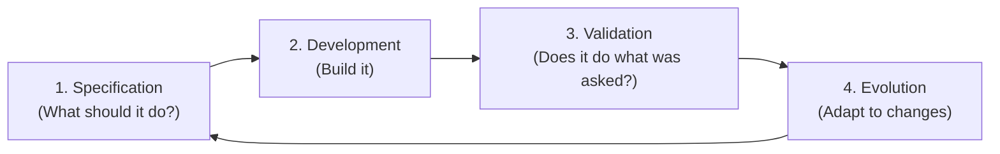
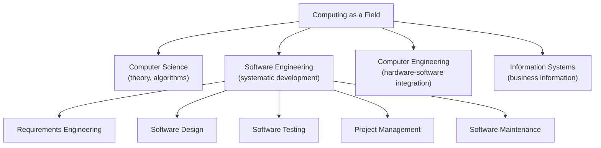

## The Origin Story: The Software Crisis

Before software engineering existed as a discipline, software was developed by individual programmers who wrote code by intuition. This worked for small programs. But in the 1960s, organisations began commissioning large software systems — payroll systems, air traffic control, banking platforms — and something alarming happened:

- Projects were delivered years late
- Final products did not do what customers asked for
- Costs exceeded budgets by enormous margins
- Systems were unreliable and crashed frequently

This became known as the **software crisis**. In 1969, a NATO conference formally named the discipline **Software Engineering** to address it.

**The name was chosen deliberately:** engineers build bridges, buildings, and machines according to scientific principles that ensure they work reliably. Why should software be any different?

---

## Formal Definitions

**Software Engineering (IEEE Definition):**

> "The application of a systematic, disciplined, quantifiable approach to the development, operation and maintenance of software."

Every word matters:
- **Systematic** — follows a defined method, not improvisation
- **Disciplined** — adheres to standards and best practices
- **Quantifiable** — uses measurements and metrics
- **Development, operation and maintenance** — the full lifecycle

**Software (expanded definition):**

Software is more than just programs. It includes:
- All **executable code** (the programs)
- All associated **documentation** (user manuals, design documents, test plans)
- **Configuration data** required to make programs operate correctly

Without documentation, software cannot be maintained. Without configuration, it cannot be deployed.

---

## Why Software Engineering Is Needed

| Without SE | With SE |
|---|---|
| Improvised, unpredictable process | Defined, repeatable process |
| No documentation | Full documentation |
| Cannot scale to large teams | Scales to hundreds of developers |
| Hard to maintain or modify | Designed for change |
| No quality assurance | Systematic testing and reviews |
| Budget overruns common | Estimates backed by metrics |

**Real-world analogy:** Imagine building a bridge with no engineering: workers improvise as they go, using materials at hand, no calculations, no blueprints. The bridge might stand — or collapse. Software engineering is the set of principles, methods, and tools that ensure the bridge stands.

---

## Two Key Complexity-Reduction Techniques

All of software engineering is fundamentally about managing complexity. Two primary tools:

### 1. Abstraction
Simplifying a problem by hiding irrelevant details and focusing only on what matters for the current purpose.

**Example:** When designing a student registration system, you do not care about how the database engine stores data on disk — you work at the level of "student records" and "enrolment transactions."

### 2. Decomposition
Breaking a complex problem into smaller, independently solvable sub-problems.

Each sub-problem can be assigned to a different team, developed independently, and then integrated. The key principle: **minimise interactions between sub-components** (high cohesion, low coupling).

---

## Types of Software Products

### Generic Products
Stand-alone systems sold to any customer on the open market. The developer owns the specification.

**Examples:** Microsoft Office, Adobe Photoshop, Oracle Database, antivirus software.

**Characteristic:** The developer decides what features to include. Changes require a new product version.

### Customised (Bespoke) Products
Systems commissioned by a specific customer to meet their specific needs. The customer owns the requirements.

**Examples:** A custom payroll system for Lagos State Government, an air traffic control system for a specific airport, a hospital management system for a particular hospital.

**Characteristic:** The customer can change the requirements; the developer must accommodate them.

---

## Essential Attributes of Good Software

| Attribute | What it means |
|---|---|
| **Maintainability** | Can be modified as requirements change — inevitable in any real system |
| **Dependability** | Reliable, secure, safe — does not cause physical or financial harm when it fails |
| **Efficiency** | Does not waste memory or CPU — responsive and performant |
| **Acceptability** | Understandable, usable, compatible — fits the user's context |

---

## Four Fundamental Activities of Software Engineering

All software processes — regardless of methodology — include these four activities:

| Activity | Description |
|---|---|
| **Specification** | Define requirements — what the software must do and its constraints |
| **Development** | Design and implement the software |
| **Validation** | Verify the software meets requirements — testing |
| **Evolution** | Modify in response to changing needs |

---

## Software Engineering as a Discipline Within Computing

Software engineering draws on computer science (algorithms, data structures) but adds the engineering dimension: process, project management, quality assurance, and systematic methods for building large, reliable systems.

---

## Key Takeaway

> Software engineering arose from the "software crisis" of the 1960s — a recognition that large software systems could not be built reliably by individual programmers improvising. The IEEE defines it as "a systematic, disciplined, quantifiable approach" to software development. Its core tools are abstraction (hiding complexity) and decomposition (dividing complexity). The four fundamental activities — specification, development, validation, evolution — appear in every software process, regardless of methodology.

---

## Exam Tips

**What lecturers test:**
- State the IEEE definition of software engineering and explain each word
- Explain the "software crisis" — what it was, why it happened, what it led to
- Distinguish generic vs. customised software products with examples
- List the four essential attributes of good software
- State the four fundamental activities common to all software processes

**Common mistakes:**
- Saying software engineering is just "programming" — it includes requirements, design, testing, project management, and maintenance
- Confusing "software" with "program" — software includes documentation and configuration, not just executable code

**Likely question:**
> "Define software engineering. Explain why it emerged as a discipline and describe the four fundamental activities common to all software processes." (12 marks)
