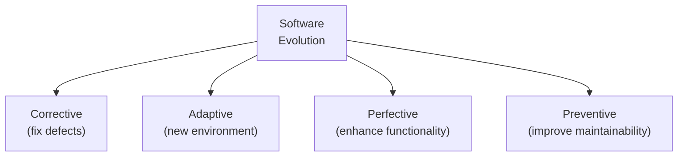
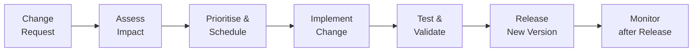

## Software Is Never Finished

Unlike physical products, software does not wear out. A chair weakens over time through use. Software runs identically on day 1 and day 1000 — it does not degrade from use. Yet software still "ages" and must evolve.

Why? Because the world around it changes:
- Business requirements change
- Regulations change
- Technology platforms change
- Competitors release new features
- Users discover the software does not meet all their needs

**Evolution is not optional.** A software system that cannot evolve becomes progressively less useful until it is eventually replaced. The choice is not whether to evolve software, but how to manage it.

---

## Lehman's Laws of Software Evolution

Meir Manny Lehman studied the evolution of large software systems over decades and formulated eight "laws" — empirical observations about how software evolves in real organisations.

### The Most Important Laws

**Law 1: Continuing Change**
> "A program that is used in a real-world environment must be continually adapted or it becomes progressively less satisfactory."

Real environments change. Software must adapt or become obsolete.

**Law 2: Increasing Complexity**
> "As an evolving program is continually changed, its complexity increases unless work is done to maintain or reduce it."

Each change tends to add special cases, exceptions, and workarounds. Over time, the system becomes harder to understand, modify, and test — unless deliberate effort (refactoring) is invested in maintaining structure.

**Law 4: Conservation of Organisational Stability**
> "The average effective global activity rate on an evolving system is invariant over the lifetime of the product."

In other words, the rate of development is roughly constant over time regardless of team size or management pressure.

**Law 6: Continuing Growth**
> "The functional content of a program must be continually increased to maintain user satisfaction over its lifetime."

Users' expectations grow. A system that was impressive in year 1 must gain new features to remain satisfactory in year 5.

---

## Types of Evolution

| Type | Trigger | Example |
|---|---|---|
| **Corrective** | Bug discovered after deployment | Fix NullPointerException in grade calculator |
| **Adaptive** | Environment changes | Update to run on Java 17 instead of Java 8 |
| **Perfective** | User requests new features | Add PDF export to grade reports |
| **Preventive** | Technical debt reduction | Refactor spaghetti code before it causes more bugs |

Studies show the distribution varies, but typically: **~20% corrective, ~25% adaptive, ~55% perfective**.

---

## The Evolution Process

Software evolution follows a change management process:

### Change Requests
Come from multiple sources: users reporting bugs, management requesting features, legal requiring compliance, IT reporting infrastructure issues.

### Impact Assessment
Before implementing any change, assess:
- What components will be affected?
- How long will it take?
- What is the risk of introducing new defects?
- What testing will be required?

### Ripple Effects
A change to one component can have **ripple effects** — unexpected consequences in other components that depend on it. This is why low coupling (Topic 6) is so important: loosely coupled systems contain ripple effects; tightly coupled ones propagate them everywhere.

---

## Software Ageing

Software ages when it becomes progressively harder to change and evolve. Signs of software ageing:

| Symptom | Cause |
|---|---|
| Changes take longer each release | Accumulated complexity (Lehman's Law 2) |
| Bug fix in A breaks B, C, D | High coupling |
| Hard to understand what code does | Poor documentation, inconsistent naming |
| Tests are slow and flaky | Test suite not maintained as code evolved |
| Team afraid to change core code | "If it works, don't touch it" culture |

The solution to software ageing is **continuous refactoring** — improving code structure without changing behaviour, as part of every development cycle.

---

## Worked Example: Evolution of a University Portal

**Year 1 (Initial release):**
- Student login
- View grades
- View timetable

**Year 2 (Corrective + Perfective):**
- Bug: Login fails for students with apostrophes in their name → corrective fix
- New feature: Download transcripts as PDF → perfective enhancement
- Compliance: Nigerian Data Protection Regulation requires consent banners → adaptive change

**Year 3 (Adaptive + Preventive):**
- Mobile app version required → adaptive (new platform)
- Grade calculation engine refactored for clarity → preventive
- Old PHP backend replaced with Java Spring → preventive/adaptive

**Year 5 (Considering replacement):**
- System built on old framework (no longer supported)
- Adding new features takes 3× as long as Year 1
- Team struggles to understand original code
- Evaluating: continue evolving vs. full replacement

---

## Key Takeaway

> Software must continually evolve or it becomes obsolete. Lehman's laws describe empirical patterns: systems grow in size, complexity, and functionality over time. Changes are categorised as corrective (fix bugs), adaptive (new environment), perfective (new features), or preventive (improve maintainability). Evolution is managed through change control: request, assess impact, schedule, implement, test, release. Unmanaged evolution leads to software ageing — systems that become increasingly costly to change.

---

## Exam Tips

**What lecturers test:**
- State and explain Lehman's first two laws of software evolution
- Classify types of maintenance/evolution (corrective, adaptive, perfective, preventive) with examples
- Draw the evolution/change management process
- Explain what "software ageing" is and what causes it
- Why is low coupling important for managing evolution?

**Likely question:**
> "Explain Lehman's Law of Increasing Complexity. What does it imply for how software projects should be managed? Describe two specific practices that can counteract this law." (8 marks)
