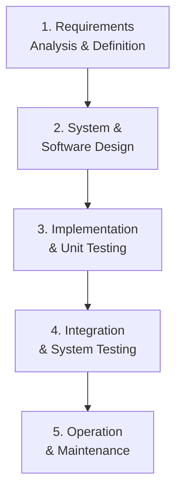
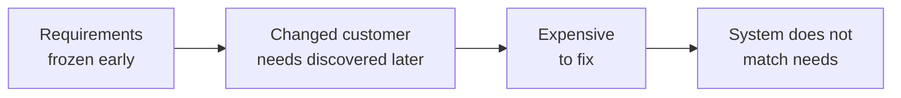
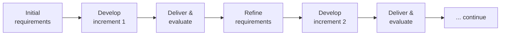
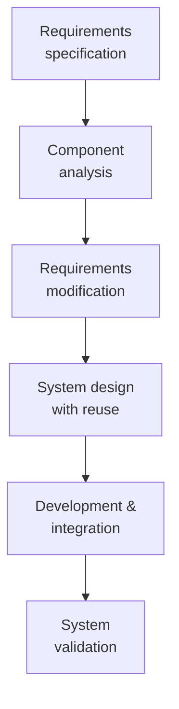
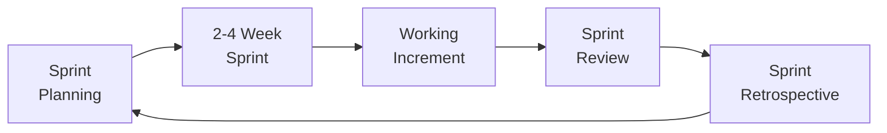
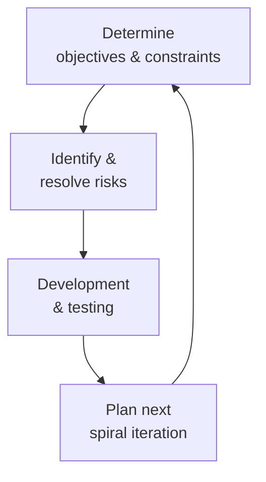

## The Software Life Cycle

Software has a life. Like a person, it is born (developed), grows (evolves), and eventually retires (replaced). The **software life cycle** captures the full arc from initial concept to final decommissioning.

**Typical stages:**
1. **Planning** — feasibility study, project scoping
2. **Analysis** — requirements gathering
3. **Design** — architecture and detailed design
4. **Implementation** — coding
5. **Testing and Integration** — verification and deployment
6. **Maintenance** — bug fixing, enhancements, adaptation

---

## What Is a Software Process Model?

A **software process model** is a simplified, abstract representation of a software development process. It shows the stages, activities, and their relationships.

**Important:** No single process model fits all projects. Different models suit different:
- Project sizes (small vs. large)
- Requirements stability (fixed vs. changing)
- Risk levels (low vs. high)
- Delivery preferences (one release vs. incremental)

---

## Model 1: The Waterfall Model

The **waterfall model** is the first published model of the software development process. It is **plan-driven** — all activities must be planned and scheduled before work begins.

### The Five Stages

| Stage | What happens | Output |
|---|---|---|
| Requirements Analysis | Gather and document what the system must do | Requirements specification |
| System & Software Design | Define architecture and component design | Design documents |
| Implementation & Unit Testing | Write and test individual modules | Tested code modules |
| Integration & System Testing | Combine modules and test the complete system | Validated system |
| Operation & Maintenance | Deploy and maintain through its lifetime | Running system |

### Key Principle

Each stage produces an **approved document**. The next stage should not begin until the previous is complete and signed off. Like a waterfall — water flows only downward, not back up.

### When to Use Waterfall

- Requirements are very well understood and unlikely to change
- Large teams in different locations where frequent communication is difficult
- Embedded or safety-critical systems (defense, aerospace, medical devices) where documentation is legally required

### Limitations

- Inflexible to changing requirements
- Customers do not see a working product until very late
- Problems discovered late are expensive to fix
- Poor choice for projects with evolving or unclear requirements

---

## Model 2: Incremental Development

**Incremental development** interleaves specification, development, and validation. Instead of building the whole system before showing it to the customer, you build and deliver it in **increments**.

### How It Works

1. Identify the core functionality that is most urgently needed
2. Build and deliver increment 1 (basic working version)
3. Customer evaluates increment 1 and provides feedback
4. Incorporate feedback, add next priority features
5. Deliver increment 2
6. Repeat until adequate system is achieved

### Advantages Over Waterfall

| Waterfall | Incremental |
|---|---|
| Customer sees product only at the end | Customer sees working product early |
| All requirements fixed upfront | Requirements refined based on feedback |
| Hard to accommodate change | Change is expected and welcomed |
| High risk (long period before feedback) | Lower risk (early and frequent feedback) |

### When to Use Incremental

- Most business, e-commerce, and web applications
- When requirements are expected to change
- When early delivery of partial functionality has value
- Small to medium sized software systems

### Limitation

Multiple versions of the system code may be spread across development, making structure degrade over time without disciplined refactoring.

---

## Model 3: Reuse-Oriented Software Engineering

Instead of building from scratch, this model focuses on **finding and integrating existing components** — software that already does what you need.

| Stage | What happens |
|---|---|
| Component analysis | Search for components (libraries, services, open-source) matching requirements |
| Requirements modification | Adapt requirements to fit available components where possible |
| System design with reuse | Architect the system around available components |
| Development & integration | Develop only what cannot be found; integrate with procured components |
| System validation | Test the assembled system |

### Real-world analogy

Instead of manufacturing every part of a car from raw steel, a car manufacturer buys seats from a seat supplier, engines from an engine supplier, and electronics from a third party — they assemble and integrate rather than build everything.

### Advantages

- Reduces development cost and time
- Lower risk (components are pre-tested)
- Standards-based components are often higher quality than custom-built

### Limitation

Some requirements may need to be compromised to fit available components. Loss of control over component evolution (if the third party changes their component).

---

## Model 4: The Agile Model

**Agile** is an umbrella term for iterative, incremental, and flexible approaches to software development. It emerged as a reaction to the rigidity of Waterfall.

The **Agile Manifesto** (2001) values:
- **Individuals and interactions** over processes and tools
- **Working software** over comprehensive documentation
- **Customer collaboration** over contract negotiation
- **Responding to change** over following a plan

**Scrum** is the most popular Agile framework. Sprints are fixed-time iterations (typically 2-4 weeks) that deliver a working software increment.

---

## Model 5: The Spiral Model

The **spiral model** combines iterative development with systematic risk analysis. It is designed for large, complex, high-risk systems.

Each loop of the spiral passes through four quadrants:
1. **Determine objectives, alternatives, and constraints**
2. **Evaluate alternatives, identify and resolve risks** ← the distinctive feature
3. **Develop and test** the next version
4. **Plan the next iteration**

**Characteristic:** Risk assessment at every iteration. The project stops or pivots if risks are too high to proceed.

**Used for:** Large government contracts, defense systems, high-stakes enterprise projects.

---

## Comparison of Process Models

| Model | Requirements | Change tolerance | Delivery | Risk management |
|---|---|---|---|---|
| Waterfall | Fixed upfront | Low | Single release | Low |
| Incremental | Evolve over time | High | Multiple releases | Medium |
| Reuse-Oriented | May be adapted | Medium | Varies | Low-medium |
| Agile | Continuously refined | Very high | Frequent | Built-in feedback |
| Spiral | Refined each iteration | High | Spiral by spiral | Explicit at each iteration |

---

## Key Takeaway

> The software life cycle covers planning, analysis, design, implementation, testing, and maintenance. Process models — Waterfall, Incremental, Reuse-Oriented, Agile, Spiral — represent different philosophies for managing that lifecycle. Waterfall is linear and plan-driven (good for stable requirements); Incremental delivers working software in stages (good for changing requirements); Reuse-Oriented focuses on integrating existing components; Agile is iterative and flexible; Spiral adds explicit risk management at each iteration.

---

## Exam Tips

**What lecturers test:**
- Draw and label the Waterfall model's 5 stages
- Draw the Incremental development flow and explain how each increment is evaluated
- Compare Waterfall and Incremental/Agile: when would you use each?
- State the four Agile manifesto values
- Explain what makes the Spiral model distinctive (risk analysis)

**Common mistakes:**
- Saying Agile has no documentation — it values "working software over comprehensive documentation" but documentation still exists; it just is not the primary focus
- Confusing incremental (multiple functional releases) with iterative (rework the same release multiple times)

**Likely question:**
> "Draw and describe the Waterfall model of software development. Explain two major limitations of this model and suggest an alternative process model that overcomes one of these limitations." (14 marks)
