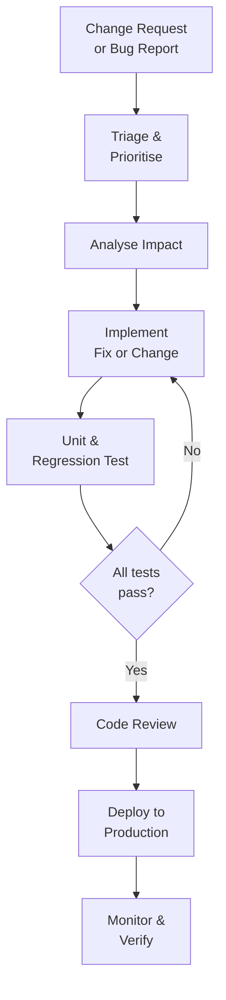

## Maintenance Is the Dominant Activity

A common misconception: "development" is the main activity in software engineering. In reality, for most software systems:

- **Initial development:** ~20–40% of total lifetime cost
- **Maintenance:** ~60–80% of total lifetime cost

This means the discipline of software engineering must be at least as concerned with **how to keep software working** as with how to build it initially.

---

## Why Maintenance Costs Are High

Several factors drive maintenance costs:

**1. Team turnover:** The people who understand the original code often leave. New maintainers must reverse-engineer code written years ago with no documentation.

**2. Poor original design:** Code that was never designed for change is rigid — every modification requires understanding vast amounts of code.

**3. Inadequate documentation:** Without documentation of design decisions, maintainers repeat old mistakes or accidentally break assumptions.

**4. Technology changes:** Libraries, frameworks, and platforms evolve. Code must be updated to remain compatible.

**5. Creeping complexity:** Each modification adds slightly to complexity. Over years, the cumulative effect makes the system very hard to change.

---

## Maintenance Activities in Practice

### Understanding the System
Before any modification, the maintainer must understand the relevant part of the system. This may require:
- Reading code
- Tracing execution paths
- Consulting documentation (if available)
- Interviewing original developers (if available)

This alone can consume 50–60% of maintenance effort.

### Making Changes Safely
Every change carries risk of introducing new defects ("regression"). Safe change process:
1. Understand the change required
2. Identify all code that will be affected (impact analysis)
3. Implement the change
4. Test — including regression tests
5. Review
6. Deploy

### Testing After Changes
After every maintenance change, regression testing must verify that nothing was broken. This requires a maintained, up-to-date test suite.

---

## The Maintenance Process

---

## Managing Maintenance: Key Practices

### Configuration Management
Track all versions of all components. When a bug is reported, you must know exactly what version the customer has, what changed since the previous version, and what dependencies exist.

### Change Control Board (CCB)
For large systems, a committee reviews all proposed changes before implementation:
- Prevents unauthorised changes
- Prioritises competing requests
- Assesses impact and schedules resources

### Maintenance Teams vs. Development Teams
Many organisations have separate maintenance and development teams. Developers build new systems; a maintenance team handles the operational legacy system.

**Problem:** Maintainers often feel less valued than developers. Good engineers resist being assigned to maintenance. This creates a vicious cycle: the best engineers avoid maintenance, quality declines, maintenance becomes harder, maintenance is even less attractive.

**Solution:** Recognise maintenance as a full software engineering discipline requiring the same skills and more knowledge of the system.

---

## Maintenance and Contracts

For contracted software (bespoke products), maintenance is often a separate contract. Key terms to understand:

- **Warranty period:** Initial post-delivery period where defects are fixed free of charge
- **Service Level Agreement (SLA):** Contractual commitments on response time (e.g., "critical bugs fixed within 4 hours")
- **Maintenance contract:** Ongoing contract covering corrective, adaptive, and perfective maintenance

---

## Maintainability as a Design Goal

The most effective way to reduce maintenance costs is to build maintainable software in the first place. Design for maintainability means:

| Practice | How it helps maintenance |
|---|---|
| Clear, descriptive naming | Maintainers understand code faster |
| Modular design | Changes are localised |
| Comprehensive documentation | Maintainers understand design decisions |
| High test coverage | Maintainers can safely refactor |
| Low coupling | Changes don't ripple everywhere |
| Consistent coding standards | Code is uniform and predictable |

---

## Key Takeaway

> Software maintenance consumes the majority of the total cost of a software system. Maintenance types include corrective (bug fixes), adaptive (environment changes), perfective (new features), and preventive (refactoring for future maintainability). High maintenance costs stem from poor original design, team turnover, inadequate documentation, and accumulated complexity. The best investment in reducing maintenance costs is building maintainable software from the start — through modular design, documentation, and high test coverage.

---

## Exam Tips

**What lecturers test:**
- State why maintenance costs dominate software lifecycle costs
- List and explain the four types of maintenance with examples
- Describe the maintenance process (from change request to deployment)
- Explain why maintainability must be designed-in from the beginning
- Define SLA in the context of software maintenance

**Likely question:**
> "Why does software maintenance typically cost more than initial development? Describe the four categories of software maintenance with examples, and explain two design practices that can reduce future maintenance costs." (12 marks)
